# COLD

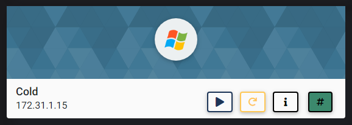

## NMAP SCAN

```text
PORT      STATE SERVICE            REASON          VERSION
80/tcp    open  http               syn-ack ttl 127 Apache httpd 2.4.43 ((Win64) OpenSSL/1.1.1g PHP/7.2.30)
|_http-favicon: Unknown favicon MD5: 56F7C04657931F2D0B79371B2D6E9820
| http-methods: 
|_  Supported Methods: GET HEAD POST OPTIONS
|_http-server-header: Apache/2.4.43 (Win64) OpenSSL/1.1.1g PHP/7.2.30
| http-title: Welcome to XAMPP
|_Requested resource was http://172.31.1.15/dashboard/
135/tcp   open  msrpc              syn-ack ttl 127 Microsoft Windows RPC
139/tcp   open  netbios-ssn        syn-ack ttl 127 Microsoft Windows netbios-ssn
443/tcp   open  ssl/http           syn-ack ttl 127 Apache httpd 2.4.43 ((Win64) 
445/tcp   open  microsoft-ds       syn-ack ttl 127 Microsoft Windows Server 2008 R2 - 2012 microsoft-ds
1243/tcp  open  serialgateway?     syn-ack ttl 127
3389/tcp  open  ssl/ms-wbt-server? syn-ack ttl 127
5500/tcp  open  http               syn-ack ttl 127 Jetty 9.3.6.v20151106
| http-methods: 
|_  Supported Methods: GET
|_http-server-header: Jetty(9.3.6.v20151106)
|_http-title: Error 404 
5985/tcp  open  http               syn-ack ttl 127 Microsoft HTTPAPI httpd 2.0 (SSDP/UPnP)
|_http-server-header: Microsoft-HTTPAPI/2.0
|_http-title: Not Found
6095/tcp  open  unknown            syn-ack ttl 127
| fingerprint-strings: 
|   GetRequest, HTTPOptions: 
|_    JNB70*
6096/tcp  open  unknown            syn-ack ttl 127
7993/tcp  open  unknown            syn-ack ttl 127
8018/tcp  open  unknown            syn-ack ttl 127
8500/tcp  open  http               syn-ack ttl 127 Samsung AllShare httpd
| http-methods: 
|_  Supported Methods: OPTIONS GET HEAD POST
|_http-title: 404
8581/tcp  open  unknown            syn-ack ttl 127
| fingerprint-strings: 
|   FourOhFourRequest, GetRequest, HTTPOptions, RTSPRequest, SIPOptions: 
|     HTTP/1.1 403 Forbidden
|     Content-Length: true
|_    Forbidden
20007/tcp open  unknown            syn-ack ttl 127
20008/tcp open  unknown            syn-ack ttl 127
47001/tcp open  http               syn-ack ttl 127 Microsoft HTTPAPI httpd 2.0 (SSDP/UPnP)
|_http-server-header: Microsoft-HTTPAPI/2.0
|_http-title: Not Found
49152/tcp open  msrpc              syn-ack ttl 127 Microsoft Windows RPC
49153/tcp open  msrpc              syn-ack ttl 127 Microsoft Windows RPC
49154/tcp open  msrpc              syn-ack ttl 127 Microsoft Windows RPC
49155/tcp open  msrpc              syn-ack ttl 127 Microsoft Windows RPC
49163/tcp open  msrpc              syn-ack ttl 127 Microsoft Windows RPC
49192/tcp open  msrpc              syn-ack ttl 127 Microsoft Windows RPC
49193/tcp open  msrpc              syn-ack ttl 127 Microsoft Windows RPC
```

## PORT 80 ENUMERATION

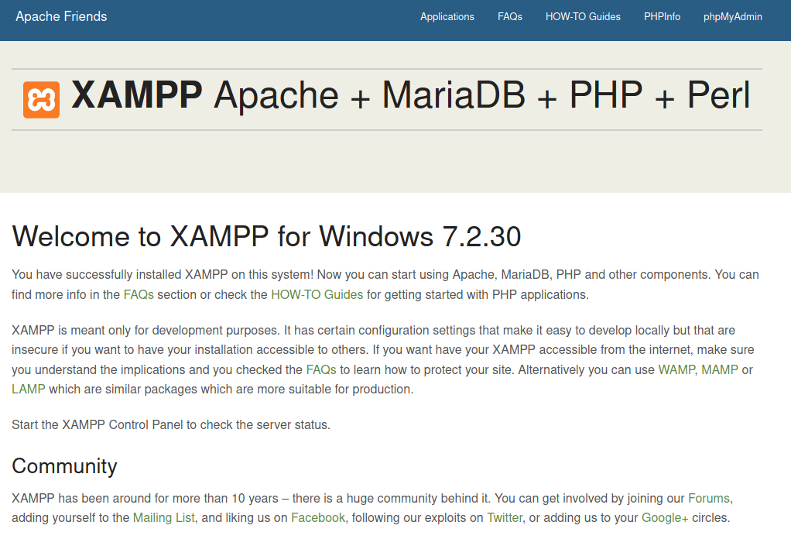

* NOTHING IN GOBUSTER

### PHPINFO

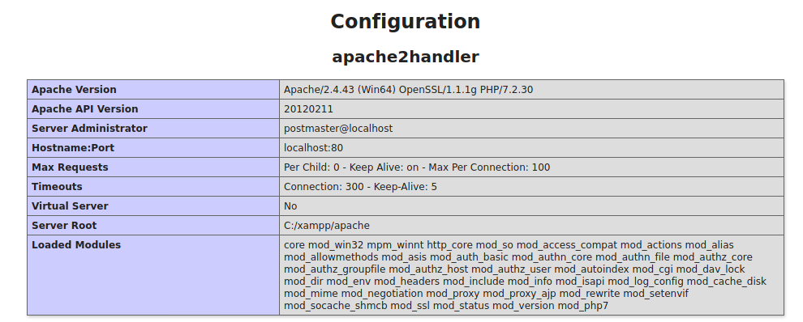

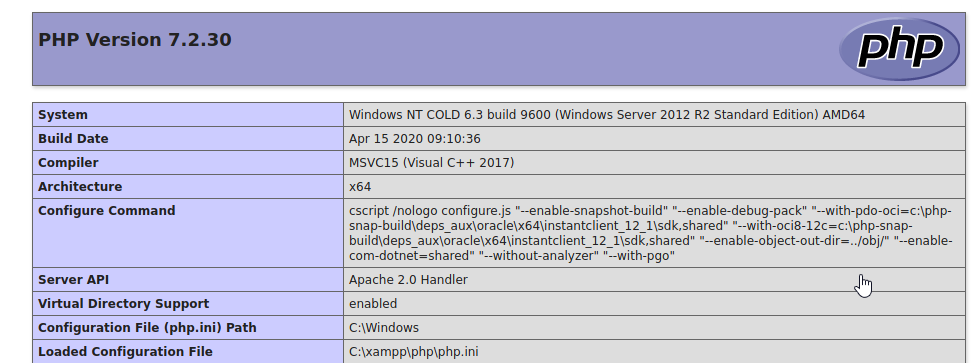

## SMB ENUMERATION

* DEAD END

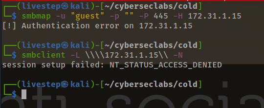

## PORT 8500 ENUMERATION

### NIKTO

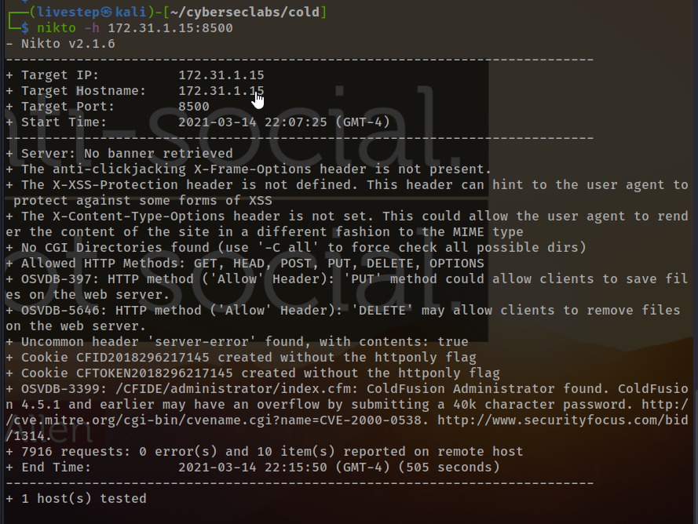

### COLDFUSION

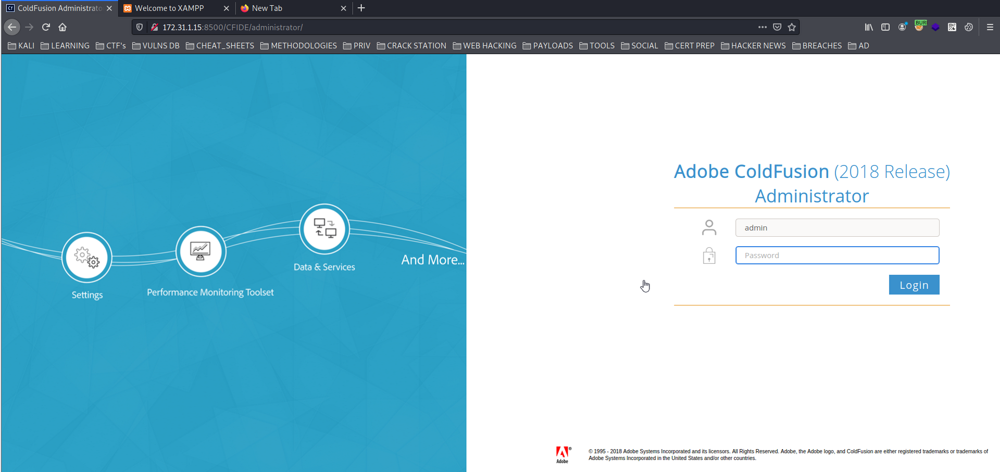

* ADMIN:ADMIN WORKED

## EXPLOIT \(METASPLOIT\)

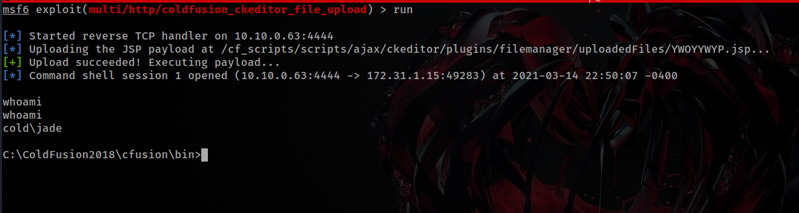

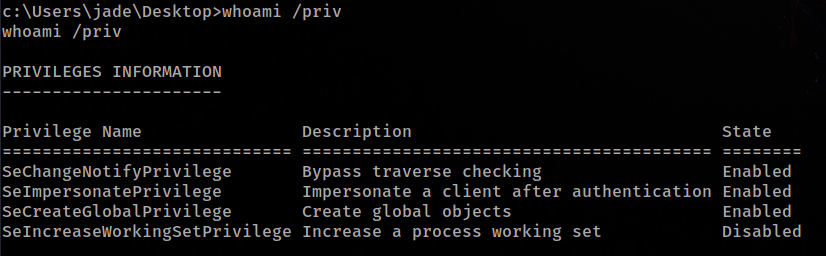

## WINPEAS

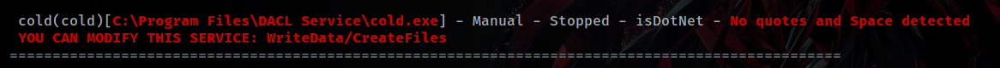

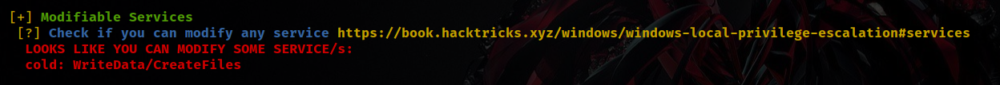

## EXPLOIT

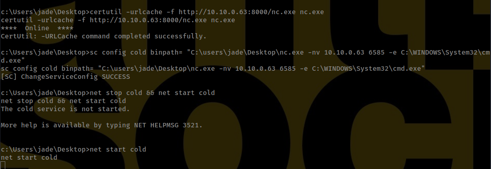

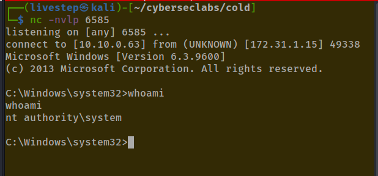

* The Shell isn´t stable, lets fix

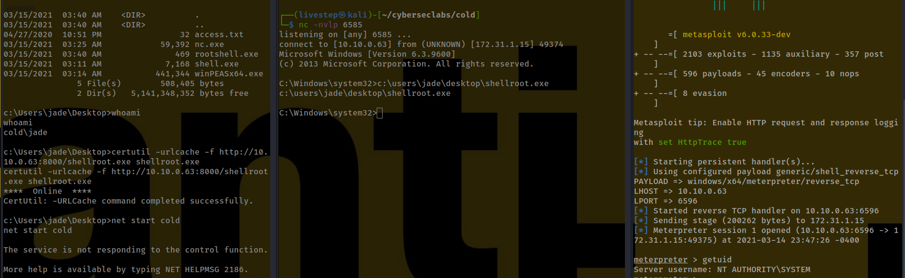

## CREDS

```text
Administrator:500:aad3b435b51404eeaad3b435b51404ee:03ffb14a94c1e286a8b2c644376d9074:::
Guest:501:aad3b435b51404eeaad3b435b51404ee:31d6cfe0d16ae931b73c59d7e0c089c0:::
jade:1009:aad3b435b51404eeaad3b435b51404ee:6adfbcc84fab5910245231288dc52d56:::
```

## FLAGS

### USER

```text
cb6d4de6b3ca3b97e7247fd90a3e0c72
```

### ROOT

```text
0ef516f5bd8895026f9e34947233a1e8
```


