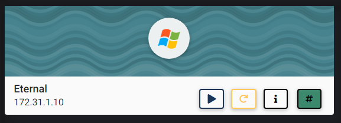
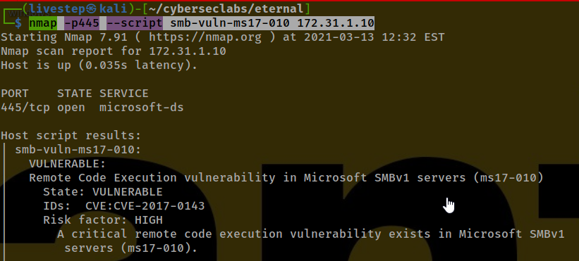
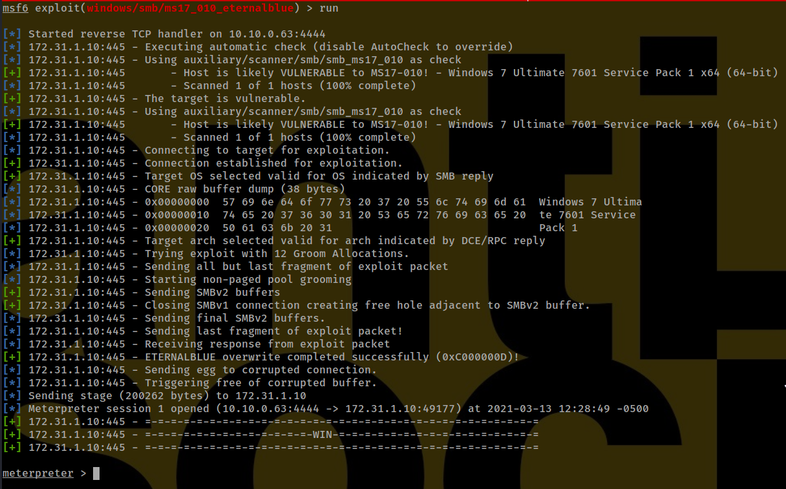

# ETERNAL



## NMAP SCAN

```text
PORT      STATE SERVICE     REASON          VERSION
135/tcp   open  msrpc       syn-ack ttl 127 Microsoft Windows RPC
139/tcp   open  netbios-ssn syn-ack ttl 127 Windows 7 Ultimate 7601 Service Pack 1 netbios-ssn
5357/tcp  open  http        syn-ack ttl 127 Microsoft HTTPAPI httpd 2.0 (SSDP/UPnP)
|_http-server-header: Microsoft-HTTPAPI/2.0
|_http-title: Service Unavailable
49152/tcp open  msrpc       syn-ack ttl 127 Microsoft Windows RPC
49153/tcp open  msrpc       syn-ack ttl 127 Microsoft Windows RPC
49154/tcp open  msrpc       syn-ack ttl 127 Microsoft Windows RPC
49155/tcp open  msrpc       syn-ack ttl 127 Microsoft Windows RPC
```

## CHECKING IF VULNERABLE TO ETERNAL BLUE

```text
nmap -p445 --script smb-vuln-ms17-010 172.31.1.10
```



## EXPLOIT METASPLOIT



## FLAGS USER

### USER

```text
cb1fc8533080fcb3e2636234f5e601c3
```

### ROOT

```text
ab04582b704dde9f2de2c36ffb91b5a5
```


