# HIJACK

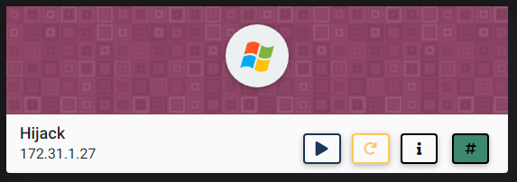

## NMAP SCAN

```text
PORT      STATE SERVICE       REASON          VERSION
80/tcp    open  http          syn-ack ttl 127 Apache httpd 2.4.37 ((Win32) OpenSSL/1.1.1a PHP/7.2.13)
|_http-favicon: Unknown favicon MD5: CF2445DCB53A031C02F9B57E2199BC03
|_http-generator: Drupal 8 (https://www.drupal.org)
| http-methods: 
|_  Supported Methods: GET POST HEAD OPTIONS
| http-robots.txt: 22 disallowed entries 
| /core/ /profiles/ /README.txt /web.config /admin/ 
| /comment/reply/ /filter/tips/ /node/add/ /search/ /user/register/ 
| /user/password/ /user/login/ /user/logout/ /index.php/admin/ 
| /index.php/comment/reply/ /index.php/filter/tips/ /index.php/node/add/ 
| /index.php/search/ /index.php/user/password/ /index.php/user/register/ 
|_/index.php/user/login/ /index.php/user/logout/
|_http-server-header: Apache/2.4.37 (Win32) OpenSSL/1.1.1a PHP/7.2.13
|_http-title: Welcome to Hijack | Hijack
135/tcp   open  msrpc         syn-ack ttl 127 Microsoft Windows RPC
139/tcp   open  netbios-ssn   syn-ack ttl 127 Microsoft Windows netbios-ssn
443/tcp   open  ssl/http      syn-ack ttl 127 Apache httpd 2.4.37 ((Win32) OpenSSL/1.1.1a PHP/7.2.13)
3306/tcp  open  mysql         syn-ack ttl 127 MariaDB (unauthorized)
3389/tcp  open  ms-wbt-server syn-ack ttl 127 Microsoft Terminal Services
5985/tcp  open  http          syn-ack ttl 127 Microsoft HTTPAPI httpd 2.0 (SSDP/UPnP)
|_http-server-header: Microsoft-HTTPAPI/2.0
|_http-title: Not Found
47001/tcp open  http          syn-ack ttl 127 Microsoft HTTPAPI httpd 2.0 (SSDP/UPnP)
|_http-server-header: Microsoft-HTTPAPI/2.0
|_http-title: Not Found
49664/tcp open  msrpc         syn-ack ttl 127 Microsoft Windows RPC
49665/tcp open  msrpc         syn-ack ttl 127 Microsoft Windows RPC
49666/tcp open  msrpc         syn-ack ttl 127 Microsoft Windows RPC
49667/tcp open  msrpc         syn-ack ttl 127 Microsoft Windows RPC
49668/tcp open  msrpc         syn-ack ttl 127 Microsoft Windows RPC
49669/tcp open  msrpc         syn-ack ttl 127 Microsoft Windows RPC
49672/tcp open  msrpc         syn-ack ttl 127 Microsoft Windows RPC
```

## PORT 80 ENUMERATION

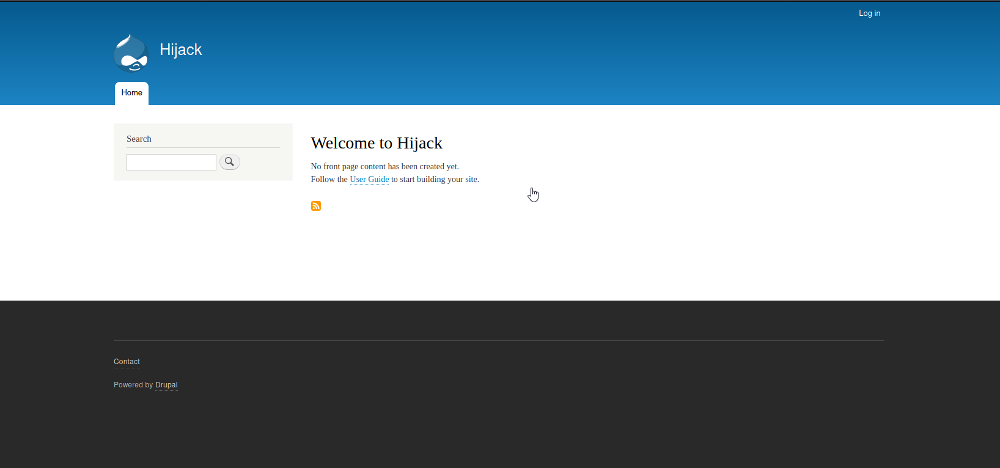

### USER ENUMERATION

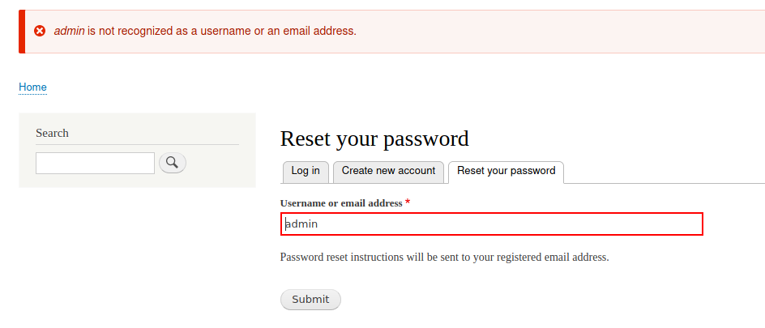

* Error message to the user JACK


### DROOPESCAN

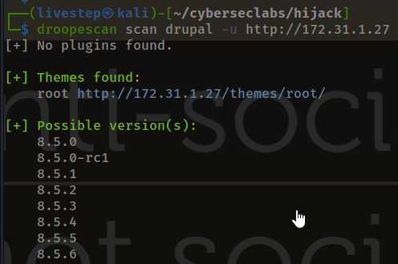

### EXPLOIT DRUPALGEDDON

* [https://wjmccann.github.io/blog/2018/06/02/Drupalgeddon2](https://wjmccann.github.io/blog/2018/06/02/Drupalgeddon2)

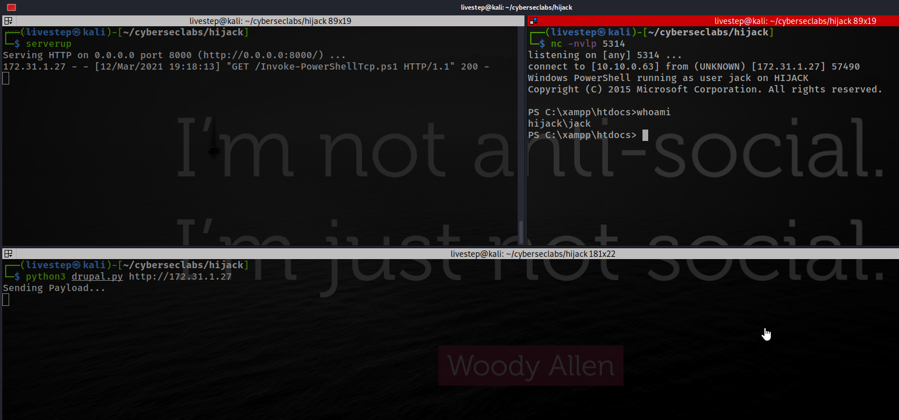

## UPLOAD METERPRETER REVERSE SHELL

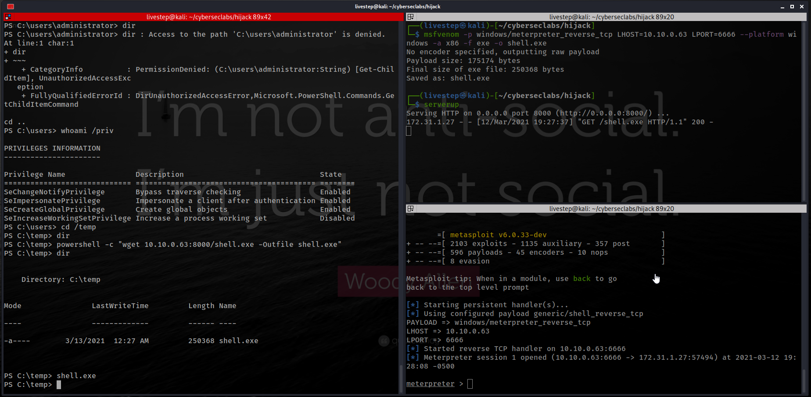

### LOCAL EXPLOIT SUGGESTER


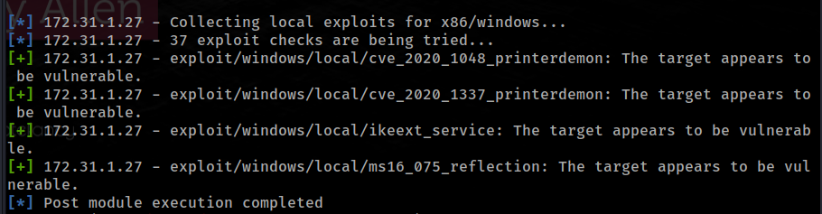

None exploit worked

## WINPEAS FINDINGS

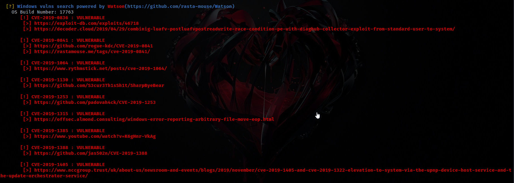

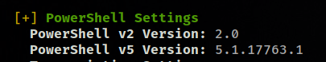


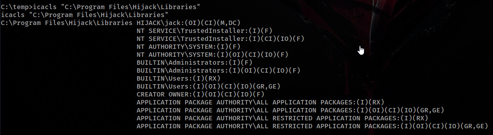

C:\Program Files\Hijack\Libraries\Custom.dllCustom.dll

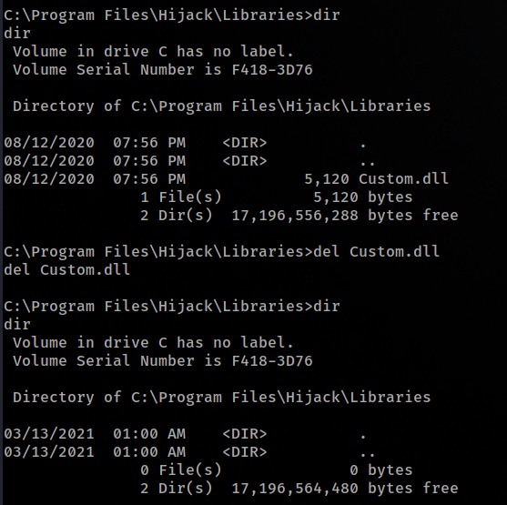

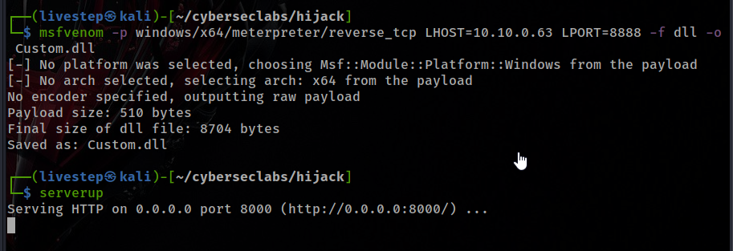

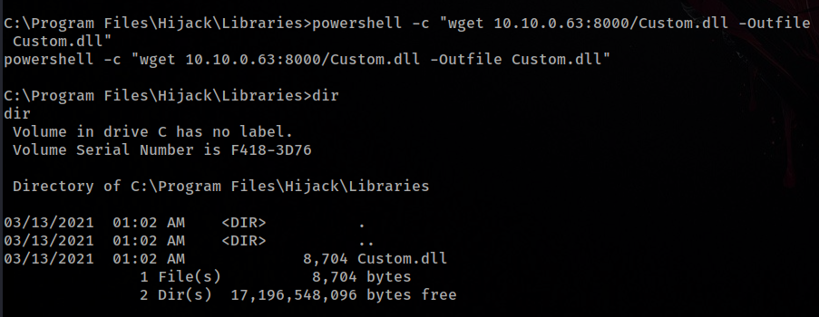

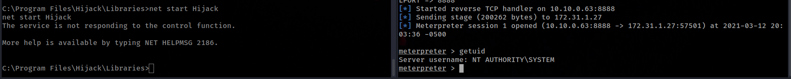

## CREDS

```text
Administrator:500:aad3b435b51404eeaad3b435b51404ee:7338b4cc969700678f8b9ae85ed779cb:::
DefaultAccount:503:aad3b435b51404eeaad3b435b51404ee:31d6cfe0d16ae931b73c59d7e0c089c0:::
Guest:501:aad3b435b51404eeaad3b435b51404ee:31d6cfe0d16ae931b73c59d7e0c089c0:::
jack:1008:aad3b435b51404eeaad3b435b51404ee:350144b4ec62c791e0a988419eaa3ee5:::QGR54gprPG5SMw3e
WDAGUtilityAccount:504:aad3b435b51404eeaad3b435b51404ee:58f8e0214224aebc2c5f82fb7cb47ca1:::
```

## FLAGS

### USER

```text
f7beb3cc769e0b70c750eab32e3e3c91
```

### ROOT

```text
eaaaed85d047342ef6ac0b2248e9e599
```


