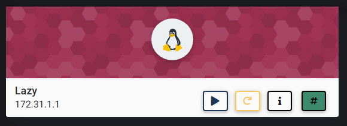
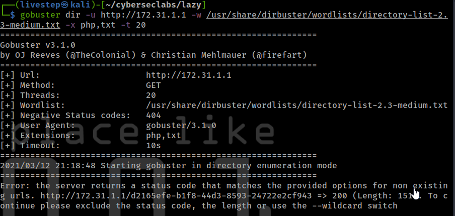
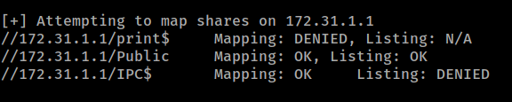
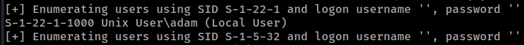
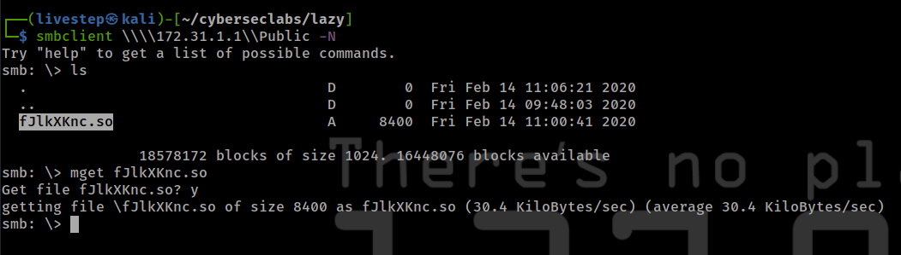
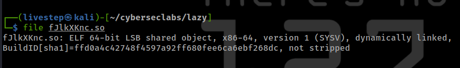
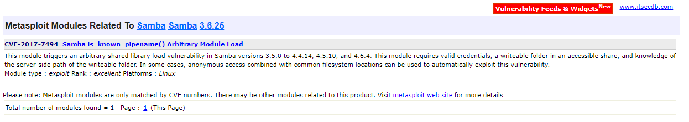
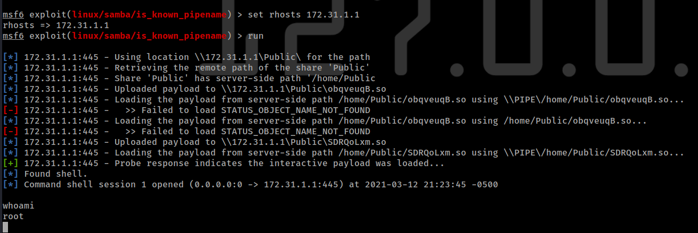

# LAZY



## NMAP SCAN

```text
PORT    STATE SERVICE     REASON         VERSION
22/tcp  open  ssh         syn-ack ttl 63 OpenSSH 5.9p1 Debian 5ubuntu1.10 (Ubuntu Linux; protocol 2.0)
| ssh-hostkey: 
|   1024 8f:fd:3e:5e:b1:0e:c8:ff:5d:34:2a:7e:65:b3:58:7a (DSA)
| ssh-dss AAAAB3NzaC1kc3MAAACBAKDoEueMtAdk558c/fE/rnGSqirGHIE5gCNmnm3CUPvEdhUe69oDln/Roxj4FE8YsxpYyBIWol8J6awOJnBnthNtRcjSD4v9BghASqu/2Xa2bcsQjxmyGQoLf3ztVXqYw5BwRYqfR1jcuN6qMvpmu5NCcT2tVANvnkcoOwP59jOBAAAAFQDdHRwfKkL1bAoFOVf2xX+MW/yOTQAAAIBQkRzg1iqFowaFubF73O0J58pkKfhT5tWuKdUe6B7VAlRMCTEdG1mgO2yIuIbtZY3vqmWauIunGd5RXUBVF4jc3e2mxwufPQamY6WKUyqNoAuHK8owlcrH/bEfoMyX3XmrCgRtTpTXs/R7/pukRV9Zgg9q0qYCV3eK8JABRoTNWAAAAIAr/vgk3ztrOIi642HYea65w5xERQH3LOybQhkDaDB50HtMij9pL6lMJS/hngyfyUYcs+hCmPYWamuiF4gC+AnSR9PYqWt0k7UjQg0JR3GC8SDHfy0g6FveTjtCbh2joS2b4IrR8ucA0/H18J2San8VS1HAFEkubU1XnN1w/26/dQ==
|   2048 93:41:e8:35:92:a3:ed:b8:de:42:7d:9f:fc:82:67:24 (RSA)
| ssh-rsa AAAAB3NzaC1yc2EAAAADAQABAAABAQDdndpdTeUN27OfEVzWp7kAs8pC2+ldy3jKGJeia/Et5yKISm21VXCCaDl1JbpKR3jQHXVJEnMKoymjhuGHG2zqciapSNAxhKLBqgfIh5jclVJS0mPcUJ9IKPCeJpdzKPwju6TQFQEWqqo5iQJwokgxbbybg8F/mBfkpcFabcjqLD/nd0Gh8+3i4XD/moWax37jTy+wWUUAXZAO7LJ3h1jA2MYEtEz97SmmnDLF7+ju9+YdTDbRkmD6AbtgvQTA6JazIoMUu4vcKYikhslr5G43BMyIka/Q9RpR9sFLj61MyibB68taSmAIPaOaQgi1gDdyK8GVGg9Nu9uMU9ps4ObR
|   256 6a:0c:be:0d:83:b8:9d:03:c8:9f:47:e0:8b:f1:a3:c0 (ECDSA)
|_ecdsa-sha2-nistp256 AAAAE2VjZHNhLXNoYTItbmlzdHAyNTYAAAAIbmlzdHAyNTYAAABBBGDA4yTd1OhdUYRNqEs+pFxN9DmdQO9+WrlWELmAJ8XWh34HEGQaZ7IazORAEosCEPTYh+jYycXY++Y6me3Vidk=
80/tcp  open  http        syn-ack ttl 63 nginx 1.1.19
|_http-favicon: Unknown favicon MD5: 5B6D74F1453E20C09D6A20D909779AD7
| http-methods: 
|_  Supported Methods: GET HEAD
|_http-server-header: nginx/1.1.19
|_http-title: Welcome to nginx!
139/tcp open  netbios-ssn syn-ack ttl 63 Samba smbd 3.X - 4.X (workgroup: WORKGROUP)
445/tcp open  netbios-ssn syn-ack ttl 63 Samba smbd 3.6.25 (workgroup: WORKGROUP)
```

## PORT 80 ENUMERATION


### GOBUSTER



## SAMBA ENUMERATION

### ENUM4LINUX

```text
enum4linux -a 172.31.1.1
```





* USERS ENUMERATION

  ```text
  adam
  ```

### SMBCLIENT







## EXPLOIT



## CREDS

```text
root:$6$ZjUCHrEo$zGaKWFs2uePPPDpgYcBjWkz4PHROXqUYw/RyKG9flvnDU6knGYt5aq8j2mU0MEK32NF6qzYrhJ.3DR6FR6hWz.:18306:0:99999:7:::
adam:$6$QFftImNW$FpXmZ8A6Y9w/qVW7sO1epFHL7g5P.oe2/M4AuMWDMVk7xGQLjpqH.b4wus8f2qNpo9kq9MaWS7jFWSfTbsiq//:18306:0:99999:7:::
```

## FLAGS

### USER

```text
899661bdf5057dabf7c652dd75f00fb8
```

## ROOT

```text
17307fd709f556f59e2c698b7495476c
```


