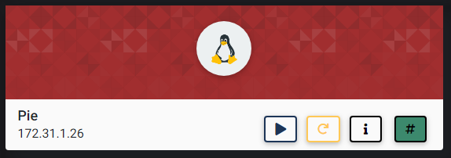
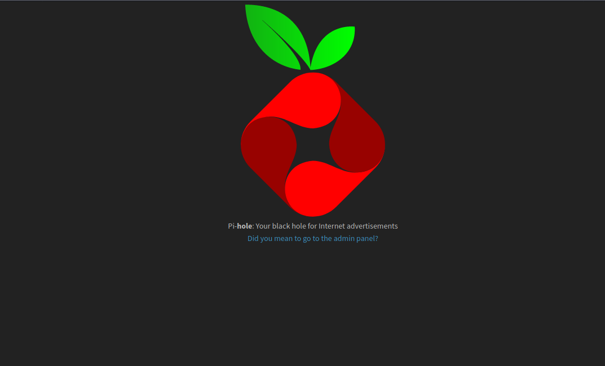
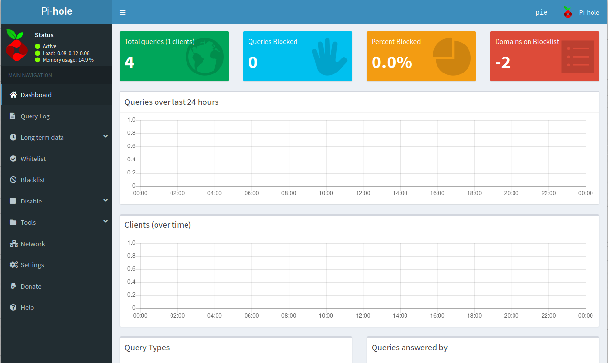
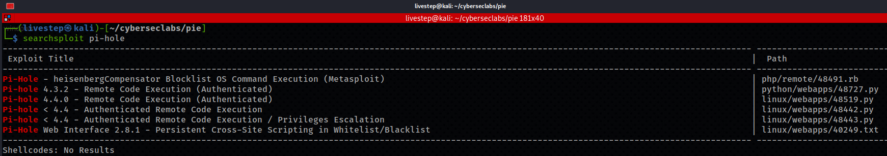
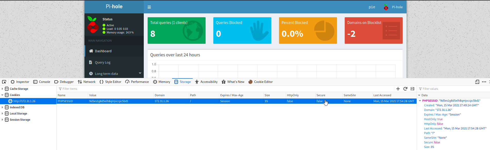
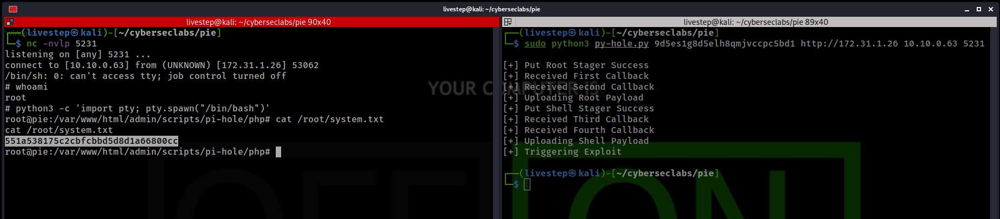

# PIE



## NMAP SCAN

```text
PORT   STATE SERVICE REASON         VERSION
22/tcp open  ssh     syn-ack ttl 63 OpenSSH 7.6p1 Ubuntu 4ubuntu0.3 (Ubuntu Linux; protocol 2.0)
| ssh-hostkey: 
|   2048 f6:a9:75:4c:34:de:ee:58:23:83:dc:b1:00:fc:3f:d4 (RSA)
| ssh-rsa AAAAB3NzaC1yc2EAAAADAQABAAABAQDlc0jSC36svdsFwUFaNKuW5jyJ1NbFbd0qmI6eZ2fG4rVhjK42KwutN0M9CKNF3vw5aJYQFPRWcEhk0OX50woYi26gUG7CLamBqo4XsRpZEoPcZ6U1ufl1sANM8rx+l16pJ0yzikXF5Fuu6ltVlUYZfdCl2BeVef/0FwkCwOvpAq8pY5zNlAbfyPfEdEvjF7mU0KVTyaJl6zmSCjRa2BImGMWwD/tHdqVgla5183ndcylSLxOh5HutOLbc0CtIy2sP/LtSoFtaFyNxcYLlodfRfF1lnbKr9B+31kMnhBczFCgtMSpCuj4rMLqL5SWRYvu5+9qMG6mDbemlJuvD9a3P
|   256 26:44:00:05:82:b6:d2:2e:6a:34:34:91:83:73:fd:50 (ECDSA)
| ecdsa-sha2-nistp256 AAAAE2VjZHNhLXNoYTItbmlzdHAyNTYAAAAIbmlzdHAyNTYAAABBBNnV6IBxRzTs0767OsOCdM5tO8u9cd6L5A4NKcUOIAqGATwaHaeD/bLhHFOI17w3h3CVgGvnLBdl0u0Kx97r76g=
|   256 65:d2:02:da:22:74:71:5c:e1:30:3e:64:ea:37:a0:d3 (ED25519)
|_ssh-ed25519 AAAAC3NzaC1lZDI1NTE5AAAAIFYoY1ADW2IQFjrN1aPh8lkVmwXZjchUX88CBpZcgWe3
53/tcp open  domain  syn-ack ttl 63 dnsmasq pi-hole-2.81
| dns-nsid: 
|_  bind.version: dnsmasq-pi-hole-2.81
80/tcp open  http    syn-ack ttl 63 lighttpd 1.4.45
|_http-favicon: Unknown favicon MD5: 3085ED1F5F2E7501CB0AB1E99C7C225A
| http-methods: 
|_  Supported Methods: OPTIONS GET HEAD POST
|_http-server-header: lighttpd/1.4.45
|_http-title: Site doesn't have a title (text/html; charset=UTF-8).
```

## PORT 80 ENUMERATION



* /ADMIN





## EXPLOIT

* [https://www.exploit-db.com/exploits/48443](https://www.exploit-db.com/exploits/48443)





## FLAGS

### USER

```text
1621f6c9650f47aee51b6b2e08505273
```

### ROOT

```text
551a538175c2cbfcbbd5d8d1a66800cc
```


