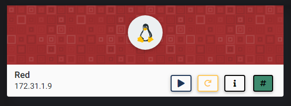
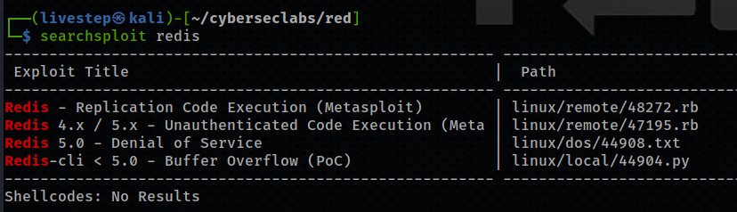
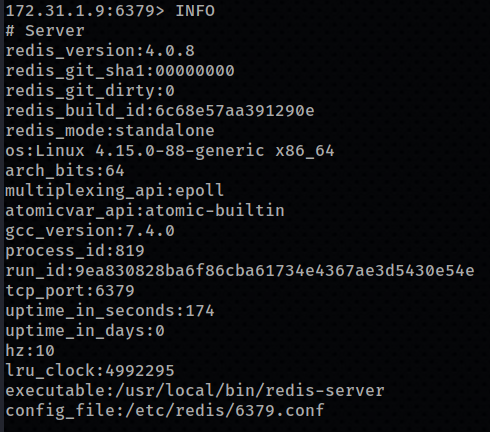
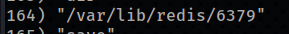
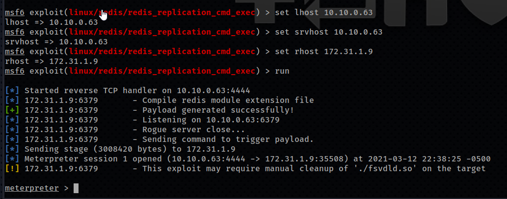
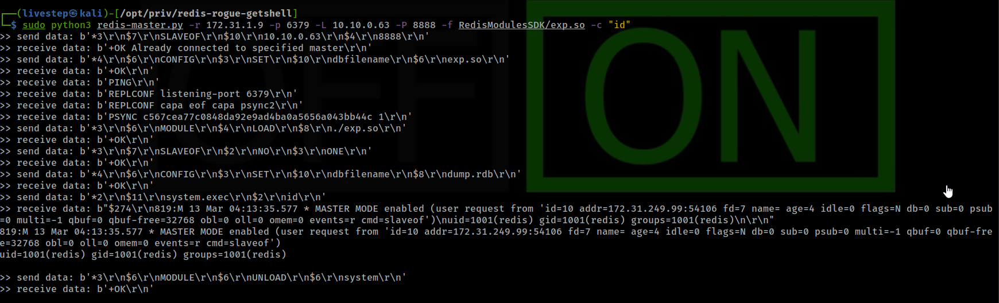
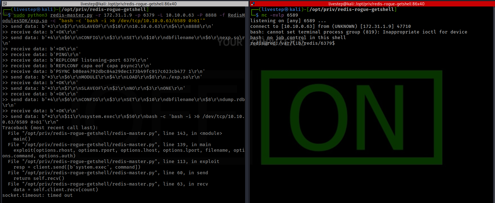
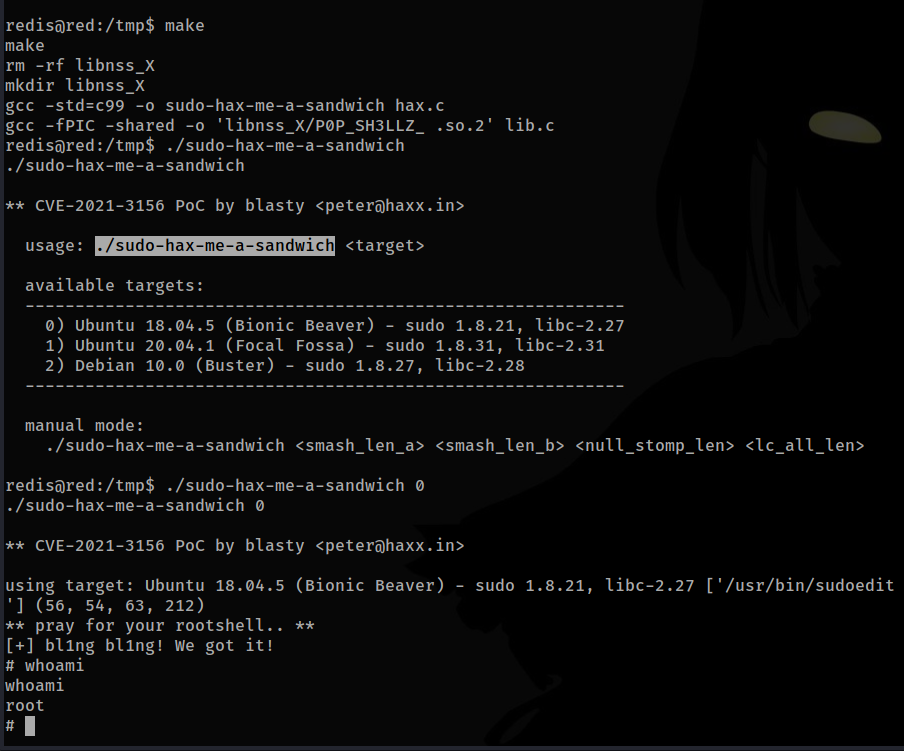

# RED



## NMAP SCAN

```text
PORT     STATE SERVICE REASON         VERSION
22/tcp   open  ssh     syn-ack ttl 63 OpenSSH 7.6p1 Ubuntu 4ubuntu0.3 (Ubuntu Linux; protocol 2.0)
| ssh-hostkey: 
|   2048 32:22:88:22:9b:d2:76:c9:8c:ee:8a:4d:47:63:e5:14 (RSA)
| ssh-rsa AAAAB3NzaC1yc2EAAAADAQABAAABAQDxjwnDd+b9T3FTOzNiuzErD+NgFPDXaSHIGVBp5CU7E5TXC5v78La0mQruA84GG1F3rF3yj7mRFbbDH6sk6KzVv/1ogOLpq7eLPmfF83xof5iW4CEdxULgkNNPW2nRvIA5YHvsUiisGq0l1Ksc0dFGHSMRQsW9FmsoiXk0RI1VZiIEz7qaiaww4VK1XgS12n2oKUo+uT0UiLVWj5LngS6X4UJ0OBbWF75C3cAc5sDYrf1VfZ2chkJ71uixx4NVxjK70+78jLty/rq2o2MAOWqqUMT7F8jj266lG/1sBD0qGPXbKrDrizVLcy1xgMdQKHKO82kXkJ7AJje8JLD9OwtV
|   256 d9:3f:c3:ee:a8:d4:36:c7:29:23:9f:e6:3d:dc:69:4b (ECDSA)
| ecdsa-sha2-nistp256 AAAAE2VjZHNhLXNoYTItbmlzdHAyNTYAAAAIbmlzdHAyNTYAAABBBEPDNxFm+iQlA+bfiJyhMioAMz2EPQLr4dsrwV4E7CHYVm7UiM8V3GuxCCSC6zptkWldm7oElJ7xb5+6JvhviCw=
|   256 24:39:e3:a7:a7:f3:97:11:88:c7:c1:4b:25:f0:fc:c1 (ED25519)
|_ssh-ed25519 AAAAC3NzaC1lZDI1NTE5AAAAIE67igYDY4G53O2phcV3JIY8YFMDWlavW7MrV9KCSzWz
80/tcp   open  http    syn-ack ttl 63 Apache httpd 2.4.29 ((Ubuntu))
| http-methods: 
|_  Supported Methods: GET POST OPTIONS HEAD
|_http-server-header: Apache/2.4.29 (Ubuntu)
|_http-title: Business Solutions
6379/tcp open  redis   syn-ack ttl 63 Redis key-value store 4.0.8
```

## PORT 80 ENUMERATION


## REDIS ENUMERATION



```text
redis-cli -h 172.31.1.9
```

### INFO



### CONFIG GET \*



## EXPLOIT METASPLOIT



## EXPLOIT WITHOUT METASPLOIT

* [https://github.com/vulhub/redis-rogue-getshell](https://github.com/vulhub/redis-rogue-getshell)





## PRIVESC SUDO

* [https://github.com/blasty/CVE-2021-3156](https://github.com/blasty/CVE-2021-3156)



## CREDS

```text
root:$6$2H0fBG39$w90n5N4NwO2ksOd0AdNT3wpgurCx8RQ5OdKtFjWN2GdtXxQvodVy.WRdtTZ7LanbjtDgXtl4kPMskV3i8.QY5.:18325:0:99999:7:::
ant:$6$NqHpc2Ai$fhMSVPOcmZ9M7VKS3qwd9SJqAcBXe748dRqODvop922yeKujXHJyHVdlMCfpdy2O08uRjkG47Euoyy2OVQYrI.:18325:0:99999:7:::
```

## FLAGS

### USER

```text
91a333c7f3815721a95d77d04a7a7e8c
```

### ROOT

```text
d885f78027b1af41751fbfafcb9694b7
```


