# STACK

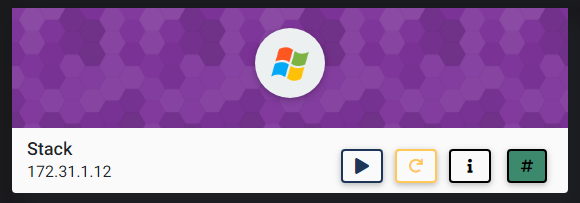

## NMAP SCAN

```text
PORT      STATE SERVICE            REASON          VERSION
80/tcp    open  http               syn-ack ttl 127 Apache httpd 2.2.22 ((Win32) mod_ssl/2.2.22 OpenSSL/0.9.8u mod_wsgi/3.3 Python/2.7.2 PHP/5.4.3)
|_http-server-header: Apache/2.2.22 (Win32) mod_ssl/2.2.22 OpenSSL/0.9.8u mod_wsgi/3.3 Python/2.7.2 PHP/5.4.3
|_http-title: Page not found at /
135/tcp   open  msrpc              syn-ack ttl 127 Microsoft Windows RPC
139/tcp   open  netbios-ssn        syn-ack ttl 127 Microsoft Windows netbios-ssn
445/tcp   open  microsoft-ds       syn-ack ttl 127 Microsoft Windows Server 2008 R2 - 2012 microsoft-ds
3389/tcp  open  ssl/ms-wbt-server? syn-ack ttl 127
| rdp-ntlm-info: 
|   Target_Name: STACK
|   NetBIOS_Domain_Name: STACK
|   NetBIOS_Computer_Name: STACK
|   DNS_Domain_Name: Stack
|   DNS_Computer_Name: Stack
|   Product_Version: 6.3.9600
|_  System_Time: 2021-03-14T01:43:11+00:00
5985/tcp  open  http               syn-ack ttl 127 Microsoft HTTPAPI httpd 2.0 (SSDP/UPnP)
|_http-server-header: Microsoft-HTTPAPI/2.0
|_http-title: Not Found
47001/tcp open  http               syn-ack ttl 127 Microsoft HTTPAPI httpd 2.0 (SSDP/UPnP)
|_http-server-header: Microsoft-HTTPAPI/2.0
|_http-title: Not Found
49152/tcp open  msrpc              syn-ack ttl 127 Microsoft Windows RPC
49153/tcp open  msrpc              syn-ack ttl 127 Microsoft Windows RPC
49154/tcp open  msrpc              syn-ack ttl 127 Microsoft Windows RPC
49155/tcp open  msrpc              syn-ack ttl 127 Microsoft Windows RPC
49156/tcp open  msrpc              syn-ack ttl 127 Microsoft Windows RPC
49163/tcp open  msrpc              syn-ack ttl 127 Microsoft Windows RPC
49164/tcp open  msrpc              syn-ack ttl 127 Microsoft Windows RPC
```

## PORT 80 ENUMERATION

### NIKTO

```text
+ Server: Apache/2.2.22 (Win32) mod_ssl/2.2.22 OpenSSL/0.9.8u mod_wsgi/3.3 Python/2.7.2 PHP/5.4.3
+ The anti-clickjacking X-Frame-Options header is not present.
+ The X-XSS-Protection header is not defined. This header can hint to the user agent to protect against some forms of XSS
+ The X-Content-Type-Options header is not set. This could allow the user agent to render the content of the site in a different fashion to the MIME type
+ OpenSSL/0.9.8u appears to be outdated (current is at least 1.1.1). OpenSSL 1.0.0o and 0.9.8zc are also current.
+ Apache/2.2.22 appears to be outdated (current is at least Apache/2.4.37). Apache 2.2.34 is the EOL for the 2.x branch.
+ PHP/5.4.3 appears to be outdated (current is at least 7.2.12). PHP 5.6.33, 7.0.27, 7.1.13, 7.2.1 may also current release for each branch.
+ Python/2.7.2 appears to be outdated (current is at least 2.7.8)
+ mod_ssl/2.2.22 appears to be outdated (current is at least 2.8.31) (may depend on server version)
+ mod_wsgi/3.3 appears to be outdated (current is at least 4.0)
+ mod_ssl/2.2.22 OpenSSL/0.9.8u mod_wsgi/3.3 Python/2.7.2 PHP/5.4.3 - mod_ssl 2.8.7 and lower are vulnerable to a remote buffer overflow which may allow a remote shell. http://cve.mitre.org/cgi-bin/cvename.cgi?name=CVE-2002-0082, OSVDB-756.
+ OSVDB-877: HTTP TRACE method is active, suggesting the host is vulnerable to XST
+ OSVDB-17113: /SilverStream: SilverStream allows directory listing
+ Cookie GitPHPLocale created without the httponly flag
+ Retrieved x-powered-by header: PHP/5.4.3
+ OSVDB-3092: /web/: This might be interesting...
```

### /WEB/

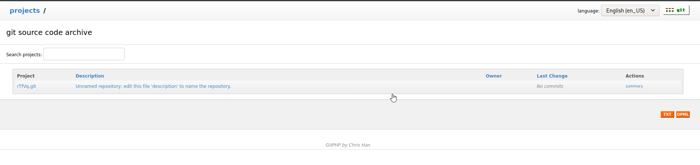

* DEAD END

### /GITSTACK

* DEFAULT CREDENTIALS WORKED ADMIN:ADMIN

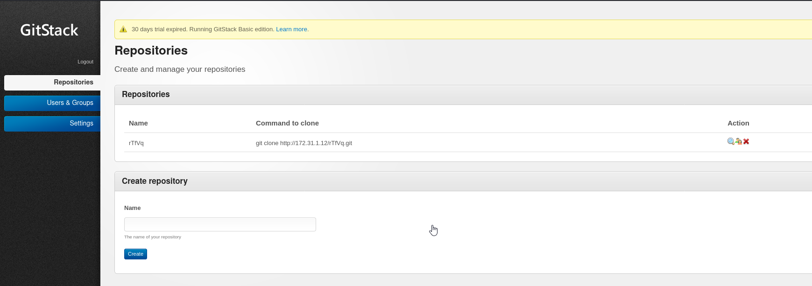

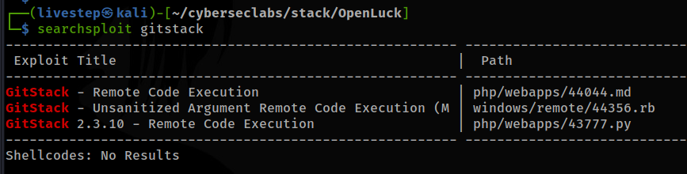

## EXPLOIT

* [https://www.exploit-db.com/exploits/43777](https://www.exploit-db.com/exploits/43777) / CMD=WHOAMI

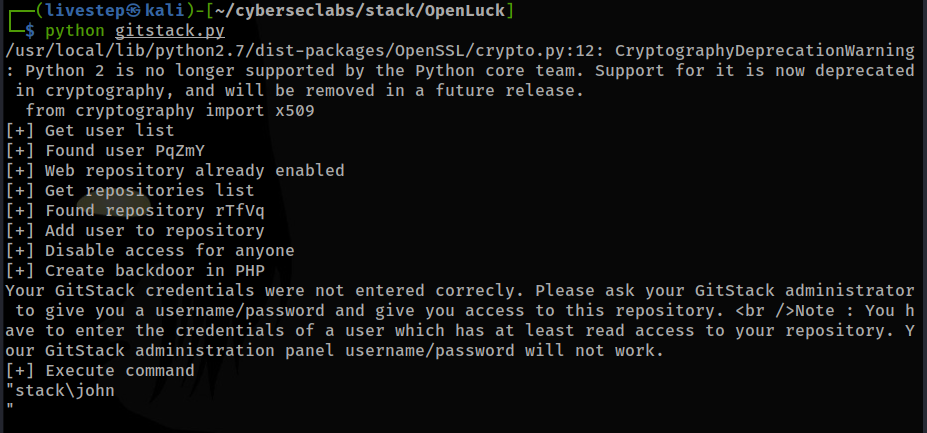

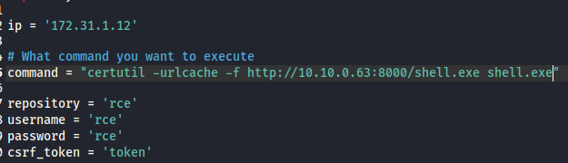

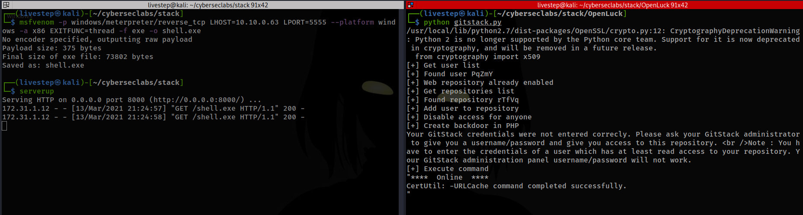

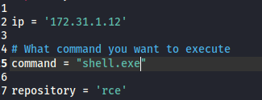

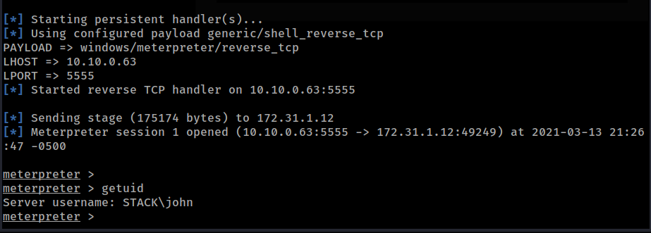

## MACHINE ENUMERATION

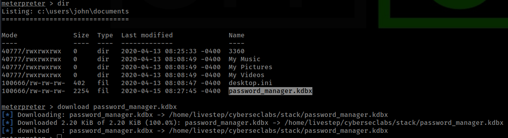

## CRACKING KEEPASS

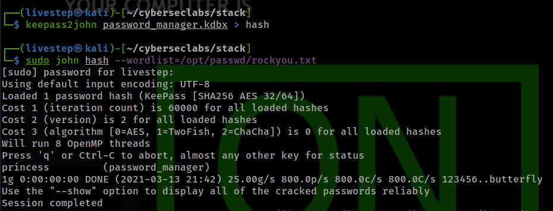

```text
princess
```

```text
keepass2 password_manager.kdbx
```

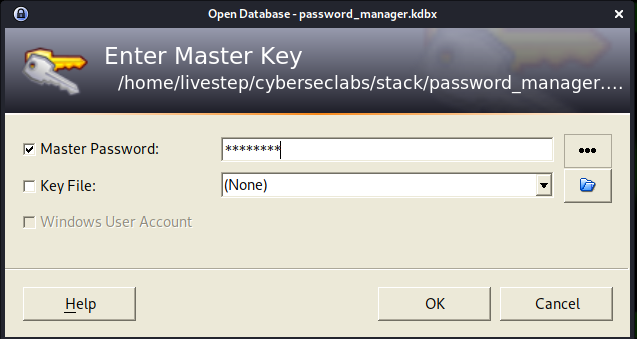

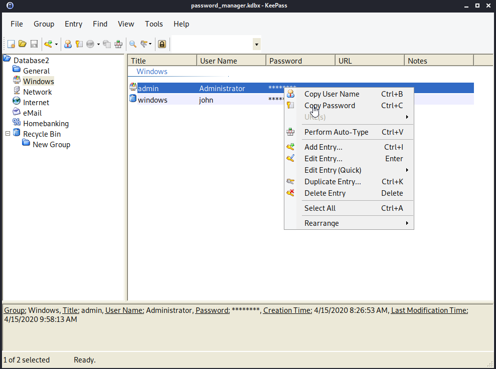

```text
administrator:secur3_apass262
john:whLd49NnsDWRJ7KW
```

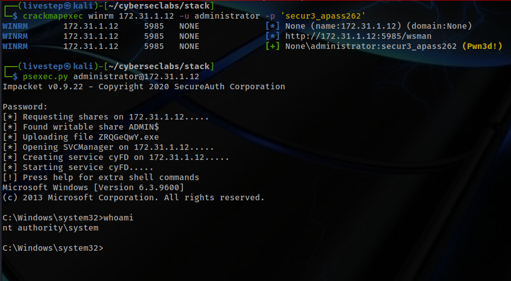

## FLAGS

### USER

```text
reb656565983289247427842gtamf6
```

### ROOT

```text
e3ce12b1bb796932868b0d793c9fac3c
```


