# ENGINE

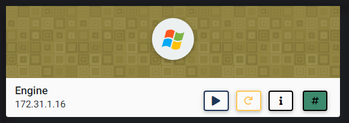

## NMAP SCAN

```text
PORT      STATE SERVICE            REASON          VERSION
80/tcp    open  http               syn-ack ttl 127 Microsoft IIS httpd 8.5
| http-methods: 
|   Supported Methods: OPTIONS TRACE GET HEAD POST
|_  Potentially risky methods: TRACE
|_http-server-header: Microsoft-IIS/8.5
|_http-title: IIS Windows Server
135/tcp   open  msrpc              syn-ack ttl 127 Microsoft Windows RPC
139/tcp   open  netbios-ssn        syn-ack ttl 127 Microsoft Windows netbios-ssn
445/tcp   open  microsoft-ds       syn-ack ttl 127 Microsoft Windows Server 2008 R2 - 2012 microsoft-ds
3389/tcp  open  ssl/ms-wbt-server? syn-ack ttl 127
5985/tcp  open  http               syn-ack ttl 127 Microsoft HTTPAPI httpd 2.0 (SSDP/UPnP)
|_http-server-header: Microsoft-HTTPAPI/2.0
|_http-title: Not Found
49154/tcp open  msrpc              syn-ack ttl 127 Microsoft Windows RPC
49155/tcp open  msrpc              syn-ack ttl 127 Microsoft Windows RPC
49164/tcp open  msrpc              syn-ack ttl 127 Microsoft Windows RPC
```

## PORT 80 ENUMERATION

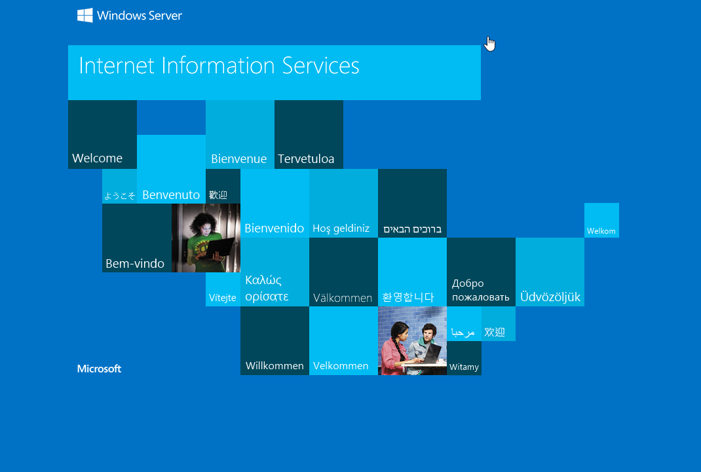

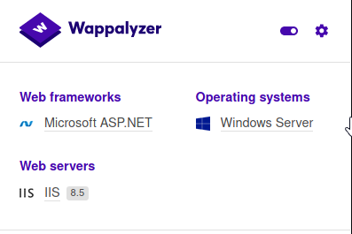

### GOBUSTER

```text
gobuster dir -u http://172.31.1.16 -w /usr/share/dirbuster/wordlists/directory-list-2.3-medium.txt -x asp,aspx,txt -t 20
```

#### /BLOG

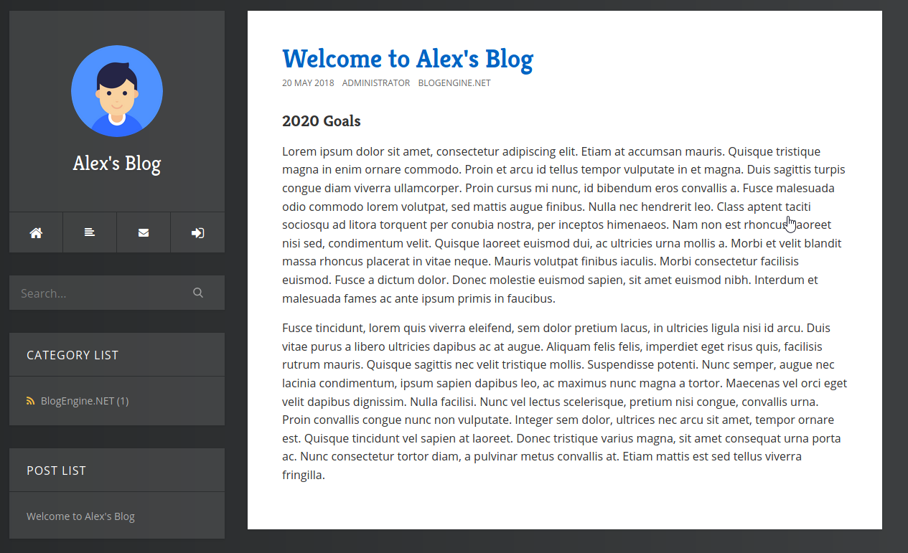


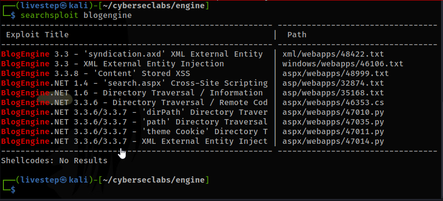

## EXPLOIT

* [https://www.exploit-db.com/exploits/47010](https://www.exploit-db.com/exploits/47010)

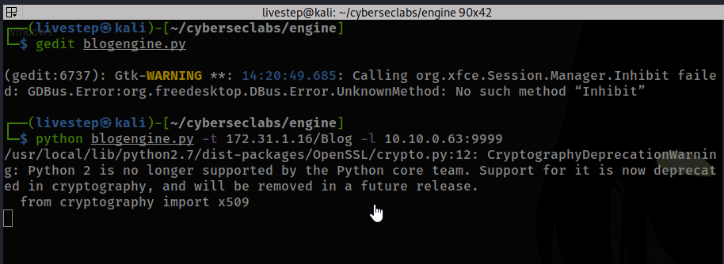

1. Using /Blog in Command

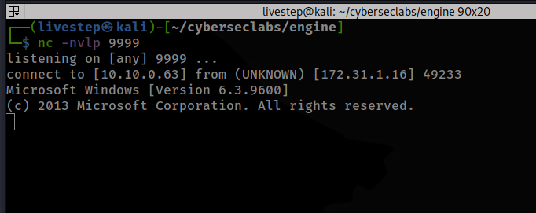

1. Using BURPSUITE, to change the Ip


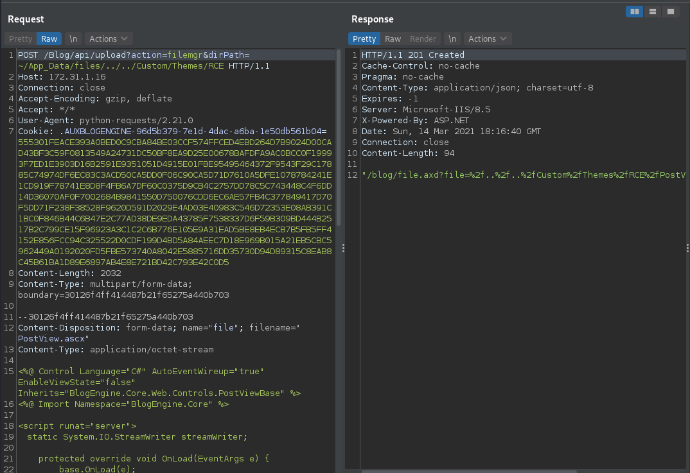

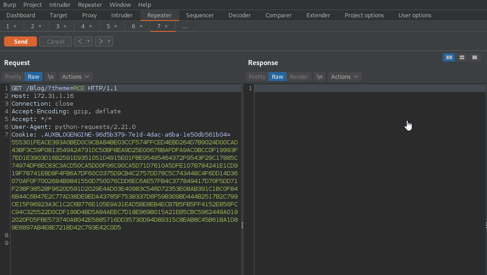

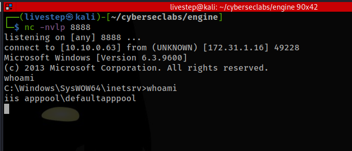

1. Because the shell isn´t stable i upload a meterpreter reverse shell

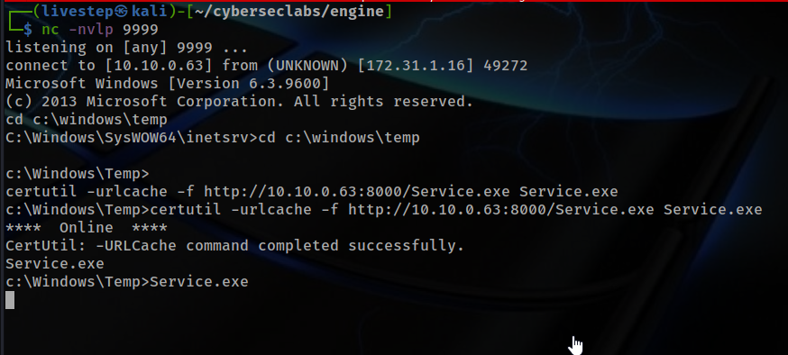

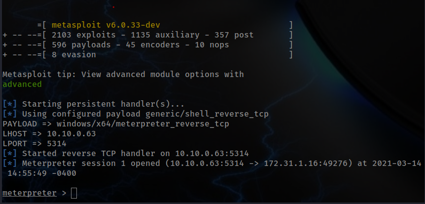

## WINPEAS

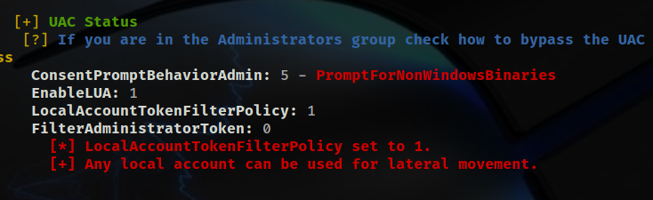

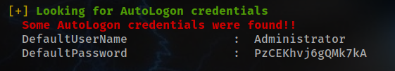

```text
Administrator:PzCEKhvj6gQMk7kA
```

## PRIVESC

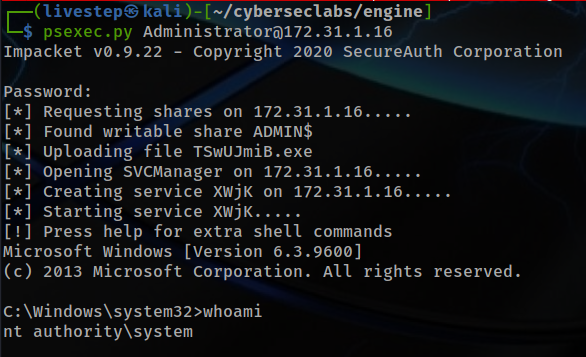

OR

```text
xfreerdp /u:administrator /p:PzCEKhvj6gQMk7kA /cert:ignore /v:172.31.1.16
```

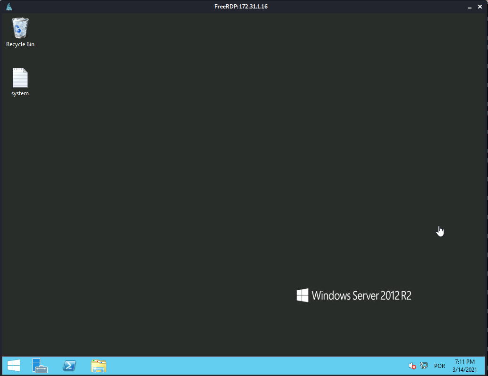

## FLAGS

### USER

```text
150688cfd5d47037eda7a9bb589c8743
```

### ROOT

```text
d345d4ac0d810fcfb63b8be2b7e3bb71
```


