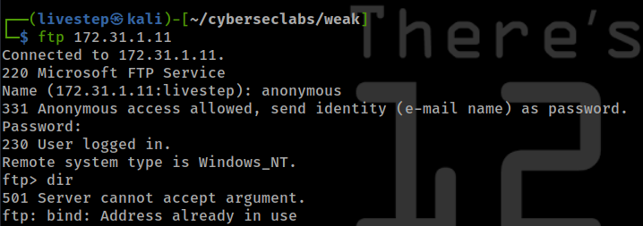
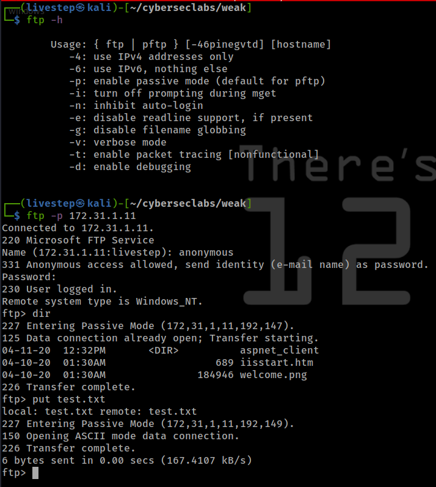
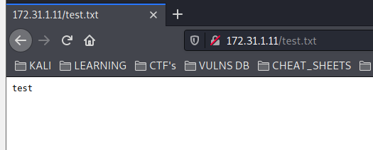
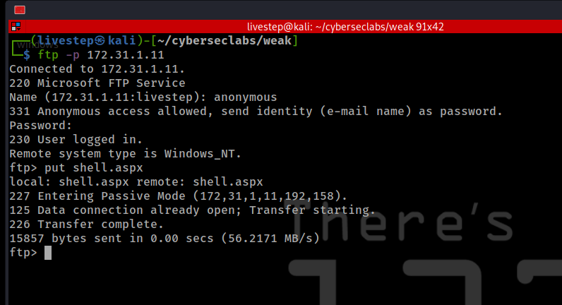
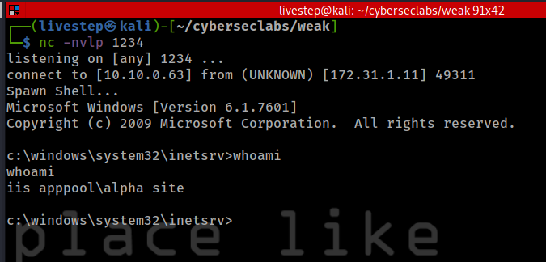
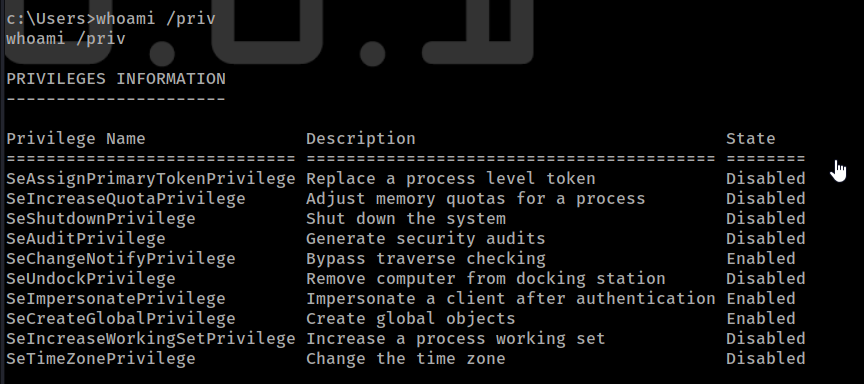
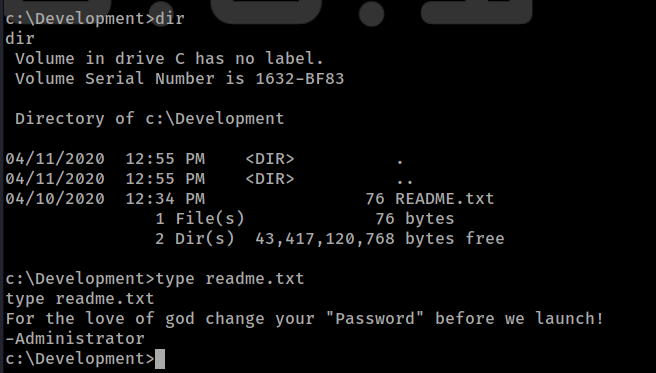
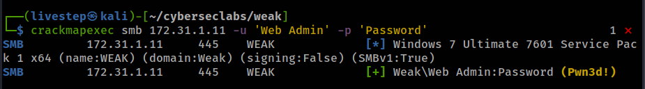
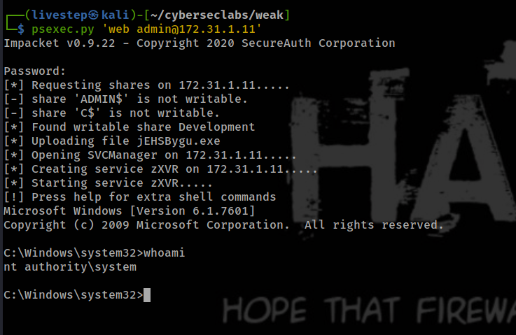

# WEAK

## NMAP SCAN

```text
21/tcp    open  ftp                syn-ack ttl 127 Microsoft ftpd
| ftp-anon: Anonymous FTP login allowed (FTP code 230)
| 04-11-20  12:32PM       <DIR>          aspnet_client
| 04-10-20  01:30AM                  689 iisstart.htm
|_04-10-20  01:30AM               184946 welcome.png
| ftp-syst: 
|_  SYST: Windows_NT
80/tcp    open  http               syn-ack ttl 127 Microsoft IIS httpd 7.5
| http-methods: 
|   Supported Methods: OPTIONS TRACE GET HEAD POST
|_  Potentially risky methods: TRACE
|_http-server-header: Microsoft-IIS/7.5
|_http-title: IIS7
135/tcp   open  msrpc              syn-ack ttl 127 Microsoft Windows RPC
139/tcp   open  netbios-ssn        syn-ack ttl 127 Microsoft Windows netbios-ssn
445/tcp   open  microsoft-ds       syn-ack ttl 127 Windows 7 Ultimate 7601 Service Pack 1 microsoft-ds (workgroup: WORKGROUP)
554/tcp   open  rtsp?              syn-ack ttl 127
2869/tcp  open  http               syn-ack ttl 127 Microsoft HTTPAPI httpd 2.0 (SSDP/UPnP)
3389/tcp  open  ssl/ms-wbt-server? syn-ack ttl 127
5357/tcp  open  http               syn-ack ttl 127 Microsoft HTTPAPI httpd 2.0 (SSDP/UPnP)
|_http-server-header: Microsoft-HTTPAPI/2.0
|_http-title: Service Unavailable
10243/tcp open  http               syn-ack ttl 127 Microsoft HTTPAPI httpd 2.0 (SSDP/UPnP)
|_http-server-header: Microsoft-HTTPAPI/2.0
|_http-title: Not Found
49152/tcp open  msrpc              syn-ack ttl 127 Microsoft Windows RPC
49153/tcp open  msrpc              syn-ack ttl 127 Microsoft Windows RPC
49154/tcp open  msrpc              syn-ack ttl 127 Microsoft Windows RPC
49155/tcp open  msrpc              syn-ack ttl 127 Microsoft Windows RPC
49161/tcp open  msrpc              syn-ack ttl 127 Microsoft Windows RPC
49162/tcp open  msrpc              syn-ack ttl 127 Microsoft Windows RPC
```

## FTP ENUMERATION







## EXPLOIT

### UPLOAD REVERSE SHELL

* [https://github.com/borjmz/aspx-reverse-shell/blob/master/shell.aspx](https://github.com/borjmz/aspx-reverse-shell/blob/master/shell.aspx)






## MACHINE ENUMERATION





## TRY USING WEB ADMIN PASSWORD





## CREDS

```text
Administrator:500:aad3b435b51404eeaad3b435b51404ee:9cc80884d2c301cdb29b2519f04edcb0:::
Guest:501:aad3b435b51404eeaad3b435b51404ee:31d6cfe0d16ae931b73c59d7e0c089c0:::
HomeGroupUser$:1002:aad3b435b51404eeaad3b435b51404ee:857a9f736a7c3b9dd0794184d78db43a:::
Web Admin:1001:aad3b435b51404eeaad3b435b51404ee:a4f49c406510bdcab6824ee7c30fd852:::
```

## FLAGS

### USER

```text
5daa210372a01577b20550679ad1b0d9
```

### ROOT

```text
c3de9cb10bf9d170e3f559a555f880eb
```


