# BLOCKY / OSCP PREP

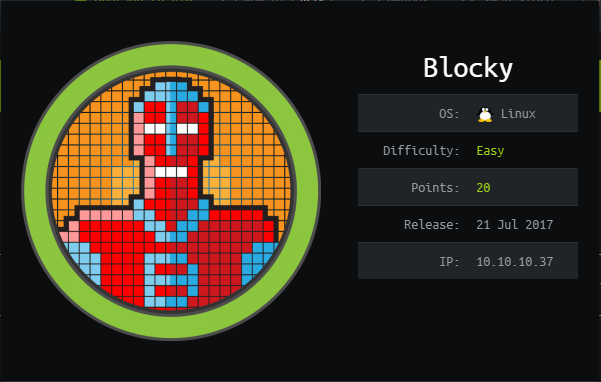

## NMAP SCAN

```text
PORT      STATE  SERVICE   REASON       VERSION
21/tcp    open   ftp?      syn-ack
22/tcp    open   ssh       syn-ack      OpenSSH 7.2p2 Ubuntu 4ubuntu2.2 (Ubuntu Linux; protocol 2.0)
| ssh-hostkey: 
|   2048 d6:2b:99:b4:d5:e7:53:ce:2b:fc:b5:d7:9d:79:fb:a2 (RSA)
| ssh-rsa AAAAB3NzaC1yc2EAAAADAQABAAABAQDXqVh031OUgTdcXsDwffHKL6T9f1GfJ1/x/b/dywX42sDZ5m1Hz46bKmbnWa0YD3LSRkStJDtyNXptzmEp31Fs2DUndVKui3LCcyKXY6FSVWp9ZDBzlW3aY8qa+y339OS3gp3aq277zYDnnA62U7rIltYp91u5VPBKi3DITVaSgzA8mcpHRr30e3cEGaLCxty58U2/lyCnx3I0Lh5rEbipQ1G7Cr6NMgmGtW6LrlJRQiWA1OK2/tDZbLhwtkjB82pjI/0T2gpA/vlZJH0elbMXW40Et6bOs2oK/V2bVozpoRyoQuts8zcRmCViVs8B3p7T1Qh/Z+7Ki91vgicfy4fl
|   256 5d:7f:38:95:70:c9:be:ac:67:a0:1e:86:e7:97:84:03 (ECDSA)
| ecdsa-sha2-nistp256 AAAAE2VjZHNhLXNoYTItbmlzdHAyNTYAAAAIbmlzdHAyNTYAAABBBNgEpgEZGGbtm5suOAio9ut2hOQYLN39Uhni8i4E/Wdir1gHxDCLMoNPQXDOnEUO1QQVbioUUMgFRAXYLhilNF8=
|   256 09:d5:c2:04:95:1a:90:ef:87:56:25:97:df:83:70:67 (ED25519)
|_ssh-ed25519 AAAAC3NzaC1lZDI1NTE5AAAAILqVrP5vDD4MdQ2v3ozqDPxG1XXZOp5VPpVsFUROL6Vj
80/tcp    open   http      syn-ack      Apache httpd 2.4.18 ((Ubuntu))
|_http-generator: WordPress 4.8
| http-methods: 
|_  Supported Methods: GET HEAD POST OPTIONS
|_http-server-header: Apache/2.4.18 (Ubuntu)
|_http-title: BlockyCraft &#8211; Under Construction!
8192/tcp  closed sophos    conn-refused
25565/tcp open   minecraft syn-ack      Minecraft 1.11.2 (Protocol: 127, Message: A Minecraft Server, Users: 0/20)
```

## PORT 21

* Version ProFTPD 1.3.5a

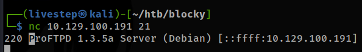

## PORT 80

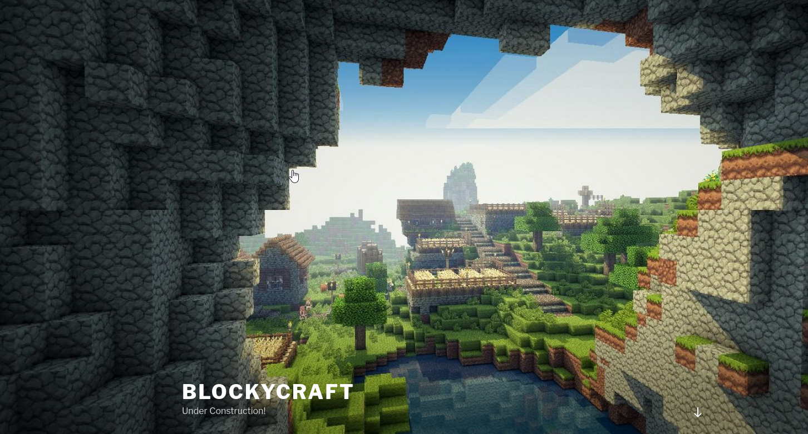

### JAVA PLUGINS

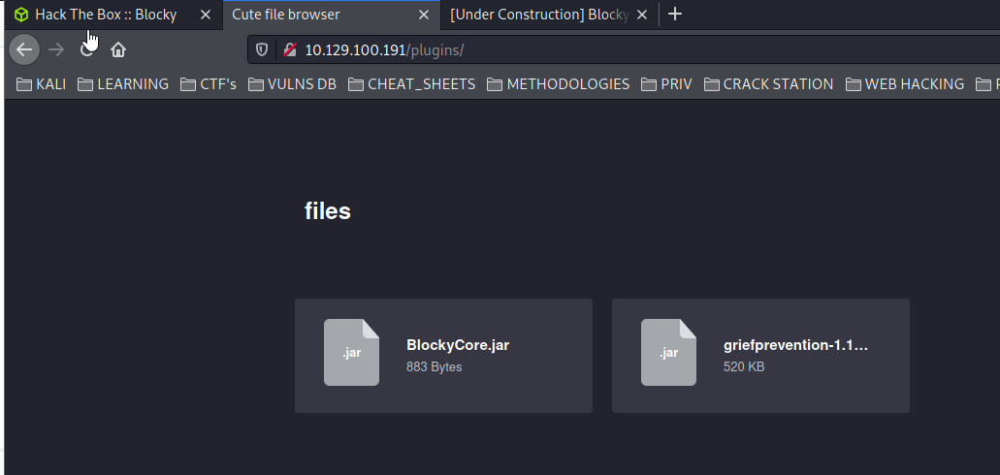

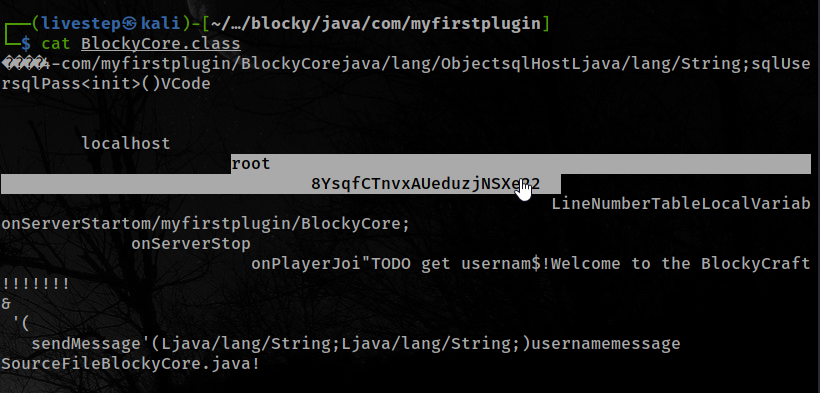

```text
root:8YsqfCTnvxAUeduzjNSXe22
```

### PHPMYADMIN


```text
Notch:$P$BiVoTj899ItS1EZnMhqeqVbrZI4Oq0/
```

#### HASHCAT 

```text
hashcat -m 400 hash /opt/passwd/rockyou.txt
```

### CHANGE PASSWORD IN PHPMYADMIN

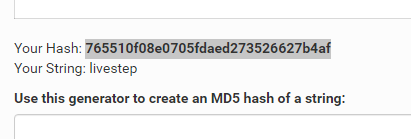

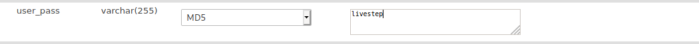

## WEBSHELL

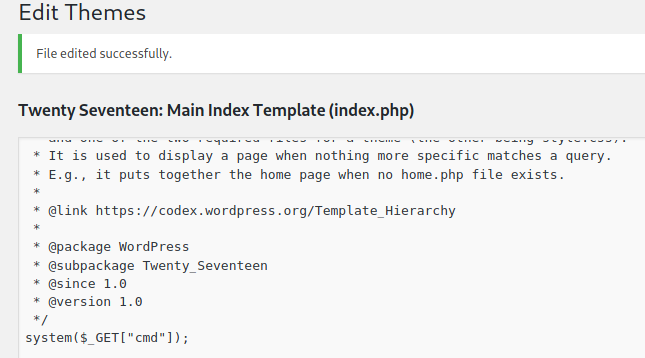

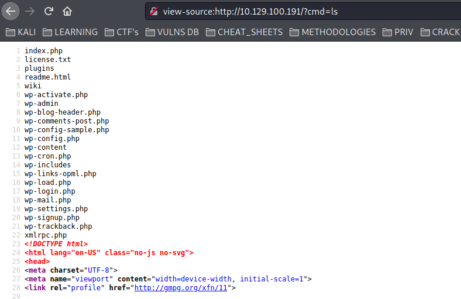

#### WP-CONFIG

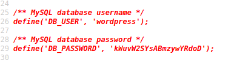

```text
wordpress:kWuvW2SYsABmzywYRdoD
```

## GET A SHELL


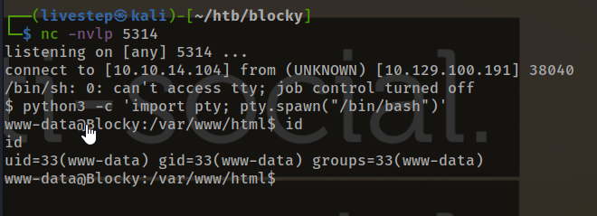

## MACHINE ENUMERATION

### USERS WITH SHELL

```text
root:x:0:0:root:/root:/bin/bash
notch:x:1000:1000:notch,,,:/home/notch:/bin/bash
```

### SERVICES ONLY LOCALHOST

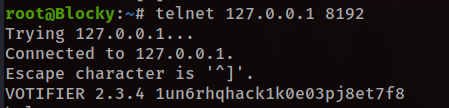

## LOGIN SSH & PRIVESC

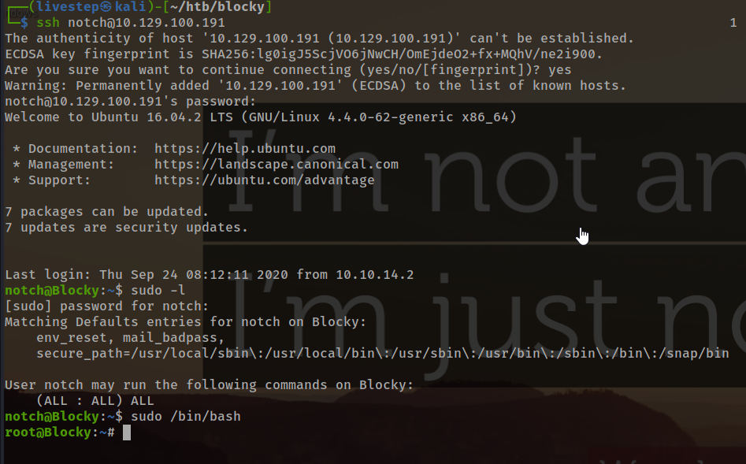

## FLAGS

### USER

```text
59fee0977fb60b8a0bc6e41e751f3cd5
```

### ROOT

```text
0a9694a5b4d272c694679f7860f1cd5f
```

## SHADOW

```text
root:$6$7ndKfAzA$8a5NvmWSj.YV7vcVq1L1WDaQCU3WaY2RCPgnrg.MO79EBVwo028JMrx5y1VQPX5tyIZ.8ZdUYaUucxvAQ4inj/:18410:0:99999:7:::
notch:$6$RdxVAN/.$DFugS5p/G9hTNY9htDWVGKte9n9r/nYYL.wVdAHfiHpnyN9dNftf5Nt.DkjrUs0PlYNcYZWhh0Vhl/5tl8WBG1:17349:0:99999:7:::
```


