# DOCTOR


## NMAP SCAN

```text
PORT     STATE SERVICE  VERSION
22/tcp   open  ssh      OpenSSH 8.2p1 Ubuntu 4ubuntu0.1 (Ubuntu Linux; protocol 2.0)
| ssh-hostkey: 
|   3072 59:4d:4e:c2:d8:cf:da:9d:a8:c8:d0:fd:99:a8:46:17 (RSA)
|   256 7f:f3:dc:fb:2d:af:cb:ff:99:34:ac:e0:f8:00:1e:47 (ECDSA)
|_  256 53:0e:96:6b:9c:e9:c1:a1:70:51:6c:2d:ce:7b:43:e8 (ED25519)
80/tcp   open  http     Apache httpd 2.4.41 ((Ubuntu))
|_http-server-header: Apache/2.4.41 (Ubuntu)
|_http-title: Doctor
8089/tcp open  ssl/http Splunkd httpd
| http-robots.txt: 1 disallowed entry 
|_/
|_http-server-header: Splunkd
|_http-title: splunkd
| ssl-cert: Subject: commonName=SplunkServerDefaultCert/organizationName=SplunkUser
| Not valid before: 2020-09-06T15:57:27
|_Not valid after:  2023-09-06T15:57:27
Warning: OSScan results may be unreliable because we could not find at least 1 open and 1 closed port
Aggressive OS guesses: Linux 4.15 - 5.6 (92%), Linux 5.0 - 5.4 (91%), Linux 5.3 - 5.4 (91%), Linux 2.6.32 (91%), Linux 5.0 (90%), Linux 5.0 - 5.3 (90%), Linux 5.4 (90%), Crestron XPanel control system (90%), ASUS RT-N56U WAP (Linux 3.4) (87%), Linux 3.1 (87%)
No exact OS matches for host (test conditions non-ideal).
Network Distance: 2 hops
Service Info: OS: Linux; CPE: cpe:/o:linux:linux_kernel

TRACEROUTE (using port 80/tcp)
HOP RTT      ADDRESS
1   32.16 ms 10.10.14.1
2   32.41 ms 10.10.10.209
```

## PORT 80 ENUMERATION


* doctors.htb \(ADD TO YOUR HOSTS\)


[https://sentrywhale.com/documentation/reverse-shell](https://sentrywhale.com/documentation/reverse-shell) 

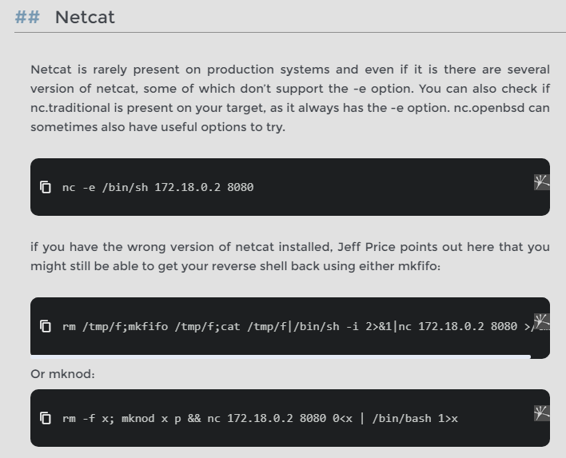

```text

```

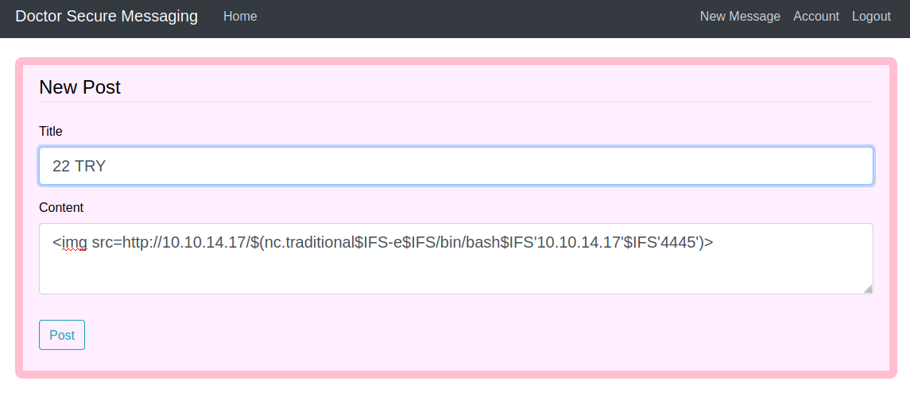


## MACHINE ENUMERATION

```text
root:x:0:0:root:/root:/bin/bash 
... 
shaun:x:1002:1002:shaun,,,:/home/shaun:/bin/bash 
splunk:x:1003:1003:Splunk Server:/opt/splunkforwarder:/bin/bash
```

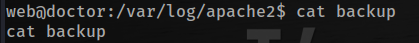

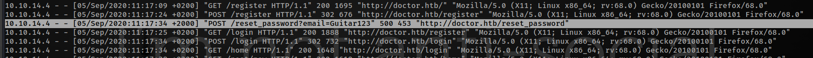

## LATERAL MOVEMENT

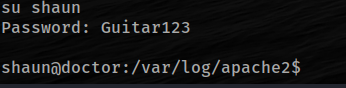

## PORT 8089 EXPLOIT

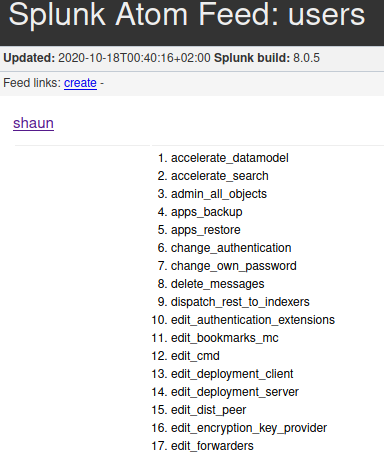

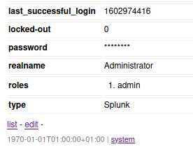

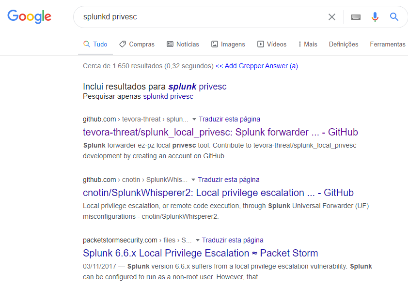

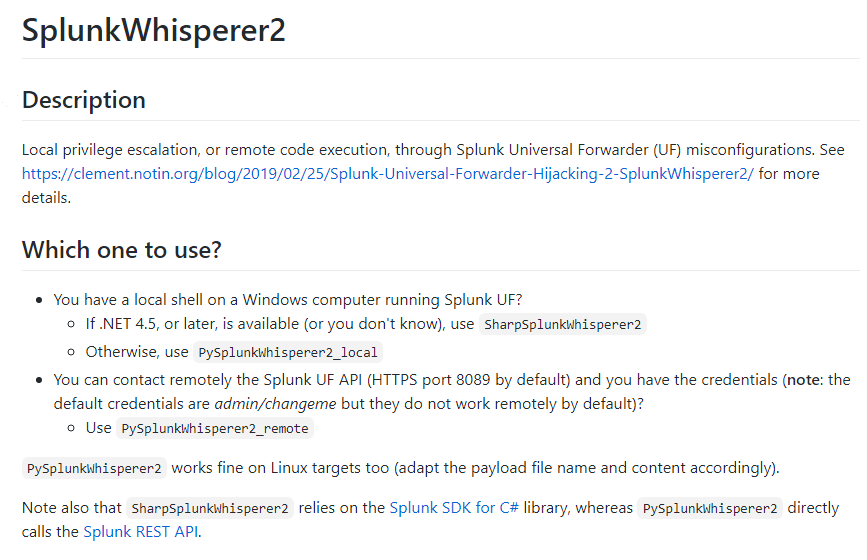

## PRIVESC ROOT

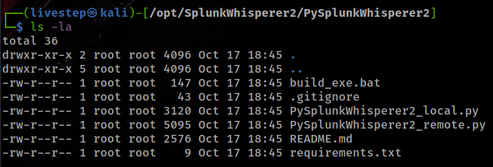

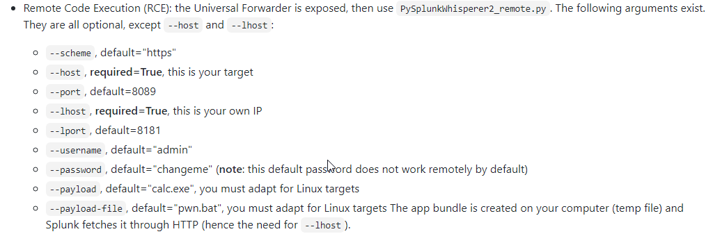

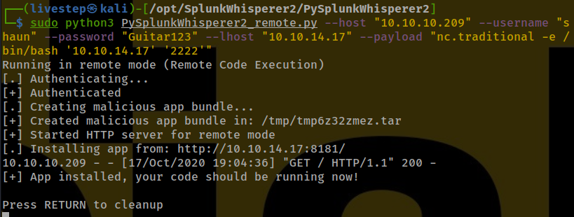

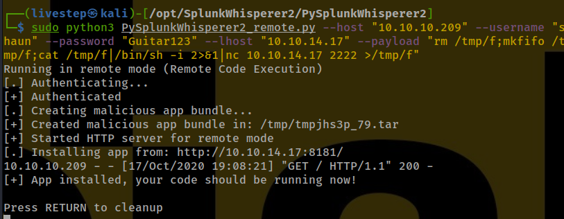

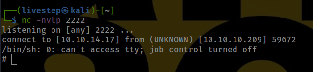

## CREDS

```text
shaun:Guitar123
```


