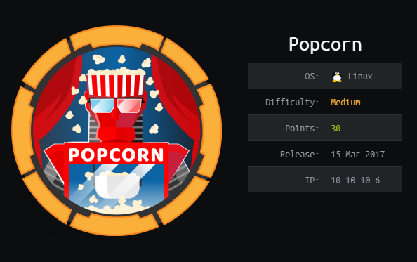
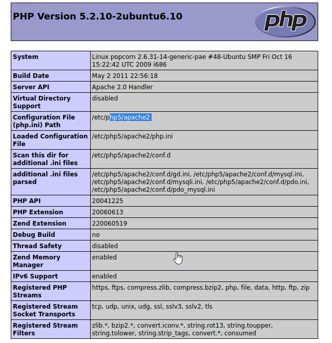
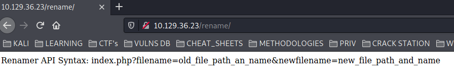
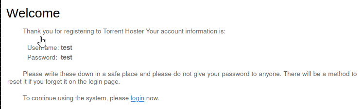
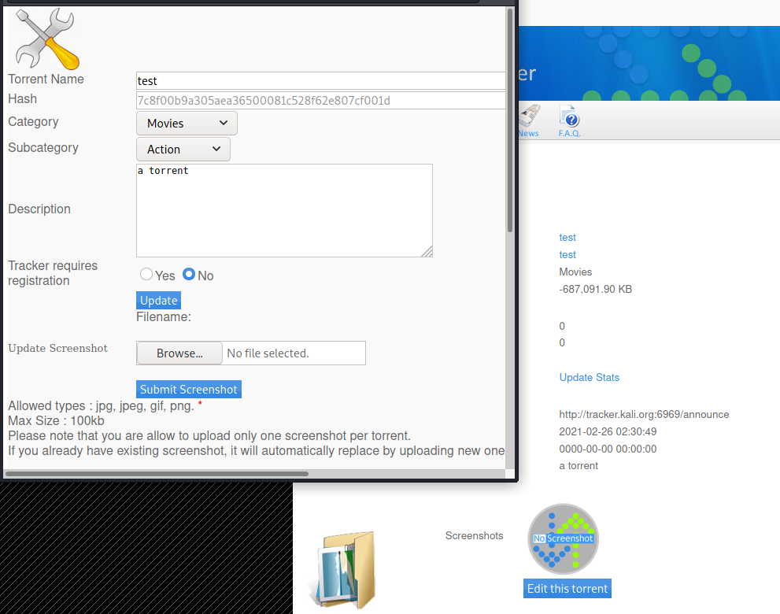
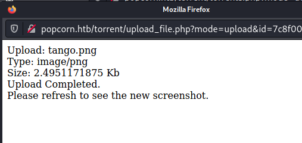
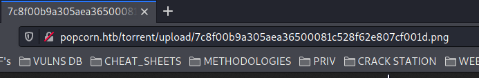
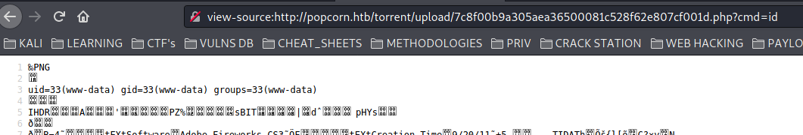
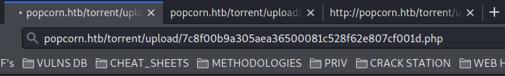
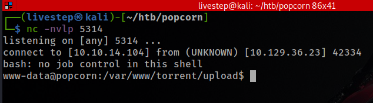

# POPCORN / OSCP PREP



## NMAP SCAN

```text
PORT   STATE SERVICE REASON         VERSION
22/tcp open  ssh     syn-ack ttl 63 OpenSSH 5.1p1 Debian 6ubuntu2 (Ubuntu Linux; protocol 2.0)
| ssh-hostkey: 
|   1024 3e:c8:1b:15:21:15:50:ec:6e:63:bc:c5:6b:80:7b:38 (DSA)
| ssh-dss AAAAB3NzaC1kc3MAAACBAIAn8zzHM1eVS/OaLgV6dgOKaT+kyvjU0pMUqZJ3AgvyOrxHa2m+ydNk8cixF9lP3Z8gLwquTxJDuNJ05xnz9/DzZClqfNfiqrZRACYXsquSAab512kkl+X6CexJYcDVK4qyuXRSEgp4OFY956Aa3CCL7TfZxn+N57WrsBoTEb9PAAAAFQDMosEYukWOzwL00PlxxLC+lBadWQAAAIAhp9/JSROW1jeMX4hCS6Q/M8D1UJYyat9aXoHKg8612mSo/OH8Ht9ULA2vrt06lxoC3O8/1pVD8oztKdJgfQlWW5fLujQajJ+nGVrwGvCRkNjcI0Sfu5zKow+mOG4irtAmAXwPoO5IQJmP0WOgkr+3x8nWazHymoQlCUPBMlDPvgAAAIBmZAfIvcEQmRo8Ef1RaM8vW6FHXFtKFKFWkSJ42XTl3opaSsLaJrgvpimA+wc4bZbrFc4YGsPc+kZbvXN3iPUvQqEldak3yUZRRL3hkF3g3iWjmkpMG/fxNgyJhyDy5tkNRthJWWZoSzxS7sJyPCn6HzYvZ+lKxPNODL+TROLkmQ==
|   2048 aa:1f:79:21:b8:42:f4:8a:38:bd:b8:05:ef:1a:07:4d (RSA)
|_ssh-rsa AAAAB3NzaC1yc2EAAAABIwAAAQEAyBXr3xI9cjrxMH2+DB7lZ6ctfgrek3xenkLLv2vJhQQpQ2ZfBrvkXLsSjQHHwgEbNyNUL+M1OmPFaUPTKiPVP9co0DEzq0RAC+/T4shxnYmxtACC0hqRVQ1HpE4AVjSagfFAmqUvyvSdbGvOeX7WC00SZWPgavL6pVq0qdRm3H22zIVw/Ty9SKxXGmN0qOBq6Lqs2FG8A14fJS9F8GcN9Q7CVGuSIO+UUH53KDOI+vzZqrFbvfz5dwClD19ybduWo95sdUUq/ECtoZ3zuFb6ROI5JJGNWFb6NqfTxAM43+ffZfY28AjB1QntYkezb1Bs04k8FYxb5H7JwhWewoe8xQ==
80/tcp open  http    syn-ack ttl 63 Apache httpd 2.2.12 ((Ubuntu))
| http-methods: 
|_  Supported Methods: GET HEAD POST OPTIONS
|_http-server-header: Apache/2.2.12 (Ubuntu)
|_http-title: Site doesn't have a title (text/html).
```

## PORT 80

### /test



### /rename



### /torrent


* SIGNUP



* UPLOAD TORRENT
* **TEST TORRENT**


* **EDIT TORRENT**









## GET SHELL






### GET CREDS

* config.php


```text
torrent:SuperSecret!!
```

* DATABASE

```text
admin:admin12
```

## MACHINE ENUMERATION

### USERS WITH BASH

```text
root:x:0:0:root:/root:/bin/bash
daemon:x:1:1:daemon:/usr/sbin:/bin/sh
bin:x:2:2:bin:/bin:/bin/sh
sys:x:3:3:sys:/dev:/bin/sh
games:x:5:60:games:/usr/games:/bin/sh
man:x:6:12:man:/var/cache/man:/bin/sh
lp:x:7:7:lp:/var/spool/lpd:/bin/sh
mail:x:8:8:mail:/var/mail:/bin/sh
news:x:9:9:news:/var/spool/news:/bin/sh
uucp:x:10:10:uucp:/var/spool/uucp:/bin/sh
proxy:x:13:13:proxy:/bin:/bin/sh
www-data:x:33:33:www-data:/var/www:/bin/sh
backup:x:34:34:backup:/var/backups:/bin/sh
list:x:38:38:Mailing List Manager:/var/list:/bin/sh
irc:x:39:39:ircd:/var/run/ircd:/bin/sh
gnats:x:41:41:Gnats Bug-Reporting System (admin):/var/lib/gnats:/bin/sh
nobody:x:65534:65534:nobody:/nonexistent:/bin/sh
libuuid:x:100:101::/var/lib/libuuid:/bin/sh
george:x:1000:1000:George Papagiannopoulos,,,:/home/george:/bin/bash
```

## PRIVESC

### DIRTYCOW

* [https://github.com/FireFart/dirtycow/blob/master/dirty.c](https://github.com/FireFart/dirtycow/blob/master/dirty.c)

## CREDS

```text
root:$6$1PvLNv2U$EvfpRPQIztnMAUlrfobv0As0nnGQlECC8okpoyXtdxdqCzlXya.Xc85szAPWozAERUbb5rMdFa2Y.fjEcdQcm0:17242:0:99999:7:::
george:$6$5mK4Ww5O$iHl2dFitDv79c1FSp9AuI4.wOXNsqqv/MLfAAiRP7rvTjU38ii2rwi9tbas0NM/NzueF4AFfJ.XAVouPL5B1e.:17242:0:99999:7:::
```

## FLAGS

### USER

```text
de16d3c94f95d4e3ddc99e8a09a84658
```

### ROOT

```text
9b8ab67db7a225992e9df7302b4f2fc3
```

