# REMOTE / OSCP PREP

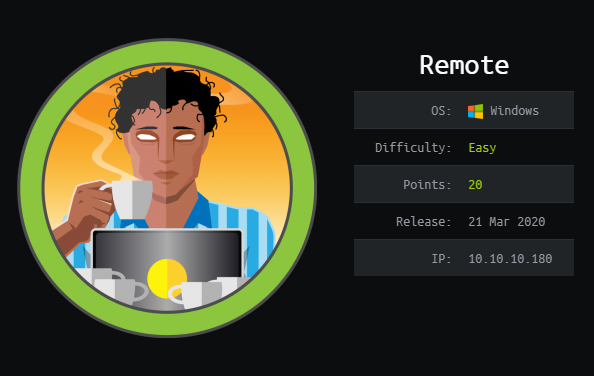

## NMAP SCAN

```text
PORT      STATE SERVICE       REASON          VERSION
21/tcp    open  ftp           syn-ack ttl 127 Microsoft ftpd
|_ftp-anon: Anonymous FTP login allowed (FTP code 230)
| ftp-syst: 
|_  SYST: Windows_NT
80/tcp    open  http          syn-ack ttl 127 Microsoft HTTPAPI httpd 2.0 (SSDP/UPnP)
| http-methods: 
|_  Supported Methods: GET HEAD POST OPTIONS
|_http-title: Home - Acme Widgets
111/tcp   open  rpcbind       syn-ack ttl 127 2-4 (RPC #100000)
| rpcinfo: 
|   program version    port/proto  service
|   100000  2,3,4        111/tcp   rpcbind
|   100000  2,3,4        111/tcp6  rpcbind
|   100000  2,3,4        111/udp   rpcbind
|   100000  2,3,4        111/udp6  rpcbind
|   100003  2,3         2049/udp   nfs
|   100003  2,3         2049/udp6  nfs
|   100003  2,3,4       2049/tcp   nfs
|   100003  2,3,4       2049/tcp6  nfs
|   100005  1,2,3       2049/tcp   mountd
|   100005  1,2,3       2049/tcp6  mountd
|   100005  1,2,3       2049/udp   mountd
|   100005  1,2,3       2049/udp6  mountd
|   100021  1,2,3,4     2049/tcp   nlockmgr
|   100021  1,2,3,4     2049/tcp6  nlockmgr
|   100021  1,2,3,4     2049/udp   nlockmgr
|   100021  1,2,3,4     2049/udp6  nlockmgr
|   100024  1           2049/tcp   status
|   100024  1           2049/tcp6  status
|   100024  1           2049/udp   status
|_  100024  1           2049/udp6  status
135/tcp   open  msrpc         syn-ack ttl 127 Microsoft Windows RPC
139/tcp   open  netbios-ssn   syn-ack ttl 127 Microsoft Windows netbios-ssn
445/tcp   open  microsoft-ds? syn-ack ttl 127
2049/tcp  open  mountd        syn-ack ttl 127 1-3 (RPC #100005)
5985/tcp  open  http          syn-ack ttl 127 Microsoft HTTPAPI httpd 2.0 (SSDP/UPnP)
|_http-server-header: Microsoft-HTTPAPI/2.0
|_http-title: Not Found
47001/tcp open  http          syn-ack ttl 127 Microsoft HTTPAPI httpd 2.0 (SSDP/UPnP)
|_http-server-header: Microsoft-HTTPAPI/2.0
|_http-title: Not Found
49664/tcp open  msrpc         syn-ack ttl 127 Microsoft Windows RPC
49665/tcp open  msrpc         syn-ack ttl 127 Microsoft Windows RPC
49666/tcp open  msrpc         syn-ack ttl 127 Microsoft Windows RPC
49667/tcp open  msrpc         syn-ack ttl 127 Microsoft Windows RPC
49678/tcp open  msrpc         syn-ack ttl 127 Microsoft Windows RPC
49679/tcp open  msrpc         syn-ack ttl 127 Microsoft Windows RPC
49680/tcp open  msrpc         syn-ack ttl 127 Microsoft Windows RPC
```

## PORT 80 ENUMERATION

#### UMBRACO

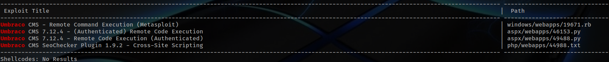

#### USER ENUMERATION

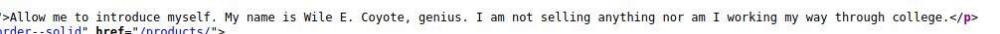

```text
Wile E. Coyote
```

## NFS ENUMERATION

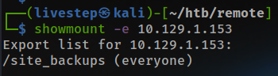

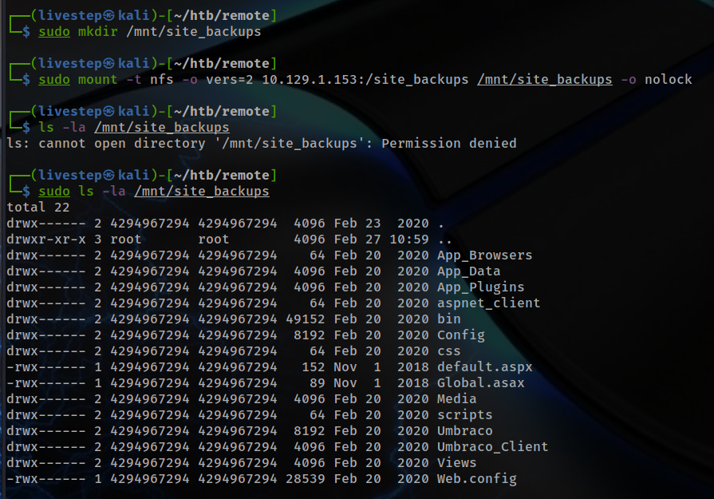

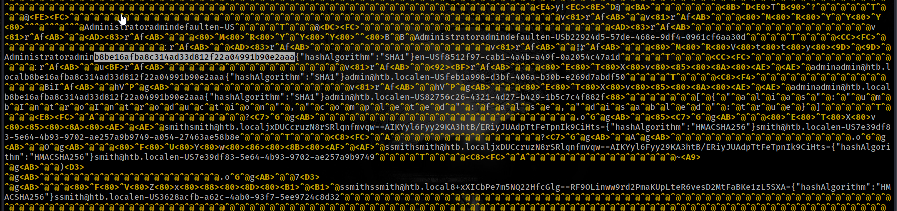

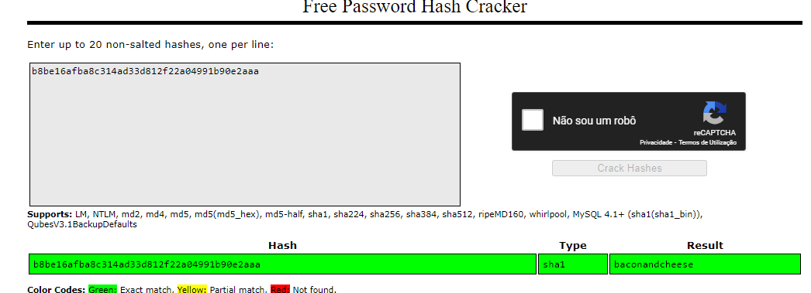

```text
admin@htb.local:baconandcheese
```

## EXPLOIT UMBRACO

* [https://www.exploit-db.com/exploits/49488](https://www.exploit-db.com/exploits/49488)

#### POC

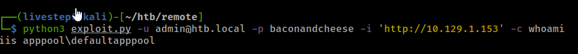

UPLOAD A SHELL.EXE

## GET SHELL

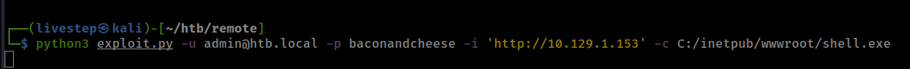

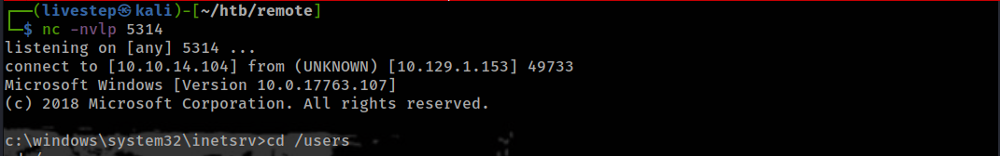

## MACHINE ENUMERATION

### SYSTEMINFO

```text
Host Name:                 REMOTE
OS Name:                   Microsoft Windows Server 2019 Standard
OS Version:                10.0.17763 N/A Build 17763
OS Manufacturer:           Microsoft Corporation
OS Configuration:          Standalone Server
OS Build Type:             Multiprocessor Free
Registered Owner:          Windows User
Registered Organization:   
Product ID:                00429-00521-62775-AA801
Original Install Date:     2/19/2020, 3:03:29 PM
System Boot Time:          2/27/2021, 10:03:53 AM
System Manufacturer:       VMware, Inc.
System Model:              VMware7,1
System Type:               x64-based PC
Processor(s):              4 Processor(s) Installed.
                           [01]: AMD64 Family 23 Model 49 Stepping 0 AuthenticAMD ~2994 Mhz
                           [02]: AMD64 Family 23 Model 49 Stepping 0 AuthenticAMD ~2994 Mhz
                           [03]: AMD64 Family 23 Model 49 Stepping 0 AuthenticAMD ~2994 Mhz
                           [04]: AMD64 Family 23 Model 49 Stepping 0 AuthenticAMD ~2994 Mhz
BIOS Version:              VMware, Inc. VMW71.00V.13989454.B64.1906190538, 6/19/2019
Windows Directory:         C:\Windows
System Directory:          C:\Windows\system32
Boot Device:               \Device\HarddiskVolume1
System Locale:             en-us;English (United States)
Input Locale:              en-us;English (United States)
Time Zone:                 (UTC-05:00) Eastern Time (US & Canada)
Total Physical Memory:     4,095 MB
Available Physical Memory: 2,650 MB
Virtual Memory: Max Size:  4,799 MB
Virtual Memory: Available: 3,457 MB
Virtual Memory: In Use:    1,342 MB
Page File Location(s):     C:\pagefile.sys
Domain:                    WORKGROUP
Logon Server:              N/A
Hotfix(s):                 5 Hotfix(s) Installed.
                           [01]: KB4534119
                           [02]: KB4462930
                           [03]: KB4516115
                           [04]: KB4523204
                           [05]: KB4464455
Network Card(s):           1 NIC(s) Installed.
                           [01]: vmxnet3 Ethernet Adapter
                                 Connection Name: Ethernet0 2
                                 DHCP Enabled:    Yes
                                 DHCP Server:     10.129.0.1
                                 IP address(es)
                                 [01]: 10.129.1.153
                                 [02]: fe80::196:fbce:de8f:d9a2
                                 [03]: dead:beef::196:fbce:de8f:d9a2
Hyper-V Requirements:      A hypervisor has been detected. Features required for Hyper-V will not be displayed.
```

### PRIVS

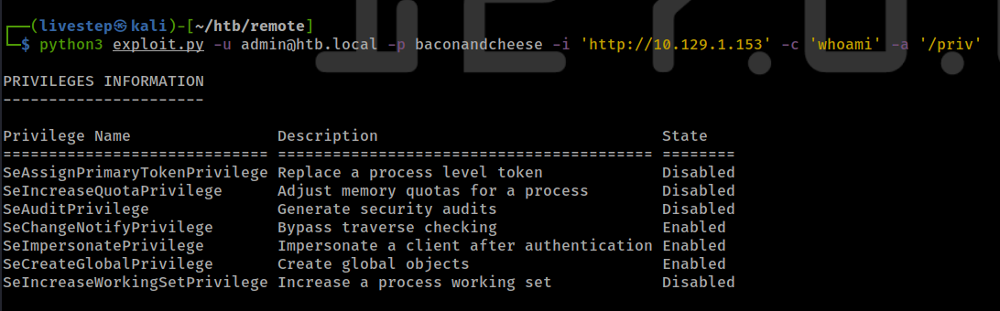

## WINPEAS

```text
C:\Windows\Panther\Unattend.xml
```

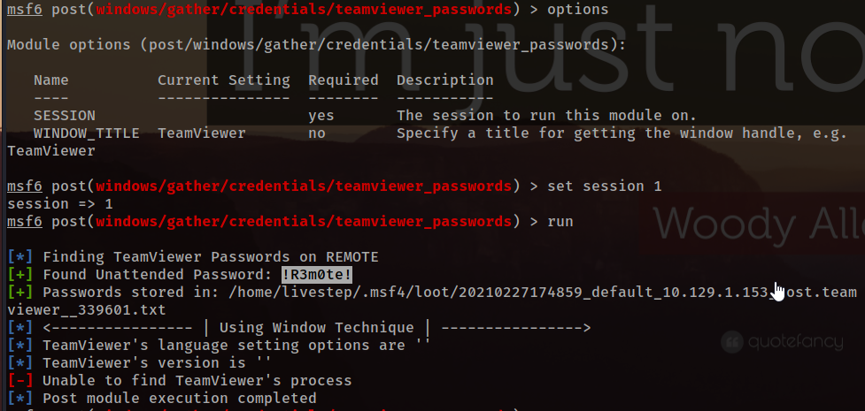

```text
!R3m0te!
```

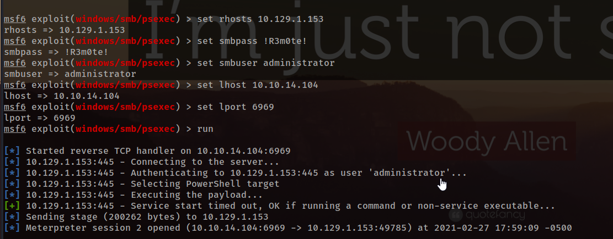

## CREDS

```text
Administrator:500:aad3b435b51404eeaad3b435b51404ee:86fc053bc0b23588798277b22540c40c:::
DefaultAccount:503:aad3b435b51404eeaad3b435b51404ee:31d6cfe0d16ae931b73c59d7e0c089c0:::
Guest:501:aad3b435b51404eeaad3b435b51404ee:31d6cfe0d16ae931b73c59d7e0c089c0:::
WDAGUtilityAccount:504:aad3b435b51404eeaad3b435b51404ee:05c9ce2fb8aad311f8447afa1398fb43:::
```

## FLAGS

### USER

```text
cd0b26b8b75dc94aedb5b3004fabafbd
```

### ROOT

```text
cc7464362f34525aedc04f7a1effa6bc
```

