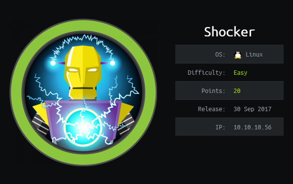
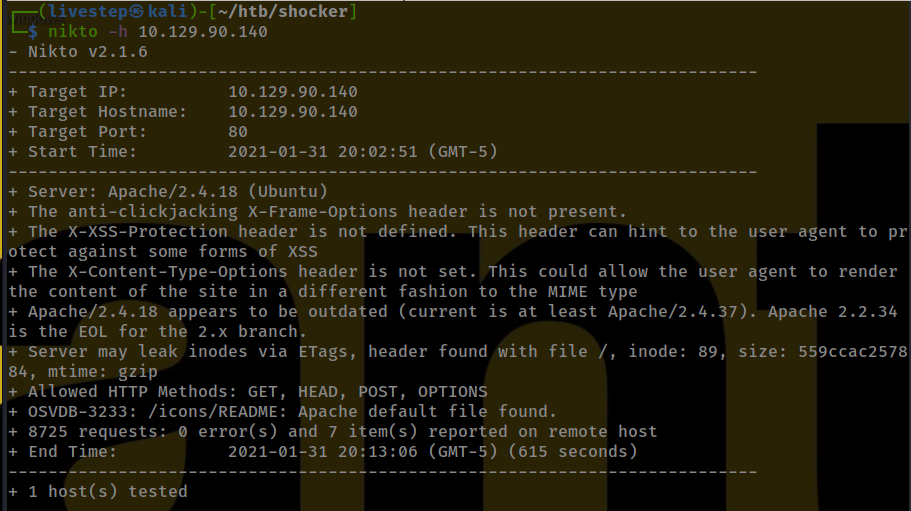
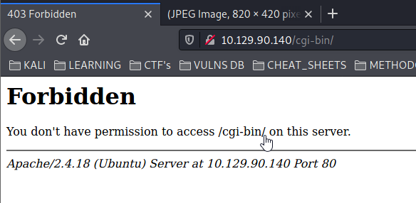
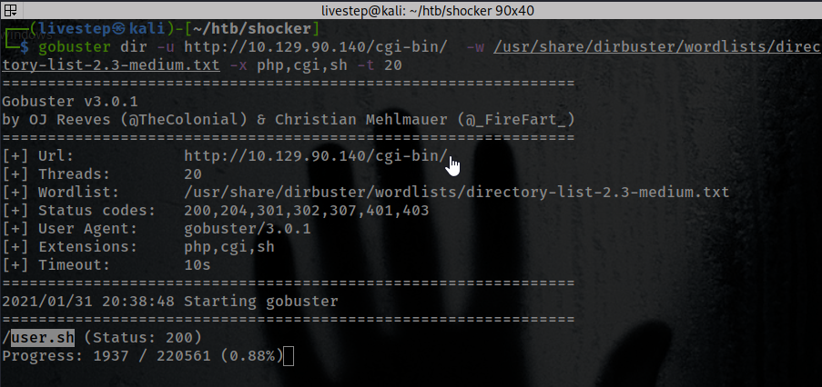
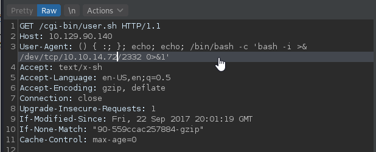
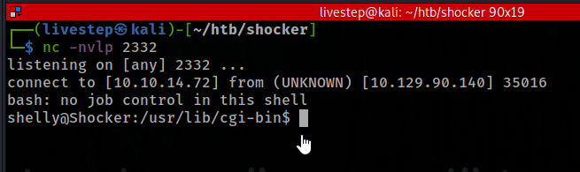
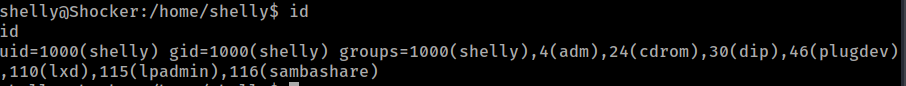
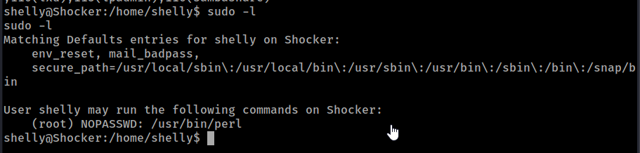
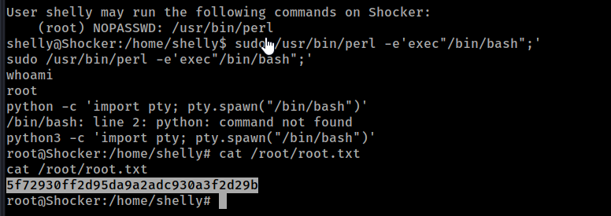

# SHOCKER / OSCP PREP



## NMAP SCAN

```text
PORT     STATE SERVICE REASON         VERSION
80/tcp   open  http    syn-ack ttl 63 Apache httpd 2.4.18 ((Ubuntu))
| http-methods: 
|_  Supported Methods: GET HEAD POST OPTIONS
|_http-server-header: Apache/2.4.18 (Ubuntu)
|_http-title: Site doesn't have a title (text/html).
2222/tcp open  ssh     syn-ack ttl 63 OpenSSH 7.2p2 Ubuntu 4ubuntu2.2 (Ubuntu Linux; protocol 2.0)
| ssh-hostkey: 
|   2048 c4:f8:ad:e8:f8:04:77:de:cf:15:0d:63:0a:18:7e:49 (RSA)
| ssh-rsa AAAAB3NzaC1yc2EAAAADAQABAAABAQD8ArTOHWzqhwcyAZWc2CmxfLmVVTwfLZf0zhCBREGCpS2WC3NhAKQ2zefCHCU8XTC8hY9ta5ocU+p7S52OGHlaG7HuA5Xlnihl1INNsMX7gpNcfQEYnyby+hjHWPLo4++fAyO/lB8NammyA13MzvJy8pxvB9gmCJhVPaFzG5yX6Ly8OIsvVDk+qVa5eLCIua1E7WGACUlmkEGljDvzOaBdogMQZ8TGBTqNZbShnFH1WsUxBtJNRtYfeeGjztKTQqqj4WD5atU8dqV/iwmTylpE7wdHZ+38ckuYL9dmUPLh4Li2ZgdY6XniVOBGthY5a2uJ2OFp2xe1WS9KvbYjJ/tH
|   256 22:8f:b1:97:bf:0f:17:08:fc:7e:2c:8f:e9:77:3a:48 (ECDSA)
| ecdsa-sha2-nistp256 AAAAE2VjZHNhLXNoYTItbmlzdHAyNTYAAAAIbmlzdHAyNTYAAABBBPiFJd2F35NPKIQxKMHrgPzVzoNHOJtTtM+zlwVfxzvcXPFFuQrOL7X6Mi9YQF9QRVJpwtmV9KAtWltmk3qm4oc=
|   256 e6:ac:27:a3:b5:a9:f1:12:3c:34:a5:5d:5b:eb:3d:e9 (ED25519)
|_ssh-ed25519 AAAAC3NzaC1lZDI1NTE5AAAAIC/RjKhT/2YPlCgFQLx+gOXhC6W3A3raTzjlXQMT8Msk
No exact OS matches for host (If you know what OS is running on it, see https://nmap.org/submit/ ).
```

## PORT 80 ENUMERATION

### GOBUSTER


### NIKTO



## SHELLSHOCK





## EXPLOIT





## PRIVESC

* There are some Ways
* LXD GROUP 



* SUDO PERL





## FLAGS

### USER

```text
b0ccf8c6ae90e4f2c7f431204bfff8f0
```

### ROOT

```text
5f72930ff2d95da9a2adc930a3f2d29b
```

## SHADOW

```text
root:$6$BVgS5ne0$Q6rV3guK7QQUy7uRMwbQ3vv2Y5I9yQUhIzvrIhuiDso/o5UfDxZw7MMq8atR3UdJjhpkFVxVD0cVtjXQdPUAH.:17431:0:99999:7:::
shelly:$6$aYLAoDIC$CJ8f8WSCT6GYmbx7x8z5RfrbTG5mpDkkJkLW097hoiEw3tqei2cE7EcUTYdJTVMSa3PALZeBHjhiFR8Ba5jzf0:17431:0:99999:7:::
```

