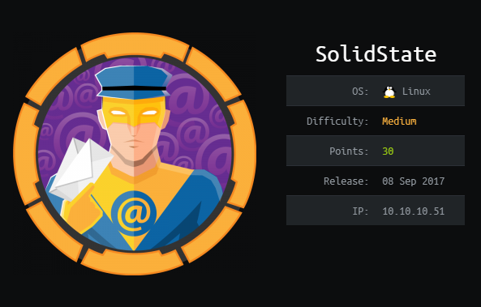
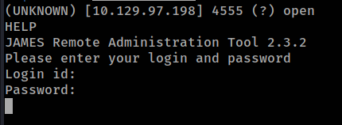
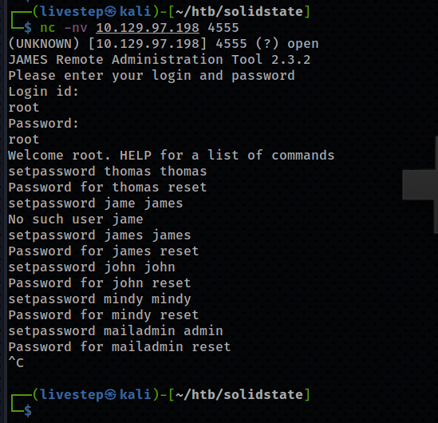
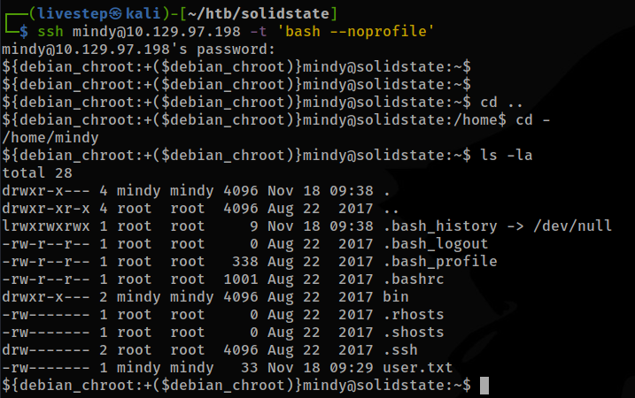
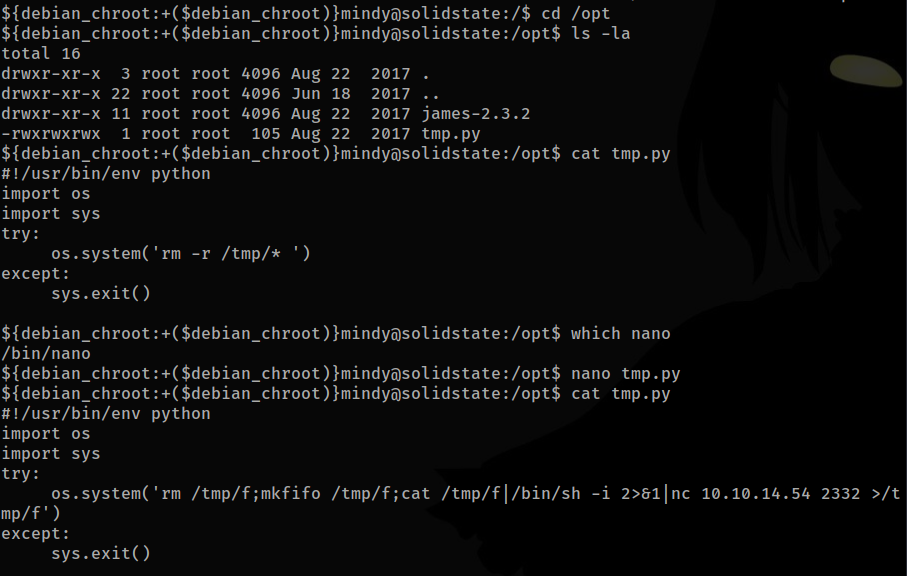

# SOLID STATE / OSCP PREP



## NMAP SCAN

```text
PORT     STATE SERVICE REASON  VERSION
22/tcp   open  ssh     syn-ack OpenSSH 7.4p1 Debian 10+deb9u1 (protocol 2.0)
| ssh-hostkey: 
|   2048 77:00:84:f5:78:b9:c7:d3:54:cf:71:2e:0d:52:6d:8b (RSA)
| ssh-rsa AAAAB3NzaC1yc2EAAAADAQABAAABAQCp5WdwlckuF4slNUO29xOk/Yl/cnXT/p6qwezI0ye+4iRSyor8lhyAEku/yz8KJXtA+ALhL7HwYbD3hDUxDkFw90V1Omdedbk7SxUVBPK2CiDpvXq1+r5fVw26WpTCdawGKkaOMYoSWvliBsbwMLJEUwVbZ/GZ1SUEswpYkyZeiSC1qk72L6CiZ9/5za4MTZw8Cq0akT7G+mX7Qgc+5eOEGcqZt3cBtWzKjHyOZJAEUtwXAHly29KtrPUddXEIF0qJUxKXArEDvsp7OkuQ0fktXXkZuyN/GRFeu3im7uQVuDgiXFKbEfmoQAsvLrR8YiKFUG6QBdI9awwmTkLFbS1Z
|   256 78:b8:3a:f6:60:19:06:91:f5:53:92:1d:3f:48:ed:53 (ECDSA)
| ecdsa-sha2-nistp256 AAAAE2VjZHNhLXNoYTItbmlzdHAyNTYAAAAIbmlzdHAyNTYAAABBBISyhm1hXZNQl3cslogs5LKqgWEozfjs3S3aPy4k3riFb6UYu6Q1QsxIEOGBSPAWEkevVz1msTrRRyvHPiUQ+eE=
|   256 e4:45:e9:ed:07:4d:73:69:43:5a:12:70:9d:c4:af:76 (ED25519)
|_ssh-ed25519 AAAAC3NzaC1lZDI1NTE5AAAAIMKbFbK3MJqjMh9oEw/2OVe0isA7e3ruHz5fhUP4cVgY
25/tcp   open  smtp?   syn-ack
|_smtp-commands: Couldn't establish connection on port 25
110/tcp  open  pop3?   syn-ack
119/tcp  open  nntp?   syn-ack
4555/tcp open  rsip?   syn-ack
Service Info: OS: Linux; CPE: cpe:/o:linux:linux_kernel
```

## PORT 4555



```text
root:root
```

#### ENUM USERS

```text
user: james 
user: thomas 
user: john 
user: mindy 
user: mailadmin
```

* RESET all the passwords accounts



## PORT 110

## RETRIEVING EMAILS

* JOHN \(1 EMAIL\)

```text
Return-Path: <mailadmin@localhost>
Message-ID: <9564574.1.1503422198108.JavaMail.root@solidstate>
MIME-Version: 1.0
Content-Type: text/plain; charset=us-ascii
Content-Transfer-Encoding: 7bit
Delivered-To: john@localhost
Received: from 192.168.11.142 ([192.168.11.142])
          by solidstate (JAMES SMTP Server 2.3.2) with SMTP ID 581
          for <john@localhost>;
          Tue, 22 Aug 2017 13:16:20 -0400 (EDT)
Date: Tue, 22 Aug 2017 13:16:20 -0400 (EDT)
From: mailadmin@localhost
Subject: New Hires access
John, 

Can you please restrict mindy's access until she gets read on to the program. Also make sure that you send her a tempory password to login to her accounts.

Thank you in advance.

Respectfully,
James
```

* MINDY \(2 EMAILS\)

```text
Return-Path: <mailadmin@localhost>
Message-ID: <5420213.0.1503422039826.JavaMail.root@solidstate>
MIME-Version: 1.0
Content-Type: text/plain; charset=us-ascii
Content-Transfer-Encoding: 7bit
Delivered-To: mindy@localhost
Received: from 192.168.11.142 ([192.168.11.142])
          by solidstate (JAMES SMTP Server 2.3.2) with SMTP ID 798
          for <mindy@localhost>;
          Tue, 22 Aug 2017 13:13:42 -0400 (EDT)
Date: Tue, 22 Aug 2017 13:13:42 -0400 (EDT)
From: mailadmin@localhost
Subject: Welcome

Dear Mindy,
Welcome to Solid State Security Cyber team! We are delighted you are joining us as a junior defense analyst. Your role is critical in fulfilling the mission of our orginzation. The enclosed information is designed to serve as an introduction to Cyber Security and provide resources that will help you make a smooth transition into your new role. The Cyber team is here to support your transition so, please know that you can call on any of us to assist you.

We are looking forward to you joining our team and your success at Solid State Security. 

Respectfully,
James
```

```text
Return-Path: <mailadmin@localhost>
Message-ID: <16744123.2.1503422270399.JavaMail.root@solidstate>
MIME-Version: 1.0
Content-Type: text/plain; charset=us-ascii
Content-Transfer-Encoding: 7bit
Delivered-To: mindy@localhost
Received: from 192.168.11.142 ([192.168.11.142])
          by solidstate (JAMES SMTP Server 2.3.2) with SMTP ID 581
          for <mindy@localhost>;
          Tue, 22 Aug 2017 13:17:28 -0400 (EDT)
Date: Tue, 22 Aug 2017 13:17:28 -0400 (EDT)
From: mailadmin@localhost
Subject: Your Access

Dear Mindy,


Here are your ssh credentials to access the system. Remember to reset your password after your first login. 
Your access is restricted at the moment, feel free to ask your supervisor to add any commands you need to your path. 

username: mindy
pass: P@55W0rd1!2@

Respectfully,
James
```

## CREDS

### SSH

```text
mindy:P@55W0rd1!2@
```

## RBASH ESCAPE



## PRIVESC



## SHADOW

```text
root:$6$iQr/I1zE$4WWMMLNiLVeP0bWApzkPgI0R0pVmjkV1FeTiI0usV1fFsZu9nemKXtp31G3cDZJV6k76G8oSimA29F9vGl375/:17400:0:99999:7:::
james:$6$HLswWHmv$0jRcVXHEin6ODXIoVG5IfEMzNdJydGAvT5CpsBXz7iSub8b0AM6YzBwIz/XocNh/640ZX39xYxGJv7wL/t8EX/:17400:0:99999:7:::
mindy:$6$lYRE6LYh$tYmz0ecAIzbppDR8xmGynHvYMJxwX7JqEPdEHjbNHN7jRzD2XC7tqbsV4TCRXYKJoj8HDqcJPLdOO2OsMncAh.:17400:0:99999:7:::
```

## FLAGS

### USER

```text
0510e71c2e8c9cb333b36a38080d0dc2
```

### ROOT

```text
4f4afb55463c3bc79ab1e906b074953d
```

