# TRAVERXEC / OSCP PREP


## NMAP SCAN

```text
PORT   STATE SERVICE REASON         VERSION
22/tcp open  ssh     syn-ack ttl 63 OpenSSH 7.9p1 Debian 10+deb10u1 (protocol 2.0)
| ssh-hostkey: 
|   2048 aa:99:a8:16:68:cd:41:cc:f9:6c:84:01:c7:59:09:5c (RSA)
| ssh-rsa AAAAB3NzaC1yc2EAAAADAQABAAABAQDVWo6eEhBKO19Owd6sVIAFVCJjQqSL4g16oI/DoFwUo+ubJyyIeTRagQNE91YdCrENXF2qBs2yFj2fqfRZy9iqGB09VOZt6i8oalpbmFwkBDtCdHoIAZbaZFKAl+m1UBell2v0xUhAy37Wl9BjoUU3EQBVF5QJNQqvb/mSqHsi5TAJcMtCpWKA4So3pwZcTatSu5x/RYdKzzo9fWSS6hjO4/hdJ4BM6eyKQxa29vl/ea1PvcHPY5EDTRX5RtraV9HAT7w2zIZH5W6i3BQvMGEckrrvVTZ6Ge3Gjx00ORLBdoVyqQeXQzIJ/vuDuJOH2G6E/AHDsw3n5yFNMKeCvNNL
|   256 93:dd:1a:23:ee:d7:1f:08:6b:58:47:09:73:a3:88:cc (ECDSA)
| ecdsa-sha2-nistp256 AAAAE2VjZHNhLXNoYTItbmlzdHAyNTYAAAAIbmlzdHAyNTYAAABBBLpsS/IDFr0gxOgk9GkAT0G4vhnRdtvoL8iem2q8yoRCatUIib1nkp5ViHvLEgL6e3AnzUJGFLI3TFz+CInilq4=
|   256 9d:d6:62:1e:7a:fb:8f:56:92:e6:37:f1:10:db:9b:ce (ED25519)
|_ssh-ed25519 AAAAC3NzaC1lZDI1NTE5AAAAIGJ16OMR0bxc/4SAEl1yiyEUxC3i/dFH7ftnCU7+P+3s
80/tcp open  http    syn-ack ttl 63 nostromo 1.9.6
|_http-favicon: Unknown favicon MD5: FED84E16B6CCFE88EE7FFAAE5DFEFD34
| http-methods: 
|_  Supported Methods: GET HEAD POST
|_http-server-header: nostromo 1.9.6
|_http-title: TRAVERXEC
```

## PORT 80

### GOBUSTER

```text
/Readme.txt (Status: 200) [Size: 203]
/empty.html (Status: 200) [Size: 55]
/icons (Status: 301) [Size: 314]
/img (Status: 301) [Size: 314]
/index.html (Status: 200) [Size: 15674]
/index.html (Status: 200) [Size: 15674]
```

### NOSTROMO

* [https://www.exploit-db.com/exploits/47837](https://www.exploit-db.com/exploits/47837)

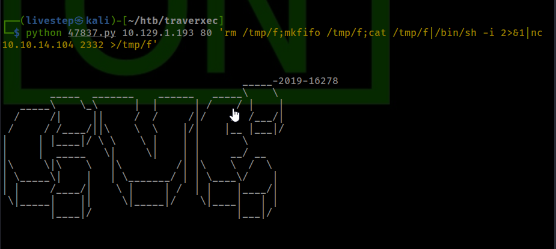

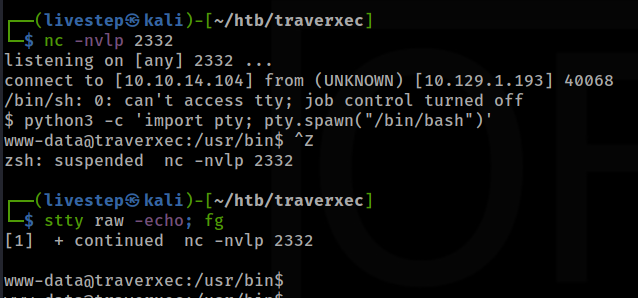

## MACHINE ENUMERATION

### WEB FILES

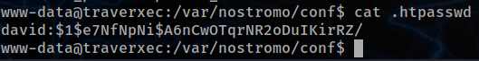

```text
david:$1$e7NfNpNi$A6nCwOTqrNR2oDuIKirRZ/
```

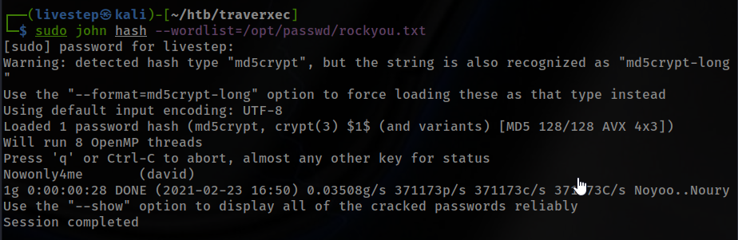

```text
david:Nowonly4me
```

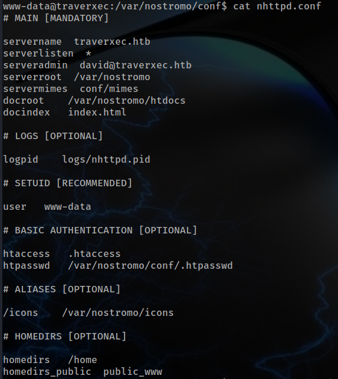

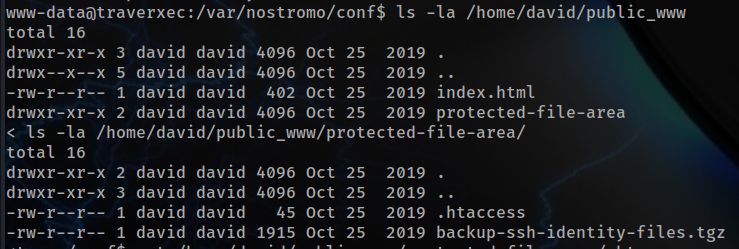

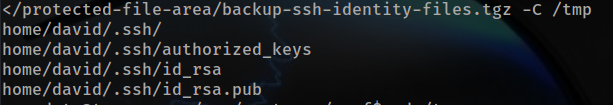

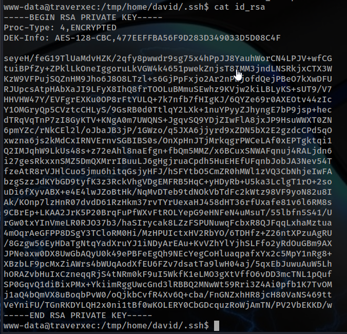

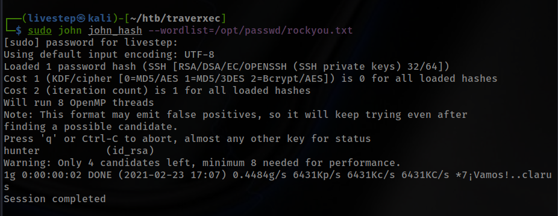

## LOGIN SSH

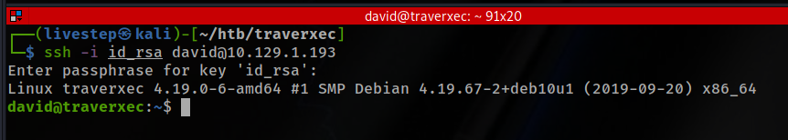

## PRIVESC

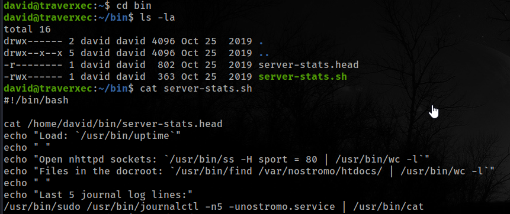

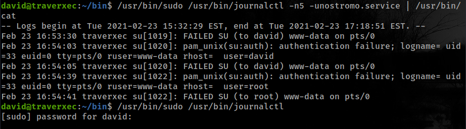

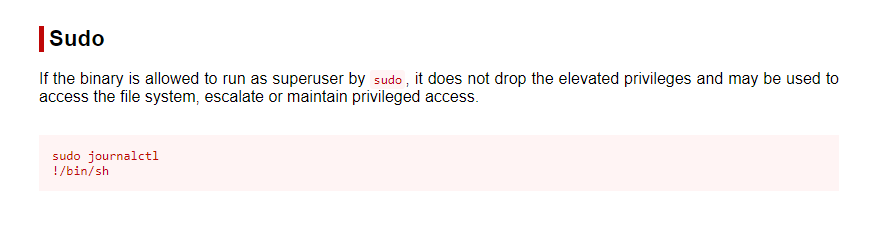

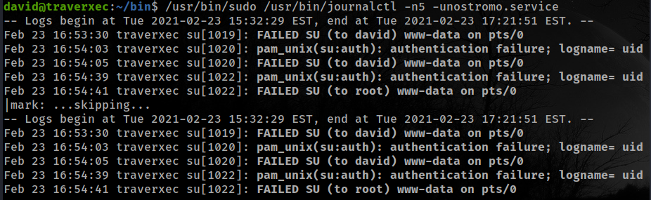

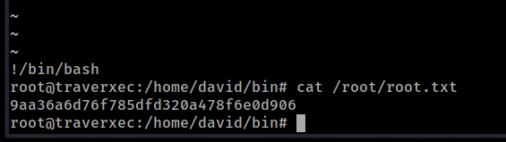

## CREDS

```text
root:$6$JS78lx7ObSd/2eY2$zkk.LEer7SmMyeSSm3kbjm/.1LoTrLFeKnpHP43mA/kY/RGNRTcEp96WsD2QZhBYavYOZTSVuSVVMFzUFn86V0:18196:0:99999:7:::
david:$6$maAFQhyFbcK/2XgC$iJUcfeGtIBZFHbE1ugl00Pm9r023byxysujFq3sbEgmA4oP7ivtHYAI3Cww1ET.z9Je3vostL.PxbvD2c6WXk/:18196:0:99999:7:::
```

## FLAGS

### USER

```text
7db0b48469606a42cec20750d9782f3d
```

### ROOT

```text
9aa36a6d76f785dfd320a478f6e0d906
```

