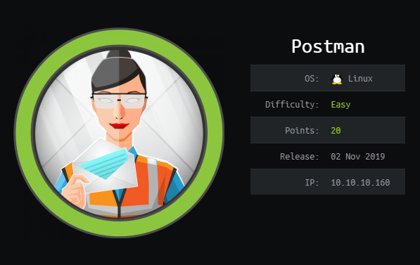
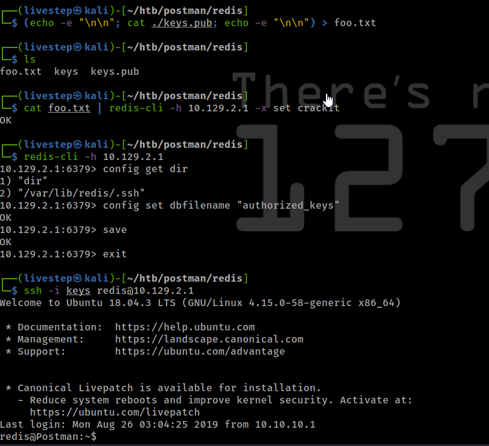
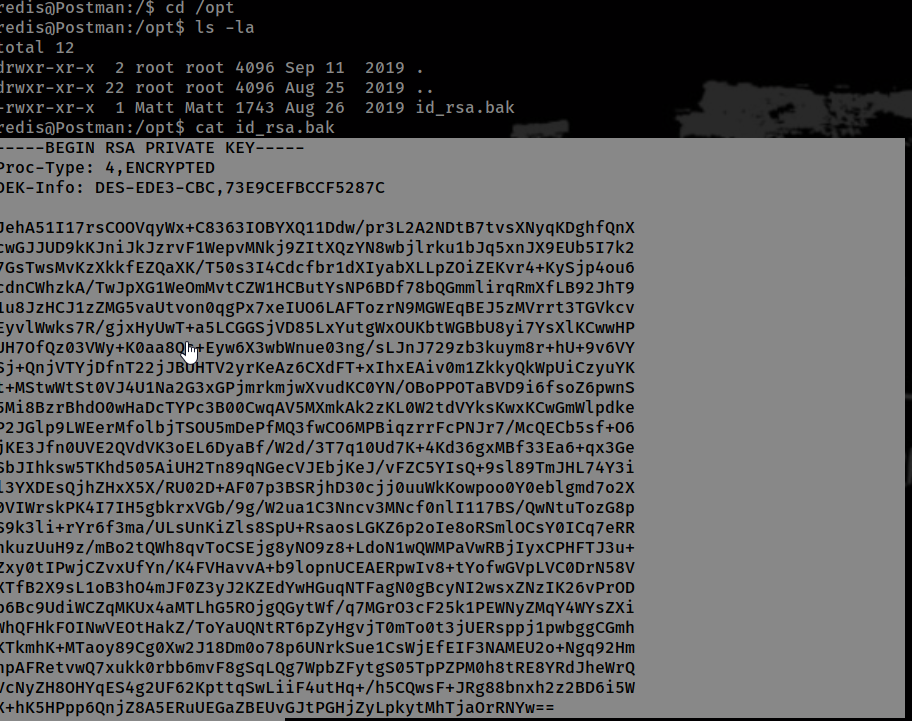
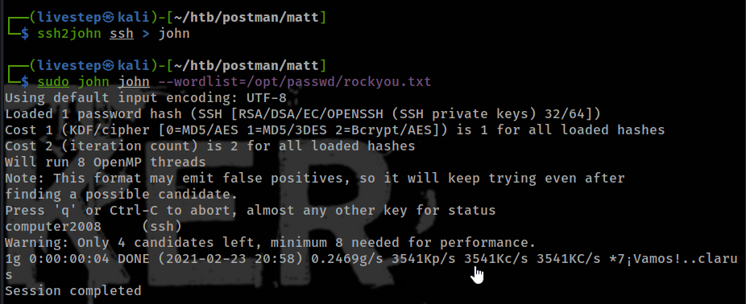
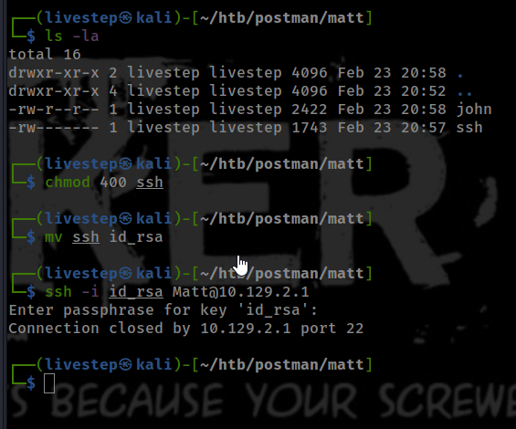
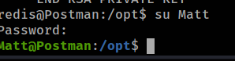
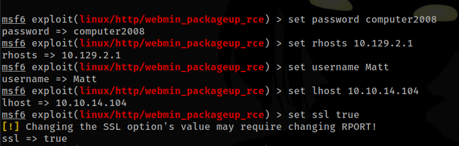
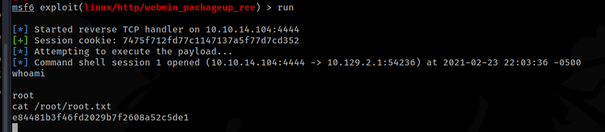

# POSTMAN / OSCP PREP



## NMAP SCAN

```text
PORT      STATE SERVICE REASON         VERSION
22/tcp    open  ssh     syn-ack ttl 63 OpenSSH 7.6p1 Ubuntu 4ubuntu0.3 (Ubuntu Linux; protocol 2.0)
| ssh-hostkey: 
|   2048 46:83:4f:f1:38:61:c0:1c:74:cb:b5:d1:4a:68:4d:77 (RSA)
| ssh-rsa AAAAB3NzaC1yc2EAAAADAQABAAABAQDem1MnCQG+yciWyLak5YeSzxh4HxjCgxKVfNc1LN+vE1OecEx+cu0bTD5xdQJmyKEkpZ+AVjhQo/esF09a94eMNKcp+bhK1g3wqzLyr6kwE0wTncuKD2bA9LCKOcM6W5GpHKUywB5A/TMPJ7UXeygHseFUZEa+yAYlhFKTt6QTmkLs64sqCna+D/cvtKaB4O9C+DNv5/W66caIaS/B/lPeqLiRoX1ad/GMacLFzqCwgaYeZ9YBnwIstsDcvK9+kCaUE7g2vdQ7JtnX0+kVlIXRi0WXta+BhWuGFWtOV0NYM9IDRkGjSXA4qOyUOBklwvienPt1x2jBrjV8v3p78Tzz
|   256 2d:8d:27:d2:df:15:1a:31:53:05:fb:ff:f0:62:26:89 (ECDSA)
| ecdsa-sha2-nistp256 AAAAE2VjZHNhLXNoYTItbmlzdHAyNTYAAAAIbmlzdHAyNTYAAABBBIRgCn2sRihplwq7a2XuFsHzC9hW+qA/QsZif9QKAEBiUK6jv/B+UxDiPJiQp3KZ3tX6Arff/FC0NXK27c3EppI=
|   256 ca:7c:82:aa:5a:d3:72:ca:8b:8a:38:3a:80:41:a0:45 (ED25519)
|_ssh-ed25519 AAAAC3NzaC1lZDI1NTE5AAAAIF3FKsLVdJ5BN8bLpf80Gw89+4wUslxhI3wYfnS+53Xd
80/tcp    open  http    syn-ack ttl 63 Apache httpd 2.4.29 ((Ubuntu))
|_http-favicon: Unknown favicon MD5: E234E3E8040EFB1ACD7028330A956EBF
| http-methods: 
|_  Supported Methods: HEAD GET POST OPTIONS
|_http-server-header: Apache/2.4.29 (Ubuntu)
|_http-title: The Cyber Geek's Personal Website
6379/tcp  open  redis   syn-ack ttl 63 Redis key-value store 4.0.9
10000/tcp open  http    syn-ack ttl 63 MiniServ 1.910 (Webmin httpd)
|_http-favicon: Unknown favicon MD5: 066AF1F6A59FCB67495B545A6B81F371
| http-methods: 
|_  Supported Methods: GET HEAD POST OPTIONS
|_http-title: Site doesn't have a title (text/html; Charset=iso-8859-1).
```

## EXPLOIT REDIS

* [https://book.hacktricks.xyz/pentesting/6379-pentesting-redis](https://book.hacktricks.xyz/pentesting/6379-pentesting-redis)



## MACHINE ENUMERATION

### USERS WITH BASH

```text
root:x:0:0:root:/root:/bin/bash
Matt:x:1000:1000:,,,:/home/Matt:/bin/bash
redis:x:107:114::/var/lib/redis:/bin/bash
```

### /OPT

* ID\_RSA.BAK





```text
pass=computer2008
```

* I can't login 



* SO I USE THE PASSWORD TO SU MATT, AND WORKED



## PRIVESC

* [https://www.exploit-db.com/exploits/46984](https://www.exploit-db.com/exploits/46984)





## FLAGS

### USER

```text
2bf5475c090937e8e55bc3936898b68d
```

### ROOT

```text
e84481b3f46fd2029b7f2608a52c5de1
```

## CREDS

```text
root:$6$BY.59Uqc$OCL4yigbZkNkprjAJHjUEzPIjvbYUuyNDwBwcl9/R3doZU3myn/cnTakyFmQRUrbiqwdxTfYs/MmYmLOCmROS1:18134:0:99999:7:::
Matt:$6$QNBwoLyZ$s6GTOYGr7.6USu4BlCcjFsWhvgQ5BVOqV830iiB4TTc3i4jbuaCxuuF9AO7uuP65PRNMnREZ7NLSMr7XOSGe80:18133:0:99999:7:::
```

