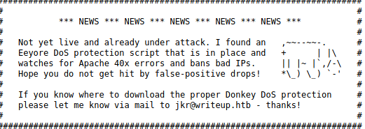
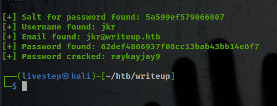
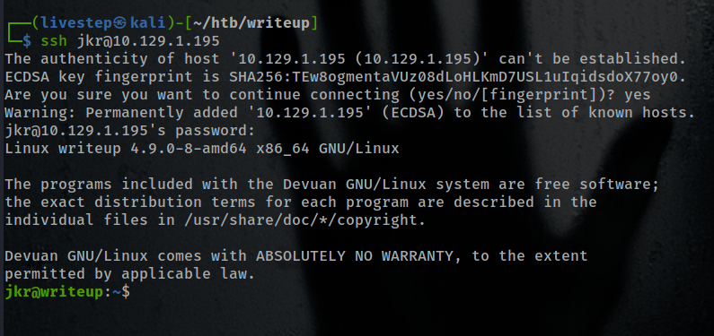
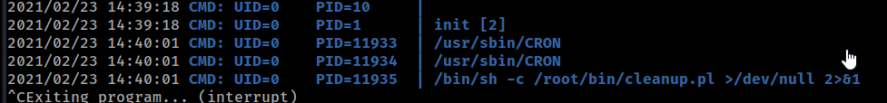
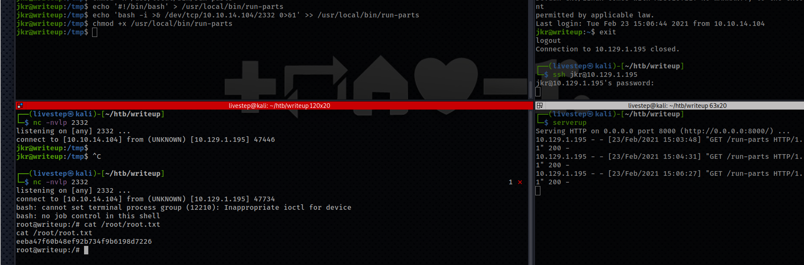

# WRITEUP / OSCP PREP


## NMAP SCAN

```text
PORT   STATE SERVICE    REASON  VERSION
22/tcp open  ssh        syn-ack OpenSSH 7.4p1 Debian 10+deb9u6 (protocol 2.0)
| ssh-hostkey: 
|   2048 dd:53:10:70:0b:d0:47:0a:e2:7e:4a:b6:42:98:23:c7 (RSA)
| ssh-rsa AAAAB3NzaC1yc2EAAAADAQABAAABAQDKBbBK0GkiCbxmAbaYsF4DjDQ3JqErzEazl3v8OndVhynlxNA5sMnQmyH+7ZPdDx9IxvWFWkdvPDJC0rUj1CzOTOEjN61Qd7uQbo5x4rJd3PAgqU21H9NyuXt+T1S/Ud77xKei7fXt5kk1aL0/mqj8wTk6HDp0ZWrGBPCxcOxfE7NBcY3W++IIArn6irQUom0/AAtR3BseOf/VTdDWOXk/Ut3rrda4VMBpRcmTthjsTXAvKvPJcaWJATtRE2NmFjBWixzhQU+s30jPABHcVtxl/Fegr3mvS7O3MpPzoMBZP6Gw8d/bVabaCQ1JcEDwSBc9DaLm4cIhuW37dQDgqT1V
|   256 37:2e:14:68:ae:b9:c2:34:2b:6e:d9:92:bc:bf:bd:28 (ECDSA)
| ecdsa-sha2-nistp256 AAAAE2VjZHNhLXNoYTItbmlzdHAyNTYAAAAIbmlzdHAyNTYAAABBBPzrVwOU0bohC3eXLnH0Sn4f7UAwDy7jx4pS39wtkKMF5j9yKKfjiO+5YTU//inmSjlTgXBYNvaC3xfOM/Mb9RM=
|   256 93:ea:a8:40:42:c1:a8:33:85:b3:56:00:62:1c:a0:ab (ED25519)
|_ssh-ed25519 AAAAC3NzaC1lZDI1NTE5AAAAIEuLLsM8u34m/7Hzh+yjYk4pu3WHsLOrPU2VeLn22UkO
80/tcp open  tcpwrapped syn-ack
Service Info: OS: Linux; CPE: cpe:/o:linux:linux_kernel
```

## PORT 80 ENUMERATION



* Eeyore DoS protection

### /WRITEUP

#### CMS EXPLOIT

* [https://www.exploit-db.com/exploits/46635](https://www.exploit-db.com/exploits/46635)



```text
exploit.py -u http://target-uri --crack -w /path-wordlist
```

## SSH LOGIN



## CREDS

### SSH

```text
jkr:raykayjay9
```

## MACHINE ENUMERATION

### USERS WITH BASH

```text
root:x:0:0:root:/root:/bin/bash
jkr:x:1000:1000:jkr,,,:/home/jkr:/bin/bash
```

### USER JKR

```text
uid=1000(jkr) gid=1000(jkr) groups=1000(jkr),24(cdrom),25(floppy),29(audio),30(dip),44(video),46(plugdev),50(staff),103(netdev)
```

### LINPEAS.SH

```text
writeup
127.0.0.1    localhost
10.10.10.138    writeup.htb    writeup
```

-rwxr-xr-x 1 root root 18148040 Aug 8 2018 /usr/bin/mariabackup

* WRITABLE FILES/FOLDERS

  ```text
  /usr/local/bin
  /usr/local/games
  /usr/local/sbin
  ```

* PASSWORDS FOUND

```text
/etc/apache2/passwords:$apr1$zXpnkbX6$LPzyE8Wa0d1yNQ4/F8aQa.
```

### PSPY64




## PRIVESC



## CREDS

```text
root:$6$UlEJZekN$aPu1k14KxCPSqb/VMn46GlG2o4nzaXDCizgOSEVdID4zooOSL9evZ3SIof1cqSepwNvRZub1FfzHFIZmKCtDw.:18005:0:99999:7:::
jkr:$6$93CBiQYZ$mDSfcWRIg/zPXDlVWoKLYqWHTL3ppdvH/1NsUi8uhTMSLtJnwY2jSwg0AbocoNUitJcWZqvBTlGpkGYdkiwhL/:18005:0:99999:7:::
```

## FLAGS

### USER

```text
d4e493fd4068afc9eb1aa6a55319f978
```

### ROOT

```text
eeba47f60b48ef92b734f9b6198d7226
```

