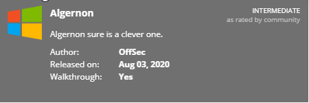
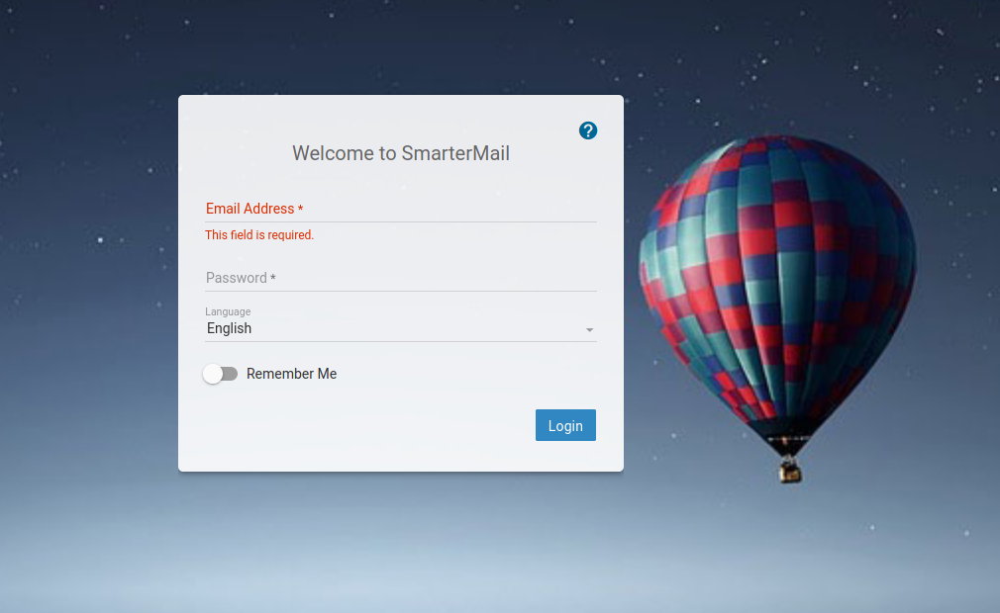
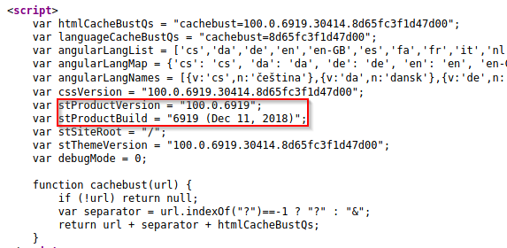
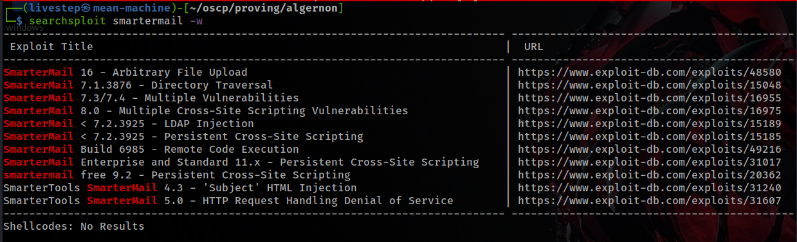
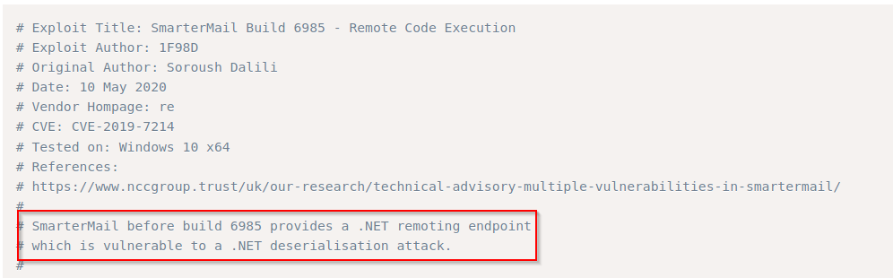
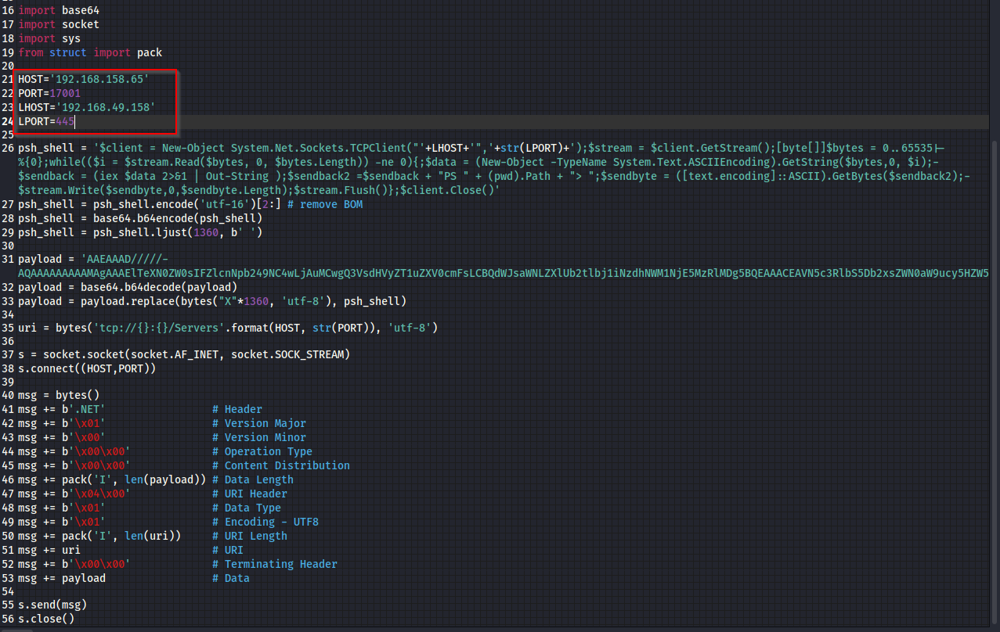
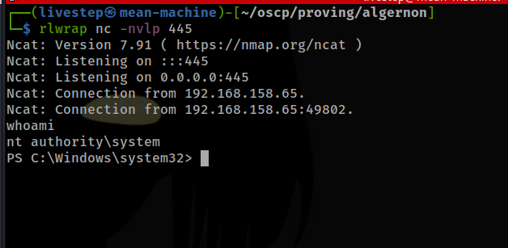

# ALGERNON \| 10 POINTS



## NMAP SCAN

```text
PORT      STATE SERVICE       REASON          VERSION
21/tcp    open  ftp           syn-ack ttl 127 Microsoft ftpd
| ftp-anon: Anonymous FTP login allowed (FTP code 230)
|_Can't get directory listing: TIMEOUT
| ftp-syst: 
|_  SYST: Windows_NT
80/tcp    open  http          syn-ack ttl 127 Microsoft IIS httpd 10.0
| http-methods: 
|   Supported Methods: OPTIONS TRACE GET HEAD POST
|_  Potentially risky methods: TRACE
|_http-server-header: Microsoft-IIS/10.0
|_http-title: IIS Windows
135/tcp   open  msrpc         syn-ack ttl 127 Microsoft Windows RPC
139/tcp   open  netbios-ssn   syn-ack ttl 127 Microsoft Windows netbios-ssn
445/tcp   open  microsoft-ds? syn-ack ttl 127
9998/tcp  open  http          syn-ack ttl 127 Microsoft IIS httpd 10.0
|_http-favicon: Unknown favicon MD5: 9D7294CAAB5C2DF4CD916F53653714D5
| http-methods: 
|_  Supported Methods: GET HEAD POST OPTIONS
|_http-server-header: Microsoft-IIS/10.0
| http-title: Site doesn't have a title (text/html; charset=utf-8).
|_Requested resource was /interface/root
17001/tcp open  remoting      syn-ack ttl 127 MS .NET Remoting services
```

## PORT 9998

### SMARTERMAIL V.6919 







## EXPLOIT

* [https://www.exploit-db.com/exploits/49216](https://www.exploit-db.com/exploits/49216)



* REMEMBER THE NMAP SCAN \(PORT 17001\)

```text
17001/tcp open  remoting      syn-ack ttl 127 MS .NET Remoting services
```





## PROOF.TXT

```text
4d85d916eef375d96de643a71ead09cb
```

