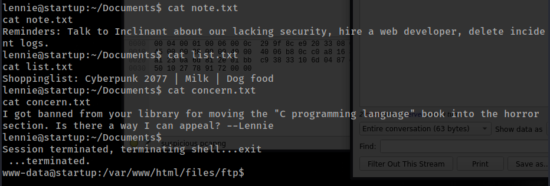
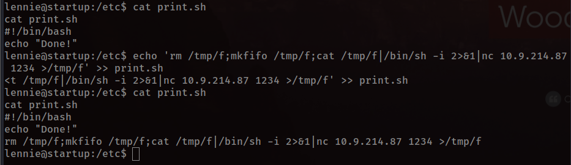
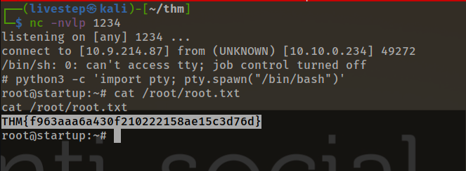

# STARTUP


## NMAP SCAN

```text
PORT   STATE SERVICE REASON         VERSION
21/tcp open  ftp     syn-ack ttl 63 vsftpd 3.0.3
| ftp-anon: Anonymous FTP login allowed (FTP code 230)
| drwxrwxrwx    2 65534    65534        4096 Nov 12 04:53 ftp [NSE: writeable]
| -rw-r--r--    1 0        0          251631 Nov 12 04:02 important.jpg
|_-rw-r--r--    1 0        0             208 Nov 12 04:53 notice.txt
| ftp-syst: 
|   STAT: 
| FTP server status:
|      Connected to 10.9.214.87
|      Logged in as ftp
|      TYPE: ASCII
|      No session bandwidth limit
|      Session timeout in seconds is 300
|      Control connection is plain text
|      Data connections will be plain text
|      At session startup, client count was 4
|      vsFTPd 3.0.3 - secure, fast, stable
|_End of status
22/tcp open  ssh     syn-ack ttl 63 OpenSSH 7.2p2 Ubuntu 4ubuntu2.10 (Ubuntu Linux; protocol 2.0)
| ssh-hostkey: 
|   2048 b9:a6:0b:84:1d:22:01:a4:01:30:48:43:61:2b:ab:94 (RSA)
| ssh-rsa AAAAB3NzaC1yc2EAAAADAQABAAABAQDAzds8QxN5Q2TsERsJ98huSiuasmToUDi9JYWVegfTMV4Fn7t6/2ENm/9uYblUv+pLBnYeGo3XQGV23foZIIVMlLaC6ulYwuDOxy6KtHauVMlPRvYQd77xSCUqcM1ov9d00Y2y5eb7S6E7zIQCGFhm/jj5ui6bcr6wAIYtfpJ8UXnlHg5f/mJgwwAteQoUtxVgQWPsmfcmWvhreJ0/BF0kZJqi6uJUfOZHoUm4woJ15UYioryT6ZIw/ORL6l/LXy2RlhySNWi6P9y8UXrgKdViIlNCun7Cz80Cfc16za/8cdlthD1czxm4m5hSVwYYQK3C7mDZ0/jung0/AJzl48X1
|   256 ec:13:25:8c:18:20:36:e6:ce:91:0e:16:26:eb:a2:be (ECDSA)
| ecdsa-sha2-nistp256 AAAAE2VjZHNhLXNoYTItbmlzdHAyNTYAAAAIbmlzdHAyNTYAAABBBOKJ0cuq3nTYxoHlMcS3xvNisI5sKawbZHhAamhgDZTM989wIUonhYU19Jty5+fUoJKbaPIEBeMmA32XhHy+Y+E=
|   256 a2:ff:2a:72:81:aa:a2:9f:55:a4:dc:92:23:e6:b4:3f (ED25519)
|_ssh-ed25519 AAAAC3NzaC1lZDI1NTE5AAAAIPnFr/4W5WTyh9XBSykso6eSO6tE0Aio3gWM8Zdsckwo
80/tcp open  http    syn-ack ttl 63 Apache httpd 2.4.18 ((Ubuntu))
| http-methods: 
|_  Supported Methods: GET HEAD POST OPTIONS
|_http-server-header: Apache/2.4.18 (Ubuntu)
|_http-title: Maintenance
```

## FTP ENUMERATION

* WE CAN UPLOAD WEBSHELL

## PORT 80 ENUMERATION

### /FILES

* We can run webshell

## MACHINE ENUMERATION

### USERS WITH BASH

```text
root:x:0:0:root:/root:/bin/bash
vagrant:x:1000:1000:,,,:/home/vagrant:/bin/bash
lennie:x:1002:1002::/home/lennie:
```

### - suspicious.pcapng

```text
lennie:c4ntg3t3n0ughsp1c3
```


## PRIVESC







```text
#!/bin/bash
echo $LIST > /home/lennie/scripts/startup_list.txt
/etc/print.sh
```

## FLAGS

### USER

```text
THM{03ce3d619b80ccbfb3b7fc81e46c0e79}
```

### ROOT

```text
THM{f963aaa6a430f210222158ae15c3d76d}
```

