# WATCHER


## NMAP SCAN

```text
PORT   STATE SERVICE REASON         VERSION
21/tcp open  ftp     syn-ack ttl 63 vsftpd 3.0.3
22/tcp open  ssh     syn-ack ttl 63 OpenSSH 7.6p1 Ubuntu 4ubuntu0.3 (Ubuntu Linux; protocol 2.0)
| ssh-hostkey: 
|   2048 e1:80:ec:1f:26:9e:32:eb:27:3f:26:ac:d2:37:ba:96 (RSA)
| ssh-rsa AAAAB3NzaC1yc2EAAAADAQABAAABAQC7hN8ixZsMzRUvaZjiBUrqtngTVOcdko2FRpRMT0D/LTRm8x8SvtI5a52C/adoiNNreQO5/DOW8k5uxY1Rtx/HGvci9fdbplPz7RLtt+Mc9pgGHj0ZEm/X0AfhBF0P3Uwf3paiqCqeDcG1HHVceFUKpDt0YcBeiG1JJ5LZpRxqAyd0jOJsC1FBNBPZAtUA11KOEvxbg5j6pEL1rmbjwGKUVxM8HIgSuU6R6anZxTrpUPvcho9W5F3+JSxl/E+vF9f51HtIQcXaldiTNhfwLsklPcunDw7Yo9IqhqlORDrM7biQOtUnanwGZLFX7kfQL28r9HbEwpAHxdScXDFmu5wR
|   256 36:ff:70:11:05:8e:d4:50:7a:29:91:58:75:ac:2e:76 (ECDSA)
| ecdsa-sha2-nistp256 AAAAE2VjZHNhLXNoYTItbmlzdHAyNTYAAAAIbmlzdHAyNTYAAABBBBmjWU4CISIz0mdwq6ObddQ3+hBuOm49wam2XHUdUaJkZHf4tOqzl+HVz107toZIXKn1ui58hl9+6ojTnJ6jN/Y=
|   256 48:d2:3e:45:da:0c:f0:f6:65:4e:f9:78:97:37:aa:8a (ED25519)
|_ssh-ed25519 AAAAC3NzaC1lZDI1NTE5AAAAIHb7zsrJYdPY9eb0sx8CvMphZyxajGuvbDShGXOV9MDX
80/tcp open  http    syn-ack ttl 63 Apache httpd 2.4.29 ((Ubuntu))
|_http-generator: Jekyll v4.1.1
| http-methods: 
|_  Supported Methods: GET HEAD POST OPTIONS
|_http-server-header: Apache/2.4.29 (Ubuntu)
|_http-title: Corkplacemats
```

## PORT 80 ENUMERATION

### ROBOTS.TXT

```text
User-agent: *
Allow: /flag_1.txt
Allow: /secret_file_do_not_read.txt
```

## LFI

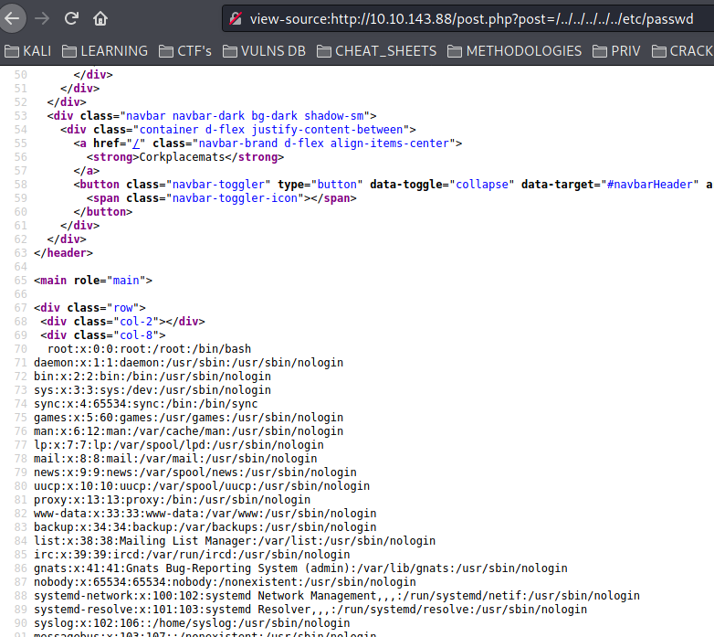

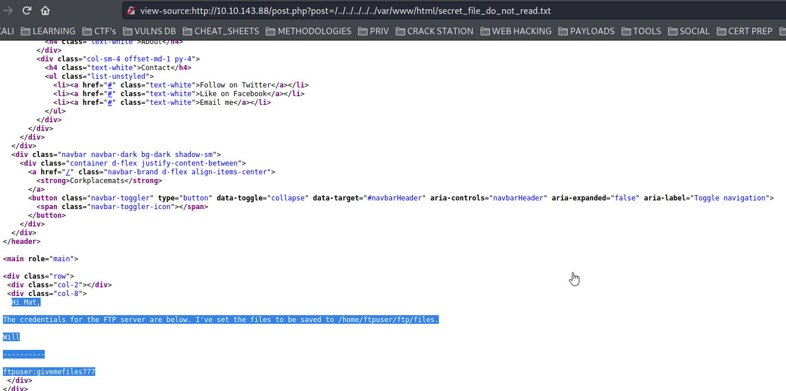

```text
Hi Mat,

The credentials for the FTP server are below. I've set the files to be saved to /home/ftpuser/ftp/files.

Will

----------

ftpuser:givemefiles777
```

## FTP

```text
ftpuser:givemefiles777
```

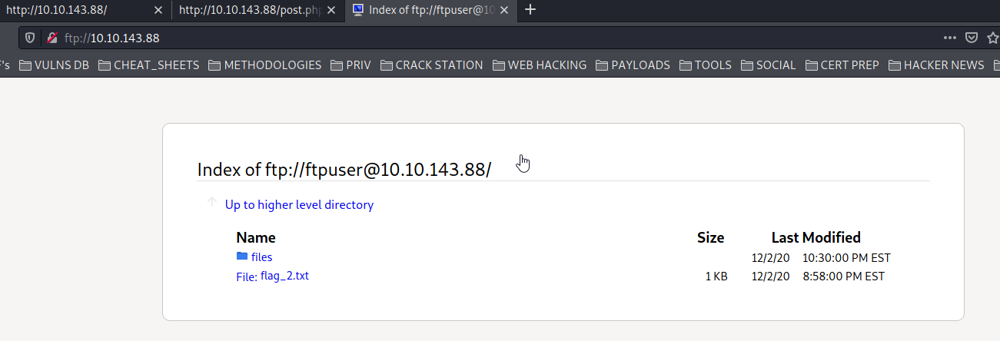

### UPLOAD A REVERSE SHELL

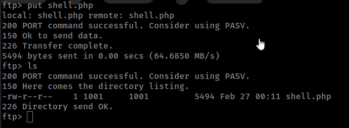

## GET A SHELL


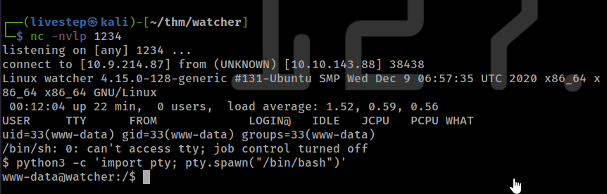

## LATERAL MOVEMENT

* TOBY

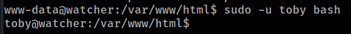

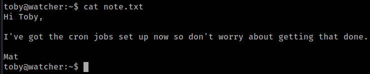

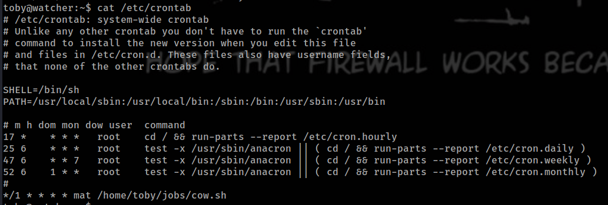

* MAT

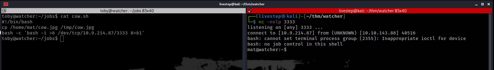

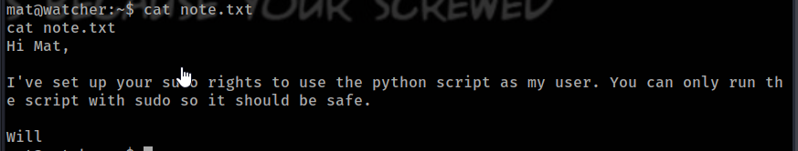


* WILL

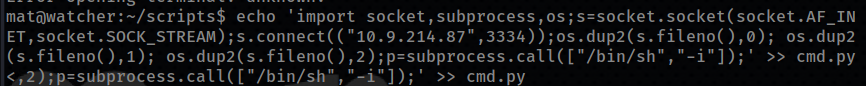


## PRIVESC

### LINPEAS

```text
-rw-rw---- 1 root adm 2270 Dec  3 02:04 /opt/backups/key.b64
-rw-r----- 1 root adm 32924510 Feb 27 00:13 /var/log/apache2/access.log
-rw-r----- 1 root adm 16080020 Feb 27 00:56 /var/log/apache2/error.log
-rw-r----- 1 root adm 0 Dec  3 01:39 /var/log/apache2/other_vhosts_access.log
-rw-r----- 1 root adm 28898 Dec 12 15:23 /var/log/apt/term.log

  Group adm:
/opt/backups
/opt/backups/key.b64
```


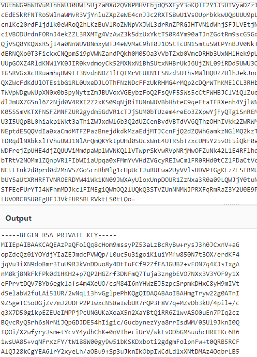


### USERS WITH BASH

```text
root:x:0:0:root:/root:/bin/bash
will:x:1000:1000:will:/home/will:/bin/bash
mat:x:1002:1002:,#,,:/home/mat:/bin/bash
toby:x:1003:1003:,,,:/home/toby:/bin/bash
```

## CREDS

```text
root:$6$UseANeHi$f02vVBMbk9b5LRepJhjdhquXMJ6aBOi1IwQ3EJqF.dbhC0XCNDcZ4kmCVxR.3vNKr4ol0HzTIYXR6ATpYjDwJ1:18599:0:99999:7:::
will:$6$PMxyf2rOO/k.yQyc$o5EbluoIAvLUeOivGTHqx6opAGuHit2d8wBWtFD7xWyJBTt680a/7917Wcg6fi83ubwnFhWFlPmYJjRKWwp0m.:18599:0:99999:7:::
ftpuser:$6$ag2r/3kP$9N1nbsh10Vb0WFHXGza.fnWNjbiPGiuYZ2nRGiq3/cR1SDPCyVi9GSrgeYBP/9wfzsFvRsIL3cJIsFUCL1741.:18599:0:99999:7:::
mat:$6$yCP235ym$3EE8j2pgbseXTOvIOA23rWHGzO3UesHWdOUoesyJFpCkHmUwspwyPtbxUCvfuba8yi69LrYIMJnyUjJ07M1M21:18599:0:99999:7:::
toby:$6$c9ZzrH1h$KII6cn/29vuk2cSxA5HC56UJ9BfRhmIDapaB2Bpkb7LATFQtVThblvo5f8Po2FmODE0a4pBcC7SNxlYnFkXO8.:18599:0:99999:7:::
```

## FLAGS

### 1

```text
FLAG{robots_dot_text_what_is_next}
```

### 2

```text
FLAG{ftp_you_and_me}
```

### 3

```text
FLAG{lfi_what_a_guy}
```

### 4

```text
FLAG{chad_lifestyle}
```

### 5

```text
FLAG{live_by_the_cow_die_by_the_cow}
```

### 6

```text
FLAG{but_i_thought_my_script_was_secure}
```

### 7

```text
FLAG{who_watches_the_watchers}
```

